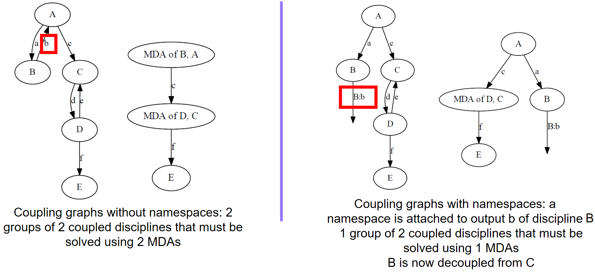

..
    Copyright 2021 IRT Saint Exupéry, https://www.irt-saintexupery.com

    This work is licensed under the Creative Commons Attribution-ShareAlike 4.0
    International License. To view a copy of this license, visit
    http://creativecommons.org/licenses/by-sa/4.0/ or send a letter to Creative
    Commons, PO Box 1866, Mountain View, CA 94042, USA.

..
   Contributors:
          :author: Francois Gallard

.. _namespaces:

Namespaces
==========

What are namespaces?
--------------------

Namespaces are prefixes to input or output names of the :class:`.MDODiscipline` subclasses.
The name of the variable is replaced by the namespace, a separator, ':' by default,
and the original variable name.

This allows to control the data exchanges between existing disciplines, and therefore configure the
process without changing the original grammar.
For instance, if a discipline A with input "x" and output "y"
is chained with a discipline B of input "y" and output "z", adding the namespace "ns" to the output
y of A will result in a "disconnection" between "y" as the output of A and "y" as the input of B.

In terms of API this would result in the following example:

.. code::

    >>> from gemseo.api import create_discipline
    >>> from gemseo.core.chain import MDOChain
    >>>
    >>> def func_a(x=1.):
    >>>     y=x+1
    >>>     return y
    >>>
    >>> def func_b(y=1.):
    >>>     z=y+1
    >>>     return z
    >>>
    >>> a_disc = create_discipline("AutoPyDiscipline", py_func=func_a)
    >>> b_disc = create_discipline("AutoPyDiscipline", py_func=func_b)
    >>> print("A inputs", list(a_disc.get_input_data_names()), ", outputs",
    ...    list(a_disc.get_output_data_names()))
    A inputs ['x'], outputs ['y']

    >>> chain = MDOChain(disciplines=[a_disc, b_disc])
    >>> print("Chain output, z = ", chain.execute()['z'])
    Chain output, z = [3.]

    >>> a_disc_ns = create_discipline("AutoPyDiscipline", py_func=func_a)
    >>> a_disc_ns.add_namespace_to_output("y", "ns")
    >>>
    >>> print("A inputs", list(a_disc_ns.get_input_data_names()), ", outputs",
    ...     list(a_disc_ns.get_output_data_names()))
    A inputs ['x'], outputs ['ns:y']

    >>> chain_ns = MDOChain(disciplines=[a_disc_ns, b_disc])
    >>> print("Chain output with namespace, z = ", chain_ns.execute()['z'])
    Chain output with namespace, z = [2.]

.. warning::
    This is an experimental feature, that is currently validated for the main process classes:
    :class:`.MDOChain`, :class:`.MDA` and its subclasses, :class:`.MDOParallelChain` etc.
    Scenarios can be created with disciplines handling namespaces.
    The main limitation is that not all wrappers and MDO test problems are
    compatible with namespaces, which requires the modifications described at the end of this page.
    Currently, the :class:`.AutoPyDiscipline` and :class:`.ConstrAggegationDisc` support namespaces
    and can be used as examples.

Coupling control in MDAs
------------------------

Namespaces allow to control the couplings in MDAs by renaming a variable.
This may change the coupling structure graph, as illustrated in the next figure.

   Controlling the couplings using namespaces.

Impact on the MDODiscipline wrappers
------------------------------------

The discipline that wraps a simulation code,
such as :class:`.AutoPyDiscipline`, declares its input
and output names without the namespace prefix,
in :meth:`.MDODiscipline.__init__`.

After instantiation,
a namespace may be added to the discipline,
which may make the names of the
grammar elements inconsistent with the names of the local variables in the discipline wrapper.
The wrappers must be adapted to handle input names changes due to namespaces.
To this aim, the :class:`.DisciplineData` values may be accessed from keys with or without
namespaces. Also :meth:`.MDODiscipline.get_input_data_names` has an argument "input_prefix" that
allows to define whether to return namespace prefixes or not.

Besides, :class:`.BaseGrammar` has the attributes :attr:`.BaseGrammar.to_namespaced` and
:attr:`.BaseGrammar.from_namespaced` that map the names with and without namespace prefixes.

Finally, :meth:`.MDODiscipline.store_local_data` allows to pass variables names without namespace prefixes.
This allows to adapt wrappers to support namespaces with only minor modifications.

For instance, the :meth:`.AutoPyDiscipline._run` method is as follows, and supports namespaces:

.. code::

    def _run(self):
        output_values = self.py_func(**self.get_input_data(namespaces_prefix=False))
        self.store_local_data(**output_values)
