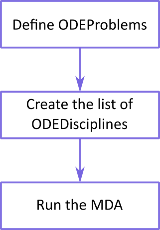
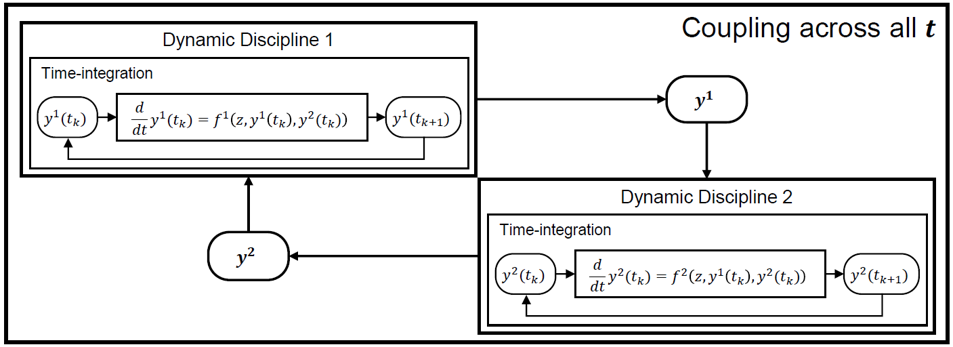
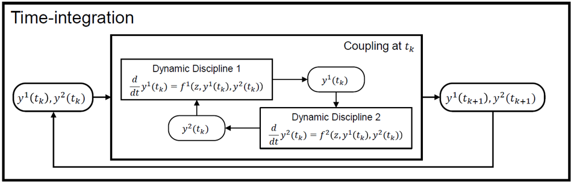
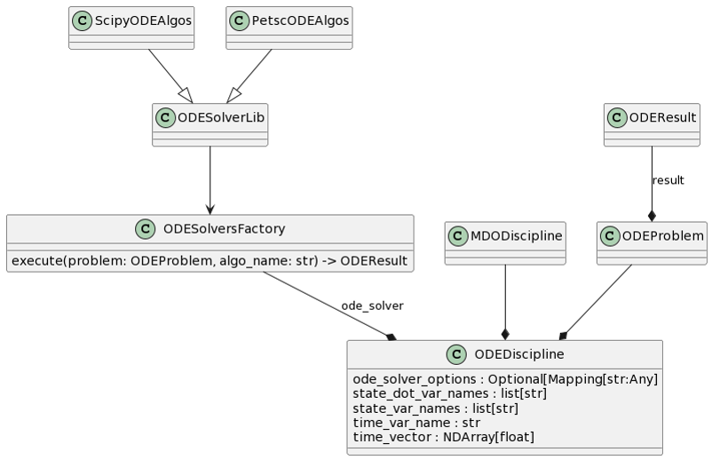

..
   Copyright 2021 IRT Saint Exupéry, https://www.irt-saintexupery.com

   This work is licensed under the Creative Commons Attribution-ShareAlike 4.0
   International License. To view a copy of this license, visit
   http://creativecommons.org/licenses/by-sa/4.0/ or send a letter to Creative
   Commons, PO Box 1866, Mountain View, CA 94042, USA.

..
   Contributors:
          :author: Isabelle Santos

.. _odediscipline:

ODE disciplines
===============

The typical workflow is to define a list of :class:`.ODEDiscipline` s from a list of :class:`.ODEProblem` s, then execute the list of disciplines like any other.

In this tutorial, we explain this procedure in detail.

What is an ODE discipline?
--------------------------

ODE stands for Ordinary Differential Equation.

An ODE discipline is a discipline that is defined using the solution of an ODE for .

Two formulations are possible for a time-dependent optimization problem.

How to build an ODE discipline?
-------------------------------

In practice, an :class:`.ODEDiscipline` is defined from an :class:`.Discipline` and an :class:`.ODEProblem`.

Note: By default, the name of the first-order derivative of a variable is the name of that variable to which "_dot" is appended.

How to execute an ODE discipline?
---------------------------------
