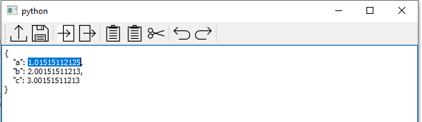
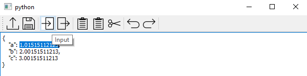
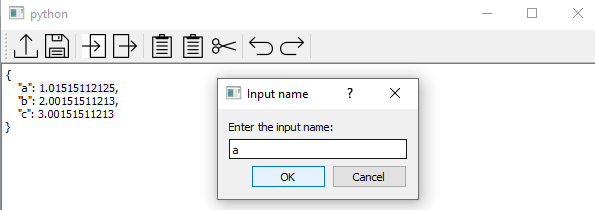
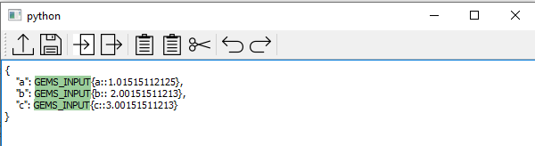
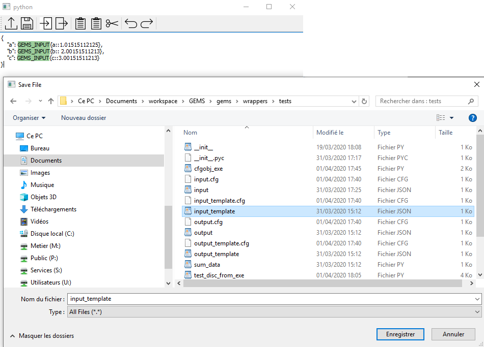
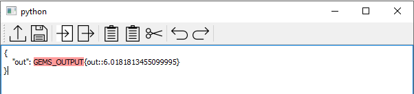

..
   Copyright 2021 IRT Saint Exupéry, https://www.irt-saintexupery.com

   This work is licensed under the Creative Commons Attribution-ShareAlike 4.0
   International License. To view a copy of this license, visit
   http://creativecommons.org/licenses/by-sa/4.0/ or send a letter to Creative
   Commons, PO Box 1866, Mountain View, CA 94042, USA.

..
   Contributors:
          :author:  Francois Gallard

.. _disc_from_exe:

Automatic wrapper for executables with Graphical User Interface
***************************************************************

The DiscFromExe wrapper
~~~~~~~~~~~~~~~~~~~~~~~

This section describes how to use :class:`~gemseo.wrappers.disc_from_exe.DiscFromExe`.
The input and output template files can be edited using the dedicated GUI, see next section.

.. currentmodule:: gemseo.wrappers.disc_from_exe
.. autoclass:: DiscFromExe
   :noindex:
   :no-inherited-members:

Inputs and outputs files template edition GUI
~~~~~~~~~~~~~~~~~~~~~~~~~~~~~~~~~~~~~~~~~~~~~

.. _template_editor_gui:

.. currentmodule:: gemseo.wrappers.template_grammar_editor
.. autoclass:: QtTemplateEditor
   :noindex:
   :no-inherited-members:

The following screenshots detail the steps to create the templates from the reference input file.

   Open a reference input file

   Select the input and press the Input button (Ctrl+I) to generate the template tag

   Enter the input name

   The GUI highlights the inputs that are tagged in the template

   The user saves the input template (Ctrl+S)

   Same for the outputs, shortcut (Ctrl+O)
