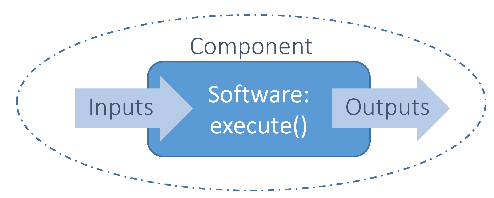

..
   Copyright 2021 IRT Saint Exupéry, https://www.irt-saintexupery.com

   This work is licensed under the Creative Commons Attribution-ShareAlike 4.0
   International License. To view a copy of this license, visit
   http://creativecommons.org/licenses/by-sa/4.0/ or send a letter to Creative
   Commons, PO Box 1866, Mountain View, CA 94042, USA.

..
   Contributors:
          :author:  Francois Gallard

.. _software_connection:

Interfacing simulation software
===============================

To interface a simulation software with |g|,
and make an :class:`.MDODiscipline` from it,
several options are available:

- Your program is a Python function,
  you can use :class:`.AutoPyDiscipline`,
  see :ref:`sphx_glr_examples_mdo_plot_gemseo_in_10_minutes.py`.

- You have simple analytic expressions,
  use :ref:`AnalyticDiscipline<analyticdiscipline>`,
  that also provides analytic derivatives automatically.

- You have an Excel workbooks,
  use :ref:`Excel discipline<xls_discipline>`.

- If your program is a MATLAB function, there is a generic interface
  that allows to connect it to |g| as an :class:`.MDODiscipline`,
  without writing code in a dedicated plugin.
  See :ref:`the generic MATLAB wrapper<discipline_matlab>`.

- For Scilab functions, `a plugin is available <https://gitlab.com/gemseo/dev/gemseo-scilab>`_.
  With it, you can create an :class:`.MDODiscipline` that runs Scilab code directly from |g|.

- If your program is an executable,
  you have two options.
  Either you use the :ref:`disc_from_exe`
  to wrap a single executable and the inputs and outputs file,
  with the help of a Graphical User Interface.
  Or use a workflow engine (next point).

- Interface a discipline with a :term:`workflow engine`,
  and then integrate the :term:`workflow engine`
  within the :term:`MDO platform`,
  which embeds |g|.
  This option is
  the best if the :term:`workflow engine` provides services that you require,
  such as HPC
  access,
  working directory management,
  post-processing,
  or if you want
  to chain easily multiple programs with files exchanges.

- Directly inherit from the :class:`.MDODiscipline` class to make a specific wrapper in Python.
  This option is possible if you have no :term:`workflow engine`,
  or if you have a light and
  pure in-memory code that does not require a lot of file processing or
  multiple machine access.

- If you only have execution data,
  for instance from a :term:`DOE`,
  you can build a :term:`surrogate model` automatically
  from this data and embed it in a scenario as any other discipline.
  See :ref:`Surrogate models <surrogates>`.

All these options can be mixed to build MDO processes,
allowing a strong flexibility.

.. warning::
    All the inputs and outputs names of the disciplines in a scenario shall be consistent.

    |g| assumes that the data are tagged by their names with a global convention in the whole process.
    What two disciplines call "X" shall be the same "X".
    The coupling variables for instance,
    are detected thanks to these conventions.
    The wrappers shall handle conversions if needed.
    This may rely on third party technologies provided by the platform.

The next sections go into the details of the wrapping of a :term:`discipline` in |g|.

The basics of wrappers
----------------------

A :term:`wrapper`,
or library wrapper,
is a piece of software which translates the existing :term:`API` of an existing
program or a library,
into a compatible one.
Each program is encapsulated within using a dedicated :term:`interface`.
|g| defines the standardized interface in the :class:`~gemseo.core.discipline.MDODiscipline` interface,
to define input data,
output data and an execution of the integrated software.
Thanks to it,
|g| can treat the integrated software
independently of their own implementation and of their own conventions to describe the
inputs and outputs (file formats for instance).

The next figure displays the concept of wrapper in workflow management.

   The wrapper concept

.. _grammars:

Input and output description: grammars
--------------------------------------

Principles
~~~~~~~~~~

The inputs and outputs are represented by :term:`grammars<grammar>`.
Grammars are a set of rules that
define whether a set of data is valid or not as inputs or outputs of an :class:`.MDODiscipline`.
There are at least two grammars for a discipline: one for input data and one for output data.

In |g|,
there is an :class:`.BaseGrammar` class that defines the contract of the grammars implementations,
such as checking data,
listing the required data,
etc.

- :class:`.SimpleGrammar`: it manipulates the list of required data names,
   and a list of the associated types (string,
   float,
   numpy.ndarray or any type provided).
   There is also a dictionary of
   default values that adds default values to the data if they are not
   provided.

- :class:`.JSONGrammar`: a :term:`JSON`-based grammar.
   You must provide a JSON file that
   describes the validity of the data.
   This is a much more advanced and much more powerful description.
   JSON is a web standard supported by
   many languages: `JSON Schema <http://json-schema.org/implementations.html>`_.
   Please
   read `Understanding JSON Schema <http://spacetelescope.github.io/understanding-json-schema/index.html>`_
   for details on :term:`JSON schema`.
   The input and output schemas for the disciplines
   must be files in the same directory as the Python module of the
   discipline,
   with a naming convention MyDisciplineName\_input.json and
   MyDisciplineName\_output.json.

Examples of grammars
~~~~~~~~~~~~~~~~~~~~

The following code is the JSON Schema file of the SSBJ Mission discipline of :ref:`sobieski_use_case`.
All inputs are arrays of floats.

.. code-block:: JSON

    {
    "name": "SobieskiMission_input",
    "required": ["y_14","x_shared","y_24","y_34"],
    "properties": {
        "y_14": {
            "items": {
                "type": "number"
            },
            "type": "array"
        },
        "x_shared": {
            "items": {
                "type": "number"
            },
            "type": "array"
        },
        "y_24": {
            "items": {
                "type": "number"
            },
            "type": "array"
        },
        "y_34": {
            "items": {
                "type": "number"
            },
            "type": "array"
        }
    },
    "$schema": "http://json-schema.org/draft-04/schema",
    "type": "object",
    "id": "#SobieskiMission_input"
    }

JSON Grammars are used to describe and check many inputs of |g|,
such as algorithms options.
The :class:`.MDOScenario` class is a subclass of :class:`.MDODiscipline`,
therefore it has its own input grammar,
which
has two mandatory data: the optimization algorithm and the maximum number of iterations.

.. code-block:: JSON

    {
    "name": "MDOScenario_input",
    "required": ["algo", "max_iter"],
    "properties": {
        "max_iter": {
            "type" : "integer",
            "minimum":1
        },
        "algo": {
            "type": "string",
            "enum":["SLSQP","L-BFGS-B","TNC","NLOPT_COBYLA",
                    "NLOPT_MMA","NLOPT_SLSQP","NLOPT_BOBYQA","NLOPT_BFGS", "NLOPT_NEWUOA",
                    "SNOPTB", "ODD"]
        }
    },
    "$schema": "http://json-schema.org/draft-04/schema",
    "type": "object",
    "id": "#MDOScenario_input"
    }

Examples of data checking by the grammars
~~~~~~~~~~~~~~~~~~~~~~~~~~~~~~~~~~~~~~~~~

An advantage of the JSON schema is that it is implemented in many languages.
Python has a json-schema package,
which
can check data against a JSON schema and provide clear error messages,
which is key in the development and debugging of an MDO process.
For the final user,
this is also very important,
since a lot of data has to be filled,
which is error-prone.

From the previous JSON grammar of the Sobieski Mission discipline,
we can illustrate the interest of the data check.
The :class:`~gemseo.problems.sobieski.disciplines.SobieskiMission` will check any data passed to its  :meth:`.MDODiscipline.execute` method before
calling :meth:`!MDODiscipline._run`.

.. code-block:: python

    from gemseo.problems.sobieski.disciplines import SobieskiMission
    misssion = SobieskiMission()
    misssion.execute(input_data={"y_14": [1.0, "a"]})

The :code:`y_14` value shall be an array of numbers.
:code:`"a"` is not a number and this prevents the execution of the discipline.
|g| raises an exception,
the invalid property of the schema is highlighted,
as well as the rules.

.. code-block:: shell

    ERROR - 15:15:19 : Invalid data in : SobieskiMission_input on property : 'y_14 1',
    error : 'a' is not of type u'number'
    ERROR - 15:15:19 : JSON Grammar schema = {u'name': u'SobieskiMission_input', 'required': [u'x_shared', u'y_14', u'y_24', u'y_34'], u'id': u'#SobieskiMission_input', u'$schema': u'http://json-schema.org/draft-04/schema', 'type': u'object', 'properties': {u'y_24': {'items': {'type': u'number'}, 'type': u'array'}, u'x_shared': {'items': {'type': u'number'}, 'type': u'array'}, u'y_34': {'items': {'type': u'number'}, 'type': u'array'}, u'y_14': {'items': {'type': u'number'}, 'type': u'array'}}}

The existence of required inputs is also checked before running.
The wrapper :class:`~gemseo.problems.sobieski.disciplines.SobieskiMission` has :attr:`!MDODiscipline.default_inputs` set for all its inputs, so
we need first to erase them to show that.

.. code-block:: python

    from gemseo.problems.sobieski.disciplines import SobieskiMission
    misssion = SobieskiMission()
    misssion.default_inputs = {}
    misssion.execute(input_data={"y_14": [2.0, "a"]})

Note that all errors are displayed before raising the exception.
This avoids to have to rerun the process multiple times to debug data errors
one by one.
In a single pass,
we learn that the data :code:`x_shared`,
:code:`y_24`,
:code:`y_34` are required and missing,
and that the
second component of :code:`y_14` is of the wrong type.

.. code-block:: python

   ERROR - 15:21:22 : Invalid data in : SobieskiMission_input on property : '', error : u'x_shared' is a required property
   ERROR - 15:21:22 : JSON Grammar schema = {u'name': u'SobieskiMission_input', 'required': [u'x_shared', u'y_14', u'y_24', u'y_34'], u'id': u'#SobieskiMission_input', u'$schema': u'http://json-schema.org/draft-04/schema', 'type': u'object', 'properties': {u'y_24': {'items': {'type': u'number'}, 'type': u'array'}, u'x_shared': {'items': {'type': u'number'}, 'type': u'array'}, u'y_34': {'items': {'type': u'number'}, 'type': u'array'}, u'y_14': {'items': {'type': u'number'}, 'type': u'array'}}}
   ERROR - 15:21:22 : Invalid data in : SobieskiMission_input on property : '', error : u'y_24' is a required property
   ERROR - 15:21:22 : JSON Grammar schema = {u'name': u'SobieskiMission_input', 'required': [u'x_shared', u'y_14', u'y_24', u'y_34'], u'id': u'#SobieskiMission_input', u'$schema': u'http://json-schema.org/draft-04/schema', 'type': u'object', 'properties': {u'y_24': {'items': {'type': u'number'}, 'type': u'array'}, u'x_shared': {'items': {'type': u'number'}, 'type': u'array'}, u'y_34': {'items': {'type': u'number'}, 'type': u'array'}, u'y_14': {'items': {'type': u'number'}, 'type': u'array'}}}
   ERROR - 15:21:22 : Invalid data in : SobieskiMission_input on property : '', error : u'y_34' is a required property
   ERROR - 15:21:22 : JSON Grammar schema = {u'name': u'SobieskiMission_input', 'required': [u'x_shared', u'y_14', u'y_24', u'y_34'], u'id': u'#SobieskiMission_input', u'$schema': u'http://json-schema.org/draft-04/schema', 'type': u'object', 'properties': {u'y_24': {'items': {'type': u'number'}, 'type': u'array'}, u'x_shared': {'items': {'type': u'number'}, 'type': u'array'}, u'y_34': {'items': {'type': u'number'}, 'type': u'array'}, u'y_14': {'items': {'type': u'number'}, 'type': u'array'}}}
   ERROR - 15:21:22 : Invalid data in : SobieskiMission_input on property : 'y_14 1', error : 'a' is not of type u'number'
   ERROR - 15:21:22 : JSON Grammar schema = {u'name': u'SobieskiMission_input', 'required': [u'x_shared', u'y_14', u'y_24', u'y_34'], u'id': u'#SobieskiMission_input', u'$schema': u'http://json-schema.org/draft-04/schema', 'type': u'object', 'properties': {u'y_24': {'items': {'type': u'number'}, 'type': u'array'}, u'x_shared': {'items': {'type': u'number'}, 'type': u'array'}, u'y_34': {'items': {'type': u'number'}, 'type': u'array'}, u'y_14': {'items': {'type': u'number'}, 'type': u'array'}}}
   Traceback (most recent call last):
   File "/home/Francois/workspace/|g|/mdo_examples/sellar_full_example.py", line 105, in <module>
     misssion.execute(input_data={"y_14": [2.0, "a"]})
   File "/home/Francois/workspace/|g|/gemseo/core/discipline.py", line 376, in execute
     self.check_input_data(input_data)
   File "/home/Francois/workspace/|g|/gemseo/core/discipline.py", line 803, in check_input_data
     raise InvalidDataException("Invalid input data for: " + self.name)
   gemseo.core.grammar.InvalidDataException: Invalid input data for: SobieskiMission

Interfacing with other technologies
~~~~~~~~~~~~~~~~~~~~~~~~~~~~~~~~~~~

|g| internally uses :term:`JSON schema` based grammars,
for the generic :ref:`mda` and :term:`chain` processes for instance.
Therefore if one wants to use a specific technology for inputs and outputs description and checks,
it is recommended to write a converter
to the :class:`.JSONGrammar` or to generate a JSON Schema.
This was performed multiple times for different :term:`workflow engine`
such as :term:`Model Center` and :term:`WORMS`,
or specific simulation software technologies (:term:`Scilab`).
It is usually not a complex task,
since |g| only needs to deal with floating point arrays of data useful for the :term:`MDO formulation`,
*i.e.* data that are :term:`design variables`,
an :term:`objective function` or :term:`constraints`,
or :term:`coupling variables`.
Therefore,
many private data of the disciplines may be kept inside third party technologies,
without any translation to |g| grammars.
It is the case of all configuration data,
such as :term:`HPC` configuration,
input files of the simulation,
meshes,
**which do not have to be exposed in** |g| **grammars**.

.. _discipline_execution:

Wrapping of execution
---------------------

The effective execution of the :class:`.MDODiscipline` is defined by the :meth:`!MDODiscipline._run` method.
It shall implement,
in the subclasses,
the calculation of outputs for given inputs.
When |g| needs to execute the discipline,
it will call the public :code:`execute` method,
that will:

#. Add default inputs to the input_data if some inputs are not defined
   in :code:`input_data` but exist in :attr:`!MDODiscipline.default_inputs`.
#. Check if the last execution of the discipline was called with
   identical inputs,
   buffered in :attr:`!MDODiscipline._in_buffered`,
   if yes,
   directly
   return :attr:`!MDODiscipline._out_buffered`.
#. Cache the inputs,
   *i.e.* stores :code:`input_data` in :attr:`!MDODiscipline.cache`.
#. Check the input data against  :attr:`!MDODiscipline.input_grammar`.
#. If :attr:`!MDODiscipline.data_processor` is not None: run the data pre-processor,
   to eventually convert data from |g| types (typically numpy arrays) to discipline types as needed by the :meth:`!MDODiscipline._run` method.
#. Update :attr:`!MDODiscipline.status` to RUNNING.
#. Call the :meth:`!MDODiscipline._run` method,
   that shall be defined by subclasses.
#. If  :attr:`!MDODiscipline.data_processor` is not None: run the post processor,
   to eventually convert data from discipline types to |g| types (typically numpy arrays).
#. Check the output data.
#. Store the outputs,
   *i.e.* stores  :meth:`!MDODiscipline.local_data` in :attr:`!MDODiscipline.cache`.
#. Update the :attr:`!MDODiscipline.status` to DONE or FAILED.
#. Update accumulated execution time :attr:`!MDODiscipline.exec_time`.

A complete example of discipline integration is given in :ref:`sellar_mdo`.
