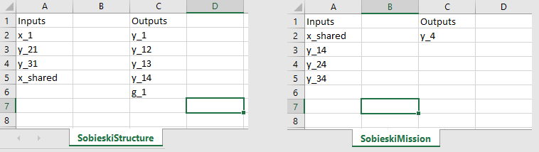
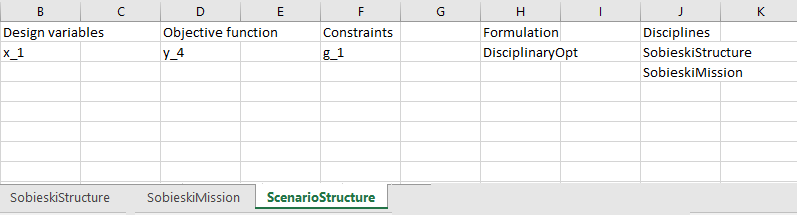
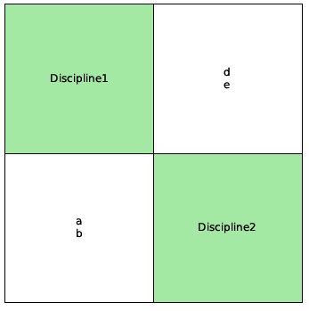
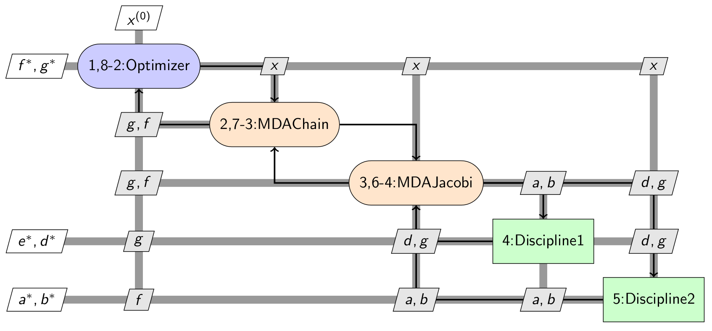
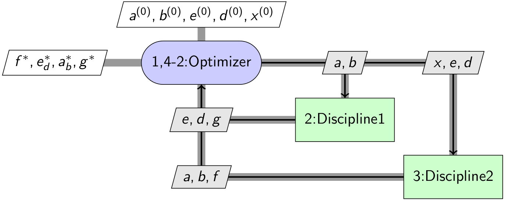
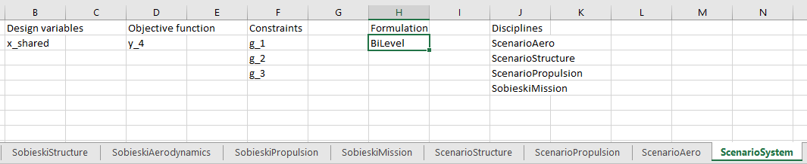

..
   Copyright 2021 IRT Saint Exupéry, https://www.irt-saintexupery.com

   This work is licensed under the Creative Commons Attribution-ShareAlike 4.0
   International License. To view a copy of this license, visit
   http://creativecommons.org/licenses/by-sa/4.0/ or send a letter to Creative
   Commons, PO Box 1866, Mountain View, CA 94042, USA.

..
   Contributors:
          :author:  Francois Gallard

.. _gemseo_study:

Study analysis
==============

Objective and scope
-------------------

This section describes how to use :class:`.StudyAnalysis`.
The idea is to help the users to define the right MDO problem to be solved, even before wrapping any software.
The result of the study are a :term:`N2` (or :term:`DSM`)
and :term:`XDSM` diagrams (see more explanations here :ref:`XDSM <xdsm>`),
with a defined MDO problems including:

- The list of disciplines, with their inputs and outputs
- The design variables
- The constraints
- The objective function(s)

No executable code is produced, the idea is to assist the discussions with design and field experts,
customers, to define the MDO problem, from the white sheet. This way, the study may be visualized before
any process or tool being actually ready.

There is no need to write any line of code to use this tool. A command line executable is available.

Examples
--------

The next figure illustrates how this tool can be used to create an MDO study analysis.
This requires the creation of an excel workbook with one sheet per discipline.
The name of the discipline is given by the name of the sheet.
On each of these sheets, the inputs and outputs of the discipline must be given.

   Disciplines definition

Scenarios are defined by sheet names starting with "Scenario".

   Scenario definition

The N2 and XDSM diagrams can be generated from such as study file.
The N2 diagrams are generated as pdf files.
The XDSM diagrams are generated as standalone HTML files, by default, or as Latex and pdf files as an option (-l).

   N2 of the study

   MDF XDSM diagram of the study

   IDF XDSM diagram of the study

For more complex use cases, multi-level formulations can also be used.
You first need to define the sub-scenarios in dedicated sheets,
and then add the names of these sheets in the cell block "Disciplines" of the sheet defining the main scenario.
Finally, a multilevel MDO formulation has to be chosen, e.g. ``"BiLevel"``.

   Definition of a scenario based on a bi-level formulation

Class documentation
-------------------

.. currentmodule:: gemseo.utils.study_analysis
.. autoclass:: StudyAnalysis
   :noindex:

Usage of the command line executable
------------------------------------

|g| installation provides the :program:`gemseo-study` command line executable, its usage is:

gemseo-study [-h] [-o OUT_DIR] [-x] [-l] [-s FIG_SIZE] study_file

A tool to generate an N2 chart and an XDSM diagram from an Excel description file.

positional arguments:
  study_file            XLS file that describes the study

optional arguments:
  -h, --help            show this help message and exit
  -o OUT_DIR, --out_dir OUT_DIR
                        Output directory for the generated files
  -x, --xdsm            If True, generates the XDSM file
  -l, --latex_output    If True, generates the XDSM in PDF and Latex
  -s FIG_SIZE, --fig_size FIG_SIZE
                        Size of the N2 figure, tuple (x,y)
