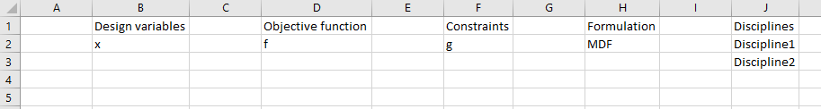

..
   Copyright 2021 IRT Saint Exupéry, https://www.irt-saintexupery.com

   This work is licensed under the Creative Commons Attribution-ShareAlike 4.0
   International License. To view a copy of this license, visit
   http://creativecommons.org/licenses/by-sa/4.0/ or send a letter to Creative
   Commons, PO Box 1866, Mountain View, CA 94042, USA.

..
   Contributors:
          :author:  Francois Gallard

.. _gemseo_study:

Study analyses
==============

The :class:`.CouplingStudyAnalysis` and :class:`.MDOStudyAnalysis` are tools based on an Excel file
to specify and analyze a study, even before wrapping any software.

No executable code is produced, the idea is to assist the discussions with design and field experts,
customers, to define the MDO problem, from the white sheet. This way, the study may be visualized before
any process or tool being actually ready.

There is no need to write any line of code to use this tool. A command line executable is available.

Coupling study analysis
-----------------------

The :class:`.CouplingStudyAnalysis` helps the user to check the couplings between various disciplines.

The user only has to fill an Excel file with one worksheet per discipline defining the input and output names.

The result of the analysis is a :term:`N2` (or :term:`DSM`) diagram

MDO study analysis
------------------

The :class:`.MDOStudyAnalysis` helps the user to define the right MDO problem to be solved.

The user only has to fill an Excel file with one worksheet per discipline defining the input and output names
and one worksheet per scenario (at least the main scenario, and multiple scenarios for distributive formulations)
defining the names of the objectives, constraints, design variables, disciplines, formulation and options.

The result of the analysis are a :term:`N2` (or :term:`DSM`)
and :term:`XDSM` diagrams (see more explanations here :ref:`XDSM <xdsm>`).

Examples
--------

The next figure illustrates how this tool can be used to create an :class:`.MDOStudyAnalysis`.
This requires the creation of an Excel workbook with one sheet per discipline.
The name of the discipline is given by the name of the sheet.
On each of these sheets, the inputs and outputs of the discipline must be given.

.. figure:: figs/study_0.png
   :scale: 70 %

   Disciplines definition

Scenarios are defined by sheet names starting with "Scenario".

   Scenario definition

The N2 and XDSM diagrams can be generated from such as study file.
The N2 diagrams are generated as pdf files.
The XDSM diagrams are generated as standalone HTML files, by default, or as LaTex and PDF files as an option (-l).

.. figure:: figs/study_n2.png
   :scale: 100 %

   N2 of the study

   MDF XDSM diagram of the study

   IDF XDSM diagram of the study

For more complex use cases, multi-level formulations can also be used.
You first need to define the sub-scenarios in dedicated sheets,
and then add the names of these sheets in the cell block ``Disciplines`` of the sheet defining the main scenario.
Finally, a multilevel MDO formulation has to be chosen, e.g. ``"BiLevel"``.

   Definition of a scenario based on a bi-level formulation

Class documentation
-------------------

.. currentmodule:: gemseo.utils.study_analyses.mdo_study_analysis
.. autoclass:: MDOStudyAnalysis
   :noindex:

Usage of the command line executable
------------------------------------

|g| installation provides the :program:`gemseo-study` command line executable.
This tool allows the generation of an N2 chart and an XDSM diagram from an Excel description file.

Its usage is:

``gemseo-study [-h] [-o OUT_DIR] [-x] [-p] [--height HEIGHT] [--width WIDTH] [-t STUDY_TYPE] study_file``

with

positional arguments:
  study_file                       The path of the XLS file that describes the study.

optional arguments:
  -h, --help                       show this help message and exit
  -t, --study-type                 The type of the study (either coupling or mdo).
  -o OUT_DIR, --out_dir OUT_DIR    The path of the directory to save the files.
  -x, --xdsm                       Whether to generate an XDSM; compatible only with the study type 'mdo'.
  -p, --save-pdf                   Whether to save the XDSM as a PDF file.
  --height HEIGHT                  The height of the N2 figure in inches.
  --width WIDTH                    The width of the N2 figure in inches.

Excel file templates
--------------------

- :download:`Coupling study analysis </_static/study_analysis_templates/coupling_study.xlsx>`,
- :download:`MDO study analysis with MDF </_static/study_analysis_templates/mdo_study_mdf.xlsx>`,
