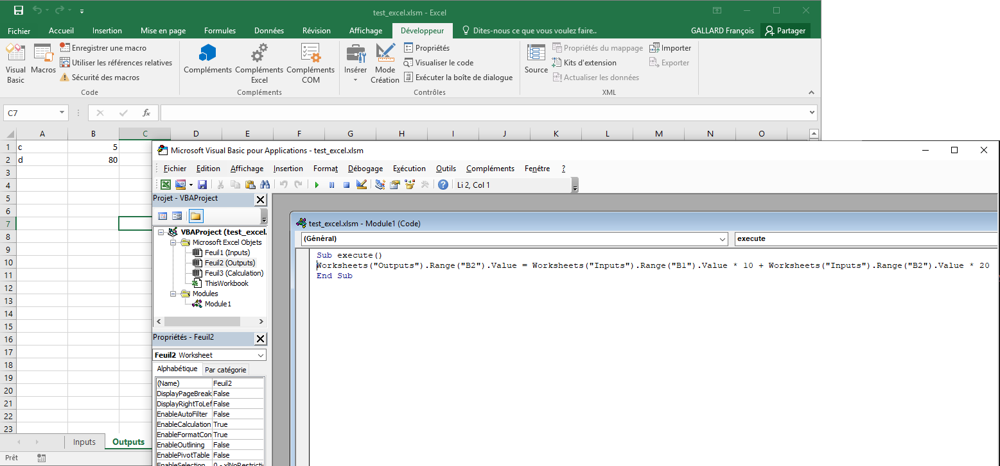

..
   Copyright 2021 IRT Saint Exupéry, https://www.irt-saintexupery.com

   This work is licensed under the Creative Commons Attribution-ShareAlike 4.0
   International License. To view a copy of this license, visit
   http://creativecommons.org/licenses/by-sa/4.0/ or send a letter to Creative
   Commons, PO Box 1866, Mountain View, CA 94042, USA.

..
   Contributors:
          :author:  Francois Gallard, Gilberto Ruiz

.. _xls_discipline:

Excel wrapper
=============

This section describes how to use an :class:`.XLSDiscipline` with
a practical application using a simple discipline in a :class:`.DOEScenario`.

Imports
-------
We start by importing all the necessary modules and configuring the logger.

.. code-block:: python

   from numpy import array, ones

   from gemseo.api import create_design_space, configure_logger, create_scenario
   from gemseo.wrappers.xls_discipline import XLSDiscipline

   configure_logger()

Create an XLSDiscipline
-----------------------
For this simple problem, the Excel book will compute :math:`c=a+b`.

1. Create the Excel file that will compute the outputs (``c``) from the inputs (``a``, ``b``).
   Inputs must be specified in the "Inputs" sheet:

   .. list-table::
      :header-rows: 1
      :stub-columns: 1

      *  -
         -  A
         -  B
      *  -  1
         -  a
         -  3
      *  -  2
         -  b
         -  5

   "Inputs" sheet setting :math:`a=3` and :math:`b=5`.

   .. warning::

      The number of rows is arbitrary but they must be contiguous (no empty lines) and start at line 1.

   The same applies for the "Outputs" sheet:

   .. list-table::
      :header-rows: 1
      :stub-columns: 1

      *  -
         -  A
         -  B
      *  -  1
         -  c
         -  8

   "Outputs" sheet setting :math:`c=8`.

2. Instantiate the discipline.
   For this basic implementation we only need to provide the path to the Excel file: ``my_book.xlsx``.

.. code-block:: python

   xls_discipline = XLSDiscipline('my_book.xlsx')

Instantiate the scenario
------------------------
The scenario requires a :class:`.DesignSpace` defining the design variables ``a`` and ``b``:

.. code-block:: python

   design_space = create_design_space()
   design_space.add_variable("a", 1, l_b=0.0, u_b=10.0, value=array([1]))
   design_space.add_variable("b", 1, l_b=-10.0, u_b=10.0, value=array([2]))

Create the :class:`.DOEScenario` with the :class:`.XLSDiscipline`, the :class:`.DesignSpace` and an :class:`.MDF` formulation:

.. code-block:: python

   scenario = create_scenario(
       xls_discipline,
       formulation="DisciplinaryOpt",
       objective_name="c",
       design_space=design_space,
       scenario_type='DOE',
   )

Execute the Scenario
--------------------
Define the execution options using a dictionary, then execute the scenario. Here, we use a :class:`.CustomDOE` and
provide two samples to be evaluated:

.. code-block:: python

   sample_1 = [1, 2]  # a=1, b=2
   sample_2 = [2, 3]  # a=2, b=3
   samples = array([sample_1, sample_2])
   scenario.execute({"algo": "CustomDOE", "algo_options": {"samples": samples}})
   print(scenario.export_to_dataset().export_to_dataframe())

Which prints the results of the computation as follows:

.. code-block:: bash

     design_parameters      functions
                     a    b         c
                     0    0         0
   0               1.0  2.0       3.0
   1               2.0  3.0       5.0

Parallel execution considerations
---------------------------------
|g| relies on the `xlswings library <https://www.xlwings.org>`__ to communicate with Excel. This imposes some
constraints to our development. In particular,
`we cannot pass xlwings objects between processes or threads <https://docs.xlwings.org/en/stable/threading_and_multiprocessing.html>`__.
We have different strategies to comply with this requirement in parallel execution, depending on whether we are
using multiprocessing, multithreading or both.

In the following, we no longer use the previous discipline to illustrate these parallel execution considerations but an
:class:`.XLSDiscipline` named ``xls_discipline`` and strongly coupled to another discipline called ``other_discipline``.
The idea is to minimize the objective function ``"f"`` computed by this multidisciplinary system over a ``design_space``.
For that, we will use the :class:`.MDFFormulation`:

.. code-block:: python

   scenario = create_scenario(
       [xls_discipline, other_discipline],
       formulation="MDF",
       objective_name="f",
       design_space=design_space,
       scenario_type='DOE',
   )

Multiprocessing
^^^^^^^^^^^^^^^
In multiprocessing, we recreate the ``xlwings`` object in each subprocess through ``__setstate__``. However,
the same Excel file cannot be used by all the subprocesses at the same time. Which means that we need a
unique copy of the original file for each one.

The option ``copy_xls_at_setstate`` shall be set to ``True`` whenever an :class:`.XLSDiscipline`
will be used in a :class:`.ParallelExecution` instance implementing multiprocessing.

If we wanted to run the previously defined scenario in parallel, then the discipline instantiation would be:

.. code-block:: python

   xls_discipline = XLSDiscipline('my_book.xlsx', copy_xls_at_setstate=True)

The algo options would change as well to request the number of processes to run:

.. code-block:: python

   input_data = {"algo": "CustomDOE", "algo_options": {"n_processes": 2, "samples": samples}}

And the execution call shall be protected:

.. code-block:: python

   if __name__ == '__main__':
       scenario.execute(input_data)

Multithreading
^^^^^^^^^^^^^^
In multithreading, we recreate the ``xlwings`` object at each call to the :class:`.XLSDiscipline`. Thus, when
instantiating an :class:`.XLSDiscipline` that will be executed in multithreading, the user must set ``recreate_book_at_run=True``.

.. warning::

   An :class:`.MDAJacobi` uses multithreading to accelerate its convergence, even if the
   overall scenario is being run in serial mode. If your :class:`.XLSDiscipline` is inside an :class:`.MDAJacobi`, you must
   instantiate it with ``recreate_book_at_run=True``.

Going back to the example scenario, if we want to run it using an :class:`.MDAJacobi` then the
:class:`.XLSDiscipline` would be created as follows:

.. code-block:: python

   xls_discipline = XLSDiscipline('my_book.xlsx', copy_xls_at_setstate=True)

The scenario creation would specify the MDA:

.. code-block:: python

   scenario = create_scenario(
       [xls_discipline, other_discipline],
       formulation="MDF",
       main_mda_class="MDAJacobi",
       objective_name="f",
       design_space=design_space,
       scenario_type='DOE',
   )

The scenario execution remains the same:

.. code-block:: python

   input_data = {"algo": "CustomDOE", "algo_options": {"samples": samples}}
   scenario.execute(input_data)

Multiprocessing & Multithreading
^^^^^^^^^^^^^^^^^^^^^^^^^^^^^^^^
There is one last case to consider, which occurs when the :class:`.XLSDiscipline` will run in multithreading mode
from a subprocess that was itself created by a multiprocessing instance. A good example of this particular
situation is when a :class:`.DOEScenario` runs in parallel with an :class:`.MDAJacobi` that solves the couplings for
each sample.

It will be necessary to set both ``copy_xls_at_setstate=True`` and ``recreate_book_at_run=True``.

In our example, the ``XLSDiscipline`` instantiation would be:

.. code-block:: python

   xls_discipline = XLSDiscipline('my_book.xlsx', copy_xls_at_setstate=True, recreate_book_at_run=True)

The scenario would be created as follows:

.. code-block:: python

   scenario = create_scenario(
       [xls_discipline, other_discipline],
       formulation="MDF",
       main_mda_class="MDAJacobi",
       objective_name="f",
       design_space=design_space,
       scenario_type='DOE',
   )

The algo options would change as well to request the number of processes to run:

.. code-block:: python

   input_data = {"algo": "CustomDOE", "algo_options": {"n_processes": 2, "samples": samples}}

And the execution call shall be protected:

.. code-block:: python

   if __name__ == '__main__':
       scenario.execute(input_data)

What about macros?
------------------
The next figure illustrates how a macro can be wrapped to compute outputs from inputs.
You shall pass the name of the macro with the option ``macro_name`` at instantiation.

   Example of macro that can be wrapped
