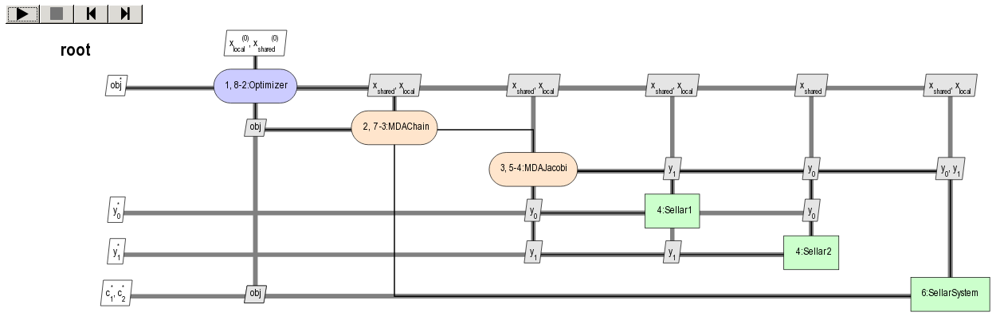

..
   Copyright 2021 IRT Saint Exupéry, https://www.irt-saintexupery.com

   This work is licensed under the Creative Commons Attribution-ShareAlike 4.0
   International License. To view a copy of this license, visit
   http://creativecommons.org/licenses/by-sa/4.0/ or send a letter to Creative
   Commons, PO Box 1866, Mountain View, CA 94042, USA.

..
   Contributors:
          :author: Matthias De Lozzo

.. _nutshell_scenario:

How to deal with scenarios
==========================

1. How is a scenario defined?
*****************************

1.a. What is a scenario?
~~~~~~~~~~~~~~~~~~~~~~~~

A scenario is an interface that:

- creates an optimization or sampling problem,
- from a set of disciplines and a multidisciplinary formulation based on a design space and on an objective name,
- executes it from an optimization or sampling algorithm with mandatory arguments and options and
- post-process it.

1.b. How does a scenario is implemented in |g|?
~~~~~~~~~~~~~~~~~~~~~~~~~~~~~~~~~~~~~~~~~~~~~~~~~~~~~~~~~~~

Programmatically speaking, scenarios are implemented in |g| through the :class:`.Scenario` abstract class
inheriting from the :class:`.MDODiscipline` class and derived classes:

- The :class:`.MDOScenario` class inheriting from :class:`.Scenario`
  is dedicated to optimization processes.
- The :class:`.DOEScenario` class inheriting from :class:`.Scenario`
  is dedicated to trade-off studies and sampling processes.

A :class:`.Scenario` is defined by four main elements:

- the ``disciplines`` attribute: the list of :class:`.MDODiscipline`,
- the ``formulation`` attribute: the multidisciplinary formulation based on :class:`~gemseo.algos.design_space.DesignSpace`,
- the ``optimization_result`` attribute: the optimization results,
- the ``post_factory`` attribute: the post-processing set of methods.

1.c. What are the API functions in |g|?
~~~~~~~~~~~~~~~~~~~~~~~~~~~~~~~~~~~~~~~~~~~~~~~~~~~

After the instantiation of the different :class:`.MDODiscipline`,
an instance of this scenario can be created from the :meth:`~gemseo.create_scenario` API function whose arguments are:

- ``disciplines``: the ``list`` of instantiated :class:`.MDODiscipline`,
- ``formulation``: the multidisciplinary formulation name (``str``)
- ``objective_name``: the objective name (``str``)
- ``design_space``: the instantiated :class:`~gemseo.algos.design_space.DesignSpace`,
- ``name=None``: the optional name of the scenario (``str``),
- ``scenario_type='MDO'``: the optional type of scenario (``'MDO'`` or ``'DOE'``),
- ``maximize_objective=False``: the choice between maximizing or minimizing the objective function (``bool``),
- ``**formulation_options``: options passed to the multidisciplinary formulation.

The types of scenarios already implemented in |g| can be obtained by means of the :meth:`~gemseo.get_available_scenario_types` API function:

.. code::

   from gemseo import get_available_scenario_types

   get_available_scenario_types():

which results in:

.. code::

   ["MDO", "DOE"]

2. How to create a scenario?
****************************

We can easily create an :class:`.MDOScenario` or a :class:`.DOEScenario`
from the :meth:`~gemseo.create_scenario` API function.

2.a. Instantiate the disciplines
~~~~~~~~~~~~~~~~~~~~~~~~~~~~~~~~

For that, we first instantiate the different :class:`.MDODiscipline`, e.g.

.. code::

   from gemseo import create_discipline

   disciplines = create_discipline(['Sellar1', 'Sellar2', 'SellarSystem'])

2.b. Define the design space
~~~~~~~~~~~~~~~~~~~~~~~~~~~~

Then, we define the design space,
either by instantiating a :class:`~gemseo.algos.design_space.DesignSpace`,

.. code::

    from gemseo.problems.sellar.sellar_design_space import SellarDesignSpace

    design_space = SellarDesignSpace()

or by means of the file path of the design space:

.. code::

    design_space = 'path_to_sellar_design_space.csv'

2.c. Define the objective function
~~~~~~~~~~~~~~~~~~~~~~~~~~~~~~~~~~

The objective function should be an output taken among the output list of the different :class:`.MDODiscipline`, e.g.

.. code::

   objective_name = 'obj'

2.d. Define the multidisciplinary formulation
~~~~~~~~~~~~~~~~~~~~~~~~~~~~~~~~~~~~~~~~~~~~~

From the design space and the objective name,
the :class:`.Scenario` automatically builds an multidisciplinary formulation
corresponding to a multidisciplinary formulation name specified by the user, e.g.

.. code::

   formulation = 'MDF'

The list of the different available formulations can be obtained by means of the :meth:`~gemseo.get_available_formulations` API function:

.. code::

   from gemseo import get_available_formulations

   get_available_formulations()

which yields:

.. code::

   ['BiLevel', 'IDF', 'MDF', 'DisciplinaryOpt']

.. note::

   ``argument=value`` formulation options can also be passed to the :meth:`~gemseo.create_scenario` API function.
   Available options for the different formulations are presented in :ref:`gen_formulation_algos`.

2.e. Choose the type of scenario
~~~~~~~~~~~~~~~~~~~~~~~~~~~~~~~~

Just before the :class:`.Scenario` instantiation,
the type of scenario must be chosen, e.g.

.. code::

   scenario_type = 'MDO'

Remind that the different types of scenario can be obtained by means of the :meth:`~gemseo.get_available_scenario_types` API function:

.. code::

   from gemseo import get_available_scenario_types

   get_available_scenario_types()

which yields:

.. code::

   ['MDO', 'DOE']

2.f. Instantiate the scenario
~~~~~~~~~~~~~~~~~~~~~~~~~~~~~

From these different elements, we can instantiate the :class:`.Scenario`
by means of the :meth:`~gemseo.create_scenario` API function:

.. code::

   from gemseo import create_scenario

   scenario = create_scenario(
       disciplines=disciplines,
       formulation=formulation,
       objective_name=objective_name,
       design_space=design_space,
       scenario_type=scenario_type,
   )

2.g. Get the names of design variables
~~~~~~~~~~~~~~~~~~~~~~~~~~~~~~~~~~~~~~

We can use the :meth:`.Scenario.get_optim_variable_names` method of the :class:`.Scenario`
to access formulation design variables names in a convenient way:

.. code::

   print(scenario.get_optim_variable_names)

which yields:

.. code::

   ['x_local', 'x_shared']

2.g. Get the design space
~~~~~~~~~~~~~~~~~~~~~~~~~

The design space can be accessed using the :attr:`.Scenario.design_space` property of the :class:`.Scenario`:

.. code::

   print(scenario.design_space)

which yields:

.. code::

   +----------+-------------+--------+-------------+-------+
   | name     | lower_bound | value  | upper_bound | type  |
   +----------+-------------+--------+-------------+-------+
   | x_local  |      0      | (1+0j) |      10     | float |
   | x_shared |     -10     | (4+0j) |      10     | float |
   | x_shared |      0      | (3+0j) |      10     | float |
   +----------+-------------+--------+-------------+-------+

2.h. Visualize the scenario before execute it (XDSM graph)
~~~~~~~~~~~~~~~~~~~~~~~~~~~~~~~~~~~~~~~~~~~~~~~~~~~~~~~~~~

The simplest way to visualize how the :class:`.Scenario` manages the workflow and dataflow before to execute it
is to log them in the console or in a file using |g|'s logger.

The method :meth:`.Scenario.xdsmize` of the :class:`.Scenario`
can be used to this aim (``monitor=True``).

If ``save_html`` (default True), will generate a self contained HTML file, that can be automatically open using the option ``show_html=True``.
If ``save_json`` is True, it will generate a `XDSMjs <https://github.com/OneraHub/XDSMjs>`_ input file :ref:`xdsm`.
It will log the status of the workflow if ``log_workflow_status=True``:

.. code::

    scenario.xdsmize(monitor=True, log_workflow_status=True, show_html=False)

which yields:

.. code::

   INFO - 13:21:18 : {MDOScenario(RUNNING), {MDAChain(PENDING), [{MDAJacobi(None), (Sellar1(None), Sellar2(None), ), }, SellarSystem(None), ], }, }
   INFO - 13:21:18 : {MDOScenario(RUNNING), {MDAChain(RUNNING), [{MDAJacobi(PENDING), (Sellar1(None), Sellar2(None), ), }, SellarSystem(None), ], }, }
   INFO - 13:21:18 : {MDOScenario(RUNNING), {MDAChain(RUNNING), [{MDAJacobi(RUNNING), (Sellar1(PENDING), Sellar2(PENDING), ), }, SellarSystem(None), ], }, }
   INFO - 13:21:18 : {MDOScenario(RUNNING), {MDAChain(RUNNING), [{MDAJacobi(RUNNING), (Sellar1(RUNNING), Sellar2(RUNNING), ), }, SellarSystem(None), ], }, }
   INFO - 13:21:18 : {MDOScenario(RUNNING), {MDAChain(RUNNING), [{MDAJacobi(RUNNING), (Sellar1(DONE), Sellar2(RUNNING), ), }, SellarSystem(None), ], }, }
   INFO - 13:21:18 : {MDOScenario(RUNNING), {MDAChain(RUNNING), [{MDAJacobi(RUNNING), (Sellar1(PENDING), Sellar2(PENDING), ), }, SellarSystem(None), ], }, }
   INFO - 13:21:18 : {MDOScenario(RUNNING), {MDAChain(RUNNING), [{MDAJacobi(RUNNING), (Sellar1(PENDING), Sellar2(PENDING), ), }, SellarSystem(None), ], }, }
   INFO - 13:21:18 : {MDOScenario(RUNNING), {MDAChain(RUNNING), [{MDAJacobi(RUNNING), (Sellar1(RUNNING), Sellar2(RUNNING), ), }, SellarSystem(None), ], }, }
   ...

and

Moreover, you can export a static version of the XDSM in both TIKZ, LaTeX and PDF files
by means of the ``save_pdf`` boolean argument of the
:meth:`.Scenario.xdsmize` method:

.. code::

    scenario.xdsmize(save_pdf=True)

eventually specifying the output directory ``directory_path='SOME_PATH'``.

3. How to execute a scenario?
*****************************

When the :class:`.Scenario` is created, we can execute it to solve the optimization problem, e.g.

.. code::

   scenario.execute({'algo': 'SLSQP', 'max_iter': 100}) # MDO case

or sampling the problem, e.g.

.. code::

   doe_scenario = create_scenario(
       disciplines=disciplines,
       formulation=formulation,
       objective_name=objective_name,
       design_space=design_space,
       scenario_type="DOE",
   )
   doe_scenario.execute({'algo': 'lhs', 'n_samples': 100}) # DOE case

.. note::

   :meth:`.MDOScenario.execute` and :meth:`.DOEScenario.execute` use input data defined as a dictionary
   with at least an algorithm name ``algo`` (see :meth:`.Scenario.get_available_driver_names` for a complete list).
   an :class:`.MDOScenario` also requires the mandatory parameter ``max_iter``
   corresponding to the maximum number of iterations of the optimization algorithm;
   the other parameters can be passed as a dictionary of options (see :ref:`gen_opt_algos`),
   e.g. ``{"algo": "SLSQP", "max_iter": 100, "algo_options": dict_of_options}``.
   On the other hand,
   depending on the DOE algorithm,
   :class:`.DOEScenario` can require either ``n_samples``
   or other arguments to be mandatory.
   The other optional parameters can be passed as a dictionary (see :ref:`gen_doe_algos`),
   e.g. ``{"algo": "lhs", "n_samples": 10, "algo_options": dict_of_options}``.

.. seealso::

   We can print scenario information (disciplines, MDO formulation and algorithm):

    .. code::

      repr(scenario)

   which yields:

   .. code::

      MDOScenario:
      Disciplines: Sellar1 Sellar2 SellarSystem
      MDOFormulation: MDF
      Algorithm: SLSQP

4. How to get the optimum solution?
***********************************

Once the :class:`.Scenario` is executed, the optimum results can be found in the execution log.

It is also possible to extract them by invoking the :meth:`.Scenario.get_optimum` method of the :class:`.Scenario` class.
It returns a dictionary containing the optimum results for the scenario under consideration:

.. code::

   opt_results = scenario.get_optimum()
   print("The solution of P is (x*,f(x*)) = ({}, {})".format(
       opt_results.x_opt, opt_results.f_opt
   ))

which yields:

.. code::

   The solution of P is (x*,f(x*)) = ([  0.00000000e+00   5.81632893e-01   6.38978246e-10], (0.527289923509+0j)).

5. How to log disciplinary and total execution metrics?
*******************************************************

The :meth:`.Scenario.print_execution_metrics` method of the :class:`.Scenario` class
adds disciplinary and total execution metrics in the logs:

.. code::

   scenario.print_execution_metrics()

which yields:

.. code::

    INFO - 12:50:53 : * Scenario Executions statistics *
    INFO - 12:50:53 : * Discipline: Sellar1
    INFO - 12:50:53 : Executions number: 128
    INFO - 12:50:53 : Execution time:  0.00471186637878 s
    INFO - 12:50:53 : Linearizations number: 9
    INFO - 12:50:53 : * Discipline: Sellar2
    INFO - 12:50:53 : Executions number: 128
    INFO - 12:50:53 : Execution time:  0.0041139125824 s
    INFO - 12:50:53 : Linearizations number: 9
    INFO - 12:50:53 : * Discipline: SellarSystem
    INFO - 12:50:53 : Executions number: 15
    INFO - 12:50:53 : Execution time:  0.00153756141663 s
    INFO - 12:50:53 : Linearizations number: 9
    INFO - 12:50:53 : Total number of executions calls 271
    INFO - 12:50:53 : Total number of linearizations 27

6. How to visualize the scenario execution and results?
*******************************************************

|g| provides many post-processing tools which can be called
either by means of the :meth:`.Scenario.post_process` method of the :class:`.Scenario` class
or by means of the :meth:`~gemseo.execute_post` API function.
:meth:`.Scenario.post_process` method of the :class:`.Scenario` class
returns the list of available post-processing methods.
Find more information about post-processing and visualization here: :ref:`post_processing`.
