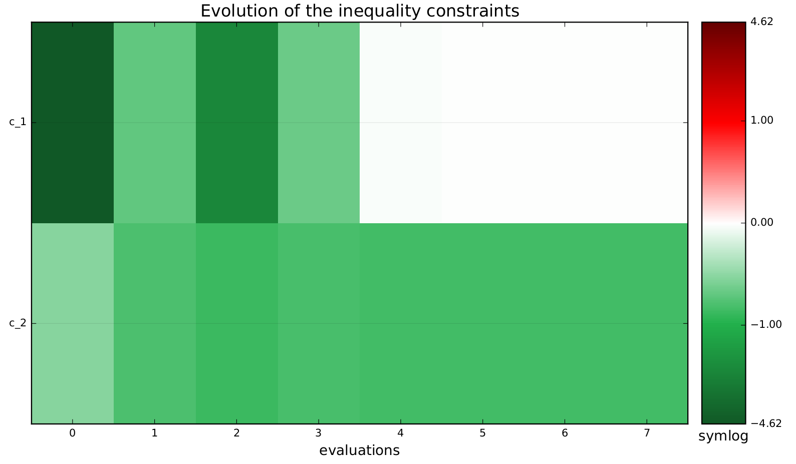
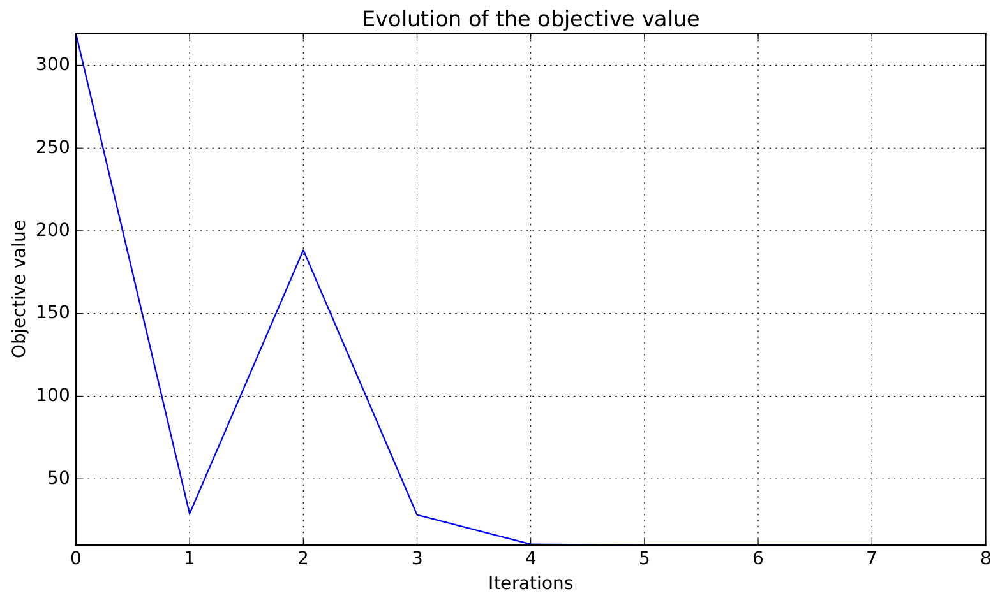
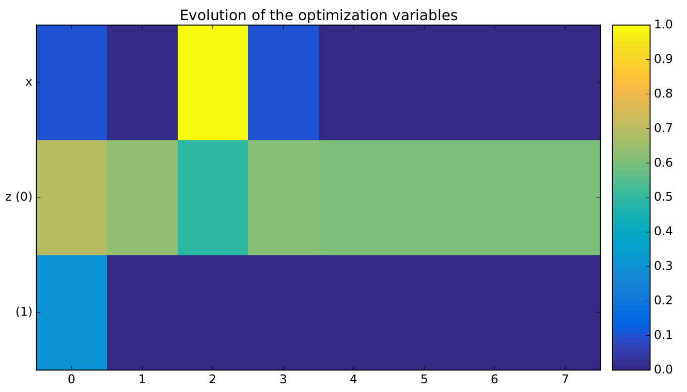

..
   Copyright 2021 IRT Saint Exupéry, https://www.irt-saintexupery.com

   This work is licensed under the Creative Commons Attribution-ShareAlike 4.0
   International License. To view a copy of this license, visit
   http://creativecommons.org/licenses/by-sa/4.0/ or send a letter to Creative
   Commons, PO Box 1866, Mountain View, CA 94042, USA.

..
   Contributors:
          :author:  Francois Gallard, Charlie Vanaret

.. _sellar_mdo:

Tutorial: How to solve a MDO problem
====================================

This tutorial describes how to solve a MDO problem by means of |g|.
For that, we consider the :ref:`Sellar problem <sellar_problem>`.

Step 1 : Creation of disciplines
--------------------------------

In order to solve the :ref:`Sellar problem <sellar_problem>` with |g|, we need first to model this set of equations as a **multidisciplinary problem**.

For that, the problem is decomposed into three :term:`disciplines <discipline>`.

What defines a :class:`.MDODiscipline`
~~~~~~~~~~~~~~~~~~~~~~~~~~~~~~~~~~~~~~

A discipline is a set of calculations that produces a set of
vector outputs from a set of vector inputs, using either equations or an external software, or a :term:`workflow engine`.

Programmatically speaking, in |g|, a :class:`.MDODiscipline` is defined by three elements :

- the **input grammar** : the set of rules that defines valid input data,
- the **output grammar** : the set of rules that defines valid output data,
- the **method to compute the output data from the input data**, here the :meth:`!MDODiscipline._run` method.

The disciplines are all subclasses of :class:`.MDODiscipline`, from which they must inherit.

.. seealso::

   The :term:`grammar` is a very powerful and key concept. There are multiple ways of creating grammars in |g|.
   The preferred one for integrating simulation processes is the use of a :term:`JSON schema`, but is not detailed here for the sake of simplicity.
   For more explanations about grammars, see :ref:`software_connection`.

.. warning::

   **All the inputs and outputs names of the disciplines in a scenario shall be consistent**.

   - |g| assumes that the data are tagged by their names with a global convention in the whole process.
   - What two disciplines call "X" shall be the same "X". The coupling variables for instance, are detected thanks to these conventions.

1.1. Define the input and output grammars of the discipline
~~~~~~~~~~~~~~~~~~~~~~~~~~~~~~~~~~~~~~~~~~~~~~~~~~~~~~~~~~~

We create a class for each discipline inheriting from :class:`.MDODiscipline`.
After having called the superconstructor :meth:`!MDODiscipline.__init__`,
we complete the constructor of the new discipline by declaring the :ref:`Sellar <sellar_problem>` discipline input data names :attr:`!MDODiscipline.input_grammar` and discipline output data names :attr:`!MDODiscipline.output_grammar` in a straightforward way with
:meth:`.JSONGrammar.initialize_from_data_names` .

.. warning::

   **These inputs and outputs shall be** `numpy <http://www.numpy.org/>`_ **arrays of numbers.**
   The grammars will check this at each execution and prevent any discipline from running with invalid data,
   or raise an error if outputs are invalid, which happens sometimes with simulation software...

For example, in the case of Sellar 1, we build:

.. code::

    from gemseo.core.discipline import MDODiscipline
    from numpy import array, ones

    class Sellar1(MDODiscipline):

        def __init__(self, residual_form=False):
            super(Sellar1, self).__init__()
            self.input_grammar.initialize_from_data_names(['x_local', 'x_shared', 'y_1'])
            self.output_grammar.initialize_from_data_names(['y_0'])

.. seealso::

    An alternative way to declare the inputs and outputs is the usage of :term:`JSON schema`, see :ref:`software_connection`.
    This gives more control on the type of data that are considered valid inputs and outputs. In our case, it would look like this for the input declaration:

    .. code::

        {
        "name": "Sellar1_input",
        "required": ["x_local","x_shared","y_0","y_1"],
        "properties": {
            "x_local": {
                "items": {
                    "type": "number"
                },
                "type": "array"
            },
            "x_shared": {
                "items": {
                    "type": "number"
                },
                "type": "array"
            },
            "y_1": {
                "items": {
                    "type": "number"
                },
                "type": "array"
            }
        },
        "$schema": "http://json-schema.org/draft-04/schema",
        "type": "object",
        }

1.2. Define the execution of the discipline
~~~~~~~~~~~~~~~~~~~~~~~~~~~~~~~~~~~~~~~~~~~

Once the inputs and outputs have been declared in the constructor of the discipline,
the abstract :meth:`!MDODiscipline._run` method of :class:`.MDODiscipline` shall be overloaded by
the discipline to define how outputs are computed from inputs.

.. seealso::

   The method is protected (starts with "_") because it shall not be called from outside the discipline.
   External calls that trigger the discipline execution use the :meth:`.MDODiscipline.execute` public method from the base class,
   which provides additional services before and after calling :meth:`!MDODiscipline._run`. These services, such as data checks by the grammars,
   are provided by |g| and the integrator of the discipline does not need to implement them.

First, the data values shall be retrieved. For each input declared in the input grammar, |g| will pass the values as arrays to the :class:`.MDODiscipline` during the execution of the process.
There are different methods to get these values within the :meth:`!MDODiscipline._run` method of the discipline:

- as a dictionary through the :meth:`.MDODiscipline.get_input_data` method, which are also already accessible in the :attr:`!MDODiscipline.local_data` attribute of the :class:`.MDODiscipline`
- or here as a list of values using :meth:`.MDODiscipline.get_inputs_by_name` with the data names passed as a list.

.. tip::

   The list of all inputs names can also be retrieved using :meth:`.MDODiscipline.get_input_data_names`:

   .. code::

      sellar1 = Sellar1()
      print(sellar1.get_input_data_names())
      # ['x_shared', 'y_1', 'x_local']

Then, the computed outputs shall be stored in the :attr:`!MDODiscipline.local_data`:

.. code::

    def _run(self):
        x_local, x_shared, y_1 = self.get_inputs_by_name(['x_local', 'x_shared', 'y_1'])
        self.local_data['y_0'] = array([x_shared[0] ** 2 + x_shared[1] + x_local[0] - 0.2 * y_1[0]])

The :meth:`.MDODiscipline.store_local_data` method can also be used to this aim:

.. code::

    def _run(self):
        x_local, x_shared, y_1 = self.get_inputs_by_name(['x_local', 'x_shared', 'y_1'])
        y_0 = array([x_shared[0] ** 2 + x_shared[1] + x_local[0] - 0.2 * y_1[0]])
        self.store_local_data(y_0=y_0)

The other Sellar :class:`.MDODiscipline` are created in a similar way.

1.3. How to define derivatives (optional)
~~~~~~~~~~~~~~~~~~~~~~~~~~~~~~~~~~~~~~~~~

The :class:`.MDODiscipline` may also provide the derivatives of their outputs with respect to their inputs, i.e. their Jacobians.
This is useful for :term:`gradient-based optimization` or :ref:`mda` based on the :term:`Newton method`.
For a vector of inputs :math:`x` and a vector of outputs :math:`y`, the Jacobian of the discipline is
:math:`\frac{\partial y}{\partial x}`.

The discipline shall provide a method to compute the Jacobian for a given set of inputs.
This is made by overloading the abstract :meth:`!MDODiscipline._compute_jacobian` method of :class:`.MDODiscipline`.
The discipline may have multiple inputs and multiple outputs. To store the multiple Jacobian matrices associated to all the inputs and outputs,
|g| uses a dictionary of dictionaries structure. This data structure is sparse and makes easy the access and the iteration over the elements
of the Jacobian.

Here is an example of a jacobian definition for the Sellar1 discipline.
The method :meth:`!MDODiscipline._init_jacobian` fills the dict of dict structure
with dense null matrices of the right sizes. Note that all Jacobians must be 2D matrices, which avoids
ambiguity.

.. code::

    from numpy import atleast_2d

    def _compute_jacobian(self, inputs=None, outputs=None):
        """
        Computes the jacobian

        :param inputs: linearization should be performed with respect
            to inputs list. If None, linearization should
            be performed wrt all inputs (Default value = None)
        :param outputs: linearization should be performed on outputs list.
            If None, linearization should be performed
            on all outputs (Default value = None)
        """
        # Initialize all matrices to zeros
        self._init_jacobian(with_zeros=True)
        x_local, x_shared, y_1 = self.get_inputs_by_name(['x_local', 'x_shared', 'y_1'])

        inv_denom = 1. / (self.compute_y_0(x_local, x_shared, y_1))
        self.jac['y_0'] = {}
        self.jac['y_0']['x_local'] = atleast_2d(array([0.5 * inv_denom]))
        self.jac['y_0']['x_shared'] = atleast_2d(array(
            [x_shared[0] * inv_denom, 0.5 * inv_denom]))
        self.jac['y_0']['y_1'] = atleast_2d(array([-0.1 * inv_denom]))

Synthetic Python code
~~~~~~~~~~~~~~~~~~~~~

In summary, here is the Python code for the three disciplines of the :ref:`Sellar <sellar_problem>`.

.. code::

    from math import exp, sqrt
    from gemseo.core.discipline import MDODiscipline

    class Sellar1(MDODiscipline):

        def __init__(self, residual_form=False):
            super(Sellar1, self).__init__()
            self.input_grammar.initialize_from_data_names(['x_local', 'x_shared', 'y_1'])
            self.output_grammar.initialize_from_data_names(['y_0'])

        def _run(self):
            x_local, x_shared, y_1 = self.get_inputs_by_name(['x_local', 'x_shared', 'y_1'])
            self.local_data['y_0'] = array([x_shared[0] ** 2 + x_shared[1] + x_local[0] - 0.2 * y_1[0]])

        def _compute_jacobian(self, inputs=None, outputs=None):
            self._init_jacobian(inputs, outputs, with_zeros=True)
            x_local, x_shared, y_1 = self.get_inputs_by_name(
                ['x_local', 'x_shared', 'y_1'])
            inv_denom = 1. / (self.compute_y_0(x_local, x_shared, y_1))
            self.jac['y_0'] = {}
            self.jac['y_0']['x_local'] = atleast_2d(array([0.5 * inv_denom]))
            self.jac['y_0']['x_shared'] = atleast_2d(array(
                [x_shared[0] * inv_denom, 0.5 * inv_denom]))
            self.jac['y_0']['y_1'] = atleast_2d(array([-0.1 * inv_denom]))

    class Sellar2(MDODiscipline):

        def __init__(self, residual_form=False):
            super(Sellar2, self).__init__()
            self.input_grammar.initialize_from_data_names(['x_shared', 'y_0'])
            self.output_grammar.initialize_from_data_names(['y_1'])

        def _run(self):
            x_shared, y_0 = self.get_inputs_by_name(['x_shared', 'y_0'])
            self.local_data['y_1'] = array([sqrt(y_0) + x_shared[0] + x_shared[1]])

        def _compute_jacobian(self, inputs=None, outputs=None):
            self._init_jacobian(inputs, outputs, with_zeros=True)
            y_0 = self.get_inputs_by_name('y_0')
            self.jac['y_1'] = {}
            self.jac['y_1']['x_local'] = zeros((1, 1))
            self.jac['y_1']['x_shared'] = ones((1, 2))
            if y_0[0] < 0.:
                self.jac['y_1']['y_0'] = -ones((1, 1))
            elif y_0[0] == 0.:
                self.jac['y_1']['y_0'] = zeros((1, 1))
            else:
                self.jac['y_1']['y_0'] = ones((1, 1))

    class SellarSystem(MDODiscipline):

        def __init__(self):
            super(SellarSystem, self).__init__()
            self.input_grammar.initialize_from_data_names(['x_local', 'x_shared', 'y_0', 'y_1'])
            self.output_grammar.initialize_from_data_names(['obj', 'c_1', 'c_2'])

        def _run(self):
            x_local, x_shared, y_0, y_1 = self.get_inputs_by_name(['x_local', 'x_shared', 'y_0', 'y_1'])
            self.local_data['obj'] = array([x_local[0] ** 2 + x_shared[1] + y_0[0] ** 2 + exp(-y_1[0])])
            self.local_data['c_1'] = array([1. - y_0[0] / 3.16])
            self.local_data['c_2'] = array([y_1[0] / 24. - 1.])

        def _compute_jacobian(self, inputs=None, outputs=None):
            self._init_jacobian(inputs, outputs, with_zeros=True)
            x_local, _, y_0, y_1 = self.get_inputs_by_name(
                ['x_local', 'x_shared', 'y_0', 'y_1'])
            self.jac['c_1']['y_0'] = atleast_2d(array([-2. * y_0]))
            self.jac['c_2']['y_1'] = ones((1, 1))
            self.jac['obj']['x_local'] = atleast_2d(array([2. * x_local[0]]))
            self.jac['obj']['x_shared'] = atleast_2d(array([0., 1.]))
            self.jac['obj']['y_0'] = atleast_2d(array([2. * y_0[0]]))
            self.jac['obj']['y_1'] = atleast_2d(array([-exp(-y_1[0])]))

Shortcut
~~~~~~~~

The classes :class:`.Sellar1`, :class:`.Sellar2` and :class:`.SellarSystem` are available in the directory **gemseo/problems/sellar**. Consequently, you just need to import them and use it!

.. code::

   from gemseo.problems.sellar.sellar import Sellar1, Sellar2, SellarSystem

   disciplines = [Sellar1(), Sellar2(), SellarSystem()]

A more simplest alternative consists of using the :meth:`~gemseo.api.create_discipline` API function:

.. code::

   from gemseo.api import create_discipline

   disciplines = create_discipline(['Sellar1', 'Sellar2', 'SellarSystem'])

Going further
~~~~~~~~~~~~~

For more information about the connection of software with |g|, in particular the concepts and what goes on under the hood, please see :ref:`software_connection`.

Step 2: Creation and execution of the MDO scenario
--------------------------------------------------

From the :class:`.MDODiscipline`, we build the :term:`scenario`.
The scenario is responsible for the creation and execution of the whole :term:`process`.
It will:

1. build an :term:`optimization problem` using a :term:`MDO formulation`,
2. connect it to a selected :term:`optimization algorithm`,
3. solve the optimization problems
4. post-process the results.

For that, we use the class :class:`.MDOScenario` which is defined by different :class:`.MDODiscipline` and a common :class:`.DesignSpace`

2.1. Create the :class:`.MDODiscipline`
~~~~~~~~~~~~~~~~~~~~~~~~~~~~~~~~~~~~~~~

To instantiate the :class:`.MDOScenario`, we need first the :class:`.MDODiscipline` instances.

.. code::

    from gemseo.api import create_discipline

    disciplines = create_discipline(['Sellar1', 'Sellar2', 'SellarSystem'])

.. _sellar_mdo_design_space:

2.2. Create the :class:`.DesignSpace`
~~~~~~~~~~~~~~~~~~~~~~~~~~~~~~~~~~~~~

Then, by means of the API function :meth:`gemseo.api.create_design_space`, we build the :class:`.DesignSpace`, which defines the design variables, with their bounds and values:

.. code::

    from numpy import ones, array
    from gemseo.api import create_design_space

    design_space = create_design_space()
    design_space.add_variable('x_local', 1, l_b=0., u_b=10., value=ones(1))
    design_space.add_variable('x_shared', 2, l_b=(-10, 0.), u_b=(10., 10.), value=array([4., 3.]))
    design_space.add_variable('y_0', 1, l_b=-100., u_b=100., value=ones(1))
    design_space.add_variable('y_1', 1, l_b=-100., u_b=100., value=ones(1))

.. warning::

   Here, we also add the coupling variables in the :class:`.DesignSpace`, even if we are going to use a :ref:`MDF formulation <mdf_formulation>`, which computes the coupling using an :ref:`mda`:

   - The formulation will by itself remove the coupling variables from the optimization unknowns, but will use the values as default values for the inputs of the :class:`.MDODiscipline`.
   - This will also be convenient when we will switch to the :ref:`IDF <idf_formulation>`, which uses the coupling variables as optimization unknowns.

   Alternatively, one can perform :ref:`MDF <mdf_formulation>` without coupling variables in the :class:`.DesignSpace`, but set the default values of the inputs using the :attr:`.MDODiscipline.default_inputs`
   attribute to the three disciplines:

   .. code::

      discipline[0].default_inputs = {'y_1': ones(1)}
      discipline[1].default_inputs = {'y_0': ones(1)}
      discipline[2].default_inputs = {'y_0': ones(1), 'y_1': ones(1)}

.. _sellar_mdo_create_scenario:

2.3. Create the :class:`.MDOScenario`
~~~~~~~~~~~~~~~~~~~~~~~~~~~~~~~~~~~~~

Then, by means of the API function :meth:`gemseo.api.create_scenario`,
we create the process which is a :class:`.MDOScenario`.
The scenario delegates the creation of an :class:`.OptimizationProblem` to the  :class:`.MDOFormulation`.
We choose the :term:`MDF` formulation, which solves a coupling problem (:ref:`mda`) at each iteration to compute the coupling variables,
here the :math:`y_0` and :math:`y_1` variables, from both :math:`x_{local}` and :math:`x_{shared}` variables.
To be executable, the scenario needs at least an objective function. The constraints being optional.
The name of the objective function shall be one of the outputs of the disciplines. Here, the SellarSystem discipline
outputs "obj", "c_1", and "c_2", which are declared as, respectively, the objective function and inequality constraints.

.. code::

    from gemseo.api import create_scenario

    scenario = create_scenario(disciplines, 'MDF', 'obj', design_space)

Users may add constraints to the :term:`optimization problem`.

.. code::

    scenario.add_constraint('c_1', 'ineq')
    scenario.add_constraint('c_2', 'ineq')

The execution of the process is triggered through the resolution of the optimization problem
by an optimizer. The name of the optimizer and its options are given to the scenario as input data in a Python dictionary.
Here the :term:`SLSQP` algorithm is a :term:`gradient-based optimization` algorithm.
The disciplines that we integrated provide no analytical derivatives,
so we need first to tell the scenario to use finite differences to compute the derivatives using :meth:`.Scenario.set_differentiation_method`.

.. code::

    scenario.set_differentiation_method('finite_differences', 1e-6)

.. _sellar_mdo_execute_scenario:

2.4. Solve the :class:`.OptimizationProblem`
~~~~~~~~~~~~~~~~~~~~~~~~~~~~~~~~~~~~~~~~~~~~

Then, we can run the scenario by calling the :meth:`.MDODiscipline.execute` method of the scenario.

.. code::

    scenario.execute(input_data={'max_iter': 10, 'algo': 'SLSQP'})

The logging message provides substantial information about the process setup, execution and results.

.. code::

    *** Start MDO Scenario execution ***
    MDOScenario:
    Disciplines: Sellar1 Sellar2 SellarSystem
    MDOFormulation: MDF
    Algorithm: SLSQP

    Optimization problem:
          Minimize: obj(x_local, x_shared)
    With respect to:
        x_local, x_shared
    Subject to constraints:
    c_1(x_local, x_shared) <= 0
    c_2(x_local, x_shared) <= 0
    Design Space:
    +-------------+-------------+-------+-------------+-------+
    | name        | lower_bound | value | upper_bound | type  |
    +-------------+-------------+-------+-------------+-------+
    | x_local     |      0      |   1   |      10     | float |
    | x_shared    |     -10     |   4   |      10     | float |
    | x_shared    |      0      |   3   |      10     | float |
    +-------------+-------------+-------+-------------+-------+
    Optimization: |          | 0/10   0% [elapsed: 00:00 left: ?, ? iters/sec]
    Optimization: |████      | 4/10  40% [elapsed: 00:00 left: 00:00, 35.47 iters/sec obj: 28.94 ]
    Optimization: |███████   | 7/10  70% [elapsed: 00:00 left: 00:00, 29.73 iters/sec obj: 10.50 ]
    Optimization: |█████████ | 9/10  90% [elapsed: 00:00 left: 00:00, 25.33 iters/sec obj: 10.01 ]
    Optimization result:
    Objective value = 10.0089939499
    The result is feasible.
    Status: 0
    Optimizer message: Optimization terminated successfully.
    Number of calls to the objective function by the optimizer: 9

    Design Space:
    +-------------+-------------+-----------------------+-------------+-------+
    | name        | lower_bound |         value         | upper_bound | type  |
    +-------------+-------------+-----------------------+-------------+-------+
    | x_local     |      0      |           0           |      10     | float |
    | x_shared    |     -10     |    1.97763896744452   |      10     | float |
    | x_shared    |      0      | 9.872903658415667e-11 |      10     | float |
    +-------------+-------------+-----------------------+-------------+-------+
    *** MDO Scenario run terminated in 0:00:00.362954 ***

Step 3: Post-processing of the results
--------------------------------------

Finally, we generate plots of the optimization history: the design variables, the objective
function and the constraints values. For a complete description of available post-processing, see :ref:`post_processing`.

.. code::

    scenario.post_process("OptHistoryView", save=True)

This generates PDF plots:

   The constraints values history

   The objective function values history

   The design variables values history

Synthetic Python code
---------------------

.. code::

   from numpy import array, ones
   from gemseo.api import create_discipline, create_design_space, create_scenario

   # Step 1: create the disciplines
   disciplines = create_discipline(['Sellar1', 'Sellar2', 'SellarSystem'])
   # Step 2: create the design space
   design_space = create_design_space()
   design_space.add_variable('x_local', 1, l_b=0., u_b=10., value=ones(1))
   design_space.add_variable('x_shared', 2, l_b=(-10, 0.), u_b=(10., 10.), value=array([4., 3.]))
   design_space.add_variable('y_0', 1, l_b=-100., u_b=100., value=ones(1))
   design_space.add_variable('y_1', 1, l_b=-100., u_b=100., value=ones(1))
   # Step 3: create and solve the MDO scenario
   scenario = create_scenario(disciplines, 'MDF', objective_name='obj', design_space=design_space)
   scenario.set_differentiation_method('finite_differences', 1e-6)
   scenario.default_inputs = {'max_iter': 10, 'algo': 'SLSQP'})
   scenario.execute()
   # Step 4: analyze the results
   scenario.post_process("OptHistoryView", save=True)

Easily switching between MDO formulations
-----------------------------------------

One of the main interests of |g| is the ability to switch between :ref:`MDO formulations <mdo_formulations>` very easily.
Basically you just need to change the name of the formulation in the script.

.. tip::

   Available formulations can obtained through the API function
   :meth:`gemseo.api.get_available_formulations()`. The following Python lines

   .. code::

      from gemseo.api import get_available_formulations

      print(get_available_formulations())

   give:

   .. code::

      ['IDF', 'BiLevel', 'MDF', 'DisciplinaryOpt']

Here, we are going to try the :ref:`IDF formulation <idf_formulation>`, which is another classical :ref:`MDO formulation <mdo_formulations>` along with :term:`MDF`:

.. code::

    scenario = MDOScenario(disciplines, 'IDF', objective_name='obj', design_space=design_space)

In IDF, all disciplines are executed independently, and the coupling variables are unknown from the optimizer.
In fact the optimizer will solve the coupling problem simultaneously with the optimization problem by adding so-called consistency constraints (see :ref:`MDO_formulations`).
The :class:`.IDF` class will create the consistency equality constraints for you.

The logging message shows that the generated optimization problem is different, while the disciplines
remain the same. One can note the consistency equality constraints, used to solve the coupling problem.
The design space now contains the coupling variables.

.. code::

   *** Start MDO Scenario execution ***
   MDOScenario:
   Disciplines: Sellar1 Sellar2 SellarSystem
   MDOFormulation: IDF
   Algorithm: SLSQP

   Optimization problem:
         Minimize: obj(x_loca, x_shared, y_0, y_1)
   With respect to:
       x_local, x_shared, y_0, y_1
   Subject to constraints:
   y_0(x_local, x_shared, y_1) = y_0(x_local, x_shared, y_1) - y_0 = 0
   y_1(x_shared, y_0) = y_1(x_shared, y_0) - y_1 = 0
   c_1(x_local, x_shared, y_0, y_1) <= 0
   c_2(x_local, x_shared, y_0, y_1) <= 0
   Design Space:
   +-------------+-------------+-------+-------------+-------+
   | name        | lower_bound | value | upper_bound | type  |
   +-------------+-------------+-------+-------------+-------+
   | x_local     |      0      |   1   |      10     | float |
   | x_shared    |     -10     |   4   |      10     | float |
   | x_shared    |      0      |   3   |      10     | float |
   | y_0         |     -100    |   1   |     100     | float |
   | y_1         |     -100    |   1   |     100     | float |
   +-------------+-------------+-------+-------------+-------+

The results are similar, and the execution duration is 4 times shorter than in the previous case. Indeed, the :ref:`IDF formulation <idf_formulation>`
does not need to solve an :ref:`mda` at each step, and is often more efficient in low dimension.

.. code::

   Optimization: |          | 0/10   0% [elapsed: 00:00 left: ?, ? iters/sec]
   Optimization: |███████   | 7/10  70% [elapsed: 00:00 left: 00:00, 101.65 iters/sec]
   Optimization result:
   Objective value = 10.0089731042
   The result is feasible.
   Status: 0
   Optimizer message: Optimization terminated successfully.
   Number of calls to the objective function by the optimizer: 7

   Design Space:
   +------+-------------+-----------------------+-------------+-------+
   | name | lower_bound |         value         | upper_bound | type  |
   +------+-------------+-----------------------+-------------+-------+
   | x    |      0      | 4.258931532094556e-11 |      10     | float |
   | z    |     -10     |   1.978530433409389   |      10     | float |
   | z    |      0      |  2.2557630473285e-11  |      10     | float |
   | y_0  |     -100    |   3.160000000019167   |     100     | float |
   | y_1  |     -100    |   3.756169316899445   |     100     | float |
   +------+-------------+-----------------------+-------------+-------+
   *** MDO Scenario run terminated in 0:00:00.077177 ***
