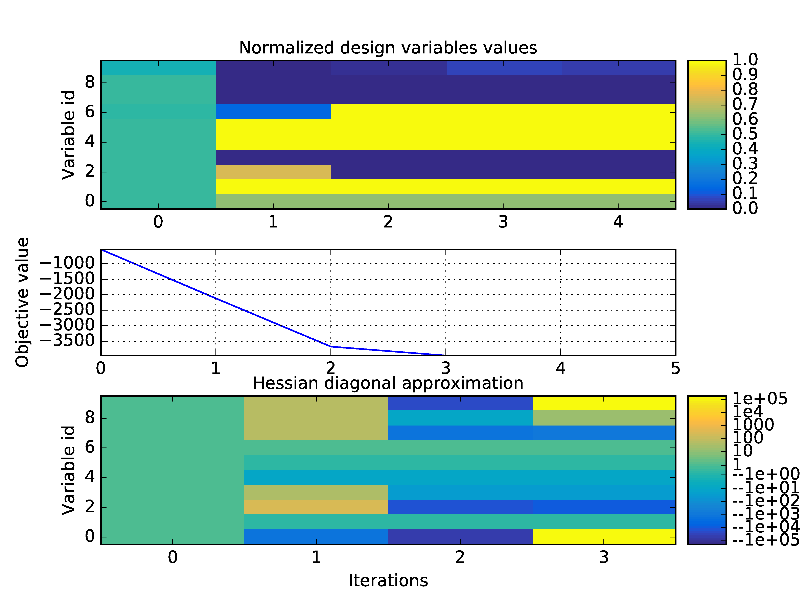

..
   Copyright 2021 IRT Saint Exupéry, https://www.irt-saintexupery.com

   This work is licensed under the Creative Commons Attribution-ShareAlike 4.0
   International License. To view a copy of this license, visit
   http://creativecommons.org/licenses/by-sa/4.0/ or send a letter to Creative
   Commons, PO Box 1866, Mountain View, CA 94042, USA.

..
   Contributors:
          :author:  Francois Gallard, Damien Guénot

.. _sobieski_mdo:

Application: Sobieski's Super-Sonic Business Jet (MDO)
======================================================

This section describes how to setup and solve the MDO problem relative to the :ref:`Sobieski test case <sobieski_problem>` with |g|.

.. seealso::

   To begin with a more simple MDO problem, and have a detailed description of how to plug a test case to |g|, see :ref:`sellar_mdo`.

.. _sobieski_use_case:

Solving with a :ref:`MDF formulation <mdf_formulation>`
-------------------------------------------------------

In this example, we solve the range optimization using the following :ref:`MDF formulation <mdf_formulation>`:

- The :ref:`MDF formulation <mdf_formulation>` couples all the disciplines during the :ref:`mda` at each optimization iteration.
- All the :term:`design variables` are equally treated, concatenated in a single vector and given to a single :term:`optimization algorithm` as the unknowns of the problem.
- There is no specific :term:`constraint` due to the :ref:`MDF formulation <mdf_formulation>`.
- Only the design :term:`constraints` :math:`g\_1`, :math:`g\_2` and :math:`g\_3` are added to the problem.
- The :term:`objective function` is the range (the :math:`y\_4` variable in the model), computed after the :ref:`mda`.

Step 1: Creation of :class:`.MDODiscipline`
~~~~~~~~~~~~~~~~~~~~~~~~~~~~~~~~~~~~~~~~~~~

To build the scenario, we first instantiate the disciplines. Here, the disciplines themselves have already been
developed and interfaced with |g| (see :ref:`benchmark_problems`).

.. code::

    from gemseo.api import create_discipline

    disciplines = create_discipline(["SobieskiPropulsion", "SobieskiAerodynamics",
                                     "SobieskiMission", "SobieskiStructure"])

.. tip::

   For the disciplines that are not interfaced with |g|, the |g|'s :mod:`~gemseo.api` eases the creation of disciplines without having to import them.

   See :ref:`api`.

Step 2: Creation of :class:`.Scenario`
~~~~~~~~~~~~~~~~~~~~~~~~~~~~~~~~~~~~~~

The scenario delegates the creation of the optimization problem to the :ref:`MDO formulation <mdo_formulations>`.

Therefore, it needs the list of :code:`disciplines`, the names of the formulation, the name of the objective function and the design space.

- The :code:`design_space` (here, :code:`design_space.txt`) defines the unknowns of the optimization problem, and their bounds. It contains all the design variables needed by the :ref:`MDF formulation <mdf_formulation>`. They are selected among all the inputs of the disciplines, which can be listed with :meth:`~gemseo.api.get_all_inputs`.

   .. code::

      vi design_space.txt

      name      lower_bound      value      upper_bound  type
      x_shared      0.01          0.05          0.09     float
      x_shared    30000.0       45000.0       60000.0    float
      x_shared      1.4           1.6           1.8      float
      x_shared      2.5           5.5           8.5      float
      x_shared      40.0          55.0          70.0     float
      x_shared     500.0         1000.0        1500.0    float
      x_1           0.1           0.25          0.4      float
      x_1           0.75          1.0           1.25     float
      x_2           0.75          1.0           1.25     float
      x_3           0.1           0.5           1.0      float
      y_14        24850.0    50606.9741711    77100.0    float
      y_14        -7700.0    7306.20262124    45000.0    float
      y_32         0.235       0.50279625      0.795     float
      y_31         2960.0    6354.32430691    10185.0    float
      y_24          0.44       4.15006276      11.13     float
      y_34          0.44       1.10754577       1.98     float
      y_23         3365.0    12194.2671934    26400.0    float
      y_21        24850.0    50606.9741711    77250.0    float
      y_12        24850.0      50606.9742     77250.0    float
      y_12          0.45          0.95          1.5      float

- The available :ref:`MDO formulations <mdo_formulations>` are located in the
  **gemseo.formulations** package, see :ref:`extending-gemseo` for extending
  GEMSEO with other formulations.
- The :code:`formulation` classname (here, :code:`"MDF"`) shall be passed to the scenario to select them.
- The list of available formulations can be obtained by using :meth:`~gemseo.api.get_available_formulations`.

  .. code::

     >> from gemseo.api import get_available_formulations
     >> get_available_formulations()
     ['IDF', 'BiLevel', 'MDF', 'DisciplinaryOpt']

- :math:`y\_4` corresponds to the :code:`objective_name`. This name must be one of the disciplines outputs, here the "SobieskiMission" discipline. The list of all outputs of the disciplines can be obtained by using :meth:`~gemseo.api.get_all_outputs`:

  .. code::

     >> from gemseo.api import create_discipline, get_all_outputs
     >> disciplines = create_discipline(["SobieskiMission","SobieskiStructure","SobieskiPropulsion","SobieskiAerodynamics"])
     >> get_all_outputs([disciplines])
     ['y_4']
     >> get_all_inputs([disciplines])
     ['x_1', 'y_23', 'y_12', 'x_shared', 'x_3', 'y_14', 'y_31', 'x_2', 'y_24', 'y_32', 'y_34', 'y_21']

From these :class:`~gemseo.core.discipline.MDODiscipline`, design space filename, :ref:`MDO formulation <mdo_formulations>` name and objective function name,
we build the scenario:

.. code::

    from gemseo.api import create_scenario

    scenario = create_scenario(disciplines,
                               formulation="MDF",
                               maximize_objective=True,
                               objective_name="y_4",
                               design_space="design_space.txt")

The range function (:math:`y\_4`) should be maximized. However, optimizers minimize functions by default. Then, when creating the scenario, the argument :code:`maximize_objective` shall be set to :code:`True`.

Scenario options
^^^^^^^^^^^^^^^^

We may provide additional options to the scenario:

**Function derivatives.** As analytical disciplinary derivatives are available for Sobieski
test-case, they can be used instead of computing the derivatives with
finite-differences or with the complex-step method:

.. code::

    scenario.optimizer.set_differentiation_method(“user”)

.. seealso::

   The default behavior of the optimizer triggers :term:`finite differences`. It corresponds to:

   .. code::

      scenario.optimizer.set_differentiation_method(“finite_differences”,1e-7)

.. seealso::

   It it also possible to differentiate functions by means of the :term:`complex step` method:

   .. code::

      scenario.optimizer.set_differentiation_method(“complex_step”,1e-30j)

Constraints
^^^^^^^^^^^

Similarly to the objective function, the constraints names are a subset of the disciplines
outputs, that can be obtained by using :meth:`~gemseo.api.get_all_outputs`.

The formulation has a powerful feature to automatically dispatch the constraints
(:math:`g\_1, g\_2, g\_3`) and plug them to the optimizers depending on
the formulation. For that, we use the method :meth:`gemseo.core.scenario.Scenario.add_constraint`:

.. code::

    for constraint in [“g_1”, “g_2”, “g_3”]:
        scenario.add_constraint(constraint, ’ineq’)

Step 3: Execution and visualization of the results
~~~~~~~~~~~~~~~~~~~~~~~~~~~~~~~~~~~~~~~~~~~~~~~~~~

The algorithm options are provided as a dictionary to the execution
method of the scenario: :code:`algo_options = {'max_iter': 10, 'algo': "SLSQP"}`.

.. warning::

   The mandatory options are the maximum number of iterations and the algorithm name.

The scenario is executed by means of the line:

.. code::

    scenario.execute(algo_options)

To visualize the optimization history:

.. code::

    scenario.post_process(“OptHistoryView”, save=True, show=False, file_path=“mdf”)

    Optimization history on the Sobieski use case for the MDF formulation

A whole variety of visualizations may be displayed for both MDO and DOE
scenarios. These features are illustrated on the SSBJ use case in :ref:`post_processing`.

Influence of gradient computation method on performance
-------------------------------------------------------

As mentioned in :ref:`jacobian_assembly`, several methods
are available in order to perform  the gradient computations: classical finite
differences, complex step and :ref:`mda` linearization in direct or adjoint mode.
These modes are automatically selected by |g| to minimize the CPU time. Yet, they can be forced on demand in each :ref:`mda`:

.. code::

    from gemseo.core.jacobian_assembly import JacobianAssembly
    scenario.formulation.mda.linearization_mode = JacobianAssembly.DIRECT_MODE
    scenario.formulation.mda.matrix_type = JacobianAssembly.LINEAR_OPERATOR

The method used to solve the adjoint or direct linear problem may also be selected. |g| can either assemble a sparse residual jacobian matrix of the :ref:`mda` from the
disciplines matrices. This has the advantage that LU factorizations may be stored to solve multiple right hand sides problems in a cheap way. But this requires
extra memory.

.. code::

    scenario.formulation.mda.matrix_type = JacobianAssembly.SPARSE
    scenario.formulation.mda.use_lu_fact = True

Altenatively, |g| can implicitly create a matrix-vector product operator, which is sufficient for GMRES-like solvers. It avoids to create an additional data structure.
This can also be mandatory if the disciplines do not provide full Jacobian matrices but only matrix-vector product operators.

.. code::

    scenario.formulation.mda.matrix_type = JacobianAssembly.LINEAR_OPERATOR

The next table shows the performance of each method for solving the Sobieski use case
with :ref:`MDF <mdf_formulation>` and :ref:`IDF <idf_formulation>` formulations. Efficiency of linearization is clearly visible
has it takes from 10 to 20 times less CPU time to compute analytic derivatives of an :ref:`mda` compared
to finite difference and complex step.
For :ref:`IDF <idf_formulation>`, improvements are less consequent, but direct linearization is more than 2.5 times faster than other methods.

.. tabularcolumns:: |l|c|c|

+-----------------------+------------------------------+------------------------------+
|                       |  Execution time (s)                                         |
+  Derivation Method    +------------------------------+------------------------------+
|                       | :ref:`MDF <mdf_formulation>` | :ref:`IDF <idf_formulation>` |
+=======================+==============================+==============================+
| Finite differences    | 8.22                         | 1.93                         |
+-----------------------+------------------------------+------------------------------+
| Complex step          | 18.11                        | 2.07                         |
+-----------------------+------------------------------+------------------------------+
| Linearized (direct)   | 0.90                         | 0.68                         |
+-----------------------+------------------------------+------------------------------+
