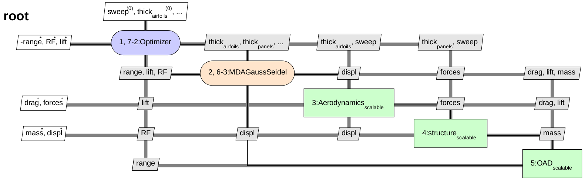
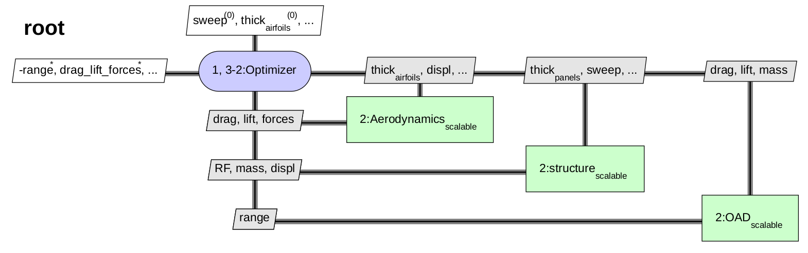
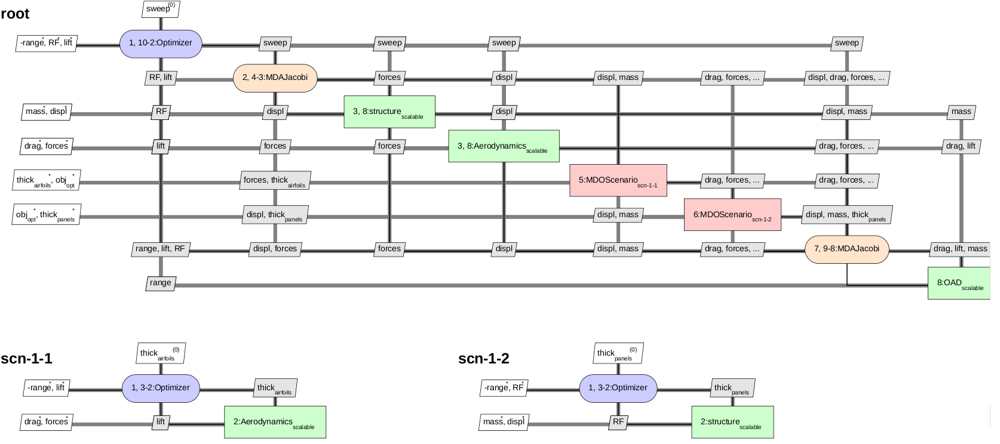
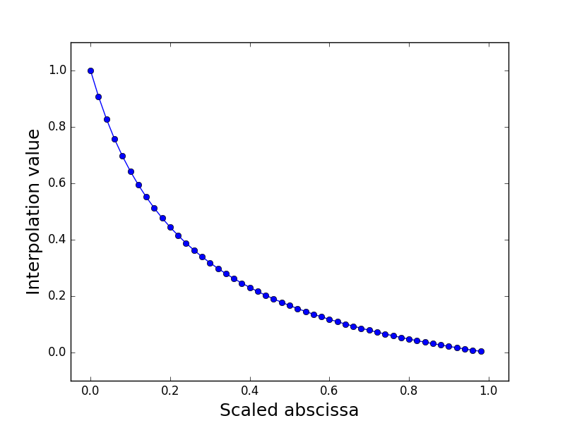

..
   Copyright 2021 IRT Saint Exupéry, https://www.irt-saintexupery.com

   This work is licensed under the Creative Commons Attribution-ShareAlike 4.0
   International License. To view a copy of this license, visit
   http://creativecommons.org/licenses/by-sa/4.0/ or send a letter to Creative
   Commons, PO Box 1866, Mountain View, CA 94042, USA.

..
   Contributors:
          :author: Matthias De Lozzo

.. _aerostruct_toy_example:

MDO formulations and scalable models for a toy example in aerostructure
=======================================================================

This tutorial describes how to build and run a scalable problem by means of |g| for the :ref:`Sobieski SSBJ aerostructure problem <aerostruct_problem>`.

Creation of the disciplines
***************************

In this tutorial, we are creating the disciplines from their analytic formulation using the :class:`~gemseo.disciplines.analytic.AnalyticDiscipline` discipline class:

.. code::

    from gemseo.api import create_discipline

    def create_disciplines():
        """
        Create the disciplines (aero, structure, OAD) with dummy formulas

        :returns: disciplines (aero, structure, OAD)
        :rtype: dict(MDODiscipline)
        """
        aero_formulas = {"drag": "0.1*((sweep/360)**2 + 200 + thick_airfoils**2-thick_airfoils -4*displ)",
                         "forces": "10*sweep + 0.2*thick_airfoils-0.2*displ",
                         "lift": "(sweep + 0.2*thick_airfoils-2.*displ)/3000."}
        aerodynamics = create_discipline("AnalyticDiscipline", name="Aerodynamics",
                                         expressions=aero_formulas)
        struc_formulas = {"mass": "4000*(sweep/360)**3 + 200000 + 100*thick_panels +200.0*forces",
                          "RF": "-3*sweep + -6*thick_panels+0.1*forces+55"
                          ,
                          "displ": "2*sweep + 3*thick_panels-2.*forces"}
        structure = create_discipline("AnalyticDiscipline", name="structure",
                                      expressions=struc_formulas)
        oad_formulas = {"range": "8e11*lift/(mass*drag)"}
        oad = create_discipline("AnalyticDiscipline", name="OAD",
                                expressions=oad_formulas)
        return [aerodynamics, structure, oad]

    disciplines = create_disciplines()

Description of the MDO study
****************************

The goal of this study is to maximize the range :math:`range` with respect to the design parameters which are:

   - thick_airfoils
   - thick_panels
   - sweep

Different MDO formulations can be considered to adress this study.

Monolithic formulations
-----------------------

Monolithic formulations can be used to adress this MDO study:

   - Multiple Discipline Feasible (MDF): a Multiple Disciplinary Analysis is performed for each optimisation iteration to converge the coupling variables disciplines to their equilibrium values
   - Individual Discipline Feasible (IDF): the coupling variables equalities between the disciplines are set as constraints of the optimizer.

MDF
^^^

The MDF MDO formulation for the current problem is as follows:

.. code::

    Optimization problem:
          Minimize: -range(sweep, thick_airfoils, thick_panels)
    With respect to:
          sweep, thick_airfoils, thick_panels
    Subject to constraints:
          lift(sweep, thick_airfoils, thick_panels) = lift + -0.5 = 0
          RF(sweep, thick_airfoils, thick_panels) = RF + -0.5 <= 0

The XDSM for the MDF formulation is displayed below:

IDF
^^^

The MDF MDO formulation for the current problem is as follows:

.. code::

    Optimization problem:
          Minimize: -range(mass, drag, lift)
    With respect to:
          sweep, thick_airfoils, thick_panels, mass, drag, forces, displ, lift
    Subject to constraints:
          drag_lift_forces(sweep, thick_airfoils, displ) = drag(sweep, thick_airfoils, displ) - drag = 0
                                                           lift(sweep, thick_airfoils, displ) - lift = 0
                                                           forces(sweep, thick_airfoils, displ) - forces = 0
          mass_displ(sweep, thick_panels, forces) = mass(sweep, thick_panels, forces) - mass = 0
                                                    displ(sweep, thick_panels, forces) - displ = 0
          lift(sweep, thick_airfoils, displ) = lift + -0.5 = 0
          RF(sweep, thick_panels, forces) = RF + -0.5 <= 0

As previously stressed, the coupling variables have become optimization variables in this MDO formulation. The XDSM for the IDF formulation is as follows:

Bi-level
--------

A bi-level formulation can be considered for the following MDO problem. It consists of performing optimizations at two levels:

   - at the system level, an optimization is made with respect to the shared design variables
   - at the discipline level, for each discipline, an optimization is made with respect to the local discipline design variable.

Discipline optimizations are performed in parallel. MDAs are performed at the beginning and at the end of each system level optimization iteration in order to get converged coupling variables.

System level
^^^^^^^^^^^^

The optimization problem for the system level reads:

.. code::

    Optimization problem:
          Minimize: -range(sweep)
    With respect to:
          sweep
    Subject to constraints:
          lift(sweep) = lift + -0.5 = 0
          RF(sweep) = RF + -0.5 <= 0

Aerodynamics level
^^^^^^^^^^^^^^^^^^

The optimization problem for the aerodynamics discipline level reads:

.. code::

    Optimization sub-problem:
          Minimize: -range(thick_airfoils)
    With respect to:
          thick_panels
    Subject to constraints:
          lift(thick_airfoils) = lift + -0.5 <= 0

Structure level
^^^^^^^^^^^^^^^

The optimization problem for the structure discipline level reads:

.. code::

    Optimization sub-problem:
          Minimize: -range(thick_panels)
    With respect to:
          thick_panels
    Subject to constraints:
          RF(thick_panels) = RF + -0.5 <= 0

   The XDSM for the bi-level formulation

The scalable problem
********************

In this section, we are going to build a scalable problem from the aerostructure problem. Futher information on the scalable problem methodolody can be found :ref:`here <scalable>`.

Build the interpolation functions
---------------------------------

We build the interpolation functions from the discipline:

.. code::

    disciplines_scal = create_scalable_disciplines(disciplines)

where:

.. code::

    from gemseo.api import create_scenario
    from gemseo.problems.aerostructure.aerostructure_design_space import AerostructureDesignSpace
    from copy import deepcopy

    def create_scalable_disciplines(disciplines, n_samples=20, fill_factor=0.8):
        """
        Create scalables disciplines.

        :param disciplines: disciplines
        :type disciplines: list(MDODiscipline)
        :param n_samples: number of samples
        :type n_samples: int
        :param fill_factor: fill factor
        :type fill_factor: float
        :return: scalable disciplines
        :rtype: list(MDODiscipline)
        """
        design_space = AerostructureDesignSpace()
        design_space.set_current_value(design_space.get_current_value().real)
        sizes = design_space.variables_sizes
        disciplines_scal = []
        for discipline in disciplines:
            discipline.set_cache_policy(cache_type=discipline.MEMORY_FULL_CACHE)
            output = discipline.get_output_data_names()[0]
            disc_design_space = deepcopy(design_space)
            disc_design_space.filter(discipline.get_input_data_names())
            scenario = create_scenario([discipline], 'DisciplinaryOpt', output,
                                           disc_design_space, scenario_type='DOE')
            scenario.execute({'algo': 'DiagonalDOE', 'n_samples': n_samples})
            discipline_scal = create_discipline(
                'ScalableDiagonalModel', discipline.cache, sizes, fill_factor=fill_factor
            )
            disciplines_scal.append(discipline_scal)
        return disciplines_scal

Plot the interpolation function
-------------------------------

We can easily plot the interpolation functions:

.. code::

   for scal in disciplines_scal:
            scal.scalable_model.plot_1d_interpolations(save=True)

We obtain the following plots for the three disciplines.

Aerodynamics
^^^^^^^^^^^^

+-------------------------------------------------------+------------------------------------------------------+-------------------------------------------------------+
| .. figure:: Aerodynamics_drag_1D_interpolation.png    | .. figure:: Aerodynamics_lift_1D_interpolation.png   |  .. figure:: Aerodynamics_forces_1D_interpolation.png |
+-------------------------------------------------------+------------------------------------------------------+-------------------------------------------------------+
|    Interpolation of drag(sweep, thickAirfoils, displ) |    Interpolation of lift(sweep, thickAirfoils, displ)|  Interpolation of forces(sweep, thickAirfoils, displ) |
+-------------------------------------------------------+------------------------------------------------------+-------------------------------------------------------+

Structure
^^^^^^^^^

+-------------------------------------------------------+-------------------------------------------------------+-------------------------------------------------------+
| .. figure:: Structure_RF_1D_interpolation.png         | .. figure:: Structure_mass_1D_interpolation.png       |  .. figure:: Structure_displ_1D_interpolation.png     |
+-------------------------------------------------------+-------------------------------------------------------+-------------------------------------------------------+
|    Interpolation of RF(sweep, thickPanels, forces)    |    Interpolation of mass(sweep, thickAirfoils, forces)|  Interpolation of displ(sweep, thickAirfoils, forces) |
+-------------------------------------------------------+-------------------------------------------------------+-------------------------------------------------------+

OAD
^^^

   Interpolation of range(lift, mass, drag)
