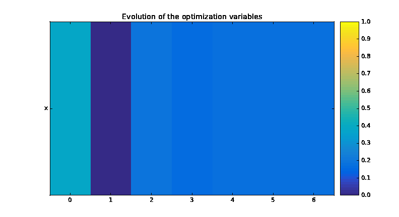
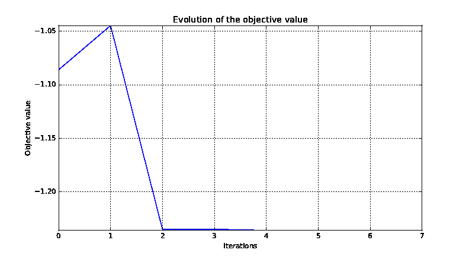
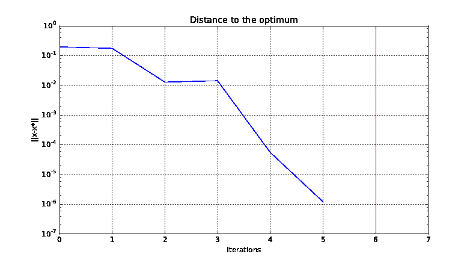
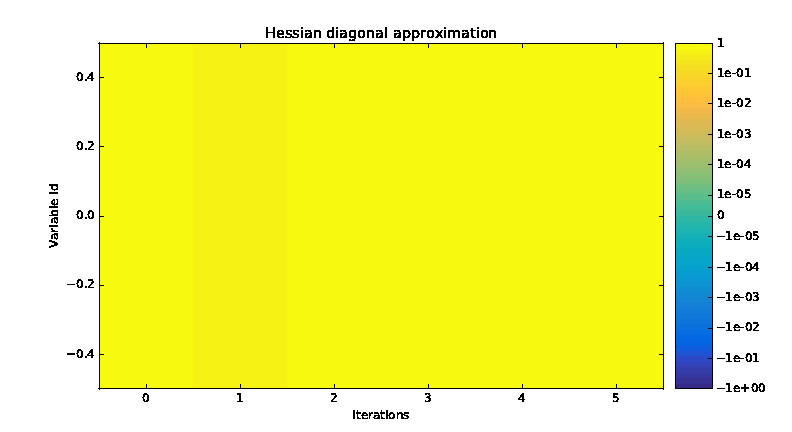

..
   Copyright 2021 IRT Saint Exupéry, https://www.irt-saintexupery.com

   This work is licensed under the Creative Commons Attribution-ShareAlike 4.0
   International License. To view a copy of this license, visit
   http://creativecommons.org/licenses/by-sa/4.0/ or send a letter to Creative
   Commons, PO Box 1866, Mountain View, CA 94042, USA.

..
   Contributors:
          :author: Matthias De Lozzo

.. _simple_opt_example:

Tutorial: How to solve an optimization problem
==============================================

Although the library **|g|** is dedicated to the :term:`MDO`, it can also be used for mono-disciplinary optimization problems.
This tutorial presents some examples on analytical test cases.

1. Optimization based on a design of experiments
************************************************

Let :math:`(P)` be a simple optimization problem:

.. math::

   (P) = \left\{
   \begin{aligned}
     & \underset{x\in\mathbb{N}^2}{\text{minimize}}
     & & f(x) = x_1 + x_2 \\
     & \text{subject to}
     & & -5 \leq x \leq 5
   \end{aligned}
   \right.

In this subsection, we will see how to use **|g|** to solve this problem :math:`(P)` by means of a Design Of Experiments (DOE)

1.a. Define the objective function
~~~~~~~~~~~~~~~~~~~~~~~~~~~~~~~~~~

Firstly, by means of the :meth:`~gemseo.api.create_discipline` API function,
we create a :class:`~gemseo.core.discipline.MDODiscipline` of :class:`~gemseo.disciplines.autopy.AutoPyDiscipline` type
from a python function:

.. code::

    from gemseo.api import create_discipline

    def f(x1=0., x2=0.):
        y = x1 + x2
        return y

    discipline = create_discipline("AutoPyDiscipline", py_func=f)

Now, we want to minimize this :class:`~gemseo.core.discipline.MDODiscipline` over a design of experiments (DOE).

1.b. Define the design space
~~~~~~~~~~~~~~~~~~~~~~~~~~~~

For that, by means of the :meth:`~gemseo.api.create_design_space` API function,
we define the :class:`~gemseo.algos.design_space.DesignSpace` :math:`[-5, 5]\times[-5, 5]`
by using its :meth:`~gemseo.algos.design_space.DesignSpace.add_variable` method.

.. code::

   from gemseo.api import create_design_space

   design_space = create_design_space()
   design_space.add_variable("x1", 1, l_b=-5, u_b=5, var_type="integer")
   design_space.add_variable("x2", 1, l_b=-5, u_b=5, var_type="integer")

1.c. Define the DOE scenario
~~~~~~~~~~~~~~~~~~~~~~~~~~~~

Then, by means of the :meth:`~gemseo.api.create_scenario` API function,
we define a :class:`~gemseo.core.doe_scenario.DOEScenario` from the :class:`~gemseo.core.discipline.MDODiscipline`
and the :class:`~gemseo.algos.design_space.DesignSpace` defined above:

.. code::

   from gemseo.api import create_scenario

   scenario = create_scenario(
       discipline, "DisciplinaryOpt", "y", design_space, scenario_type="DOE"
   )

1.d. Execute the DOE scenario
~~~~~~~~~~~~~~~~~~~~~~~~~~~~~

Lastly, we solve the :class:`~gemseo.algos.opt_problem.OptimizationProblem` included in the :class:`~gemseo.core.doe_scenario.DOEScenario`
defined above by minimizing the objective function over a design of experiments included in the :class:`~gemseo.algos.design_space.DesignSpace`.
Precisely, we choose a `full factorial design <https://en.wikipedia.org/wiki/Factorial_experiment>`_ of size :math:`11^2`:

.. code::

   scenario.execute({"algo": "fullfact", "n_samples": 11**2})

The optimum results can be found in the execution log. It is also possible to
extract them by invoking the :meth:`~gemseo.core.scenario.Scenario.get_optimum` method. It
returns a dictionary containing the optimum results for the
scenario under consideration:

.. code::

   opt_results = scenario.get_optimum()
   print("The solution of P is (x*,f(x*)) = ({}, {})".format(
       opt_results.x_opt, opt_results.f_opt
   ))

which yields:

.. code:: bash

   The solution of P is (x*,f(x*)) = ([-5, -5], -10.0).

2. Optimization based on a quasi-Newton method by means of the library `scipy <https://www.scipy.org/>`_
********************************************************************************************************

Let :math:`(P)` be a simple optimization problem:

.. math::

   (P) = \left\{
   \begin{aligned}
     & \underset{x}{\text{minimize}}
     & & f(x) = \sin(x) - \exp(x) \\
     & \text{subject to}
     & & -2 \leq x \leq 2
   \end{aligned}
   \right.

In this subsection, we will see how to use **|g|** to solve this problem :math:`(P)` by means of an optimizer
directly used from the library `scipy <https://www.scipy.org/>`_.

2.a. Define the objective function
~~~~~~~~~~~~~~~~~~~~~~~~~~~~~~~~~~

Firstly, we create the objective function and its gradient as standard python functions:

.. code-block:: python

    import numpy as np
    from gemseo.api import create_discipline

    def g(x=0):
        y = np.sin(x) - np.exp(x)
        return y

    def dgdx(x=0):
        y = np.cos(x) - np.exp(x)
        return y

2.b. Minimize the objective function
~~~~~~~~~~~~~~~~~~~~~~~~~~~~~~~~~~~~

Now, we can to minimize this :class:`~gemseo.core.discipline.MDODiscipline` over its design space by means of
the `L-BFGS-B algorithm <https://en.wikipedia.org/wiki/Limited-memory_BFGS>`_ implemented in the function :code:`scipy.optimize.fmin_l_bfgs_b`.

.. code-block:: python

   from scipy import optimize

   x_0 = -0.5 * np.ones(1)
   opt = optimize.fmin_l_bfgs_b(g, x_0, fprime=dgdx, bounds=[(-.2, 2.)])
   x_opt, f_opt, _ = opt

Then, we can display the solution of our optimization problem with the following code:

.. code::

   print("The solution of P is (x*,f(x*)) = ({}, {})".format(x_opt[0], f_opt[0]))

which gives:

.. code:: bash

   The solution of P is (x*,f(x*)) = (-0.2, -1.01740008).

.. seealso::

   You can found the scipy implementation of the L-BFGS-B algorithm `by clicking here <https://docs.scipy.org/doc/scipy-0.14.0/reference/generated/scipy.optimize.fmin_l_bfgs_b.html>`_.

3. Optimization based on a quasi-Newton method by means of the |g| optimization interface
*****************************************************************************************************

Let :math:`(P)` be a simple optimization problem:

.. math::

   (P) = \left\{
   \begin{aligned}
     & \underset{x}{\text{minimize}}
     & & f(x) = \sin(x) - \exp(x) \\
     & \text{subject to}
     & & -2 \leq x \leq 2
   \end{aligned}
   \right.

In this subsection, we will see how to use **|g|** to solve this problem :math:`(P)` by means of an optimizer
from `scipy <https://www.scipy.org/>`_ called through the optimization interface of **|g|**.

3.a. Define the objective function
~~~~~~~~~~~~~~~~~~~~~~~~~~~~~~~~~~

Firstly, by means of the :meth:`~gemseo.api.create_discipline` API function,
we create a :class:`~gemseo.core.discipline.MDODiscipline` of :class:`~gemseo.disciplines.autopy.AutoPyDiscipline` type
from a python function:

.. code-block:: python

    import numpy as np
    from gemseo.api import create_discipline

    def g(x=0):
        y = np.sin(x) - np.exp(x)
        return y

    def dgdx(x=0):
        y = np.cos(x) - np.exp(x)
        return y

    discipline = create_discipline("AutoPyDiscipline", py_func=g, py_jac=dgdx)

Now, we can to minimize this :class:`~gemseo.core.discipline.MDODiscipline` over a design space,
by means of a quasi-Newton method from the initial point :math:`0.5`.

3.b. Define the design space
~~~~~~~~~~~~~~~~~~~~~~~~~~~~

For that, by means of the :meth:`~gemseo.api.create_design_space` API function,
we define the :class:`~gemseo.algos.design_space.DesignSpace` :math:`[-2., 2.]`
with initial value :math:`0.5`
by using its :meth:`~gemseo.algos.design_space.DesignSpace.add_variable` method.

.. code::

   from gemseo.api import create_design_space

   design_space = create_design_space()
   design_space.add_variable("x", 1, l_b=-2., u_b=2., value=-0.5 * np.ones(1))

3.c. Define the optimization problem
~~~~~~~~~~~~~~~~~~~~~~~~~~~~~~~~~~~~

Then, by means of the :meth:`~gemseo.api.create_scenario` API function,
we define a :class:`~gemseo.core.mdo_scenario.MDOScenario` from the :class:`~gemseo.core.discipline.MDODiscipline`
and the :class:`~gemseo.algos.design_space.DesignSpace` defined above:

.. code::

   from gemseo.api import create_scenario

   scenario = create_scenario(
       discipline, "DisciplinaryOpt", "y", design_space, scenario_type="MDO"
   )

3.d. Execute the optimization problem
~~~~~~~~~~~~~~~~~~~~~~~~~~~~~~~~~~~~~

Lastly, we solve the :class:`~gemseo.algos.opt_problem.OptimizationProblem` included in the :class:`~gemseo.core.mdo_scenario.MDOScenario`
defined above by minimizing the objective function over the :class:`~gemseo.algos.design_space.DesignSpace`.
Precisely, we choose the `L-BFGS-B algorithm <https://en.wikipedia.org/wiki/Limited-memory_BFGS>`_
implemented in the function :code:`scipy.optimize.fmin_l_bfgs_b` and
indirectly called by means of the class :class:`~gemseo.algos.opt.opt_factory.OptimizersFactory` and of its function :meth:`~gemseo.algos.driver_factory.DriverFactory.execute`:

.. code-block:: python

   scenario.execute({"algo": "L-BFGS-B", "max_iter": 100})

The optimization results are displayed in the log file. They can also be
obtained using the following code:

.. code::

   opt_results = scenario.get_optimum()
   print("The solution of P is (x*,f(x*)) = ({}, {})".format(
       opt_results.x_opt, opt_results.f_opt
   ))

which yields:

.. code::

   The solution of P is (x*,f(x*)) = (-1.29, -1.24).

.. seealso::

   You can found the `scipy <https://www.scipy.org/>`_ implementation of the `L-BFGS-B algorithm <https://en.wikipedia.org/wiki/Limited-memory_BFGS>`_ algorithm `by clicking here <https://docs.scipy.org/doc/scipy-0.14.0/reference/generated/scipy.optimize.fmin_l_bfgs_b.html>`_.

.. tip::

   In order to get the list of available optimization algorithms, use:

   .. code::

      from gemseo.api import get_available_opt_algorithms

      algo_list = get_available_opt_algorithms()
      print('Available algorithms: {}'.format(algo_list))

   what gives:

   .. code::

      Available algorithms: ['NLOPT_SLSQP', 'L-BFGS-B', 'SLSQP', 'NLOPT_COBYLA', 'NLOPT_BFGS', 'NLOPT_NEWUOA', 'TNC', 'P-L-BFGS-B', 'NLOPT_MMA', 'NLOPT_BOBYQA', 'ODD']

4. Saving and post-processing
*****************************

After the resolution of the :class:`~gemseo.algos.opt_problem.OptimizationProblem`, we can export the results into a :term:`HDF` file:

.. code::

   problem = scenario.formulation.opt_problem
   problem.export_hdf("my_optim.hdf5")

We can also post-process the optimization history by means of the function :meth:`~gemseo.api.execute_post`,
either from the :class:`~gemseo.algos.opt_problem.OptimizationProblem`:

.. code::

   from gemseo.api import execute_post

   execute_post(problem, "OptHistoryView", save=True, file_path="opt_view_with_doe")

or from the :term:`HDF` file created above:

.. code::

   from gemseo.api import execute_post

   execute_post("my_optim.hdf5", "OptHistoryView", save=True, file_path="opt_view_from_disk")

This command produces a series of PDF files:

