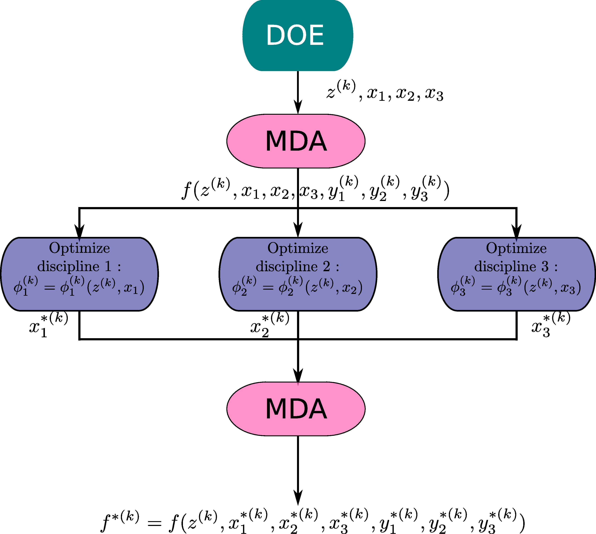
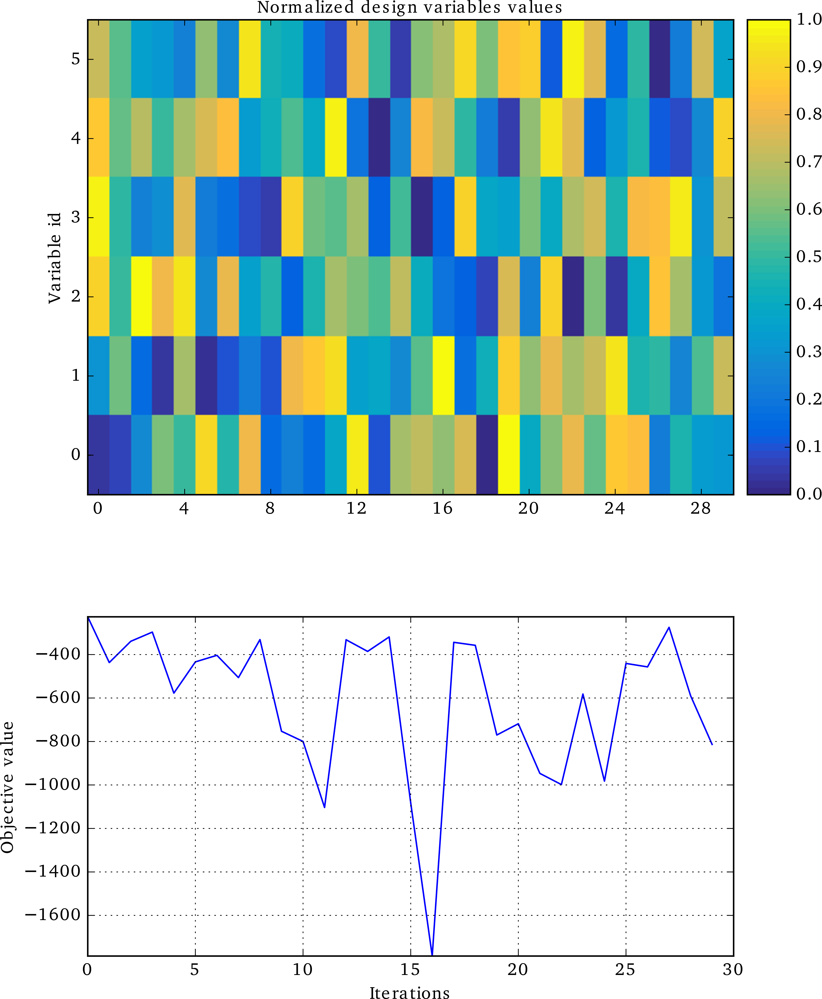
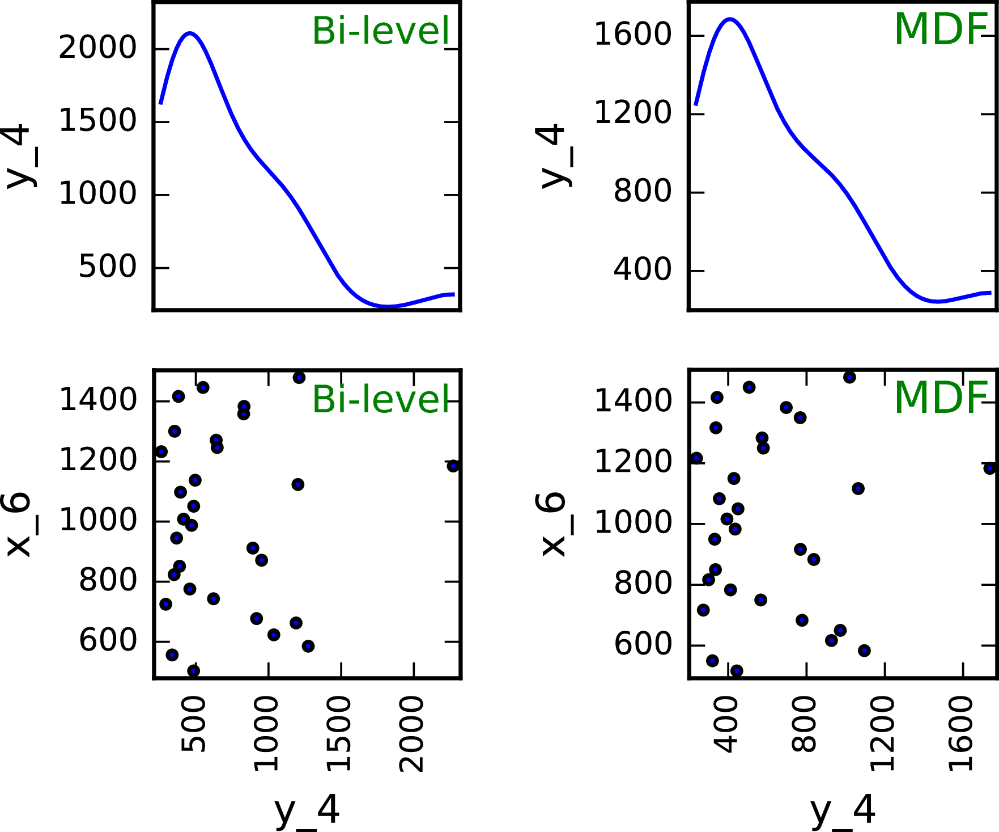
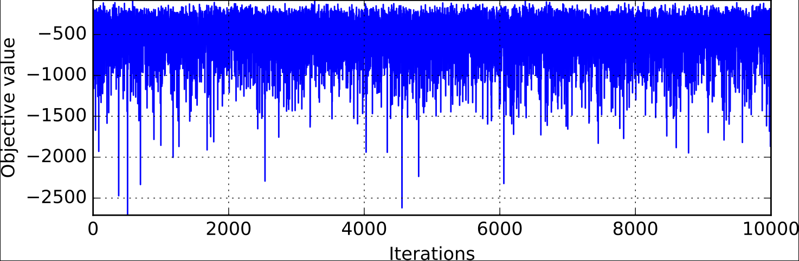

..
   Copyright 2021 IRT Saint Exupéry, https://www.irt-saintexupery.com

   This work is licensed under the Creative Commons Attribution-ShareAlike 4.0
   International License. To view a copy of this license, visit
   http://creativecommons.org/licenses/by-sa/4.0/ or send a letter to Creative
   Commons, PO Box 1866, Mountain View, CA 94042, USA.

..
   Contributors:
          :author: Matthias De Lozzo

.. _sobieski_doe:

Tutorial: How to carry out a trade-off study
============================================

This tutorial describes how to carry out a trade-off study by means of |g|. For that, we consider the :ref:`Sobieski problem <sobieski_problem>`.

Trade-off studies are implemented in the class :class:`~gemseo.core.doe_scenario.DOEScenario`.

All the post-processing tools presented in :ref:`post_processing` for :class:`~gemseo.core.mdo_scenario.MDOScenario`
remain valid for trade-off studies, as well as the additional tools presented below.

Similarities between trade-off studies and optimization problems
----------------------------------------------------------------

Trade-off studies are supported by capabilities of :term:`Design Of Experiments <DOE>`. But,
when comparing an optimization scenario and a trade-off scenario, similarities appear:

+------------------------------------+------------------------------------------------------------------------------+-------------------------------------------------------------------------------------------+
| Feature                            | MDO Scenario (implemented in :class:`~gemseo.core.mdo_scenario.MDOScenario`) | Trade-off study (implemented in :class:`~gemseo.core.doe_scenario.DOEScenario`)           |
+====================================+==============================================================================+===========================================================================================+
| Sample evaluation                  | The sample :math:`i+1` requires the evaluation of the sample :math:`i`.      | The sequence is defined *a priori* by a :term:`DOE`; an iteration corresponds to a sample |
+------------------------------------+------------------------------------------------------------------------------+-------------------------------------------------------------------------------------------+
| Constraint and objective functions | They guide the convergence of an optimization problem.                       | They are only monitored evaluated outputs.                                                |
+------------------------------------+------------------------------------------------------------------------------+-------------------------------------------------------------------------------------------+
| Constraint and objective functions | They are not directly outputs of a :term:`discipline`.                       | They are not directly outputs of a :term:`discipline`.                                    |
+------------------------------------+------------------------------------------------------------------------------+-------------------------------------------------------------------------------------------+
| Constraint and objective functions | They can be computed by an :ref:`mda` for instance (e.g. MDF)                | They can be computed by an :ref:`mda` for instance.                                       |
+------------------------------------+------------------------------------------------------------------------------+-------------------------------------------------------------------------------------------+
| Constraint and objective functions | Target values can be used for the :term:`coupling variables` (e.g. IDF).     | Target values can be used for the :term:`coupling variables`.                             |
+------------------------------------+------------------------------------------------------------------------------+-------------------------------------------------------------------------------------------+

That is why in |g|,

- the :term:`DOE` sample evaluations are performed on the objective and constraint functions generated by an :term:`MDO formulation`,

exactly as

- the :term:`optimization algorithm` evaluates the objective and constraint functions to solve the :term:`optimization problem`.

A key advantage of this approach is that the :term:`DOE` is based on a formalized MDO problem.

Besides, from the implementation point of view, **all existing methods developed for optimization can be used for trade-off without any change**.

Finally, this smoothes the transition between a :term:`DOE` study and an MDO study, and makes the :term:`DOE`
an ideal preparatory step for MDO.

Trade-offs based on a :ref:`MDF formulation <mdo_formulations>`
---------------------------------------------------------------

As mentioned previously, a trade-off script and an optimization script are very similar.
For example, a :term:`MDF` trade-off study includes an :ref:`mda` sampling with respect to the :term:`design variables`
provided by the :term:`DOE algorithm`.

1. Define the :class:`.MDODiscipline`
~~~~~~~~~~~~~~~~~~~~~~~~~~~~~~~~~~~~~

We first instantiate the :class:`~gemseo.core.discipline.MDODiscipline`:

.. code::

    from gemseo.api import create_discipline

    disciplines = create_discipline(["SobieskiPropulsion", "SobieskiAerodynamics",
                                     "SobieskiMission", "SobieskiStructure"])

2. Define the :class:`.DesignSpace`
~~~~~~~~~~~~~~~~~~~~~~~~~~~~~~~~~~~

Then, by means of the API function :meth:`~gemseo.api.read_design_space`,
we load the :class:`~gemseo.algos.design_space.DesignSpace`, like for :class:`~gemseo.core.mdo_scenario.MDOScenario`.

.. code::

    from gemseo.api import read_design_space

    input_file = join(dirname(__file__), "sobieski_design_space.txt")
    design_space = read_design_space(input_file)

3. Define the trade-off study
~~~~~~~~~~~~~~~~~~~~~~~~~~~~~

Initialization
^^^^^^^^^^^^^^

The :ref:`MDF formulation <mdf_formulation>` is selected to build the :class:`~gemseo.core.doe_scenario.DOEScenario`, like for :class:`~gemseo.core.mdo_scenario.MDOScenario`.

.. code::

    from gemseo.api import create_scenario

    scenario = create_scenario(disciplines,
                               formulation="MDF",
                               objective_name="y_4",
                               design_space=design_space,
                               scenario_type="DOE",
                               maximize_objective=True)

Constraint monitoring
^^^^^^^^^^^^^^^^^^^^^

We choose here to monitor the constraints, similarly to the MDO study:

.. code::

    for constraint in ["g_1", "g_2", "g_3"]:
        scenario.add_constraint(constraint, 'ineq')

This is optional since the driver is not able to ensure these constraints, but it is
the only way to observe an output which is not an objective, in order to
benefit from the post processing plots associated to these constraints.
Besides, this does not increase the cost of the scenario execution,
since the constraints are computed by the :ref:`Sobieski <sobieski_problem>` disciplines in all
cases, and a buffer system in avoids to call twice a discipline in a row
with identical inputs, and directly returns the buffered outputs.

Optimization options
^^^^^^^^^^^^^^^^^^^^

The DOE algorithm options are passed as inputs of the :class:`~gemseo.core.mdo_scenario.MDOScenario`.
The number of samples is specified, as well as the "criterion" option which is the center option of pyDOE centering the points within the sampling intervals.
The sensitivity of the outputs with respect to the design variables may be computed,
thanks to the coupled derivatives capabilities, to this aim the 'eval\_jac' option is set to True.

.. code::

    doe_options = {'n_samples': 30,
                   'algo': 'lhs',
                   'eval_jac': True,
                   'algo_options': {"criterion": "center"}}

.. seealso::

   In this tutorial, the design is based on :term:`LHS` from
   `pyDOE <https://pythonhosted.org/pyDOE/>`_, however,
   several other designs are available, based on the package or
   `OpenTURNS <http://www.openturns.org/>`_. Some examples of these
   designs are plotted in :ref:`doe_algos`.

   To list the available DOE algorithms in the current |g| configuration, use
   :meth:`gemseo.api.get_available_doe_algorithms`:

   .. code::

      from gemseo.api import get_available_doe_algorithms

      get_available_doe_algorithms()

  which gives:

  .. code::

     ['ff2n', 'OT_FACTORIAL', 'OT_FAURE', 'OT_HASELGROVE', 'OT_REVERSE_HALTON', 'OT_HALTON', 'ccdesign', 'OT_SOBOL', 'fullfact', 'OT_FULLFACT', 'OT_AXIAL', 'lhs', 'OT_LHSC', 'OT_MONTE_CARLO', 'OT_RANDOM', 'OT_COMPOSITE', 'CustomDOE', 'pbdesign', 'OT_LHS', 'bbdesign']

4. Execute the trade-off study
~~~~~~~~~~~~~~~~~~~~~~~~~~~~~~

The scenario outputs is executed:

.. code::

    scenario.execute(doe_options)

5. Visualize the results
~~~~~~~~~~~~~~~~~~~~~~~~

The scenario outputs can be saved to disk as :

.. code::

    scenario.save_optimization_history(“DOE_MDF.h5”, file_format=“hdf5”)
    scenario.save_optimization_history(“DOE_MDF.xml”,file_format=“ggobi”)

All the :ref:`post-processing <post_processing>` tools are available for :term:`DOE`, e.g.

.. code::

   scenario.post_process("OptHistoryView", save=True)

Trade-offs based on a :ref:`bi-level formulation <bilevel_formulation>`
-----------------------------------------------------------------------

The construction of MDO scenarios or trade-off studies based on a :ref:`bi-level formulation <bilevel_formulation>` is available.

Presentation of the bi-level trade-off
~~~~~~~~~~~~~~~~~~~~~~~~~~~~~~~~~~~~~~

The :term:`bi-level` process, shown in the next figure, is described as follows:

#. build a :term:`DOE` with respect to the :term:`shared design variables`, with :term:`local design variables` fixed at their default values,

#. for each sample of the :term:`DOE`,

   #. perform an :ref:`mda`,
   #. for each sub-discipline, perform a disciplinary optimization with respect to its :term:`local design variables`,
   #. perform an :ref:`mda` with optimal :term:`local design variables` to ensure equilibrium.

The :ref:`MDO formulation <mdo_formulations>` (:class:`~gemseo.formulations.bilevel.BiLevel` object) takes care of creating the :ref:`mda`, and
building this chain of executions.

   Description of the bilevel formulation process for trade-off

For :ref:`Sobieski's use case <sobieski_problem>`, the objective function is the range from the
`Breguet-Leduc equation <https://en.wikipedia.org/wiki/Range_(aeronautics)>`_:

.. math::

   Range = V.
   \underbrace{\left(\frac{L}{D}\right)}_{aerodynamics}.\underbrace{\frac
   {1}{SFC}}_{propulsion}
   \underbrace{\ln\left(\frac{W_T}{W_T-W_F}\right)}_{structure}
   \label{eqn:sobieski_range}

In this equation, each term is related to one of the three disciplines: aerodynamics, structure and propulsion. Therefore, in order to
maximize the range, the disciplines should:

-  maximize :math:`(L/D)` with respect to aerodynamics variables
   :math:`x_2`,

-  minimize the Specific Fuel Consumption :math:`SFC` with respect to
   propulsion variables :math:`x_3`,

-  maximize :math:`\frac{W_T}{W_T-W_F}` with respect to structure
   variables :math:`x_1`.

1. Define the disciplines
~~~~~~~~~~~~~~~~~~~~~~~~~

We first instantiate the :class:`~gemseo.core.discipline.MDODiscipline`:

.. code::

    from gemseo.api import create_discipline

    prop, aero, mission, struct = create_discipline(["SobieskiPropulsion", "SobieskiAerodynamics",
                                                     "SobieskiMission", "SobieskiStructure"])

2. Define the disciplinary design spaces
~~~~~~~~~~~~~~~~~~~~~~~~~~~~~~~~~~~~~~~~

Then, for each disciplinary scenario, we

#. load the design space (function :meth:`~gemseo.api.read_design_space`
#. keep only the design variables that are of interest for the scenario (function :meth:`~gemseo.algos.design_space.DesignSpace.filter`):

.. code::

   from copy import deepcopy
   from gemseo.api import read_design_space

   input_file = join(dirname(__file__), "sobieski_design_space.txt")
   design_space = read_design_space(input_file)
   design_space_prop = deepcopy(design_space).filter("x_3")
   design_space_aero = deepcopy(design_space).filter("x_2")
   design_space_struct = deepcopy(design_space).filter("x_1")
   design_space_mission = deepcopy(design_space).filter("x_shared")

3'. Define the disciplinary scenarios
~~~~~~~~~~~~~~~~~~~~~~~~~~~~~~~~~~~~~

The propulsion scenario minimizes the fuel specific consumption:

.. code::

    sc_prop = create_scenario(prop,
                              formulation="DisciplinaryOpt",
                              objective_name="y_34",
                              design_space=design_space_prop,
                              name="PropulsionScenario")

The aerodynamic scenario maximizes lift over drag:

.. code::

    sc_aero = create_scenario(aero,
                              formulation="DisciplinaryOpt",
                              objective_name="y_24",
                              design_space=design_space_aero,
                              name="AerodynamicsScenario",
                              maximize_objective=True)

The structure scenario maximizes :math:`log \frac{aircraft total weight}{aircraft total weight - fuel weight}`:

.. code::

    sc_struct = create_scenario(struct,
                                formulation="DisciplinaryOpt",
                                objective_name="y_11",
                                design_space=design_space_struct,
                                name="StructureScenario",
                                maximize_objective=True)

The range computation is added as a fourth discipline of the system scenario, which maximizes it:

.. code::

    sub_disciplines = [sc_prop, sc_aero, sc_struct]
    sub_disciplines.append(mission)

    for sub_sc in sub_disciplines[0:3]:
       sub_sc.default_inputs = {"max_iter": 20, "algo": "L-BFGS-B"}

Please also note that it is compulsory to set the default inputs of the first three disciplines, which are MDO scenarios. Thus, we have to set the optimization algorithm and the maximum number of iterations for each of them.

3''. Define the main scenario
~~~~~~~~~~~~~~~~~~~~~~~~~~~~~

In a bi-level formulation, disciplinary optimizations are driven by the
main (system-level) scenario which is a :term:`DOE` (trade-off study), or an optimization
process with respect to the :term:`system design variables` (optimization problem).

.. code::

   system_scenario = create_scenario(sub_disciplines,
                                     formulation="BiLevel",
                                     objective_name="y_4",
                                     parallel_scenarios=False,
                                     # This is mandatory when doing
                                     # a DOE in parallel if we want
                                     # reproductible
                                     # results, dont reuse previous xopt
                                     reset_x0_before_opt=True,
                                     design_space=deepcopy(
                                         design_space).filter("x_shared"),
                                     maximize_objective=True,
                                     scenario_type="DOE")
   # This is mandatory when doing
   # a DOE in parallel if we want always exactly the same
   # results, dont warm start mda1 to have exactely the same
   # process whatever the execution order and process dispatch
   system_scenario.formulation.mda1.warm_start = False
   system_scenario.formulation.mda2.warm_start = False

4. Execute the trade-off study
~~~~~~~~~~~~~~~~~~~~~~~~~~~~~~

Similarly to the disciplinary optimization scenarios, we create a
dictionary of options (including all :term:`DOE` settings) for the main scenario execution.

.. code::

    doe_options = {'n_samples': 30, 'algo': "lhs"}
    system_scenario.execute(doe_options)

Comparison of trade-off results: :ref:`bi-level <bilevel_formulation>` versus :ref:`MDF <mdf_formulation>` formulations
-----------------------------------------------------------------------------------------------------------------------

The aim of this section is to show the difference between :term:`MDF` and bi-level
trade-off studies presented in the previous section.

For MDF, the DOE requires
a design space reduced to the sole :term:`system design variables`, while the bi-level scenario involves disciplinary sub-optimization
on the :term:`local design variables`.

Some figures
~~~~~~~~~~~~

As shown in the next figures, the bi-level scenario execution allows to reach a higher range than the MDF based scenario.
This result highlights the interest of optimizing with respect to the :term:`local design variables` when updating the :term:`system design variables`.

    Bilevel DOE  history

    MDF DOE history

    Comparison of and bi-level trade-off for a DOE of 30 samples

Remarks on the performance
~~~~~~~~~~~~~~~~~~~~~~~~~~

One can note that with a of 30 samples, the best range found (about
1200 :math:`nm`) is nowhere near the optimum found by the optimization
process (a range of 3963 :math:`nm` in less than 10 iterations).
The last figure illustrates a trade-off study with 10,000 samples. Again, the best
sample found (around 2600 :math:`nm`) without any constraint
consideration, is far from the optimal value. This example suggests that
the sub-optimality trap is much more likely to happen with a trade-off
study than with an optimization process.

   Objective function history for a DOE of 10,000 samples with MDF
   formulation
