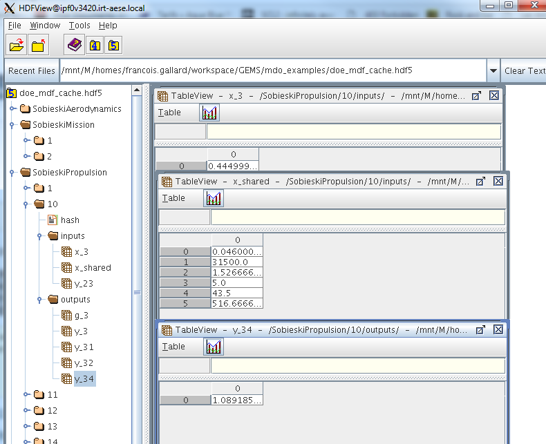

<!--
 Copyright 2021 IRT Saint Exupéry, https://www.irt-saintexupery.com

 This work is licensed under the Creative Commons Attribution-ShareAlike 4.0
 International License. To view a copy of this license, visit
 http://creativecommons.org/licenses/by-sa/4.0/ or send a letter to Creative
 Commons, PO Box 1866, Mountain View, CA 94042, USA.
-->

# Caching and recording discipline data

!!! how-to

    - [Access and clear a discipline cache][access-and-clear-a-discipline-cache]
    - [Set a discipline cache][set-a-discipline-cache]
    - [Manipulate data in a cache][manipulate-data-in-a-cache]
    - [Merge different caches][merge-different-caches]
    - [Exploit an HDF5 cache file][exploit-an-hdf5-cache-file]

## Introduction

There are several reasons to store the evaluations (input, output and Jacobian values) of a discipline:

- avoid evaluating a discipline at an input value for which it has already been evaluated,
- save data for post-processing purposes, e.g. visualization, statistics, machine learning, debugging, etc,
- save the current state in memory to restart a crashed sequential disciplinary process from the iteration preceding the unfortunate event,
- \...

Some of these reasons are all the more important as the discipline triggers a simulation which can be costly. Caching disciplinary data helps to avoid wasting computing resources.

## The basics

In GEMSEO, a [Discipline][gemseo.core.discipline.discipline.Discipline] is composed of a [cache][gemseo.core.discipline.discipline.Discipline.cache] to store these evaluations expressed in terms of input, output and Jacobian data.

### The caching mechanism

When the user passes an input value to the method [execute()][gemseo.core.discipline.discipline.Discipline.execute], the [Discipline][gemseo.core.discipline.discipline.Discipline] looks in its [cache][gemseo.core.discipline.discipline.Discipline.cache] if there is an output value associated with this input value. If so, it returns it to the user. Otherwise, it computes it, stores it in the cache and returns it to the user.

!!! note
    For performance reasons, the input value of type `Mapping[str, ndarray | int | float]` is flattened into a NumPy array. This array is then hashed using the XXH64 algorithm from the [xxHash library](https://cyan4973.github.io/xxHash/) and the resulting hash value is compared to those stored in the [cache][gemseo.core.discipline.discipline.Discipline.cache].

### Define a tolerance for caching

The user can pass a tolerance below which two input arrays are considered equal: `numpy.linalg.norm(user_array-cached_array)/(1+norm(cached_array)) <= tolerance`. This tolerance could be useful to optimize CPU time. It could be something like `2 * numpy.finfo(float).eps`.

### Different cache types

In GEMSEO, different cache types are available:

- in memory:
    - the [SimpleCache][gemseo.caches.simple.SimpleCache] (default policy) only stores in memory the data associated with the last call to [execute()][gemseo.core.discipline.discipline.Discipline.execute],
    - the [MemoryFullCache][gemseo.caches.memory_full.MemoryFullCache] stores in memory the data associated with all the calls to [execute()][gemseo.core.discipline.discipline.Discipline.execute],
- on the disk:
    - the [HDF5Cache][gemseo.caches.hdf5.HDF5Cache] stores in a node of an HDF file the data associated with all the calls to [execute()][gemseo.core.discipline.discipline.Discipline.execute].

      HDF5 (Hierarchical Data Format version 5) is a file format designed to store
      and organize large and complex datasets.
      An HDF5 file has a hierarchical structure,
      similar to a file system,
      where data is stored in groups (like folders) and datasets (like files).

      This structure allows multiple datasets to coexist in a single file, each accessible through a unique path. Metadata can also be attached to groups and datasets using attributes, making HDF5 well suited for scientific and engineering applications.

!!! warning
    - The [MemoryFullCache][gemseo.caches.memory_full.MemoryFullCache] relies on some multiprocessing features.
    When working on Windows, the execution of scripts containing instances of
    [MemoryFullCache][gemseo.caches.memory_full.MemoryFullCache] must be protected by an
    `if __name__ == '__main__':` statement.

    - The [HDF5Cache][gemseo.caches.hdf5.HDF5Cache] relies on some multiprocessing features. When working on
    Windows, the execution of scripts containing instances of [HDF5Cache][gemseo.caches.hdf5.HDF5Cache]
    must be protected by an `if __name__ == '__main__':` statement.
    Currently, the use of an HDF5Cache is not supported in parallel on Windows
    platforms. This is due to the way subprocesses are forked in this architecture.
    The method [set_backup_settings()][gemseo.scenarios.evaluation.EvaluationScenario.set_backup_settings]
    is recommended as an alternative.

!!! note
    The types of cache can be extended by subclassing [BaseFullCache][gemseo.caches.base_full.BaseFullCache] or [MemoryFullCache][gemseo.caches.memory_full.MemoryFullCache].
    The [set_cache()][gemseo.core.discipline.discipline.Discipline.set_cache] method will find the new types automatically because it is based on a [CacheFactory][gemseo.caches.factory.CacheFactory].

## Advanced use

### Cache data in an HDF file

[HDF5](https://portal.hdfgroup.org) is a standard file format for storing simulation data:

> *"HDF5 is a data model, library, and file format for storing and managing data. It supports an unlimited variety of datatypes, and is designed for flexible and efficient I/O and for high volume and complex data. HDF5 is portable and is extensible, allowing applications to evolve in their use of HDF5. The HDF5 Technology suite includes tools and applications for managing, manipulating, viewing, and analyzing data in the HDF5 format."*

The HDFView application can be used to explore the data of the cache.

*HDFView of the cache generated by an MDF DOE scenario execution on the SSBJ test case*
