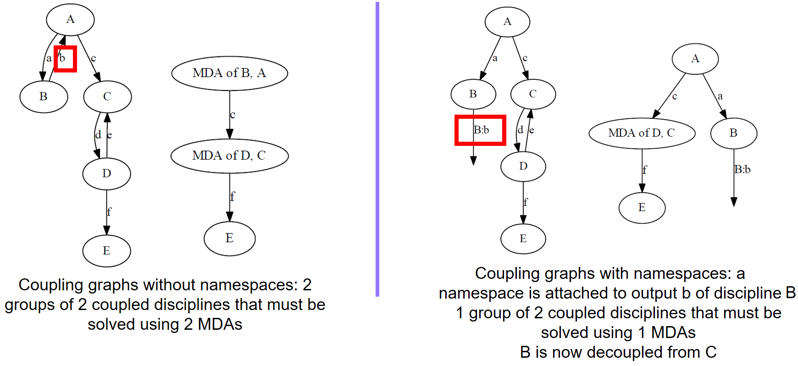

<!--
 Copyright 2021 IRT Saint Exupéry, https://www.irt-saintexupery.com

 This work is licensed under the Creative Commons Attribution-ShareAlike 4.0
 International License. To view a copy of this license, visit
 http://creativecommons.org/licenses/by-sa/4.0/ or send a letter to Creative
 Commons, PO Box 1866, Mountain View, CA 94042, USA.
-->

# Namespaces

## What are namespaces?

Namespaces are prefixes to input or output names of the [Discipline][gemseo.core.discipline.discipline.Discipline] subclasses. The name of the variable is replaced by the namespace, a separator, ':' by default, and the original variable name.

This allows to control the data exchanges between existing disciplines, and therefore configure the process without changing the original grammar. For instance, if a discipline A with input "x" and output "y" is chained with a discipline B of input "y" and output "z", adding the namespace "ns" to the output y of A will result in a "disconnection" between "y" as the output of A and "y" as the input of B.

In terms of interface, you must always use the method [add_namespace_to_input][gemseo.core.discipline.discipline.Discipline.add_namespace_to_input] and [add_namespace_to_output][gemseo.core.discipline.discipline.Discipline.add_namespace_to_output] to set the namespaces to the input and output variables after defining the latter. Never prefix a variable with a namespace by any other means.

This would result in the following example:

``` python
>>> from gemseo import create_discipline
>>> from gemseo.core.chain import MDOChain
>>>
>>> def func_a(x=1.):
>>>     y=x+1
>>>     return y
>>>
>>> def func_b(y=1.):
>>>     z=y+1
>>>     return z
>>>
>>> a_disc = create_discipline("AutoPyDiscipline", py_func=func_a)
>>> b_disc = create_discipline("AutoPyDiscipline", py_func=func_b)
>>> print("A inputs", list(a_disc.get_input_data_names()), ", outputs",
...    list(a_disc.output_grammar.names))
A inputs ['x'], outputs ['y']

>>> chain = MDOChain(disciplines=[a_disc, b_disc])
>>> print("Chain output, z = ", chain.execute()['z'])
Chain output, z = [3.]

>>> a_disc_ns = create_discipline("AutoPyDiscipline", py_func=func_a)
>>> a_disc_ns.add_namespace_to_output("y", "ns")
>>>
>>> print("A inputs", list(a_disc_ns.get_input_data_names()), ", outputs",
...     list(a_disc_ns.output_grammar.names))
A inputs ['x'], outputs ['ns:y']

>>> chain_ns = MDOChain(disciplines=[a_disc_ns, b_disc])
>>> print("Chain output with namespace, z = ", chain_ns.execute()['z'])
Chain output with namespace, z = [2.]
```

!!! warning
    This is an experimental feature, that is currently validated for the main process classes: [MDOChain][gemseo.core.chains.chain.MDOChain], [BaseMDA][gemseo.mda.base_mda.BaseMDA] and its subclasses, [MDOParallelChain][gemseo.core.chains.parallel_chain.MDOParallelChain] etc. Scenarios can be created with disciplines handling namespaces. The main limitation is that not all wrappers and MDO test problems are compatible with namespaces, which requires the modifications described at the end of this page. Currently, the [AutoPyDiscipline][gemseo.disciplines.auto_py.AutoPyDiscipline] and [ConstraintAggregation][gemseo.disciplines.constraint_aggregation.ConstraintAggregation] support namespaces and can be used as examples.

## Coupling control in MDAs

Namespaces allow to control the couplings in MDAs by renaming a variable. This may change the coupling structure graph, as illustrated in the next figure.



## Impact on the Discipline wrappers

The discipline that wraps a simulation code, such as [AutoPyDiscipline][gemseo.disciplines.auto_py.AutoPyDiscipline], declares its input and output names without the namespace prefix, in its `__init__()` method.

After instantiation, a namespace may be added to the discipline, which may make the names of the grammar elements inconsistent with the names of the local variables in the discipline wrapper. To this aim, the method `.Discipline._run()` takes the inputs with names without namespaces as argument and can return the outputs with names without namespaces.

Besides, [BaseGrammar][gemseo.core.grammars.base_grammar.BaseGrammar] has the attributes [to_namespaced][gemseo.core.grammars.base_grammar.BaseGrammar.to_namespaced] and [from_namespaced][gemseo.core.grammars.base_grammar.BaseGrammar.from_namespaced] that map the names with and without namespace prefixes.

Finally, [Discipline.io.update_output_data][gemseo.core.discipline.io.IO.update_output_data] allows to pass variables names without namespace prefixes. This allows to adapt wrappers to support namespaces with only minor modifications.

For instance, the `AutoPyDiscipline._run()` method is as follows, and supports namespaces:

``` python
def _run(self, input_data):
    return self.py_func(**input_data)
```
