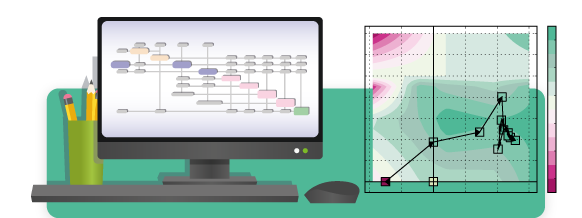

<!--
Copyright 2021 IRT Saint Exupéry, https://www.irt-saintexupery.com

This work is licensed under the Creative Commons Attribution-ShareAlike 4.0
International License. To view a copy of this license, visit
http://creativecommons.org/licenses/by-sa/4.0/ or send a letter to Creative
Commons, PO Box 1866, Mountain View, CA 94042, USA.
-->
<h1 style="display: none;">Home</h1>

<section class="gh-intro">
  

    
    
Generic Engine for Multidisciplinary Scenarios, Exploration and Optimization

    
An open-source Python library for multidisciplinary studies.

    
Looking for plugins, blog posts, and contributing advice? Those live on <a href="https://gemseo.org" target="_blank" rel="noopener">gemseo.org</a>

  

  

    

      Quick start
    

    

      <button type="button" class="gh-qtab gh-qtab--active" role="tab" aria-selected="true" data-panel="install">Install</button>
      <button type="button" class="gh-qtab" role="tab" aria-selected="false" data-panel="firstrun">First run</button>
    

    

      

        

          <button type="button" class="gh-tab gh-tab--active" role="tab" aria-selected="true" data-tab="uv" data-cmd="uv pip install gemseo[all]">uv</button>
          <button type="button" class="gh-tab" role="tab" aria-selected="false" data-tab="pip" data-cmd="pip install gemseo[all]">pip</button>
          <button type="button" class="gh-tab" role="tab" aria-selected="false" data-tab="conda" data-cmd="conda install -c conda-forge gemseo">conda</button>
        

        

          $
          uv pip install gemseo[all]
          <button type="button" class="gh-cmd__copy" data-copy="uv pip install gemseo[all]">Copy</button>
        

      

      

        

          <button type="button" class="gh-cmd__copy gh-code__copy" data-copy="from gemseo.discipline.analytic import AnalyticDiscipline&#10;from gemseo.optimization import SLSQP_Settings&#10;from gemseo.scenario.mdo import MDOScenario&#10;from gemseo.space.design import DesignSpace&#10;&#10;discipline = AnalyticDiscipline({&quot;y&quot;: &quot;(x - 2) ** 2 + 1&quot;})&#10;&#10;design_space = DesignSpace()&#10;design_space.add_variable(&#10;    &quot;x&quot;,&#10;    lower_bound=-5.0,&#10;    upper_bound=5.0,&#10;    value=0.0,&#10;)&#10;&#10;scenario = MDOScenario([discipline], design_space)&#10;scenario.add_objective(&quot;y&quot;)&#10;scenario.execute(SLSQP_Settings(max_iter=10))&#10;">Copy</button>
          <pre class="gh-code"><code>from gemseo.discipline.analytic import AnalyticDiscipline
from gemseo.optimization import SLSQP_Settings
from gemseo.scenario.mdo import MDOScenario
from gemseo.space.design import DesignSpace

discipline = AnalyticDiscipline({"y": "(x - 2) ** 2 + 1"})

design_space = DesignSpace()
design_space.add_variable(
    "x",
    lower_bound=-5.0,
    upper_bound=5.0,
    value=0.0,
)

scenario = MDOScenario([discipline], design_space)
scenario.add_objective("y")
scenario.execute(SLSQP_Settings(max_iter=10))
</code></pre>
        

      

    

    

      <a href="software/installation/">Installation &amp; setup</a>
      <a href="generated/examples/tutorials/basic/plot_gemseo_in_10_minutes/">GEMSEO in 10 minutes</a>
    

  

</section>

Its GNU LGPL v3.0 open-source license makes it commercially usable ([see licences][licenses]).

## Main concepts

- ### __Discipline__

    [:octicons-book-24: User guide][concept-discipline]
    [:octicons-play-24: Examples][disciplines-examples]
    [:octicons-gear-24: Types][available-disciplines]

    ---

    Define an input-output discipline to interface a model.

    Features:
    [analytic expressions][use-analytic-expressions],
    [executable][tutorial-wrap-an-executable],
    [surrogate model][surrogate-models] and
    [much more][concept-discipline].

- ### __Design space__

    [:octicons-book-24: User guide][concept-design-space]
    [:octicons-play-24: Examples][design-space-examples]

    ---

    Define a set of parameters, typically design parameters.

    Features:
    [deterministic parameter space][gemseo.space.design] and
    [uncertain (or mixed) parameter space][gemseo.space.parameter].

- ### __Scenario__

    [:octicons-book-24: User guide][concept-scenarios]
    [:octicons-play-24: Examples][scenario-examples]

    ---

    Define an evaluation process over a design space for a set of disciplines and a given objective.

    Features:
    [Evaluation scenario][gemseo.scenario.evaluation.EvaluationScenario] and
    [MDO scenario][gemseo.scenario.mdo.MDOScenario].

- ### __Data persistence__

    [:octicons-book-24: User guide][concept-data-persistence]
    [:octicons-play-24: Examples][cache-examples]

    ---

    Store disciplinary evaluations in a [cache][concept-cache]
    either in memory or saved in a file.
    Use a [dataset][gemseo.dataset.dataset] to store many kinds of data
    and make them easy to handle for visualization, display and query purposes.

## Features

- ### __Study analysis__

    [:octicons-book-24: User guide](interface/study_analysis.md)
    [:octicons-play-24: Examples][tutorial-prototyping-a-multidisciplinary-study]

    ---

    An intuitive tool to discover MDO without writing any code,
    and define the right MDO problem and process.
    From an Excel workbook,
    specify your disciplines, design space, objective and constraints,
    select an MDO formulation and plot both coupling structure
    ([N2 chart][concept-n2-chart]
    and MDO process
    ([XDSM][concept-xdsm-visualization]),
    even before wrapping any software.

- ### __Optimization__

    [:octicons-book-24: User guide][optimization-and-doe-framework]
    [:octicons-gear-24: Algorithms][available-optimization-algorithms]

    ---

    Define, solve and post-process an optimization problem from an optimization algorithm.

    Based on
    [GCMMA-MMA](https://github.com/arjendeetman/GCMMA-MMA-Python>),
    [NLopt](https://nlopt.readthedocs.io/en/latest/),
    [PDFO](https://www.pdfo.net/),
    [pSeven](https://www.pseven.io/product/pseven/),
    [pymoo](https://pymoo.org/) and
    [SciPy](https://scipy.org/).

- ### __DOE & trade-off__

    [:octicons-book-24: User guide][concept-evaluation-problem]
    [:octicons-play-24: Examples][design-of-experiments-doe]
    [:octicons-gear-24: Algorithms][available-doe-algorithms]

    ---

    Define, solve and post-process a trade-off problem from a DOE (design of experiments) algorithm.

    Based on
    [OpenTURNS](https://openturns.github.io/www/) and
    [PyDOE](https://pydoe.github.io/pydoe/).

- ### __MDO formulations__ { #overview-mdo-formulations }

    [:octicons-book-24: User guide][concept-mdo-formulations]
    [:octicons-play-24: Examples][mdo-formulation]
    [:octicons-gear-24: Algorithms][available-mdo-formulations]

    ---

    Define the way as the disciplinary coupling is formulated and managed by the optimization or DOE algorithm.

- ### __MDA__

    [:octicons-book-24: User guide][concept-solving-multi-disciplinary-analysis]
    [:octicons-play-24: Examples][multidisciplinary-analysis-mda]
    [:octicons-gear-24: Algorithms][available-mda-algorithms]

    ---

    Find the coupled state of a multidisciplinary system using a multi-disciplinary analysis.

- ### __Linear solvers__

    [:octicons-gear-24: Algorithms][available-linear-solvers]

    ---

    Define and solve a linear problem, typically in the context of an MDA.

    Based on
    [PETSc](https://petsc.org/release/) and
    [SciPy](https://scipy.org/).

- ### __Visualization__

    [:octicons-book-24: User guide][how-to-post-process]
    [:octicons-play-24: Examples][post-process-an-optimizationproblem]
    [:octicons-gear-24: Algorithms][available-post-processing-algorithms]

    ---

    Generate graphical representations of optimization histories.

- ### __Surrogate models__ { #overview-surrogate-models }

    [:octicons-play-24: Examples][use-a-surrogate-model]
    [:octicons-gear-24: Algorithms][needs-surrogate-modelling]

    ---

    Replace a discipline by a surrogate one relying on a machine learning regression model.

    Based on
    [OpenTURNS](https://openturns.github.io/www/) and
    [scikit-learn](https://scikit-learn.org/stable/).

- ### __Scalable model__ { #overview-scalable-models }

    Features:
    [scalability][gemseo.problem.mdo.scalable.data_driven.study.process],
    [scalable problem][the-scalable-problem],
    [scalable discipline][the-scalable-problem] and
    [diagonal-based][the-scalable-problem].

    ---

    Use scalable data-driven models to compare MDO formulations and algorithms for different problem dimensions.

    [:octicons-book-24: User guide][scalable-models]
    [:octicons-play-24: Examples][scalable-model]

- ### __Machine learning__

    [:octicons-book-24: User guide][introduction-to-machine-learning]
    [:octicons-play-24: Examples][machine-learning-howtos]
    [:octicons-gear-24: Algorithms][algorithms-of-machine-learning]

    ---

    Apply clustering, classification and regression methods from the machine learning community.

    Features:
    [clustering][gemseo.machine_learning.clustering.model],
    [classification][gemseo.machine_learning.classification.model],
    [regression][gemseo.machine_learning.regression.model],
    [quality measures][gemseo.machine_learning.core.quality.base_ml_model_quality] and
    [data transformation][gemseo.machine_learning.transformer.pipeline].

- ### __Uncertainty__

    [:octicons-book-24: User guide][concept-uncertainty-introduction]
    [:octicons-play-24: Examples][uncertainty-examples]
    [:octicons-gear-24: Algorithms][uncertainty-algorithms]

    ---

    Define, propagate, analyze and manage uncertainties.

    Features:
    [distribution][gemseo.uncertainty.distribution],
    [uncertain space][gemseo.space.parameter],
    [empirical and parametric statistics][gemseo.uncertainty.statistic.core.base],
    [distribution fitting][gemseo.uncertainty.distribution.core.base_fitter] and
    [sensitivity analysis][gemseo.uncertainty.sensitivity].

    Based on
    [OpenTURNS](https://openturns.github.io/www/).

- ### __Ordinary differential equation__

    [:octicons-book-24: User guide][concept-ode]
    [:octicons-play-24: Examples][ordinary-differential-equations]
    [:octicons-gear-24: Algorithms][available-ordinary-differential-equations-solvers]

    ---

    Define and solve an ordinary differential equation.

    Based on
    [SciPy](https://scipy.org/) and [PETSc](https://petsc.org/).
