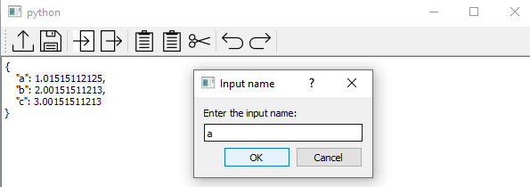

<!--
 Copyright 2021 IRT Saint Exupéry, https://www.irt-saintexupery.com

 This work is licensed under the Creative Commons Attribution-ShareAlike 4.0
 International License. To view a copy of this license, visit
 http://creativecommons.org/licenses/by-sa/4.0/ or send a letter to Creative
 Commons, PO Box 1866, Mountain View, CA 94042, USA.
-->

<!--
Contributors:
   :author:  Francois Gallard
-->

# Automatic wrapper for executables with Graphical User Interface

This section describes how to use
[DiscFromExe][gemseo.disciplines.wrappers.disc_from_exe.DiscFromExe].
The input and output template files can be edited using the dedicated GUI,
see next section.

!!! warning
      This feature requires the [GEMSEO template editor GUI plugin](https://gitlab.com/gemseo/dev/gemseo-template-editor-gui).

The following screenshots detail the steps to create the templates from
the reference input file.

