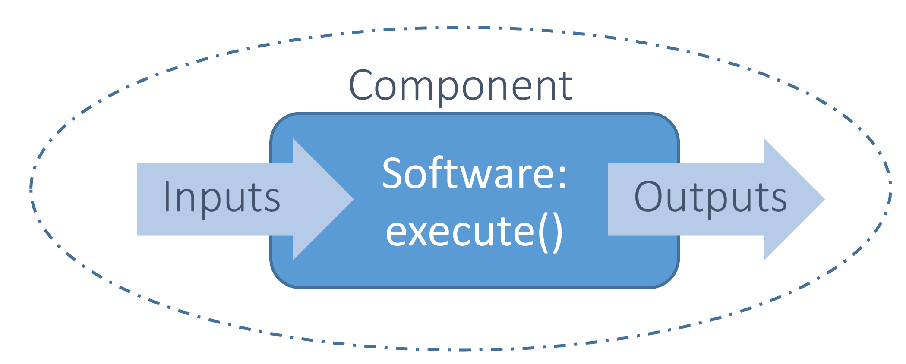

<!--
 Copyright 2021 IRT Saint Exupéry, https://www.irt-saintexupery.com

 This work is licensed under the Creative Commons Attribution-ShareAlike 4.0
 International License. To view a copy of this license, visit
 http://creativecommons.org/licenses/by-sa/4.0/ or send a letter to Creative
 Commons, PO Box 1866, Mountain View, CA 94042, USA.
-->

<!--
Contributors:
         :author:  Francois Gallard
-->

# Interfacing simulation software

To interface a simulation software with GEMSEO, and make a
[Discipline][gemseo.core.discipline.discipline.Discipline] from it, several options are available:

- Your program is a Python function, you can use [AutoPyDiscipline][gemseo.disciplines.auto_py.AutoPyDiscipline],
  see [this short example][gemseo-in-10-minutes].
- You have simple analytic expressions, use [an analytic discipline][how-to-build-an-analytic-discipline],
  that also provides analytic derivatives automatically.
- You have an Excel workbooks, use [Excel discipline][excel-wrapper].
- If your program is a MATLAB function, there is a generic interface
  that allows to connect it to GEMSEO as a [Discipline][gemseo.core.discipline.discipline.Discipline]. See
  [Gemseo-matlab](https://gemseo.gitlab.io/dev/gemseo-matlab/latest/),
- For Scilab functions, [a plugin is available](https://gitlab.com/gemseo/dev/gemseo-scilab). With it, you
  can create a [Discipline][gemseo.core.discipline.discipline.Discipline] that runs Scilab code directly from
  GEMSEO.
- If your program is an executable, you have two options. Either you use
  the [DiscFromExe][gemseo.disciplines.wrappers.disc_from_exe.DiscFromExe] to wrap a single executable and the inputs and
  outputs file, with the help of a Graphical User Interface. Or use a
  workflow engine (next point).
- Interface a discipline with a workflow engine, and then integrate
  the workflow engine within the MDO platform, which embeds GEMSEO.
  This option is the best if the workflow engine provides services
  that you require, such as HPC access, working directory management,
  post-processing, or if you want to chain easily multiple programs with
  files exchanges.
- Directly inherit from the [Discipline][gemseo.core.discipline.discipline.Discipline] class to make a specific
  wrapper in Python. This option is possible if you have no
  workflow engine, or if you have a light and pure in-memory code that
  does not require a lot of file processing or multiple machine access.
- If you only have execution data, for instance from a DOE, you can
  build a surrogate model automatically from this data and embed it in
  a scenario as any other discipline. See
  the section about surrogate models in [the user guide][surrogate-models-introduction].

All these options can be mixed to build MDO processes, allowing a strong
flexibility.

!!! warning
    All the inputs and outputs names of the disciplines in a scenario
    shall be consistent.

    GEMSEO assumes that the data are tagged by their names with a global
    convention in the whole process. What two disciplines call "X" shall
    be the same "X". The coupling variables for instance, are detected
    thanks to these conventions. The wrappers shall handle conversions if
    needed. This may rely on third party technologies provided by the
    platform.

The next sections go into the details of the wrapping of a discipline
in GEMSEO.

## The basics of wrappers

A wrapper, or library wrapper, is a piece of software which translates
the existing API of an existing program or a library, into a
compatible one. Each program is encapsulated within using a dedicated
interface. GEMSEO defines the standardized interface in the
[Discipline][gemseo.core.discipline.discipline.Discipline] interface, to define input data,
output data and an execution of the integrated software. Thanks to it,
GEMSEO can treat the integrated software independently of their own
implementation and of their own conventions to describe the inputs and
outputs (file formats for instance).

The next figure displays the concept of wrapper in workflow management.



## Input and output description: grammars

### Principles

The inputs and outputs are represented by grammars. Grammars
are a set of rules that define whether a set of data is valid or not as
inputs or outputs of a [Discipline][gemseo.core.discipline.discipline.Discipline]. There are at least two grammars
for a discipline: one for input data and one for output data.

In GEMSEO, there is an [BaseGrammar][gemseo.core.grammars.base_grammar.BaseGrammar] class that defines the contract of
the grammars implementations, such as checking data, listing the
required data, etc.

- [SimpleGrammar][gemseo.core.grammars.simple_grammar.SimpleGrammar]: it manipulates the list of required data names,
  and a list of the associated types (string, float, numpy.ndarray or
  any type provided). There is also a dictionary of default values that
  adds default values to the data if they are not provided.

- [JSONGrammar][gemseo.core.grammars.json_grammar.JSONGrammar]: a JSON-based grammar.
  You must provide a JSON file that describes the validity of the data.
  This is a much more advanced and much more powerful description. JSON
  is a web standard supported by many languages: [JSON Schema](https://json-schema.org/tools?query=&sortBy=name&sortOrder=ascending&groupBy=languages&licenses=&languages=&drafts=&toolingTypes=&environments=&showObsolete=false).
  Please read [Understanding JSON Schema](http://spacetelescope.github.io/understanding-json-schema/index.html)
  for details on JSON schema. The input and output schemas for the
  disciplines must be files in the same directory as the Python module
  of the discipline, with a naming convention
  `MyDisciplineName_input.json` and `MyDisciplineName_output.json`.

### Examples of grammars

The following code is the JSON Schema file of the mission
discipline of [Sobieski's SSBJ problem][sobieskis-ssbj-test-case]. All inputs are arrays of floats.

``` json
{
"name": "SobieskiMission_input",
"required": ["y_14","x_shared","y_24","y_34"],
"properties": {
    "y_14": {
        "items": {
            "type": "number"
        },
        "type": "array"
    },
    "x_shared": {
        "items": {
            "type": "number"
        },
        "type": "array"
    },
    "y_24": {
        "items": {
            "type": "number"
        },
        "type": "array"
    },
    "y_34": {
        "items": {
            "type": "number"
        },
        "type": "array"
    }
},
"$schema": "http://json-schema.org/draft-04/schema",
"type": "object",
"id": "#SobieskiMission_input"
}
```

JSON Grammars are used to describe and check many inputs of GEMSEO, such
as algorithms options.

### Examples of data checking by the grammars

An advantage of the JSON schema is that it is implemented in many
languages. Python has a json-schema package, which can check data
against a JSON schema and provide clear error messages, which is key in
the development and debugging of an MDO process. For the final user,
this is also very important, since a lot of data has to be filled, which
is error-prone.

From the previous JSON grammar of the Sobieski Mission discipline, we
can illustrate the interest of the data check. The [SobieskiMission][gemseo.problems.mdo.sobieski.disciplines.SobieskiMission]
will check any data passed to its [execute()][gemseo.core.discipline.discipline.Discipline.execute] method before
calling `Discipline._run()`.

``` python
from gemseo.problems.mdo.sobieski.disciplines import SobieskiMission

misssion = SobieskiMission()
misssion.execute(input_data={"y_14": [1.0, "a"]})
```

The `y_14` value shall be an array of numbers. `"a"` is not a number and
this prevents the execution of the discipline. GEMSEO raises an
exception, the invalid property of the schema is highlighted, as well as
the rules.

``` shell
ERROR - 15:15:19 : Invalid data in : SobieskiMission_input on property : 'y_14 1',
error : 'a' is not of type u'number'
ERROR - 15:15:19 : JSON Grammar schema = {u'name': u'SobieskiMission_input', 'required': [u'x_shared', u'y_14', u'y_24', u'y_34'], u'id': u'#SobieskiMission_input', u'$schema': u'http://json-schema.org/draft-04/schema', 'type': u'object', 'properties': {u'y_24': {'items': {'type': u'number'}, 'type': u'array'}, u'x_shared': {'items': {'type': u'number'}, 'type': u'array'}, u'y_34': {'items': {'type': u'number'}, 'type': u'array'}, u'y_14': {'items': {'type': u'number'}, 'type': u'array'}}}
```

The existence of required inputs is also checked before running. The
wrapper [SobieskiMission][gemseo.problems.mdo.sobieski.disciplines.SobieskiMission] has [default_input_data][gemseo.core.discipline.discipline.Discipline.default_input_data] set for
all its inputs, so we need first to erase them to show that.

``` python
from gemseo.problems.mdo.sobieski.disciplines import SobieskiMission

misssion = SobieskiMission()
misssion.default_input_data = {}
misssion.execute(input_data={"y_14": [2.0, "a"]})
```

Note that all errors are displayed before raising the exception. This
avoids to have to rerun the process multiple times to debug data errors
one by one. In a single pass, we learn that the data `x_shared`, `y_24`,
`y_34` are required and missing, and that the second component of `y_14`
is of the wrong type.

``` shell
ERROR - 15:21:22 : Invalid data in : SobieskiMission_input on property : '', error : u'x_shared' is a required property
ERROR - 15:21:22 : JSON Grammar schema = {u'name': u'SobieskiMission_input', 'required': [u'x_shared', u'y_14', u'y_24', u'y_34'], u'id': u'#SobieskiMission_input', u'$schema': u'http://json-schema.org/draft-04/schema', 'type': u'object', 'properties': {u'y_24': {'items': {'type': u'number'}, 'type': u'array'}, u'x_shared': {'items': {'type': u'number'}, 'type': u'array'}, u'y_34': {'items': {'type': u'number'}, 'type': u'array'}, u'y_14': {'items': {'type': u'number'}, 'type': u'array'}}}
ERROR - 15:21:22 : Invalid data in : SobieskiMission_input on property : '', error : u'y_24' is a required property
ERROR - 15:21:22 : JSON Grammar schema = {u'name': u'SobieskiMission_input', 'required': [u'x_shared', u'y_14', u'y_24', u'y_34'], u'id': u'#SobieskiMission_input', u'$schema': u'http://json-schema.org/draft-04/schema', 'type': u'object', 'properties': {u'y_24': {'items': {'type': u'number'}, 'type': u'array'}, u'x_shared': {'items': {'type': u'number'}, 'type': u'array'}, u'y_34': {'items': {'type': u'number'}, 'type': u'array'}, u'y_14': {'items': {'type': u'number'}, 'type': u'array'}}}
ERROR - 15:21:22 : Invalid data in : SobieskiMission_input on property : '', error : u'y_34' is a required property
ERROR - 15:21:22 : JSON Grammar schema = {u'name': u'SobieskiMission_input', 'required': [u'x_shared', u'y_14', u'y_24', u'y_34'], u'id': u'#SobieskiMission_input', u'$schema': u'http://json-schema.org/draft-04/schema', 'type': u'object', 'properties': {u'y_24': {'items': {'type': u'number'}, 'type': u'array'}, u'x_shared': {'items': {'type': u'number'}, 'type': u'array'}, u'y_34': {'items': {'type': u'number'}, 'type': u'array'}, u'y_14': {'items': {'type': u'number'}, 'type': u'array'}}}
ERROR - 15:21:22 : Invalid data in : SobieskiMission_input on property : 'y_14 1', error : 'a' is not of type u'number'
ERROR - 15:21:22 : JSON Grammar schema = {u'name': u'SobieskiMission_input', 'required': [u'x_shared', u'y_14', u'y_24', u'y_34'], u'id': u'#SobieskiMission_input', u'$schema': u'http://json-schema.org/draft-04/schema', 'type': u'object', 'properties': {u'y_24': {'items': {'type': u'number'}, 'type': u'array'}, u'x_shared': {'items': {'type': u'number'}, 'type': u'array'}, u'y_34': {'items': {'type': u'number'}, 'type': u'array'}, u'y_14': {'items': {'type': u'number'}, 'type': u'array'}}}
Traceback (most recent call last):
File "/home/Francois/workspace/GEMSEO/mdo_examples/sellar_full_example.py", line 105, in <module>
  misssion.execute(input_data={"y_14": [2.0, "a"]})
File "/home/Francois/workspace/GEMSEO/gemseo/core/discipline.py", line 376, in execute
  self.check_input_data(input_data)
File "/home/Francois/workspace/GEMSEO/gemseo/core/discipline.py", line 803, in check_input_data
  raise InvalidDataException("Invalid input data for: " + self.name)
gemseo.core.grammar.InvalidDataException: Invalid input data for: SobieskiMission
```

### Interfacing with other technologies

GEMSEO internally uses JSON schema based grammars, for the generic
MDA and chain processes for instance. Therefore, if one wants to use
a specific technology for inputs and outputs description and checks, it
is recommended to write a converter to the [JSONGrammar][gemseo.core.grammars.json_grammar.JSONGrammar] or to generate
a JSON Schema. This was performed multiple times for different
workflow engine such as Model Center and WORMS, or specific
simulation software technologies (Scilab). It is usually not a complex
task, since GEMSEO only needs to deal with floating point arrays of data
useful for the MDO formulation, *i.e.* data that are
design variables, an objective function or constraints, or
coupling variables. Therefore, many private data of the disciplines
may be kept inside third party technologies, without any translation to
GEMSEO grammars. It is the case of all configuration data, such as HPC
configuration, input files of the simulation, meshes, **which do not
have to be exposed in GEMSEO grammars**.

## Wrapping of execution

The effective execution of the [Discipline][gemseo.core.discipline.discipline.Discipline] is defined by its
`_run()` method. It shall implement, in the subclasses, the
calculation of outputs for given inputs. When GEMSEO needs to execute
the discipline, it will call the public [execute()][gemseo.core.discipline.discipline.Discipline.execute] method, that will:

1. Add default inputs to the input_data if some inputs are not defined
    in `input_data` but exist in its [default_input_data][gemseo.core.discipline.discipline.Discipline.default_input_data] attribute.
2. Cache the inputs, *i.e.* stores `input_data` in its [cache][gemseo.core.discipline.discipline.Discipline.cache] attribute.
3. Check the input data against its [input_grammar][gemseo.core.discipline.discipline.Discipline.input_grammar].
4. If `io.data_processor` is not `None`: run the data
    pre-processor, to eventually convert data from GEMSEO types
    (typically numpy arrays) to discipline types as needed by the
    `_run()` method.
5. Update its [execution_status][gemseo.core.discipline.discipline.Discipline.execution_status] attribute to `RUNNING`.
6. Call its `_run()` method, that shall be defined by
    subclasses.
7. If `io.data_processor` is not `None`: run the post
    processor, to eventually convert data from discipline types to
    GEMSEO types (typically numpy arrays).
8. Check the output data.
9. Store the outputs, *i.e.* stores [local_data][gemseo.core.discipline.discipline.Discipline.local_data] in
    [cache][gemseo.core.discipline.discipline.Discipline.cache].
10. Update the [execution_status.value][gemseo.core.discipline.discipline.Discipline.execution_status] to `DONE` or `FAILED`.
11. Update accumulated execution time `[execution_statistics.duration][gemseo.core.discipline.discipline.Discipline.execution_statistics].

A complete example of discipline integration is given in [this page][a-from-scratch-example-on-the-sellar-problem].
