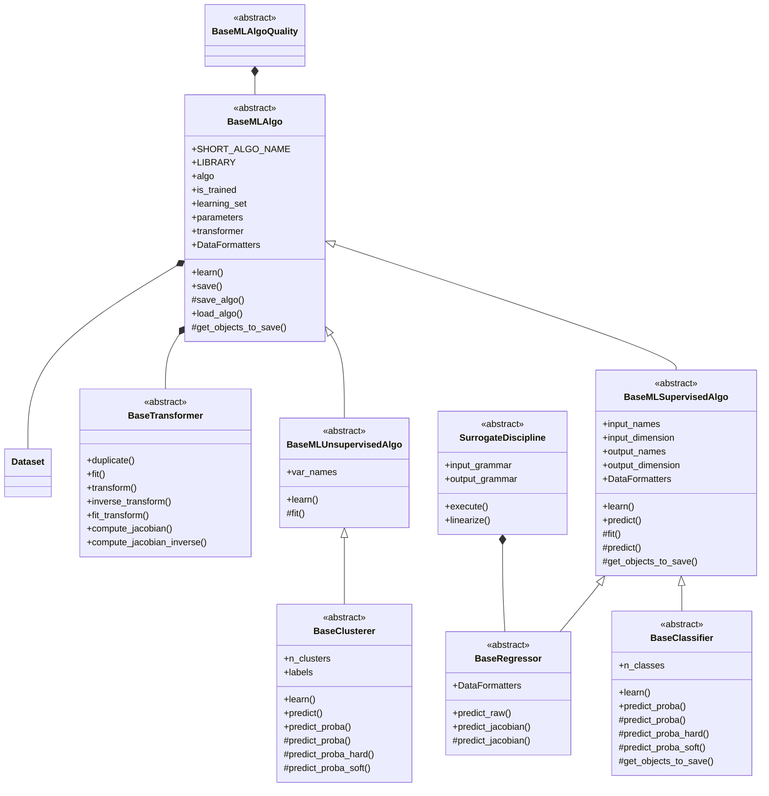

<!--
 Copyright 2021 IRT Saint Exupéry, https://www.irt-saintexupery.com

 This work is licensed under the Creative Commons Attribution-ShareAlike 4.0
 International License. To view a copy of this license, visit
 http://creativecommons.org/licenses/by-sa/4.0/ or send a letter to Creative
 Commons, PO Box 1866, Mountain View, CA 94042, USA.
-->

# Introduction to machine learning

## Introduction

When a [Discipline][gemseo.core.discipline.discipline.Discipline] is costly to evaluate,
it can be replaced by a [SurrogateDiscipline][gemseo.disciplines.surrogate.SurrogateDiscipline] cheap to evaluate,
e.g. linear model, Kriging, RBF regressor, ...
This [SurrogateDiscipline][gemseo.disciplines.surrogate.SurrogateDiscipline] is built from a few evaluations
of this [Discipline][gemseo.core.discipline.discipline.Discipline].
This learning phase commonly relies on a regression
model calibrated by machine learning techniques. This is the reason why
GEMSEO provides a machine learning package which includes the
[BaseRegressor][gemseo.mlearning.regression.algos.base_regressor.BaseRegressor] class implementing the concept of regression model.
In addition, this machine learning package has a much broader set of features
than regression: clustering, classification, dimension reduction, data scaling,
...

!!! info "See Also"

      [Surrogate models](../surrogate.md)

## Development

This diagram shows the hierarchy of all machine learning algorithms,
and where they interact with [Dataset][gemseo.datasets.dataset.Dataset],
[BaseMLAlgoQuality][gemseo.mlearning.core.quality.base_ml_algo_quality.BaseMLAlgoQuality],
[BaseTransformer][gemseo.mlearning.transformers.base_transformer.BaseTransformer]
and [MLAlgoCalibration][gemseo.mlearning.core.calibration.MLAlgoCalibration].

