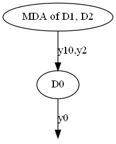

<!--
 Copyright 2021 IRT Saint Exupéry, https://www.irt-saintexupery.com

 This work is licensed under the Creative Commons Attribution-ShareAlike 4.0
 International License. To view a copy of this license, visit
 http://creativecommons.org/licenses/by-sa/4.0/ or send a letter to Creative
 Commons, PO Box 1866, Mountain View, CA 94042, USA.
-->

# Coupling visualization

!!! tutorial
    - [Tutorial - The Multi-Disciplinary Analysis][tutorial-the-multidisciplinary-design-analysis]

!!! how-to
    - [Chain disciplines][chain-disciplines]
    - [Generate a coupling graph][generate-a-coupling-graph]
    - [Generate the N2 chart][generate-the-n2-chart]

GEMSEO offers two ways of visualizing a multidisciplinary coupling structure,
either using a network diagram based on nodes and links
or using an N2 chart based on a tabular view.

## Dependency graph

Both rely on the same [DependencyGraph][gemseo.core.dependency_graph.DependencyGraph],
built from the library [NetworkX](https://networkx.org/).
This [DependencyGraph][gemseo.core.dependency_graph.DependencyGraph] generates
not only the full
[directed graph](https://en.wikipedia.org/wiki/Graph_(discrete_mathematics))
but also the condensed one with the Tarjan's algorithm[^1]
with Nuutila's modifications[^2].

## Coupling graph visualization

Both full and condensed graphs can be represented as network diagrams
where disciplines are nodes represented by circles labeled by their names,
and couplings are links represented by arrows labeled by their coupling variables.

### Full graph

### Condensed graph

## N2 chart visualization

Both full and condensed graphs can be represented as
[N2 charts](https://en.wikipedia.org/wiki/N2_chart)
also referred to as N2 diagrams, N-squared diagrams or N-squared charts.

The diagonal elements of an N2 chart are the disciplines
while the non-diagonal elements are the coupling variables.
A discipline takes its inputs vertically and returns its outputs horizontally.
In other words, if the cell *(i,j)* is not empty,
its content is the set of the names of the variables computed by the *i*-th discipline
and passed to the *j*-th discipline.

GEMSEO offers the possibility to display the N2 chart either as
a static visualization of the full graph,
or as an interactive visualization of both full and condensed graphs:

!!! note
    The self-coupled disciplines are represented by diagonal blocks
    with a specific background color:
    blue for the static N2 chart
    and the color of the group to which the discipline belongs for the dynamic N2 chart.

### Dynamic visualization of the full graph

!!! info "See Also"
    [An interactive N2 chart](../_static/n2.html) can also be exploited in a browser.

### Static visualization of the ful graph

Coupling names may be removed and replaced by blue ellipses.

[^1]: Depth-first search and linear graph algorithms, R. Tarjan SIAM Journal of Computing 1(2):146-160, (1972).

[^2]: On finding the strongly connected components in a directed graph. E. Nuutila and E. Soisalon-Soinen Information Processing Letters 49(1): 9-14, (1994).
