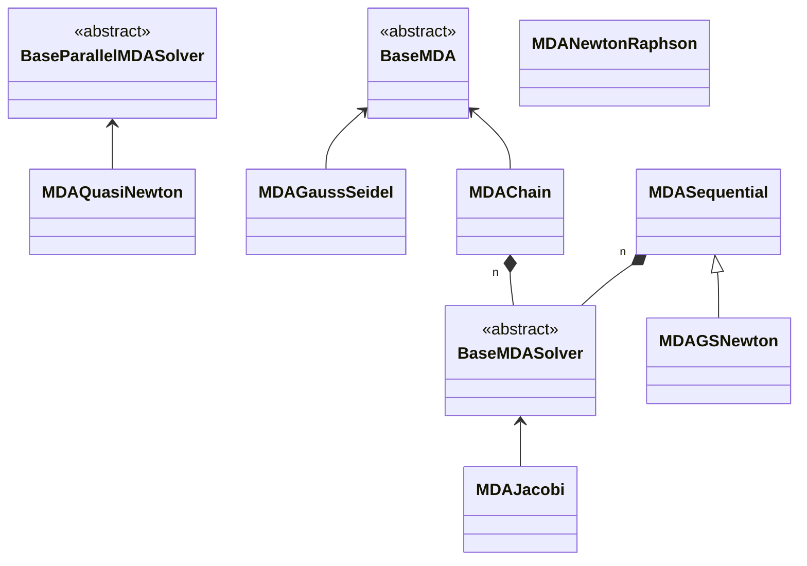

<!--
 Copyright 2021 IRT Saint Exupéry, https://www.irt-saintexupery.com

 This work is licensed under the Creative Commons Attribution-ShareAlike 4.0
 International License. To view a copy of this license, visit
 http://creativecommons.org/licenses/by-sa/4.0/ or send a letter to Creative
 Commons, PO Box 1866, Mountain View, CA 94042, USA.
-->

# Multi Disciplinary Analyses

This section deals with the construction and execution of a Multi Disciplinary Analysis, abbreviated MDA. MDAs are required when dealing with coupled disciplines, that is when inputs of disciplines are outputs of others. Such variables are referred to as the coupling variables.

!!! note
    In GEMSEO, the MDA objects all inherit from [BaseMDA][gemseo.mda.base_mda.BaseMDA].

For a given set of coupled disciplines, the MDA solves for the coupling variables. Mathematically, it reduces to the solution of a non-linear system of equations by block of the form $R(x, y^{\star}) = 0$ where $y^{\star}$ represents the solution for the coupling variables and $x$ the remaining variables. These latter variables *parametrize* the system of equations, i.e. for a fixed $x$, the MDA computes $y^{\star}$ such that $R(x, y^{\star}) = 0$.

There are two main categories of MDA objects in GEMSEO:

- The ones implementing a non-linear solver (inheriting from [BaseMDASolver][gemseo.mda.base_mda_solver.BaseMDASolver],
- The composed MDA, that creates and/or uses inner MDA solvers (more information below).

The following subsections present an overview of these two kinds of available MDAs.

!!! info "See Also"
    The examples about MDA algorithms can be found [here][multidisciplinary-analysis-mda].

## Non-linear solver algorithms

The available non-linear solvers available in GEMSEO can be split in two categories:

- fixed-point methods, that compute fixed points of a coupling function $F$, that is they solve equations of the form $F(y) = y$. The available fixed-point methods available in GEMSEO are the [Jacobi](https://en.wikipedia.org/wiki/Jacobi_method) and [Gauss-Seidel](https://en.wikipedia.org/wiki/Gauss%E2%80%93Seidel_method) methods.

- root finding methods that solves non-linear systems of equations of the form $R(y) = 0$. The root finding algorithms available in GEMSEO are the [Newton-Raphson](https://en.wikipedia.org/wiki/Newton%27s_method) method which uses the (possibly partial) derivatives $\partial R(y) / \partial y$, and several derivative-free variants known as [quasi-Newton](https://en.wikipedia.org/wiki/Quasi-Newton_method) methods.

!!! note
    A fixed-point problem can be reformulated as a root finding problem and reciprocally, since $R(y) = 0 \iff R(y) + y = y \iff F(y) = y$ with $F(y) = R(y) + y$.

To create an MDA, use the [create_mda()][gemseo.create_mda] high-level function, specifying the name of the MDA class and the (coupled) disciplines.

``` python
from gemseo import create_mda, create_discipline
from gemseo.mda.quasi_newton_settings import QuasiNewtonMethod

# Instantiate the coupled Sellar disciplines
disciplines = create_discipline(["Sellar1", "Sellar2"])

# Create an MDA based on fixed-point methods
mda_jacobi = create_mda("MDAJacobi", disciplines)
mda_gauss_seidel = create_mda("MDAGaussSeidel", disciplines)

# Create an MDA based on root finding methods
mda_newton = create_mda("MDANewtonRaphson", disciplines)
mda_quasi_newton = create_mda(
    "MDAQuasiNewton",
    disciplines,
    method=QuasiNewtonMethod.BROYDEN1,
)
```

!!! warning
    Any [Discipline][gemseo.core.discipline.discipline.Discipline] provided to a [BaseMDA][gemseo.mda.base_mda.BaseMDA] with strong couplings **must** define its [default_input_data][gemseo.core.discipline.discipline.Discipline.default_input_data]. Otherwise, the execution will fail.

## Composed MDA methods

The two composed MDAs available in GEMSEO are the [MDASequential][gemseo.mda.sequential_mda.MDASequential] and the [MDAChain][gemseo.mda.mda_chain.MDAChain].

### The sequential MDA

The [MDASequential][gemseo.mda.sequential_mda.MDASequential] implements a generic mechanism to execute sequentially an arbitrary number of inner MDAs. An example is given in the following code:

``` python
mda_1 = create_mda("MDAJacobi", disciplines, max_mda_iter=2)
mda_2 = create_mda("MDANewtonRaphson", disciplines)
mda_sequential = create_mda("MDASequential", disciplines, mda_sequence=[mda1, mda2])
```

In this example, the sequential MDA will perform 2 iterations of the Jacobi's method, before switching to the Newton-Raphson's method. This approach is interesting since the Newton-Raphson's is more expensive, but converges quickly close to the solution. This kind of sequences typically takes advantage of the robustness of fixed-point methods while obtaining an accurate solution thanks to a Newton-Raphson's method.

!!! note
    A specific instance of sequential MDA, namely the [MDAGSNewton][gemseo.mda.gs_newton.MDAGSNewton] is readily available in GEMSEO. It starts with the Gauss-Seidel's method before switching to the Newton-Raphson's method.

### The MDA chain

The [MDAChain][gemseo.mda.mda_chain.MDAChain] implements an advanced graph-based algorithm which allows, when possible, to split the solution of the non-linear system of equations into smaller and weakly coupled ones. The next figure illustrates this process on a 16 coupled disciplines toy problem.


*The 3 resolution phases of a 16 disciplines coupling problem.*

The MDA chain inspects the coupling graph and **automatically** detects strongly coupled disciplines. In the example above, the problem is split into 4 sub-systems, for which an inner MDA implementing a non-linear solver is used. As an example, the following code will create an MDA chain, that will solve the sub-systems using Jacobi's method. The solver for the sub-systems is specified via the `inner_mda_name` setting.

``` python
mda = create_mda("MDAChain", disciplines, inner_mda_name="MDAJacobi")
```

## MDA classes organization

Here is the UML diagram of the MDA classes in GEMSEO.



## Execution of MDAs

The MDA inherits from [Discipline][gemseo.core.discipline.discipline.Discipline] and can thus be executed and linearized as any other discipline.
As mentioned in the previous section, the MDA solves the non-linear system of equations induced by coupled disciplines.
Formally, it can be viewed as a function $\text{MDA}(x, y) = y^{\star}$ that takes $x$ and possibly initial values for the coupling variables $y$ and computes $y^{\star}$ that satisfies $R(x, y^{\star}) = 0$.

Let us take again the [Sellar's problem][sellars-problem] as a toy example, where:

- The design variables are labelled $x_{\text{local}}$ and $x_{\text{shared}}$.
- The coupling variables are labelled $y_1$ and $y_2$.

The following code executes the Jacobi's algorithm on the [Sellar1][gemseo.problems.mdo.sellar.sellar_1.Sellar1] and [Sellar2][gemseo.problems.mdo.sellar.sellar_2.Sellar2] disciplines for specific values of the design variables.

``` python
from numpy import array

# Instantiate the coupled Sellar disciplines
disciplines = create_discipline(["Sellar1", "Sellar2"])

# Create an MDA based on the Jacobi's fixed-point methods
mda_jacobi = create_mda("MDAJacobi", disciplines)

# Execute the MDA for specific design variables
mda_jacobi.execute({"x_local": array([0.5]), "x_shared": array([0.25, 0.25])})
print(
    "Jacobi's method reached termination criterion "
    f"after {mda_jacobi._current_iter} iterations: "
    f"normalized residual norm = {mda_jacobi.normed_residual}"
)
```

### Stopping criteria

The MDA solvers convergence can be monitored by two criteria: - The maximum number of iterations, - The tolerance on the normalized residual norm.

These settings can be either specified at MDA creation or updated on the MDA object directly. Here is an example of the Jacobi's method where the tolerance and the maximum number of iterations are provided:

``` python
from gemseo.settings.mda import MDAJacobi_Settings

# Create the settings model
settings = MDAJacobi_Settings(tolerance=1e-6, max_mda_iter=10)

# Create an MDA with specific stopping criteria settings
mda_jacobi = create_mda("MDAJacobi", disciplines, settings_model=settings)

# Execute the MDA with default input data
mda_jacobi.execute()
print(
    "Jacobi's method reached termination criterion "
    f"after {mda_jacobi._current_iter} iterations: "
    f"normalized residual norm = {mda_jacobi.normed_residual}"
)
```

!!! note
    The tolerance is monitored on a relative decrease on the residual norm. Several scaling strategies for the residual are available in GEMSEO. More information [here][gemseo.mda.base_mda.BaseMDA.ResidualScaling]

### Acceleration/relaxation methods

Acceleration and relaxation methods are available for all the MDAs in GEMSEO. The acceleration methods available can be found [here][gemseo.algos.sequence_transformer.acceleration]. For instance the following code applies Gauss-Seidel's method with the [Secant][gemseo.algos.sequence_transformer.acceleration.secant.Secant] acceleration method and an over-relaxation factor of 0.95.

``` python
from gemseo.settings.mda import MDAGaussSeidel_Settings
from gemseo.algos.sequence_transformer.acceleration import AccelerationMethod

# Create the settings model
settings = MDAGaussSeidel_Settings(
    acceleration_method=AccelerationMethod.SECANT,
    over_relaxation_factor=0.95,
)

# Create an MDA with a specific acceleration method and relaxation factor
mda_gauss_seidel = create_mda("MDAGaussSeidel", disciplines, settings_model=settings)

# Execute the MDA with default input data
mda_gauss_seidel.execute()
print(
    "Gauss-Seidel's method reached termination criterion "
    f"after {mda_gauss_seidel._current_iter} iterations: "
    f"normalized residual norm = {mda_gauss_seidel.normed_residual}"
)
```

### Monitor the convergence

The convergence history of the MDA solvers can be accessed via the [BaseMDA.residual_history][gemseo.mda.base_mda.BaseMDA.residual_history] attribute. More conveniently, there is a dedicated method as in the following example:

``` python
mda_gauss_seidel = create_mda("MDAGaussSeidel", disciplines)

mda_gauss_seidel.execute()
mda_gauss_seidel.plot_residual_history(show=True, save=False)
```

## Advanced features

In addition with the standard MDA functionnalities, GEMSEO provides more advanced features that can improve performances in certain situations.

### Parallelization

The following MDA algorithms can be parallelized:

- [MDAJacobi][gemseo.mda.jacobi.MDAJacobi],
- [MDAQuasiNewton][gemseo.mda.quasi_newton.MDAQuasiNewton],
- [MDANewtonRaphson][gemseo.mda.newton_raphson.MDANewtonRaphson],
- [MDAChain][gemseo.mda.mda_chain.MDAChain].

When using parallelization, it is possible to set the number of processes/threads on which the execution will be splitted, and whether to use threads or processes. By default, GEMSEO uses threads and the number of threads is the number of CPUs available on the computer the code is run on. The following code shows an example of settings related to this feature:

``` python
# Create the settings model
settings = MDAJacobi_Settings(use_threading=False, n_processes=4)

# Create MDA with specific parallelization settings
mda_jacobi = create_mda("MDAJacobi", disciplines, settings_model=settings)
```

### Re-use coupling structures

MDAs are created from a set of coupled disciplines. To determine the coupling variables, a [CouplingStructure][gemseo.core.coupling_structure.CouplingStructure] object is created which uses graph algorithms to analyse the coupling strcture of the provided disciplines. This process is made once at creation of the MDA, and **only depends on the set of disciplines**. The graph analysis can be expensive if there is a large number of disciplines and/or plenty of inputs/outputs variables.

Since the coupling structure only depends on the coupled disciplines, it can be computed independently, stored, and then provided to the MDA when needed.

``` python
from gemseo.core.coupling_structure import CouplingStructure

# Create the coupling structure on the disciplines
coupling_structure = CouplingStructure(disciplines)

# Create the settings model
settings = MDAGaussSeidel_Settings(coupling_structure=coupling_structure)

# Create an MDA using the already available coupling structure
mda_gauss_seidel = create_mda("MDAGaussSeidel", disciplines, settings_model=settings)
```
