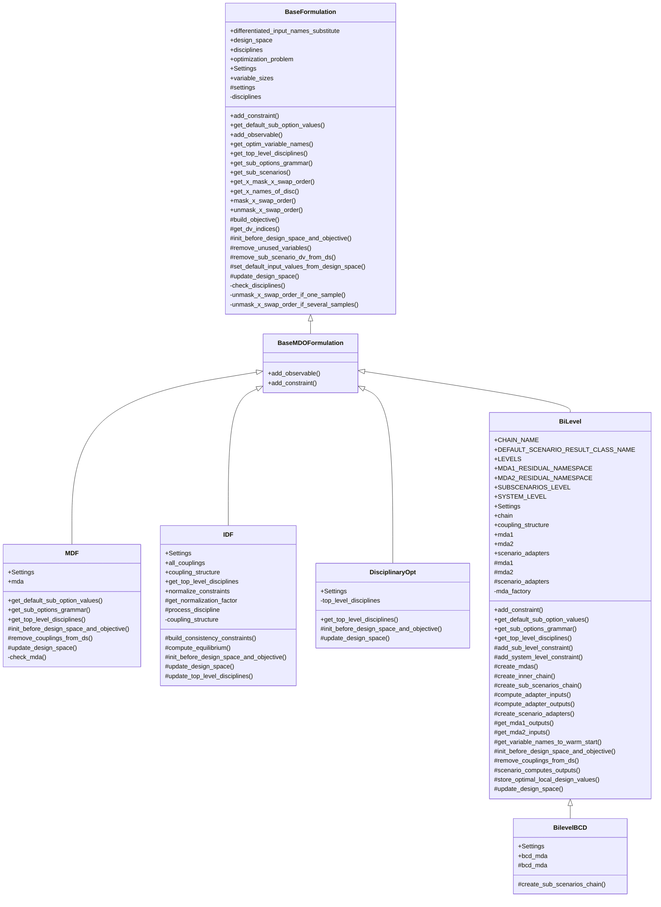

<!--
 Copyright 2021 IRT Saint Exupéry, https://www.irt-saintexupery.com

 This work is licensed under the Creative Commons Attribution-ShareAlike 4.0
 International License. To view a copy of this license, visit
 http://creativecommons.org/licenses/by-sa/4.0/ or send a letter to Creative
 Commons, PO Box 1866, Mountain View, CA 94042, USA.
-->

<!--
Contributors:
         :author: Charlie Vanaret, Francois Gallard, Rémi Lafage
-->

# MDO formulations

In this section we describe the MDO formulations features of GEMSEO.

## Available formulations in GEMSEO

To see which formulations are available in your GEMSEO version, you may have a look in the sub-package [gemseo.formulations][gemseo.formulations].
Another possibility is to use the high-level function [get_available_formulations()][gemseo.get_available_formulations] to list them:

``` python
from gemseo import get_available_formulations

get_available_formulations()
```

Output:

``` python
['BiLevel', 'BiLevelBCD', 'DisciplinaryOpt', 'IDF', 'MDF']
```

These implement the classical formulations:

- [MDF (Multi-Disciplinary Feasible)][the-mdf-formulation];
- [IDF (Individual Discipline Feasible)][the-idf-formulation];
- a simple disciplinary optimization formulation for a weakly coupled problem;
- a particular [bi-level][the-bi-level-formulation] formulation from IRT Saint Exupéry;
- another bi-level formulation, denoted [bi-level BCD][the-bi-level-bcd-formulation] formulation,
  from IRT Saint Exupéry that enhances the previous one with a
  Block Coordinate Descent (BCD) algorithm.

In the following, general concepts about the formulations are given.
The [MDF][the-mdf-formulation] and [IDF][the-idf-formulation] text is integrally taken from the paper[@Vanaret2017].

To see how to set up practical test cases with such formulations,
please see these [Sellar][a-from-scratch-example-on-the-sellar-problem] and [Sobieski][application-sobieskis-super-sonic-business-jet-mdo] examples.

!!! tip
      For a review of MDO formulations, see Martins and Lambe [@MartinsSurvey].

We use the following notations:

- $N$ is the number of disciplines,
- $x=(x_1,x_2,\ldots,x_N)$ are the local design variables,
- $z$ are the shared design variables,
- $y=(y_1,y_2,\ldots,y_N)=\Psi(x, z)$ are the coupling variables,
- $f$ is the objective,
- $g$ are the constraints.

## MDF { #the-mdf-formulation }

MDF is an architecture that guarantees an equilibrium between all
disciplines at each iterate $(x, z)$ of the optimization process.
Consequently, should the optimization process be prematurely
interrupted, the best known solution has a physical meaning. MDF generates
the smallest possible optimization problem, in which the coupling
variables are removed from the set of optimization variables and the
residuals removed from the set of constraints:

$$
\begin{aligned}
& \underset{x,z}{\text{min}}    & & f(x, z, y(x, z)) \\
& \text{subject to}             & & g(x, z, y(x, z)) \le 0
\end{aligned}
$$

The coupling variables $y(x, z)$ are computed at equilibrium via
an MDA. It amounts to solving a system of (possibly nonlinear) equations
using fixed-point methods (Gauss-Seidel, Jacobi) or root-finding methods
(Newton-Raphson, quasi-Newton). A prerequisite for invoking is the
existence of an equilibrium for any values of the design variables
$(x, z)$ encountered during the optimization process.


Gradient-based optimization algorithms require the computation of the
total derivatives of $\phi(x, z, y(x, z))$, where
$\phi \in \{f, g\}$ and $v \in \{x,
z\}$.

For details on the MDAs,
see [this page][multi-disciplinary-analyses].
For details on coupled derivatives and gradients computation,
see [this page][coupled-derivatives-and-gradients-computation].

An example of an MDO study using an MDF formulation can be found in [this example][a-from-scratch-example-on-the-sellar-problem].

!!! warning
      Any [Discipline][gemseo.core.discipline.discipline.Discipline] that will be placed inside an [MDF][gemseo.formulations.mdf.MDF] formulation with strong couplings **must**
      define its default inputs. Otherwise, the execution will fail.

## IDF { #the-idf-formulation }

IDF stands for individual discipline feasible.
This MDO formulation expresses the MDO problem as

$$\begin{aligned}
& \underset{x,z,y^t}{\text{min}} & & f(x, z, y^t) \\
& \text{subject to}     & & g(x, z, y^t) \le 0 \\
&                       & & h(x, z, y^t) = 0 \\
&                       & & y_i(x_i, z, y^t_{j \neq i}) - y_i^t = 0,
                              \quad \forall i \in \{1,\ldots, N\}
\end{aligned}
$$

where $y^t=(y_1^t,y_2^t,\ldots,y_N^t)$ are additional optimization variables, called *targets* or *coupling targets*,
used as input coupling variables of the disciplines.
The additional constraints $y_i(x_i, z, y^t_{j \neq i}) - y_i^t = 0, \forall i \in \{1, \ldots, N\}$, called *consistency* constraints,
ensure that the output coupling variables computed by the disciplines $y$ coincide with the targets.

The use of coupling targets allows the disciplines to be run in a decoupled way
while the use of consistency constraints guarantees a multidisciplinary feasible solution at convergence of the optimizer.
Thus,
the iterations are less costly than those of MDF, as they do not use an MDA algorithm,
but IF does not allow early stopping with the guarantee of a multidisciplinary feasible solution, unlike MDF.


Note that the targets can include either all the couplings or the strong couplings only.
If all couplings,
then all disciplines are executed in parallel,
and all couplings (weak and strong) are set as target variables in the design space.
This maximizes the exploitation of the parallelism but leads to a larger design space,
so usually more iterations by the optimizer.


If the strong couplings only,
then the coupling graph is analyzed
and the disciplines are chained in sequence and in parallel to solve all weak couplings.
In this case,
the size of the optimization problem is reduced,
so usually leads to less iterations.
The best option depends on the number of strong vs weak couplings,
the availability of gradients,
the availability of CPUs versus the number of disciplines,
so it is very context dependant.


## Bi-level { #the-bi-level-formulation }

Bi-level formulations are a family of MDO formulations that involve multiple optimization problems to
be solved to obtain the solution of the MDO problem.

In many of them, and in particular in the formulations derived from BLISS,
the separation of the optimization problems is made on the design variables. The
design variables shared by multiple disciplines are put in a so-called system level optimization problem.
In so-called disciplinary
optimization problems, only the design variables that have a direct impact on one discipline are used.
Then, the coupling variables may be solved by a [MDA][multi-disciplinary-analyses], as in formulations derived from MDF
(BLISS, ASO or CSSO),
or by using consistency constraints or a penalty function, like in IDF-like formulations
(CO or ATC).

The next figure shows the decomposition of the Bi-level MDO formulation implemented in GEMSEO
with two MDAs,
the parallel sub-optimizations and a main optimization (system level) on the shared variables.
It is an MDF-based approach, derived from the BLISS 98 formulation and variants from ONERA[@Blondeau2012].
This formulation was invented in the MDA-MDO project at
IRT Saint Exupéry[@gazaix2017towards][@Gazaix2019] and also used in the
R-EVOL project[@gazaix2024industrialization].


This block decomposition is motivated by several purposes. First, this separation aligns
with the industrial needs of work repartition between domains,
which matches the decomposition in terms of disciplines.
It allows for greater flexibility in the use of specific approaches (algorithms) for solving
disciplinary optimizations, also dealing with less design variables at the same time. Secondly,
as the full coupled derivatives may not be available, the use of a gradient-based
approach with all variables in the loop may not be affordable.

In the current Bi-level formulation, the objective function is minimized block by block, in parallel,
with each block $i$ minimizing its own variables $x_i$
and handling its own constraints $g_i$.
Sometimes, if it is not straightforward to optimize the objective function $f$
in the sub-problem $i$, another function $f_i$ can be considered as long as its decay
is consistent with the decay (monotonic decrease) of the overall objective function $f$.
The decomposition is such that the sub-problems constraints $g_i$ are assumed
to depend on other block variables $x_{\neq i}$ only through the couplings.
These couplings are solved by two MDAs: one before the sub-optimizations in order
to compute equilibrium values for each block,
and the second one after the sub-optimizations in order to recompute the equilibrium
for system level functions.
The sub-optimization blocks do not exchange any information when they are solved in parallel,
which means that the synchronization is ensured by the two MDAs and the system iterations
which warm start each block with the previous optimal values of local variables.
If the effect of one block variables $x_i$ on another block $j$ is too significant,
it means that the optimal solution $x^*$ is sensitive to the initial guess $x$,
and therefore that for same values of shared variables $z$,
different solutions $x^*$ can be obtained. As a consequence, the synchronization mechanism
may not be sufficient to solve accurately the lower problem and the system level algorithm may not converge
to the right solution. In such a situation, an enhancement is proposed
with the [bi-level BCD formulation][coupled-derivatives-and-gradients-computation]
which extends the range of problems that can be solved with Bi-level approaches.

An example of the Bi-level formulation implemented on the Sobieski SSBJ test case
can be found in [this example][bilevel-based-mdo-on-the-sobieski-ssbj-test-case].

!!! warning
      Any [Discipline][gemseo.core.discipline.discipline.Discipline] that will be placed inside a [BiLevel][gemseo.formulations.bilevel.BiLevel]
      formulation with strong couplings **must** define its default inputs.
      Otherwise, the execution will fail.

## Bi-level Block Coordinate Descent (Bi-level BCD) { #the-bi-level-bcd-formulation }

The Bi-level BCD formulation adds more robustness and stability with respect to the
previous [bi-level formulation][the-bi-level-formulation], solving more accurately the inner sub-problem.
The decomposition discussed in the previous [bi-level formulation][the-bi-level-formulation] section remains the same
and motivated by the same considerations.
The next figure shows the process corresponding to the Bi-level BCD implemented in GEMSEO.
This formulation was invented in the R-EVOL project at
IRT Saint Exupéry[@David2024][@david-hal-04758286].


Here, it can be seen that the lower problem is solved by a Block Coordinate Descent method (BCD),
also known as the Block Gauss-Seidel method (BGS),
which means that each block,
consisting of a disciplinary optimization,
is sequentially optimized
within an iterative loop until convergence. As a consequence, each block $i$ is updated
at every BCD iteration with $x_{\neq i}^*$ until a fixed point $x^*$ is found,
regardless the initial guess $x$, which drastically reduces the discrepancy of lower level
solutions with respect to same values of shared variables.

In David et al. [@david-hal-04758286], several variants are discussed,
regarding the way how the couplings are solved:

- when all the couplings are solved by running MDAs within each sub-optimization,
  the formulation is referred to as the Bi-level BCD-MDF;
- when each sub-optimization no longer solves the whole coupling vector but only
  its own block of coupling variables, similarly to the design vector $x_i$,
  the formulation is referred to as the Bi-level BCD-WK (stands for weak BCD).
  In this case, both the design variables and the coupling variables are exchanged
  through the BCD loop and updated at each sub-optimization.
  This approach can be considered either when running MDAs in each sub-optimization is
  too time consuming, or when it is simply not accessible due to tools limitation
  that do not give access to all coupling functions.

The Bi-level BCD process schematized in the above image corresponds to
the Bi-level BCD-MDF version where all the couplings are solved within each block,
which is explicitly denoted by the dependence of $f$ and $g_i$ to
$\Psi(x, z)$, meaning that the couplings are recomputed and not fixed
during sub-optimization conversely to the previous [bi-level formulation][the-bi-level-formulation].
While MDA 1 and 2 may not be theoretically necessary,
in practice they allow to respectively compute more relevant initial
coupling values for the BCD loop and objective function and constraints values for the system level optimizers
when the BCD loop is not fully or not enough converged.

An example of the Bi-level BCD-MDF formulation implemented on the Sobieski SSBJ test case
can be found in [this page][bi-level-bcd-based-mdo-on-the-sobieski-ssbj-test-case].

## XDSM visualization

GEMSEO allows to visualize a given MDO scenario/formulation as an XDSM diagram[@Lambe2012] in a web browser.
The figure below shows an example of such visualization.


The rendering is handled by the visualization library [XDSMjs](https://github.com/whatsopt/XDSMjs).
GEMSEO provides a utility class [XDSMizer][gemseo.utils.xdsm.xdsmizer.XDSMizer]
to export the given MDO scenario as a suitable input json file for this visualization library.

### Features

XDSM visualization shows:

- dataflow between disciplines (connections between disciplines as list of variables)
- optimization problem display (click on optimizer box)
- workflow animation (top-left control buttons trigger either automatic or step-by-step mode)

Those features are illustrated by the animated gif below.


### Usage

Then within your Python script, given your `scenario` object, you can generate the XDSM json file
with the following code:

``` python
scenario.xdsmize(show_html=True)
```

If `save_html` (default `True`), will generate a self contained HTML file, that can be automatically open using the option `show_html=True`.
If `save_json` is True, it will generate a [XDSMjs](https://github.com/whatsopt/XDSMjs) input file :ref:`xdsm` (legacy behavior).
If `save_pdf=True` (default `False`), a LaTex PDF is generated.

You should observe the XDSM diagram related to your MDO scenario.

## Class diagram


