<!--
 Copyright 2021 IRT Saint Exupéry, https://www.irt-saintexupery.com

 This work is licensed under the Creative Commons Attribution-ShareAlike 4.0
 International License. To view a copy of this license, visit
 http://creativecommons.org/licenses/by-sa/4.0/ or send a letter to Creative
 Commons, PO Box 1866, Mountain View, CA 94042, USA.
-->

<!--
Contributors:
         :author: Francois Gallard
-->

# Optimization and DOE framework

In this section we describe GEMSEO's optimization and DOE framework.

The standard way to use GEMSEO is through an [MDOScenario][gemseo.scenario.mdo.MDOScenario], which
automatically creates an [OptimizationProblem][gemseo.optimization.problem.OptimizationProblem] from an [MDO formulation][concept-mdo-formulations] and a set of
[Discipline][gemseo.core.discipline.discipline.Discipline].

However, one may be interested in directly creating an [OptimizationProblem][gemseo.optimization.problem.OptimizationProblem] using the class [OptimizationProblem][gemseo.optimization.problem.OptimizationProblem],
which can be solved using an optimization algorithm or sampled with a DOE algorithm.

!!! warning
      [MDO formulation][concept-mdo-formulations] and optimization problem developers should also understand this part of GEMSEO.

## Setting up an [OptimizationProblem][gemseo.optimization.problem.OptimizationProblem]

The [OptimizationProblem][gemseo.optimization.problem.OptimizationProblem] class is composed of at least a
[DesignSpace][gemseo.space.design.DesignSpace] which describes the design variables:

``` python
from gemseo.space import DesignSpace
design_space = DesignSpace()
design_space.add_real_variable("x", lower_bound=-2.0, upper_bound=2.0, value=-0.5)
```

and an objective function, of type [ArrayFunction][gemseo.core.function.array_function.ArrayFunction]. The [ArrayFunction][gemseo.core.function.array_function.ArrayFunction] is callable and requires at least
a function pointer to be instantiated. It supports expressions and the +, -, \ * operators:

``` python
from gemseo.core.function.array_function import ArrayFunction
from numpy import cos
from numpy import exp
from numpy import sin

f_1 = ArrayFunction(sin, name="f_1", jac=cos, expr="sin(x)")
f_2 = ArrayFunction(exp, name="f_2", jac=exp, expr="exp(x)")
f_1_sub_f_2 = f_1 - f_2
```

From this [DesignSpace][gemseo.space.design.DesignSpace],
an [OptimizationProblem][gemseo.optimization.problem.OptimizationProblem] is built:

``` python
from gemseo.optimization import OptimizationProblem

problem = OptimizationProblem(design_space)
```

To set the objective [ArrayFunction][gemseo.core.function.array_function.ArrayFunction],
the attribute [objective][gemseo.optimization.problem.OptimizationProblem.objective] of the [OptimizationProblem][gemseo.optimization.problem.OptimizationProblem]
must be set with the objective function pointer:

``` python
problem.objective = f_1_sub_f_2
```

Similarly the [constraints][gemseo.optimization.problem.OptimizationProblem.constraints] attribute must be set with a list of inequality or equality constraints.
The [f_type][gemseo.core.function.array_function.ArrayFunction.f_type] attribute of [ArrayFunction][gemseo.core.function.array_function.ArrayFunction] shall be set to `"eq"` or `"ineq"` to declare the type of constraint to equality or inequality.

!!! warning
      **All inequality constraints must be negative by convention**, whatever the optimization algorithm used to solve the problem.

## Solving the problem by optimization

Once the optimization problem created, it can be solved using one of the available
optimization algorithms from the [OptimizationLibraryFactory][gemseo.optimization.factory.OptimizationLibraryFactory]
singleton `optimization_library_factory`,
by means of the method [BaseAlgorithmFactory.execute()][gemseo.core.algorithm.base_algorithm_factory.BaseAlgorithmFactory.execute]
whose mandatory arguments are the [OptimizationProblem][gemseo.optimization.problem.OptimizationProblem]
and a settings object dedicated to the optimization algorithm. For example, in the case of the [L-BFGS-B algorithm](https://en.wikipedia.org/wiki/Limited-memory_BFGS)
with normalized design space, we have:

``` python
from gemseo.optimization import L_BFGS_B_Settings
from gemseo.optimization.factory import optimization_library_factory

opt = optimization_library_factory.execute(
    problem, L_BFGS_B_Settings(normalize_design_space=True)
)
print(f"Optimum = {opt.f_opt}")
```

Note that the [L-BFGS-B algorithm](https://en.wikipedia.org/wiki/Limited-memory_BFGS) is implemented in the external
library [SciPy](https://scipy.org/)
and interfaced with GEMSEO through the class [ScipyOpt][gemseo.optimization.scipy_local.scipy_local.ScipyOpt].

The list of available algorithms depend on the local setup of GEMSEO, and the installed
optimization libraries. It can be obtained using :

``` python
algo_list = optimization_library_factory.algorithms
print(f"Available algorithms: {algo_list}")
```

The optimization history can be saved to the disk for further analysis,
without having to re-execute the optimization.
For that, we use the method [to_hdf()][gemseo.optimization.problem.OptimizationProblem.to_hdf]:

``` python
problem.to_hdf("simple_opt.hdf5")
```

## Solving the problem by DOE

DOE algorithms can also be used to sample the design space and observe the
value of the objective and constraints, using the same
[BaseAlgorithmFactory.execute()][gemseo.core.algorithm.base_algorithm_factory.BaseAlgorithmFactory.execute]
method, from the [DOELibraryFactory][gemseo.doe.factory.DOELibraryFactory]
singleton `doe_library_factory`, with a settings object dedicated to the DOE
algorithm:

``` python
from gemseo.doe import PYDOE_LHS_Settings
from gemseo.doe.factory import doe_library_factory

opt = doe_library_factory.execute(
    problem, PYDOE_LHS_Settings(n_samples=10, normalize_design_space=True)
)
```

## Results analysis

The optimization history can be plotted using one of the post-processing tools,
see [this page][how-to-post-process].

``` python
from gemseo import execute_post
from gemseo.post import OptHistoryView_Settings

execute_post(problem, OptHistoryView_Settings(save=True, file_path="simple_opt"))

# Also works from disk
execute_post(
    "my_optim.hdf5", OptHistoryView_Settings(save=True, file_path="opt_view_from_disk")
)
```

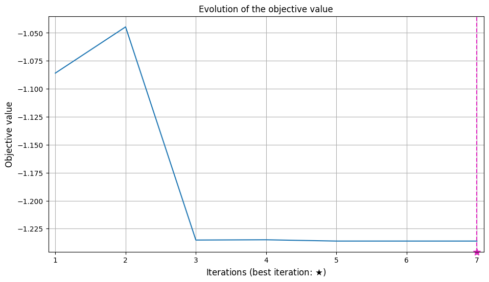

## DOE algorithms

GEMSEO is interfaced with two packages that provide DOE algorithms:
[PyDOE](https://pydoe.github.io/pydoe/), and
[OpenTURNS](https://openturns.github.io/www/).
To list the available DOE algorithms in the current GEMSEO configuration, use
[get_available_doe_algorithms()][gemseo.get_available_doe_algorithms].

The set of plots below shows plots using various available algorithms.

- Full factorial DOE from pyDOE
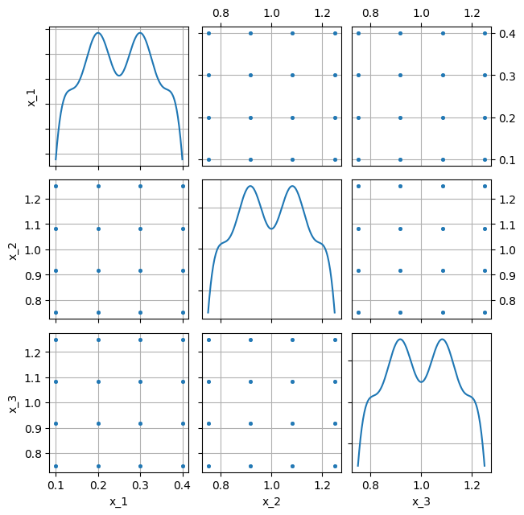

- Box-Behnken DOE from pyDO
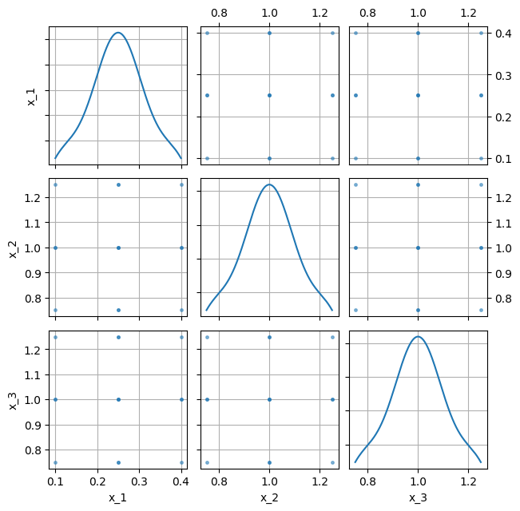

- LHS DOE from pyDOE
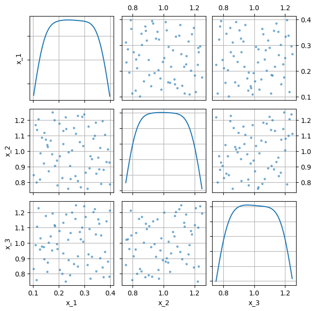

- Axial DOE from OpenTURNS
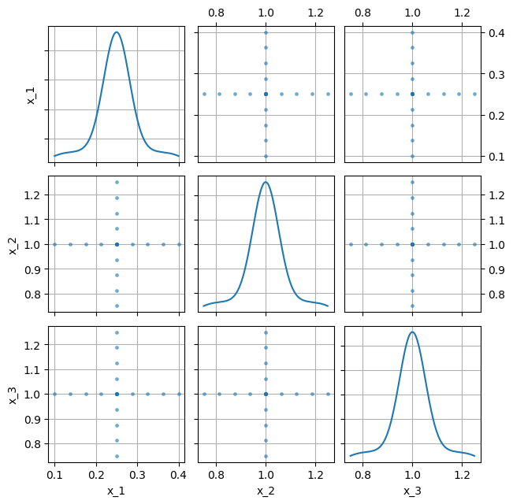

- Composite DOE from OpenTURNS
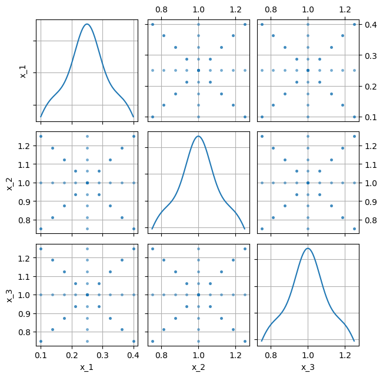

- Full Factorial DOE from OpenTURNS
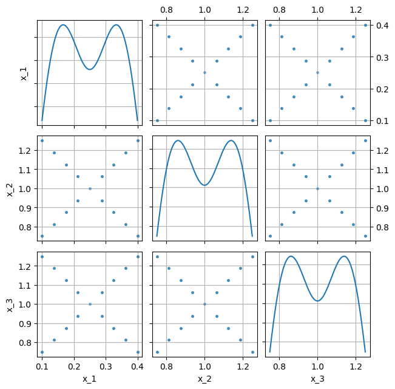

- Faure DOE from OpenTURNS
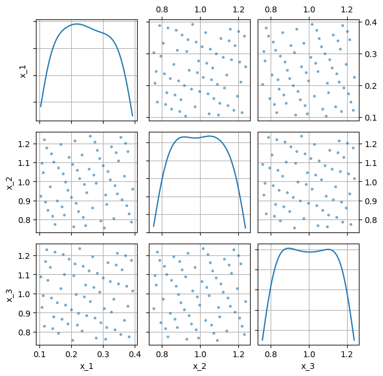

- Halton DOE from OpenTURNS
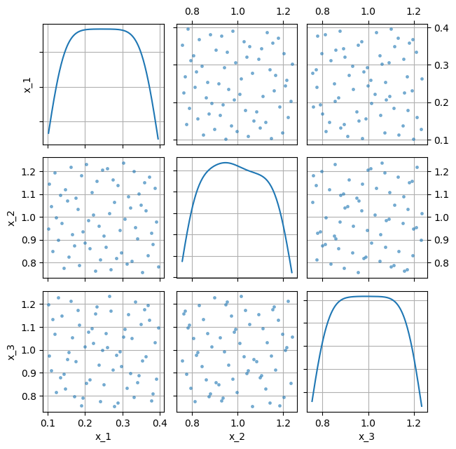

- Haselgrove DOE from OpenTURNS
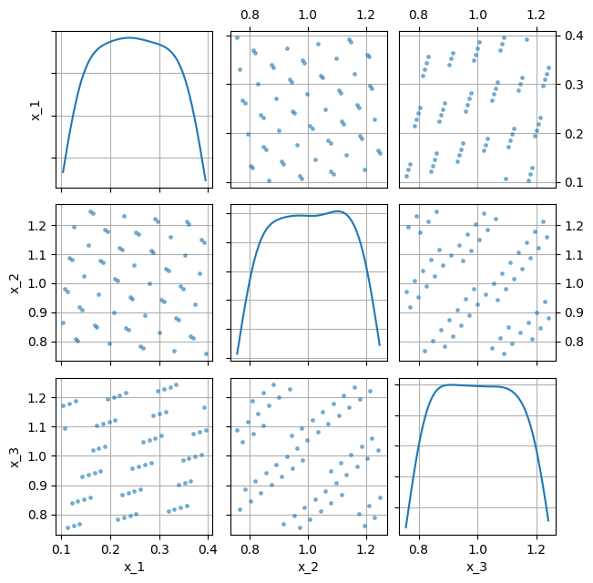

- Sobol DOE from OpenTURNS
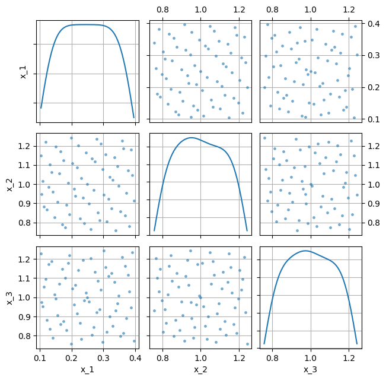

- Monte-Carlo DOE from OpenTURNS


- LHSC DOE from OpenTURNS
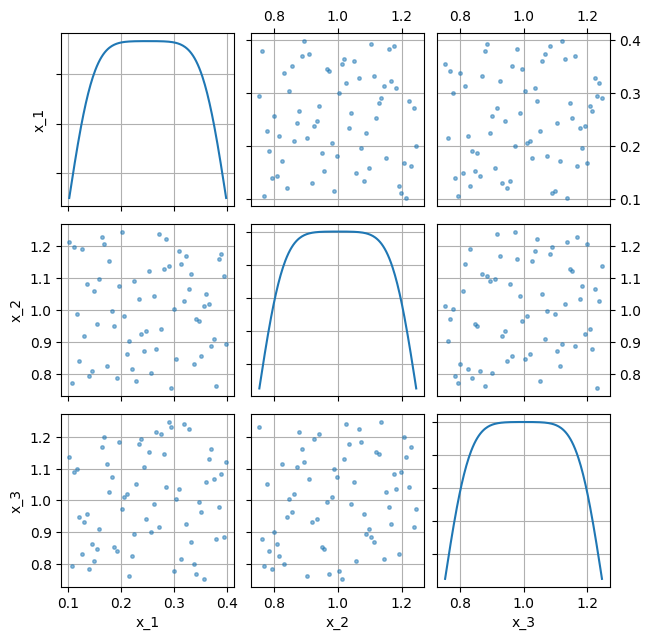

- LHS DOE from OpenTURNS
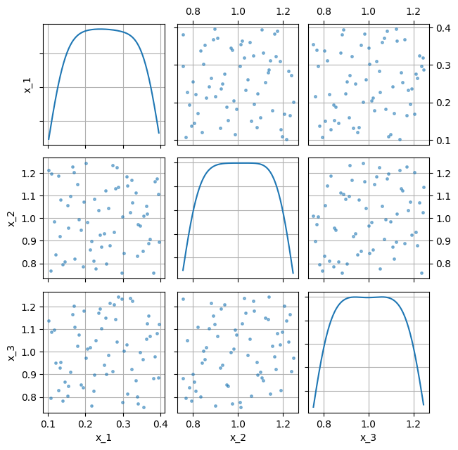

- Random DOE from OpenTURNS
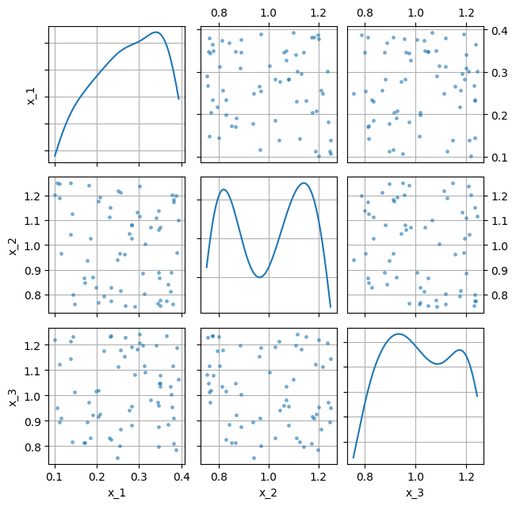
