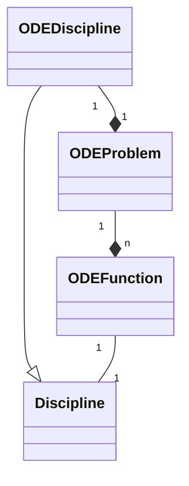

<!--
 Copyright 2021 IRT Saint Exupéry, https://www.irt-saintexupery.com

 This work is licensed under the Creative Commons Attribution-ShareAlike 4.0
 International License. To view a copy of this license, visit
 http://creativecommons.org/licenses/by-sa/4.0/ or send a letter to Creative
 Commons, PO Box 1866, Mountain View, CA 94042, USA.
-->

<!--
Contributors:
        :author: Isabelle Santos
        :author: Giulio Gargantini
-->

# The class ODEDiscipline

An [ODEDiscipline][gemseo.disciplines.ode.ode_discipline.ODEDiscipline] is the subclass of [Discipline][gemseo.core.discipline.discipline.Discipline] wrapping an [ODEProblem][gemseo.algos.ode.ode_problem.ODEProblem].

The function $f(t, y)$ defining the right-hand side of the ODE and the termination functions are encoded by
instances of [Discipline][gemseo.core.discipline.discipline.Discipline] with suitable inputs and outputs, allowing to couple different instances of
[ODEDiscipline][gemseo.disciplines.ode.ode_discipline.ODEDiscipline] in an [MDA][multi-disciplinary-analyses].

## Inputs and outputs

An instance of [ODEDiscipline][gemseo.disciplines.ode.ode_discipline.ODEDiscipline] takes as inputs:

* the initial value of the *time* variable,
* the initial value of the *state* variables,
* the value of eventual *design variables*.

Without further specifications, the outputs of [ODEDiscipline][gemseo.disciplines.ode.ode_discipline.ODEDiscipline] are the values of the state variables at the end
of the time interval (or, if *termination events* are present, at the realization of the first event).
By default, the name of the output variable corresponding to the final value of the state variable `"y"` is `"y_final"`.

If the boolean field `output_trajectory` of the [ODEDiscipline][gemseo.disciplines.ode.ode_discipline.ODEDiscipline] is set to `True`, the discipline provides,
as additional outputs, the value of the state variables at the instants listed in the array `times`.
By default, the output representing the trajectory of the state variable `"y"` is named `"y"`.

## Initialization

The instantiation of an [ODEDiscipline][gemseo.disciplines.ode.ode_discipline.ODEDiscipline] requires at least two parameters: `discipline`, representing the
function $f(t, y)$, and `times`, representing the time interval of integration of the ODE.
Further parameters can be specified at the time of the instantiation of the [ODEDiscipline][gemseo.disciplines.ode.ode_discipline.ODEDiscipline].

## Coupling

Like for other types of discipline, it is possible to couple instances of [ODEDiscipline][gemseo.disciplines.ode.ode_discipline.ODEDiscipline] to other disciplines
in an [MDA][multi-disciplinary-analyses].
Coupled instances of [ODEDiscipline][gemseo.disciplines.ode.ode_discipline.ODEDiscipline] can be used to model the dynamics of coupled physical
systems.

### Coupled instances of ODEDiscipline

A first approach consists in modeling the different entities of the system by different instances of
[ODEDiscipline][gemseo.disciplines.ode.ode_discipline.ODEDiscipline] with the parameter `return_trajectories` set to `True`.
The coupling between the disciplines is done by passing the trajectories computed by each [ODEDiscipline][gemseo.disciplines.ode.ode_discipline.ODEDiscipline] as
inputs of the other [ODEDiscipline][gemseo.disciplines.ode.ode_discipline.ODEDiscipline] in the form of *design variables*.

### Coupled dynamic inside an ODEDiscipline

A different approach consists in defining a single [ODEDiscipline][gemseo.disciplines.ode.ode_discipline.ODEDiscipline] for the entire system, having as state
variables the collection of all the variables representing each component of the coupled system, and as dynamic the
result of an *MDA* on all disciplines describing the dynamics of the components of the system.
variables the collection of all the variables representing each component of the coupled system.
The dynamic of such [ODEDiscipline][gemseo.disciplines.ode.ode_discipline.ODEDiscipline] is the result of an [MDA][multi-disciplinary-analyses] on all disciplines describing
the dynamics of the components of the system.

### ODE Classes organization

Here is the UML diagram of the classes in GEMSEO for the solution of ODEs.

## Examples

See the examples about [ODEDiscipline][gemseo.disciplines.ode.ode_discipline.ODEDiscipline] here:
[examples about ODEDiscipline][ordinary-differential-equations].
