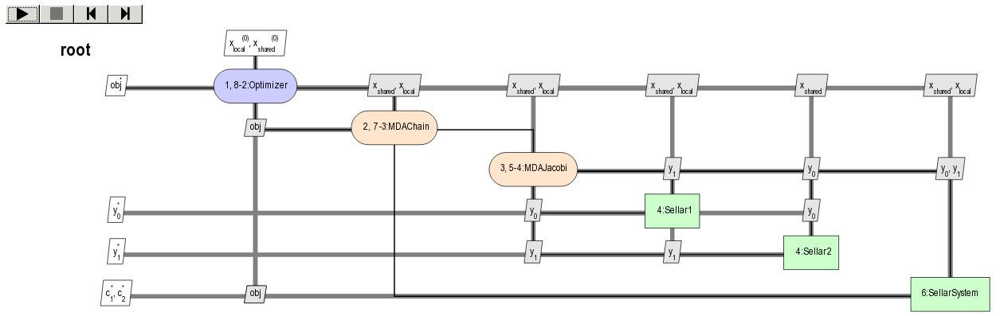

<!--
 Copyright 2021 IRT Saint Exupéry, https://www.irt-saintexupery.com

 This work is licensed under the Creative Commons Attribution-ShareAlike 4.0
 International License. To view a copy of this license, visit
 http://creativecommons.org/licenses/by-sa/4.0/ or send a letter to Creative
 Commons, PO Box 1866, Mountain View, CA 94042, USA.
-->

<!--
Contributors:
         :author: Matthias De Lozzo
-->

# How to deal with scenarios

## How is a scenario defined?

### What is a scenario?

A scenario is an interface that:

- creates an optimization or sampling problem,
- from a set of disciplines and a multidisciplinary formulation based on a design space and on an objective name,
- executes it from an optimization or sampling algorithm with mandatory arguments and options and
- post-process it.

### How does a scenario is implemented in GEMSEO?

Programmatically speaking, scenarios are implemented in GEMSEO through the [MDOScenario][gemseo.scenarios.mdo.MDOScenario] class.
They can be executed using
either optimizers in the case of optimization processes
or DOE algorithms in the case of trade-off studies and sampling processes.

An [MDOScenario][gemseo.scenarios.mdo.MDOScenario] is defined by four main elements:

- the `disciplines` attribute: the list of [Discipline][gemseo.core.discipline.discipline.Discipline],
- the `formulation` attribute: the multidisciplinary formulation based on [DesignSpace][gemseo.algos.design_space.DesignSpace],
- the `optimization_result` attribute: the optimization results,
- the `post_factory` attribute: the post-processing set of methods.

### What are the API functions in GEMSEO?

After the instantiation of the different [Discipline][gemseo.core.discipline.discipline.Discipline],
an instance of this scenario can be created from the [create_scenario()][gemseo.create_scenario] high-level function whose arguments are:

- `disciplines`: the `list` of instantiated [Discipline][gemseo.core.discipline.discipline.Discipline],
- `objective_name`: the objective name (`str`)
- `design_space`: the instantiated [DesignSpace][gemseo.algos.design_space.DesignSpace],
- `name=None`: the optional name of the scenario (`str`),
- `maximize_objective=False`: the choice between maximizing or minimizing the objective function (`bool`),
- `formulation_settings_model`: the formulation settings as a Pydantic model (`BaseFormulationSettings`)
- `**formulation_settings`: settings passed to the multidisciplinary formulation, in case no `formulation_settings_model` is specified. In this case the `formulation_name` (`str`) is mandatory.

The types of scenarios already implemented in GEMSEO can be obtained by means of the [get_available_scenario_types][gemseo.get_available_scenario_types] high-level function:

``` python

from gemseo import get_available_scenario_types

get_available_scenario_types()
> ["MDO", "DOE"]
```

## How to create a scenario?

We can easily create an [MDOScenario][gemseo.scenarios.mdo.MDOScenario]
from the [create_scenario()][gemseo.create_scenario] high-level function.

### Instantiate the disciplines

For that, we first instantiate the different [Discipline][gemseo.core.discipline.discipline.Discipline], e.g.

``` python
from gemseo import create_discipline

disciplines = create_discipline(['Sellar1', 'Sellar2', 'SellarSystem'])
```

### Define the design space

Then, we define the design space,
either by instantiating a [DesignSpace][gemseo.algos.design_space.DesignSpace],

``` python
from gemseo.problems.mdo.sellar.sellar_design_space import SellarDesignSpace

design_space = SellarDesignSpace()
```

or by means of the file path of the design space:

``` python
design_space = 'path_to_sellar_design_space.csv'
```

### Define the objective function

The objective function should be an output taken among the output list of the different [Discipline][gemseo.core.discipline.discipline.Discipline], e.g.

``` python
objective_name = 'obj'
```

### Define the multidisciplinary formulation and its settings

From the design space and the objective name,
the [MDOScenario][gemseo.scenarios.mdo.MDOScenario] automatically builds an multidisciplinary formulation
corresponding to a multidisciplinary formulation name specified by the user, e.g.

``` python
formulation_settings_model = MDF_Settings()
```

or:

``` python
formulation_name = 'MDF'
```

The list of the different available formulations can be obtained
by means of the [get_available_formulations()][gemseo.get_available_formulations] high-level function:

``` python
from gemseo import get_available_formulations

get_available_formulations()
> ['BiLevel', 'IDF', 'MDF', 'DisciplinaryOpt']
```

!!! note
      `argument=value` formulation options can also be passed
      to the [create_scenario()][gemseo.create_scenario] high-level function.
      Available options for the different formulations are presented
      in [this page][available-mdo-formulations].

### Choose the type of scenario

Just before the [MDOScenario][gemseo.scenarios.mdo.MDOScenario] instantiation,
the type of scenario must be chosen, e.g.

``` python
scenario_type = 'MDO'
```

Remind that the different types of scenario can be obtained
by means of the [get_available_scenario_types()][gemseo.get_available_scenario_types] high-level function:

``` python
from gemseo import get_available_scenario_types

get_available_scenario_types()
> ['MDO', 'DOE']
```

### Instantiate the scenario

From these different elements, we can instantiate the [MDOScenario][gemseo.scenarios.mdo.MDOScenario]
by means of the [create_scenario()][gemseo.create_scenario] high-level function:

``` python
from gemseo import create_scenario

scenario = create_scenario(
      disciplines=disciplines,
      objective_name=objective_name,
      design_space=design_space,
      formulation_settings_model=formulation_settings_model,
)
```

or:

``` python
scenario = create_scenario(
      disciplines=disciplines,
      objective_name=objective_name,
      design_space=design_space,
      formulation_name=formulation_name,
)
```

### Get the names of design variables

We can use the [get_optim_variable_names()][gemseo.scenarios.mdo.MDOScenario.get_optim_variable_names] method of the [MDOScenario][gemseo.scenarios.mdo.MDOScenario]
to access formulation design variables names in a convenient way:

``` python
print(scenario.get_optim_variable_names)
> ['x_local', 'x_shared']
```

### Get the design space

The design space can be accessed using the [design_space][gemseo.scenarios.mdo.MDOScenario.design_space] property of the [MDOScenario][gemseo.scenarios.mdo.MDOScenario]:

``` python
print(scenario.design_space)
>  +----------+-------------+--------+-------------+-------+
>  | name     | lower_bound | value  | upper_bound | type  |
>  +----------+-------------+--------+-------------+-------+
>  | x_local  |      0      | (1+0j) |      10     | float |
>  | x_shared |     -10     | (4+0j) |      10     | float |
>  | x_shared |      0      | (3+0j) |      10     | float |
>  +----------+-------------+--------+-------------+-------+
```

### Visualize the scenario before execute it (XDSM graph)

The simplest way to visualize how the [MDOScenario][gemseo.scenarios.mdo.MDOScenario] manages the workflow and dataflow before to execute it
is to log them in the console or in a file using GEMSEO's logger.

The method [xdsmize()][gemseo.scenarios.mdo.MDOScenario.xdsmize] of the [MDOScenario][gemseo.scenarios.mdo.MDOScenario]
can be used to this aim (`monitor=True`).

If `save_html` (default True), will generate a self-contained HTML file, that can be automatically open using the option `show_html=True`.
If `save_json` is True, it will generate a [XDSMjs](https://github.com/whatsopt/XDSMjs) input file `xdsm`.
It will log the status of the workflow if `log_workflow_status=True`:

``` python
scenario.xdsmize(monitor=True, log_workflow_status=True, show_html=False)
```

which yields:

``` shell
INFO - 13:21:18 : {MDOScenario(RUNNING), {MDAChain(PENDING), [{MDAJacobi(None), (Sellar1(None), Sellar2(None), ), }, SellarSystem(None), ], }, }
INFO - 13:21:18 : {MDOScenario(RUNNING), {MDAChain(RUNNING), [{MDAJacobi(PENDING), (Sellar1(None), Sellar2(None), ), }, SellarSystem(None), ], }, }
INFO - 13:21:18 : {MDOScenario(RUNNING), {MDAChain(RUNNING), [{MDAJacobi(RUNNING), (Sellar1(PENDING), Sellar2(PENDING), ), }, SellarSystem(None), ], }, }
INFO - 13:21:18 : {MDOScenario(RUNNING), {MDAChain(RUNNING), [{MDAJacobi(RUNNING), (Sellar1(RUNNING), Sellar2(RUNNING), ), }, SellarSystem(None), ], }, }
INFO - 13:21:18 : {MDOScenario(RUNNING), {MDAChain(RUNNING), [{MDAJacobi(RUNNING), (Sellar1(DONE), Sellar2(RUNNING), ), }, SellarSystem(None), ], }, }
INFO - 13:21:18 : {MDOScenario(RUNNING), {MDAChain(RUNNING), [{MDAJacobi(RUNNING), (Sellar1(PENDING), Sellar2(PENDING), ), }, SellarSystem(None), ], }, }
INFO - 13:21:18 : {MDOScenario(RUNNING), {MDAChain(RUNNING), [{MDAJacobi(RUNNING), (Sellar1(PENDING), Sellar2(PENDING), ), }, SellarSystem(None), ], }, }
INFO - 13:21:18 : {MDOScenario(RUNNING), {MDAChain(RUNNING), [{MDAJacobi(RUNNING), (Sellar1(RUNNING), Sellar2(RUNNING), ), }, SellarSystem(None), ], }, }
...
```

and



Moreover,
you can save the XDSM into a PDF file
by setting the argument `save_pdf` of the [xdsmize()][gemseo.scenarios.mdo.MDOScenario.xdsmize] method to `True`
and leaving the argument `pdf_build` to `True`
(if `pdf_build` is `False`, only the TikZ and LaTeX files will be generated and it will be up to you to compile the LaTeX file):

``` python
scenario.xdsmize(save_pdf=True)
```

eventually specifying the output directory `directory_path='SOME_PATH'`.

## How to execute a scenario?

When the [MDOScenario][gemseo.scenarios.mdo.MDOScenario] is created, we can execute it to solve the optimization problem, e.g.

``` python
scenario.execute(algo_name="SLSQP", max_iter=100) # MDO case
```

or sampling the problem, e.g.

``` python
doe_scenario = create_scenario(
      disciplines=disciplines,
      formulation=formulation,
      objective_name=objective_name,
      design_space=design_space,
)
doe_scenario.execute(algo_name="PYDOE_LHS", n_samples=100) # DOE case
```

!!! note
      [MDOScenario.execute()][gemseo.scenarios.mdo.MDOScenario.execute] uses an algorithm name (`algo_name`)
      as well as settings, passed either as a Pydantic model (`settings_model`) or as keyword arguments.
      In particular,
      the optimization algorithms require the mandatory setting parameter `max_iter`
      corresponding to the maximum number of iterations of the optimization algorithm
      and the DOE algorithms require a mandatory setting parameter `n_samples` or other setting parameters to deduce it.

!!! info "See also"

      We can print scenario information (disciplines, MDO formulation and algorithm):

      ``` python
         repr(scenario)
         > MDOScenario:
         > Disciplines: Sellar1 Sellar2 SellarSystem
         > MDOFormulation: MDF
         > Algorithm: SLSQP
      ```

## How to get the optimum solution?

Once the [MDOScenario][gemseo.scenarios.mdo.MDOScenario] is executed, the optimum results can be found in the execution log.

It is also possible to extract them by invoking the [get_result()][gemseo.scenarios.mdo.MDOScenario.get_result] method of the [MDOScenario][gemseo.scenarios.mdo.MDOScenario] class.
It returns a dictionary containing the optimum results for the scenario under consideration:

``` python
opt_results = scenario.get_optimum()
print("The solution of P is (x*,f(x*)) = ({}, {})".format(
      opt_results.x_opt, opt_results.f_opt
))
> The solution of P is (x*,f(x*)) = ([  0.00000000e+00   5.81632893e-01   6.38978246e-10], (0.527289923509+0j)).
```

## How to log disciplinary and total execution metrics?

The [print_execution_metrics()][gemseo.scenarios.mdo.MDOScenario.print_execution_metrics] method of the [MDOScenario][gemseo.scenarios.mdo.MDOScenario] class
adds disciplinary and total execution metrics in the logs:

``` python
scenario.print_execution_metrics()
```

which yields:

``` shell
INFO - 12:50:53 : * MDOScenario Executions statistics *
INFO - 12:50:53 : * Discipline: Sellar1
INFO - 12:50:53 : Executions number: 128
INFO - 12:50:53 : Execution time:  0.00471186637878 s
INFO - 12:50:53 : Linearizations number: 9
INFO - 12:50:53 : * Discipline: Sellar2
INFO - 12:50:53 : Executions number: 128
INFO - 12:50:53 : Execution time:  0.0041139125824 s
INFO - 12:50:53 : Linearizations number: 9
INFO - 12:50:53 : * Discipline: SellarSystem
INFO - 12:50:53 : Executions number: 15
INFO - 12:50:53 : Execution time:  0.00153756141663 s
INFO - 12:50:53 : Linearizations number: 9
INFO - 12:50:53 : Total number of executions calls 271
INFO - 12:50:53 : Total number of linearizations 27
```

## How to visualize the scenario execution and results?

GEMSEO provides many post-processing tools which can be called
either by means of the [post_process()][gemseo.scenarios.mdo.MDOScenario.post_process] method of the [MDOScenario][gemseo.scenarios.mdo.MDOScenario] class
or by means of the [execute_post()][gemseo.execute_post] high-level function.
The [post_process()][gemseo.scenarios.mdo.MDOScenario.post_process] method of the [MDOScenario][gemseo.scenarios.mdo.MDOScenario] class
returns the list of available post-processing methods.
Find more information about [post-processing and visualization][how-to-deal-with-post-processing].
