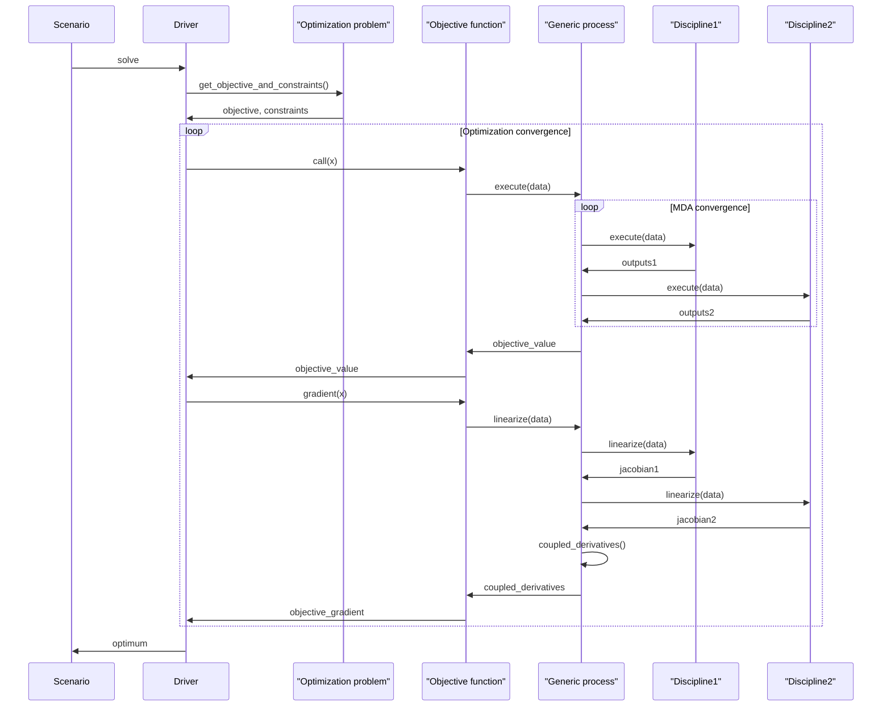
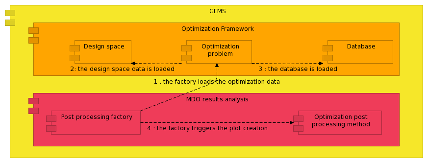
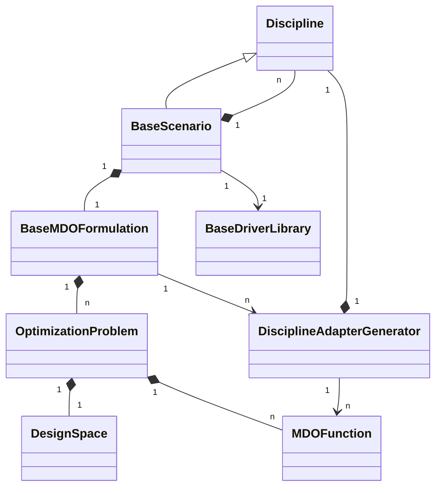
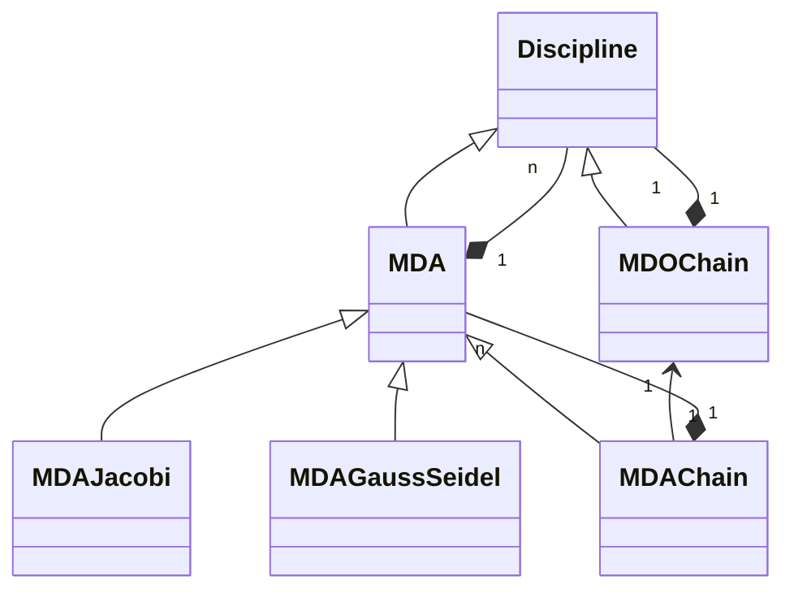
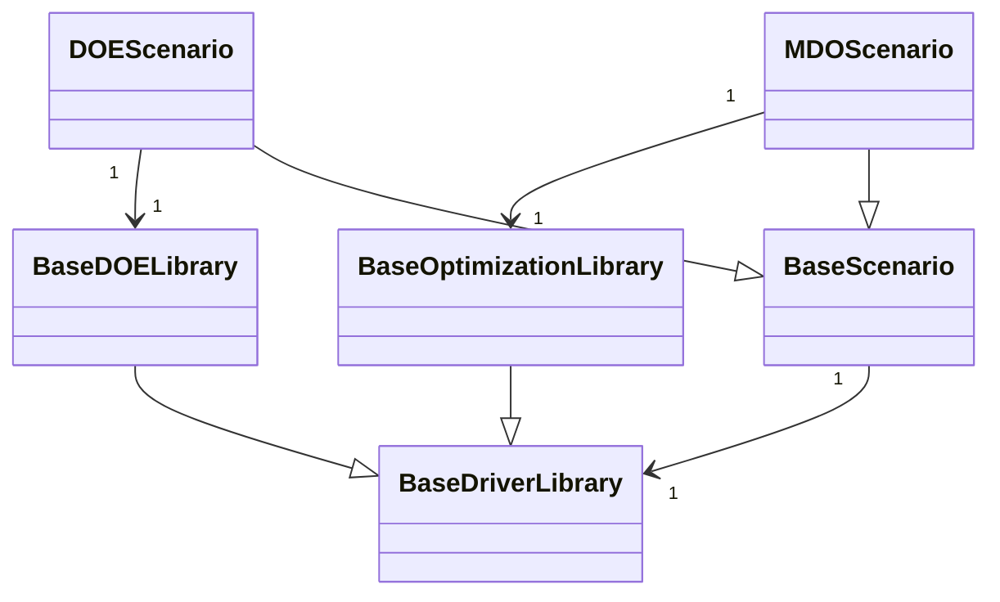
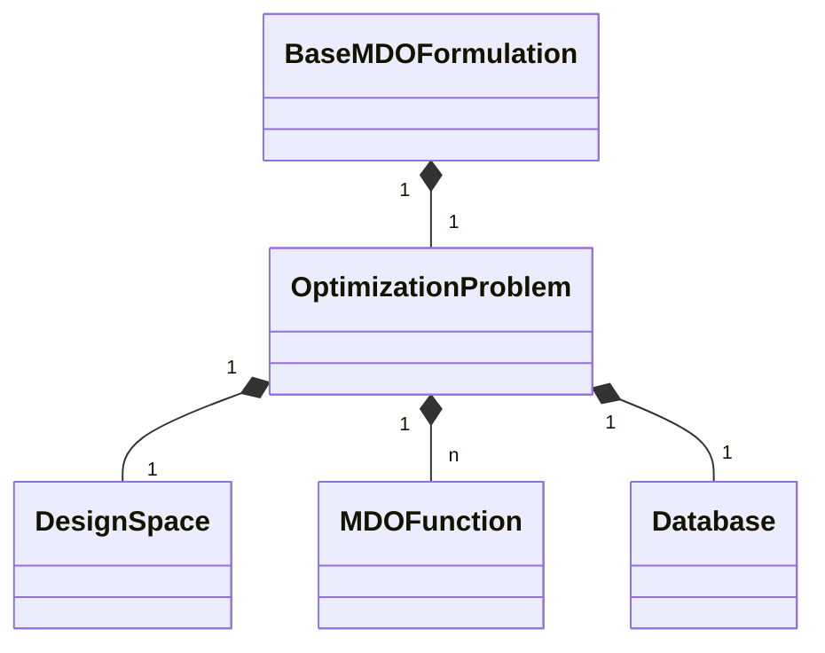

<!--
 Copyright 2021 IRT Saint Exupéry, https://www.irt-saintexupery.com

 This work is licensed under the Creative Commons Attribution-ShareAlike 4.0
 International License. To view a copy of this license, visit
 http://creativecommons.org/licenses/by-sa/4.0/ or send a letter to Creative
 Commons, PO Box 1866, Mountain View, CA 94042, USA.
-->

# Architecture principles

This page describes the key aspects of GEMSEO architecture.
It describes the main concepts used to build MDO processes.
Two scientific papers give details on the subject[@gallard2018gemseo][@gemseo2019].

## General description

GEMSEO is responsible for managing the MDO scenario, including the optimization problem, that includes the objective function, constraints, coupling variables, and design variables.

GEMSEO is independent of all disciplinary tools and thus can be used with any business case. Within the process, it executes the disciplines accordingly to the needs of the optimization algorithm or DOE, called driver. It is in charge of the of the optimization problem and links the mathematical methods to the simulation software.

It can be interfaced with multiple workflow engines of disciplines when requested by the driver.

## The interfaces of GEMSEO to an MDO platform and simulation capabilities

GEMSEO must provide generic interfaces, so that it can be integrated within any MDO platform technology.

- Interfaces with external workflow engines , see [Interfacing simulation software](../interface/software_connection.md).
- Interfaces with external optimization algorithms , and DOE methods, MDA solvers, surrogate model.
- Interfaces with the MDO platform.

*The Formulations Engine within its environment*

## GEMSEO components interactions

GEMSEO is split into 3 main component layers:

- The MDO formulation, that creates generic processes and the optimization problem from a list of disciplines
- The generic process, such as MDAs. These classes are actually abstractions of processes.
- The optimization framework contains the optimization problem description with their objective function and constraints, and drivers (optimization and DOE algorithms) to solve them.

GEMSEO architecture is modular. Many of its packages and classes are independent:

- The Optimization framework, which connects solvers and helps to formulate optimization problems, can be used to solve user-defined optimization problem, without any process or MDO formulation.
- Many generic processes, can be used to solve coupling problems without doing an MDO. Again, some examples are provided in the package.
- The optimization results plots can be generated from optimization histories stored in HDF5 files, or by using the Python API to read external data. So you may draw the same plots from optimization data generated outside of GEMSEO.

The next figure shows the main components of GEMSEO within an MDO platform.

*GEMSEO components*

### At process building step

When the scenario is instantiated by the user, typically in a script or by a platform, the process is built. Then the user can configure the overall process, before execution, by accessing and changing the objects attributes that define the process.

1. At this stage, the scenario instantiates the MDO formulation according to the user's choice.
2. Then, the formulation possibly creates generic processes (for MDF), or MDO sub-scenarios, for bi-level formulations.
3. Once this is performed, the MDO formulation creates an optimization problem.
4. This optimization problem is defined by the objective function and constraints, that eventually points to the generic processes or directly to the disciplines (for IDF for instance).

The next figure shows the components interaction at this step.

*Components interaction at the build step of the process*

### During process execution

During the process execution :

1. A driver is instantiated, it can be either an optimization algorithm or a DOE algorithm.
2. The driver solves the optimization problem that was created by the MDO formulation at the building step.
3. To this aim, the driver calls the objective function and constraints.
4. These functions point to the generic processes (that aim at solving a coupling problem for an MDA) or MDO sub-scenarios (for bi-level scenarios), in order to find an optimum.
5. These calls trigger the generic process execution, which themselves execute the disciplines.

*Components interactions at execution of the process*

The sequence diagram shows the data exchanges during the execution. Here the generic process may be a [Multi Disciplinary Analyses](../mdo/mda.md) in the case of MDF, which calls the disciplines. We represent only the objective function calls, since the constraints are handled in a similar way. The calls to the objective and its gradient are made within a loop, until convergence of the optimization algorithm (the driver). The scenario then retrieves the optimum from the driver.

### During results analysis

After the execution, convergence plots of the optimization can be generated. In addition, design space analysis, sensitivity analysis and constraints plots can be generated. For a complete overview of GEMSEO post-processing capabilities, see [How to deal with post-processing][how-to-deal-with-post-processing]. This can be achieved either from disk data (a serialized optimization problem), or from in-memory data after execution.

The user triggers the plots generation from a post-processing factory, or via the scenario, which delegates the execution to the same factory. The main steps are:

1. The post-processing factory loads an optimization problem from the disk, or in memory from a Scenario.
2. The data is split into a design space data, which contains the design variables names, bounds and types,
3. and a database of all data generated during execution, typically the objective function, constraints, their derivatives, and eventually algorithmic data.
4. Once the data is available, the factory loads the appropriate plot generation class for the plots required by the user, and calls the plot generation method.

*Components interactions during results analysis*

## Main classes

The high level classes that are key in the architecture are:

- [MDOScenario][gemseo.scenarios.mdo_scenario.MDOScenario] builds the process from a set of inputs, several disciplines and a formulation. It is one of the main interface class for the MDO user. The [MDOScenario][gemseo.scenarios.mdo_scenario.MDOScenario] triggers the overall optimization process when its [execute()][gemseo.scenarios.mdo_scenario.MDOScenario.execute] method is called. Through this class, the user provides an initial solution, user constraints, and bounds on the design variables. The user may also generate visualization of the scenario execution, such as convergence plots of the algorithm (see [this example][a-from-scratch-example-on-the-sellar-problem]).
- [DOEScenario][gemseo.scenarios.doe_scenario.DOEScenario] builds the process from a set of inputs, several disciplines and a formulation. It is the second main interface class for the MDO user. The [DOEScenario][gemseo.scenarios.doe_scenario.DOEScenario] triggers the overall trade-off process when its [execute()][gemseo.scenarios.doe_scenario.DOEScenario.execute] method is called. Through this class, the user provides a design space, some outputs to monitor (objective and constraints) and a number of samples. The user may also generate visualization of the scenario execution, such as convergence plots of the algorithm . As the [MDOScenario][gemseo.scenarios.mdo_scenario.MDOScenario], the [DOEScenario][gemseo.scenarios.doe_scenario.DOEScenario] makes the link between all the following classes. It is mainly handled by the MDO integrator. Both [MDOScenario][gemseo.scenarios.mdo_scenario.MDOScenario] and [DOEScenario][gemseo.scenarios.doe_scenario.DOEScenario] inherit from the [BaseScenario][gemseo.scenarios.base_scenario.BaseScenario] class that defines common features (bounds, constraints, ...).
- [Discipline][gemseo.core.discipline.discipline.Discipline] represents a wrapped simulation software program or a chain of wrapped software. It can either be a link to a discipline integrated within a workflow engine, or can be inherited to integrate a simulation software directly. Its inputs and outputs are represented in a **Grammar** (see [SimpleGrammar][gemseo.core.grammars.simple_grammar.SimpleGrammar] or [JSONGrammar][gemseo.core.grammars.json_grammar.JSONGrammar]).
- [BaseMDOFormulation][gemseo.formulations.base_mdo_formulation.BaseMDOFormulation] describes the MDO formulation (*e.g.* MDF and IDF) used by the [BaseScenario][gemseo.scenarios.base_scenario.BaseScenario] to generate the [OptimizationProblem][gemseo.algos.optimization_problem.OptimizationProblem]. The MDO user or the MDO integrator may either provide the name of the formulation, or a class, or an instance, to the [BaseScenario][gemseo.scenarios.base_scenario.BaseScenario] ([MDOScenario][gemseo.scenarios.mdo_scenario.MDOScenario] or[DOEScenario][gemseo.scenarios.doe_scenario.DOEScenario]) . The MDO formulations designer may create, implement, test or maintain MDO formulations  with this class.
- [OptimizationProblem][gemseo.algos.optimization_problem.OptimizationProblem] describes the mathematical functions of the optimization problem (objective function and constraints, along with the design variables. It is generated by the [BaseMDOFormulation][gemseo.formulations.base_mdo_formulation.BaseMDOFormulation], and solved by the optimization algorithm. It has an internal database that stores the calls to its functions by the optimization algorithm to avoid duplicate computations. It can be stored on disk and analyzed *a posteriori* by post-processing available in GEMSEO.
- [DesignSpace][gemseo.algos.design_space.DesignSpace] is an attribute of the [OptimizationProblem][gemseo.algos.optimization_problem.OptimizationProblem] that describes the design variables, their bounds, their type (float or integer), and current value. This object can be read from a file.

Two low-level classes at the core of GEMSEO are crucial for the understanding of its basic principles:

- [MDOFunction][gemseo.core.mdo_functions.mdo_function.MDOFunction] instances (for the objective function and the possible constraints) are generated by the [BaseMDOFormulation][gemseo.formulations.base_mdo_formulation.BaseMDOFormulation]. Depending on the formulation, constraints may be generated as well (*e.g.* consistency constraints in IDF).
- [DisciplineAdapterGenerator][gemseo.core.mdo_functions.discipline_adapter_generator.DisciplineAdapterGenerator] is a utility class that handles the [MDOFunction][gemseo.core.mdo_functions.mdo_function.MDOFunction] generation for a given [Discipline][gemseo.core.discipline.discipline.Discipline]. It is a key class for the MDO formulations designer.

The present figures display the main classes of GEMSEO. They are simplified class diagrams ; only parts of the subclasses and methods are represented. The present documentation contains the full classes description in the different sections as well as the full API documentation.

