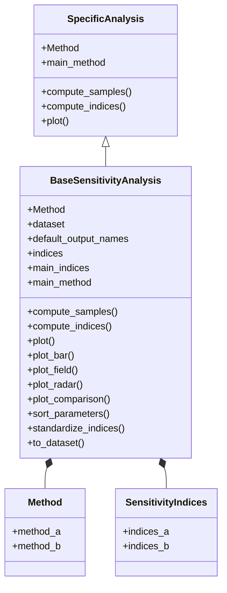

<!--
 Copyright 2021 IRT Saint Exupéry, https://www.irt-saintexupery.com

 This work is licensed under the Creative Commons Attribution-ShareAlike 4.0
 International License. To view a copy of this license, visit
 http://creativecommons.org/licenses/by-sa/4.0/ or send a letter to Creative
 Commons, PO Box 1866, Mountain View, CA 94042, USA.
-->

<!--
Contributors:
      :author: Matthias De Lozzo
-->

# Sensitivity analysis

Read [the API documentation][gemseo.uncertainty.sensitivity] and [the examples][sensitivity-analysis-examples] for more information.

## Architecture

