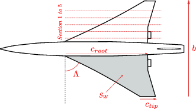
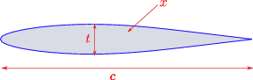

<!--
 Copyright 2021 IRT Saint Exupéry, https://www.irt-saintexupery.com

 This work is licensed under the Creative Commons Attribution-ShareAlike 4.0
 International License. To view a copy of this license, visit
 http://creativecommons.org/licenses/by-sa/4.0/ or send a letter to Creative
 Commons, PO Box 1866, Mountain View, CA 94042, USA.
-->

# MDO problems { #concept-mdo-problems }

The [gemseo.problem.mdo][gemseo.problem.mdo] package provides coupled multidisciplinary problems
for benchmarking and illustrating
[MDO formulations][concept-mdo-formulations],
[MDA solvers][concept-solving-multi-disciplinary-analysis]
and [post-processing][concept-post-processor].
All problems are decomposed into reusable
[Discipline][gemseo.core.discipline.discipline.Discipline] instances
with analytical coupling equations and Jacobians.

## Sellar's problem { #concept-sellars-problem }

Sellar *et al.* [@Sellar1996] proposed a small MDO problem that has become the
canonical benchmark for comparing MDO formulations.
In its original scalar form it reads:

$$
\begin{aligned}
\text{minimize} \quad & x_1^2 + x_{\text{shared},2} + y_1^2 + e^{-y_2} \\
\text{w.r.t.} \quad & x_{\text{shared}},\, x_1 \\
\text{subject to} \quad & c_1 = 3.16 - y_1^2 \leq 0 \\
                         & c_2 = y_2 - 24 \leq 0 \\
\text{subject to} \quad & -10 \leq x_{\text{shared},1} \leq 10 \\
                         & 0 \leq x_{\text{shared},2} \leq 10 \\
                         & 0 \leq x_1 \leq 10
\end{aligned}
$$

where the coupling variables are

$$y_1 = \sqrt{x_{\text{shared},1}^2 + x_{\text{shared},2} + x_1 - 0.2\,y_2}$$

and

$$y_2 = |y_1| + x_{\text{shared},1} + x_{\text{shared},2}.$$

In GEMSEO, the problem is generalized to support vector-valued local variables and
coupling variables of size $n$ (default: $1$), a second local design variable $x_2$,
and a coupling-strength coefficient $k$:

$$
\begin{aligned}
\text{minimize} \quad &
  \frac{x_1^\top x_1 + x_2^\top x_2 + n\,x_{\text{shared},2}
        + y_1^\top y_1 + e^{-y_2^\top \mathbf{1}_n}}{n} \\
\text{subject to} \quad &
  c_1 = \alpha - y_1^2 \leq 0,\quad c_2 = y_2 - \beta \leq 0
\end{aligned}
$$

where

$$y_1 = \sqrt{x_{\text{shared},1}^2 + x_{\text{shared},2} + x_1 - \gamma k\,y_2},
\qquad y_2 = k|y_1| + x_{\text{shared},1} + x_{\text{shared},2} - x_2.$$

Constants $\alpha$, $\beta$ and $\gamma$ can also be changed (default: 3.16, 24 and 0.2 respectively).

The original problem is recovered
with $k=1$, $n=1$, $x_2=0$, $\alpha=3.16$, $\beta=24$, $\gamma=0.2$.

??? abstract "API"

    - [Sellar1][gemseo.problem.mdo.sellar.sellar_1.Sellar1]:
      computes $y_1$ from $y_2$, $x_{\text{shared}}$, $x_1$, $\gamma$.
    - [Sellar2][gemseo.problem.mdo.sellar.sellar_2.Sellar2]:
      computes $y_2$ from $y_1$, $x_{\text{shared}}$, $x_2$.
    - [SellarSystem][gemseo.problem.mdo.sellar.sellar_system.SellarSystem]:
      computes the objective and constraints from $x_{\text{shared}}$, $x_1$, $x_2$, $y_1$, $y_2$, $\alpha$ and $\beta$.
    - [SellarDesignSpace][gemseo.problem.mdo.sellar.sellar_design_space.SellarDesignSpace]
      defines the design and coupling variables.

## Sobieski's Supersonic Business Jet (SSBJ) { #concept-sobieskis-super-sonic-business-jet-ssbj }

The Sobieski SSBJ problem is a classical aircraft design benchmark
originating from a 1996 AIAA student competition and first published alongside
the BLISS formulation [@SobieskiBLISS98] [@Sobieszczanski-Sobieski1995] [@niu] [@anderson] [@Raymer].
The goal is to maximize the range `"y_4"` of a supersonic business jet (SSBJ)
with respect to shared design variables `"x_shared"`
and local design variables `"x_1"`, `"x_2"`, `"x_3"`,
subject to constraints `"g_1"`, `"g_2"` and `"g_3"`.

### Disciplines { #concept-ssbj-disciplines }

Four disciplines are involved:

1. [SobieskiStructure][gemseo.problem.mdo.sobieski.discipline.SobieskiStructure]
   computes the structural constraint `"g_1"` from `"x_shared"` and `"x_1"`.
2. [SobieskiAerodynamics][gemseo.problem.mdo.sobieski.discipline.SobieskiAerodynamics]
   computes the aerodynamic constraint `"g_2"` from `"x_shared"` and `"x_2"`.
3. [SobieskiPropulsion][gemseo.problem.mdo.sobieski.discipline.SobieskiPropulsion]
   computes the propulsion constraint `"g_3"` from `"x_shared"` and `"x_3"`.
4. [SobieskiMission][gemseo.problem.mdo.sobieski.discipline.SobieskiMission]
   computes the objective `"y_4"` from `"x_shared"`.

Disciplines 1–3 are strongly coupled; discipline 4 is weakly coupled to them.
The coupling variable `"y_ij"` denotes an output of discipline $i$
and an input of discipline $j$.

### Input variables { #concept-ssbj-inputs }

| Disciplines  | Variable                                   | Description                                      | Bounds                      | Notation        |
|--------------|--------------------------------------------|--------------------------------------------------|-----------------------------|-----------------|
| All          | $t/c$                                      | Thickness-to-chord ratio                         | $0.01 \leq t/c \leq 0.09$   | `"x_shared[0]"` |
| All          | $h$                                        | Altitude ($\text{ft}$)                           | $30000 \leq h \leq 60000$   | `"x_shared[1]"` |
| All          | $M$                                        | Mach number                                      | $1.4 \leq M \leq 1.8$       | `"x_shared[2]"` |
| All          | $AR = b^2/S_W$                             | Aspect ratio                                     | $2.5 \leq AR \leq 8.5$      | `"x_shared[3]"` |
| All          | $\Lambda$                                  | Wing sweep ($\deg$)                              | $40 \leq \Lambda \leq 70$   | `"x_shared[4]"` |
| All          | $S_W$                                      | Wing surface area ($\text{ft}^2$)                | $500 \leq S_W \leq 1500$    | `"x_shared[5]"` |
| Structure    | $\lambda = c_{\text{tip}}/c_{\text{root}}$ | Wing taper ratio                                 | $0.1 \leq \lambda \leq 0.4$ | `"x_1[0]"`      |
| Structure    | $x$                                        | Wingbox cross-sectional area ($\text{ft}^2$)     | $0.75 \leq x \leq 1.25$     | `"x_1[1]"`      |
| Structure    | $L$                                        | Lift from Aerodynamics ($N$)                     | —                           | `"y_21[0]"`     |
| Structure    | $W_E$                                      | Engine mass from Propulsion ($\text{lb}$)        | —                           | `"y_31[0]"`     |
| Aerodynamics | $C_f$                                      | Skin friction coefficient                        | $0.75 \leq C_f \leq 1.25$   | `"x_2[0]"`      |
| Aerodynamics | $W_T$                                      | Total aircraft mass from Structure ($\text{lb}$) | —                           | `"y_12[0]"`     |
| Aerodynamics | $\Delta\alpha_v$                           | Wing twist from Structure                        | —                           | `"y_12[1]"`     |
| Aerodynamics | $ESF$                                      | Engine scale factor from Propulsion              | —                           | `"y_32[0]"`     |
| Propulsion   | $Th$                                       | Throttle setting (engine mass flow)              | $0.1 \leq Th \leq 1.25$     | `"x_3[0]"`      |
| Propulsion   | $D$                                        | Drag from Aerodynamics ($N$)                     | —                           | `"y_23[0]"`     |
| Mission      | $L/D$                                      | Lift-over-drag ratio from Aerodynamics           | —                           | `"y_24[0]"`     |
| Mission      | $W_T$                                      | Total aircraft mass from Structure ($\text{lb}$) | —                           | `"y_14[0]"`     |
| Mission      | $W_F$                                      | Fuel mass from Structure ($\text{lb}$)           | —                           | `"y_14[1]"`     |
| Mission      | $SFC$                                      | Specific fuel consumption from Propulsion        | —                           | `"y_34[1]"`     |

### Output variables { #concept-ssbj-outputs }

| Disciplines  | Variable                | Description                         | Bounds                               | Notation   |
|--------------|-------------------------|-------------------------------------|--------------------------------------|------------|
| Structure    | $\sigma_1 - 1.09$       | Stress constraint on wing section 1 | $\leq 0$                             | `"g_1[0]"` |
| Structure    | $\sigma_2 - 1.09$       | Stress constraint on wing section 2 | $\leq 0$                             | `"g_1[1]"` |
| Structure    | $\sigma_3 - 1.09$       | Stress constraint on wing section 3 | $\leq 0$                             | `"g_1[2]"` |
| Structure    | $\sigma_4 - 1.09$       | Stress constraint on wing section 4 | $\leq 0$                             | `"g_1[3]"` |
| Structure    | $\sigma_5 - 1.09$       | Stress constraint on wing section 5 | $\leq 0$                             | `"g_1[4]"` |
| Structure    | $\Delta\alpha_v - 1.04$ | First wing twist constraint         | $\leq 0$                             | `"g_1[5]"` |
| Structure    | $0.96 - \Delta\alpha_v$ | Second wing twist constraint        | $\leq 0$                             | `"g_1[6]"` |
| Structure    | $W_T$                   | Total aircraft mass ($\text{lb}$)   | —                                    | `"y_1[0]"` |
| Structure    | $W_F$                   | Fuel mass ($\text{lb}$)             | —                                    | `"y_1[1]"` |
| Structure    | $\Delta\alpha_v$        | Wing twist ($\deg$)                 | $0.96 \leq \Delta\alpha_v \leq 1.04$ | `"y_1[2]"` |
| Aerodynamics | $L$                     | Lift ($\text{lb}$)                  | —                                    | `"y_2[0]"` |
| Aerodynamics | $D$                     | Drag ($\text{lb}$)                  | —                                    | `"y_2[1]"` |
| Aerodynamics | $L/D$                   | Lift-over-drag ratio                | —                                    | `"y_2[2]"` |
| Aerodynamics | $dp/dx - 1.04$          | Pressure gradient constraint        | $\leq 0$                             | `"g_2[0]"` |
| Propulsion   | $SFC$                   | Specific fuel consumption           | —                                    | `"y_3[0]"` |
| Propulsion   | $W_E$                   | Engine mass ($\text{lb}$)           | —                                    | `"y_3[1]"` |
| Propulsion   | $ESF$                   | Engine scale factor                 | $0.5 \leq ESF \leq 1.5$              | `"y_3[2]"` |
| Propulsion   | $ESF - 1.5$             | First ESF constraint                | $\leq 0$                             | `"g_3[0]"` |
| Propulsion   | $0.5 - ESF$             | Second ESF constraint               | $\leq 0$                             | `"g_3[1]"` |
| Propulsion   | $Th - Th_{uA}$          | Throttle constraint                 | $\leq 0$                             | `"g_3[2]"` |
| Propulsion   | $T_E - 1.02$            | Engine temperature constraint       | $\leq 0$                             | `"g_3[3]"` |
| Mission      | $R$                     | Range ($\text{nm}$)                 | —                                    | `"y_4[0]"` |

### Physical variable names { #concept-ssbj-physical-names }

[SobieskiDesignSpace][gemseo.problem.mdo.sobieski.standalone.design_space.SobieskiDesignSpace]
supports two naming conventions controlled by `use_original_names`:
`True` (default) uses the indexed notation from the original paper
(`x_shared`, `x_1`, `y_12`, …);
`False` uses the physical names below.

| Indexed       | Physical       | Description                                  |
|---------------|----------------|----------------------------------------------|
| `x_shared[0]` | `t_c`          | Thickness-to-chord ratio                     |
| `x_shared[1]` | `altitude`     | Altitude (ft)                                |
| `x_shared[2]` | `mach`         | Mach number                                  |
| `x_shared[3]` | `ar`           | Aspect ratio                                 |
| `x_shared[4]` | `sweep`        | Wing sweep (deg)                             |
| `x_shared[5]` | `area`         | Wing surface area (ft²)                      |
| `x_1[0]`      | `taper_ratio`  | Wing taper ratio ($\lambda$)                 |
| `x_1[1]`      | `wingbox_area` | Wingbox cross-sectional area ($x$)           |
| `x_2[0]`      | `cf`           | Skin friction coefficient ($C_f$)            |
| `x_3[0]`      | `throttle`     | Throttle setting ($Th$)                      |
| `y_12[0]`     | `t_w_2`        | Total aircraft mass → Aerodynamics ($W_T$)   |
| `y_12[1]`     | `twist`        | Wing twist → Aerodynamics ($\Delta\alpha_v$) |
| `y_14[0]`     | `t_w_4`        | Total aircraft mass → Mission ($W_T$)        |
| `y_14[1]`     | `f_w`          | Fuel mass → Mission ($W_F$)                  |
| `y_21[0]`     | `cl`           | Lift → Structure ($L$)                       |
| `y_23[0]`     | `cd`           | Drag → Propulsion ($D$)                      |
| `y_24[0]`     | `cl_cd`        | Lift-to-drag ratio → Mission ($L/D$)         |
| `y_31[0]`     | `e_w`          | Engine weight → Structure ($W_E$)            |
| `y_32[0]`     | `esf`          | Engine scale factor → Aerodynamics ($ESF$)   |
| `y_34[0]`     | `sfc`          | Specific fuel consumption → Mission ($SFC$)  |

If you choose the physical names,
then use `SobieskiMission.create_with_physical_naming()` instead of `SobieskiMission()`,
and same for the other disciplines.

### Constants { #concept-ssbj-constants }

The disciplines depend on five problem constants $c_0, \ldots, c_4$
whose default values are:

| Symbol | Default value | Unit | Description                           |
|--------|---------------|------|---------------------------------------|
| $c_0$  | 2000          | lb   | Minimum fuel weight                   |
| $c_1$  | 25000         | lb   | Miscellaneous (empty) aircraft weight |
| $c_2$  | 6             | —    | Maximum load factor                   |
| $c_3$  | 4360          | lb   | Reference engine weight               |
| $c_4$  | 0.01375       | —    | Minimum drag coefficient              |

These constants can be overridden when instantiating the discipline objects.

??? abstract "API"

    - [SobieskiStructure][gemseo.problem.mdo.sobieski.discipline.SobieskiStructure]
    - [SobieskiAerodynamics][gemseo.problem.mdo.sobieski.discipline.SobieskiAerodynamics]
    - [SobieskiPropulsion][gemseo.problem.mdo.sobieski.discipline.SobieskiPropulsion]
    - [SobieskiMission][gemseo.problem.mdo.sobieski.discipline.SobieskiMission]
    - [SobieskiDesignSpace][gemseo.problem.mdo.sobieski.standalone.design_space.SobieskiDesignSpace]

### Reference results { #concept-ssbj-results }

All Jacobian matrices are coded analytically.
Reference results with the [MDF formulation][concept-the-mdf-formulation]
using a gradient-based optimizer are:

| Variable             | Initial    | Optimum     |
|----------------------|------------|-------------|
| **Range (nm)**       | **535.79** | **3963.88** |
| $\lambda$            | 0.25       | 0.38757     |
| $x$                  | 1.00       | 0.75        |
| $C_f$                | 1.00       | 0.75        |
| $Th$                 | 0.50       | 0.15624     |
| $t/c$                | 0.05       | 0.06        |
| $h\,(\text{ft})$     | 45000      | 60000       |
| $M$                  | 1.6        | 1.4         |
| $AR$                 | 5.5        | 2.5         |
| $\Lambda\,(\deg)$    | 55         | 70          |
| $S_W\,(\text{ft}^2)$ | 1000       | 1500        |

## Aerostructure problem { #concept-aerostructure-problem }

The aerostructure problem is a simplified aircraft design benchmark
with fully analytical coupling equations.
The goal is to maximize range subject to a lift equality constraint
and a reserve factor equality constraint:

$$
\begin{aligned}
\text{maximize} \quad &
  \text{range} = 8 \times 10^{11} \times \frac{\text{lift} \times \text{mass}}{\text{drag}} \\
\text{w.r.t.} \quad & \text{thick\_airfoils},\; \text{thick\_panels},\; \text{sweep} \\
\text{subject to} \quad & \text{rf} - 0.5 = 0, \quad \text{lift} - 0.5 \leq 0
\end{aligned}
$$

The aerodynamic coupling equations are

$$\text{drag} = 0.1\left[\left(\frac{\text{sweep}}{360}\right)^{2}
  + 200 + \text{thick\_airfoils}^2 - \text{thick_airfoils} - 4\,\text{displ}\right]$$

$$\text{forces} = 10\,\text{sweep} + 0.2\,\text{thick_airfoils} - 0.2\,\text{displ}$$

$$\text{lift} = \frac{\text{sweep} + 0.2\,\text{thick_airfoils} - 2\,\text{displ}}{3000}$$

and the structural coupling equations are

$$\text{mass} = 4000\left(\frac{\text{sweep}}{360}\right)^{3}
  + 200000 + 100\,\text{thick_panels} + 200\,\text{forces}$$

$$\text{rf} = 3\,\text{sweep} - 6\,\text{thick_panels} + 0.1\,\text{forces} + 55$$

$$\text{displ} = 2\,\text{sweep} + 3\,\text{thick_panels} - 2\,\text{forces}.$$

??? abstract "API"

    - [Aerodynamics][gemseo.problem.mdo.aerostructure.aerostructure.Aerodynamics]
    - [Structure][gemseo.problem.mdo.aerostructure.aerostructure.Structure]
    - [Mission][gemseo.problem.mdo.aerostructure.aerostructure.Mission]
    - [AerostructureDesignSpace][gemseo.problem.mdo.aerostructure.aerostructure_design_space.AerostructureDesignSpace]

## Propane combustion problem { #concept-propane-combustion-problem }

The propane combustion problem[@Padula1996] [@TedfordMartins2006] models the chemical equilibrium reached during
the combustion of propane in air.
The 11 variables $x_1, \ldots, x_{11}$ represent molar concentrations
of combustion products plus their sum.

$$
\begin{aligned}
\text{minimize} \quad & f_2 + f_6 + f_7 + f_9 \\
\text{w.r.t.} \quad & x_1, x_3, x_6, x_7 \geq 0 \\
\text{subject to} \quad & f_2(x) \geq 0,\; f_6(x) \geq 0,\; f_7(x) \geq 0,\; f_9(x) \geq 0
\end{aligned}
$$

where the system discipline ([PropaneReaction][gemseo.problem.mdo.propane.propane.PropaneReaction]) computes:

$$
\begin{aligned}
f_2(x) &= 2x_1 + x_2 + x_4 + x_7 + x_8 + x_9 + 2x_{10} - R \\
f_6(x) &= K_6\,x_2^{1/2}\,x_4^{1/2} - x_1^{1/2}\,x_6\,(p/x_{11})^{1/2} \\
f_7(x) &= K_7\,x_1^{1/2}\,x_2^{1/2} - x_4^{1/2}\,x_7\,(p/x_{11})^{1/2} \\
f_9(x) &= K_9\,x_1\,x_3^{1/2} - x_4\,x_9\,(p/x_{11})^{1/2}
\end{aligned}
$$

The three computation disciplines solve implicit equations for the remaining variables:

**PropaneComb1** computes $(x_2, x_4)$:

$$x_1 + x_4 = 3, \qquad K_5\,x_2\,x_4 = x_1\,x_5$$

**PropaneComb2** computes $(x_8, x_{10})$:

$$K_8\,x_1 + x_4\,x_8\,(p/x_{11}) = 0, \qquad K_{10}\,x_1^2 = x_4^2\,x_{10}\,(p/x_{11})$$

**PropaneComb3** computes $(x_5, x_9, x_{11})$:

$$2x_2 + 2x_5 + x_6 + x_7 = 8, \qquad 2x_3 + x_9 = 4R, \qquad x_{11} = \sum_{j=1}^{10} x_j$$

??? abstract "API"

    - [PropaneReaction][gemseo.problem.mdo.propane.propane.PropaneReaction]:
      system discipline computing objective and constraint terms.
    - [get_design_space][gemseo.problem.mdo.propane.propane.get_design_space]:
      loads the design space from the bundled CSV file.

The optimum is $(x_1, x_3, x_6, x_7) = (1.378887,\, 18.426810,\, 1.094798,\, 0.931214)$
with objective value $0$; all system-level inequality constraints are active.
