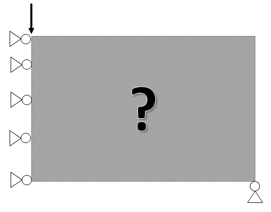
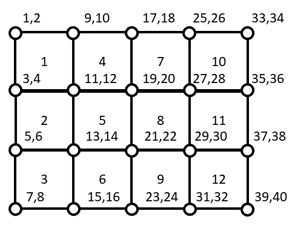

<!--
 Copyright 2021 IRT Saint Exupéry, https://www.irt-saintexupery.com

 This work is licensed under the Creative Commons Attribution-ShareAlike 4.0
 International License. To view a copy of this license, visit
 http://creativecommons.org/licenses/by-sa/4.0/ or send a letter to Creative
 Commons, PO Box 1866, Mountain View, CA 94042, USA.
-->

# Topology optimization { #concept-topology-optimization }

!!!tutorial
    - [Solve a 2D L-shape topology optimization problem][tutorial-solve-a-2d-l-shape-topology-optimization-problem]

The [gemseo.problems.topology_optimization][gemseo.problems.topology_optimization] package implements
a 2D density-based structural topology optimization problem
decomposed into four [Disciplines][gemseo.core.discipline.discipline.Discipline].
The design variable is the element density field $\rho \in [0, 1]^{n_x \times n_y}$.
The goal is to minimize structural compliance (maximize stiffness)
subject to a volume fraction constraint.

## Problem formulation { #concept-topology-optimization-formulation }

Topology optimization aims at finding the "best" material layout
within a given design space.
It is especially useful in preliminary design phases,
when only part of the operating conditions is known
and one wants to find good design candidates achieving stiffer structures
within a given mass budget.
The formulation adopted here
is the Solid Isotropic Material with Penalization (SIMP)[^1] approach;
the examples reproduce the MATLAB and Python implementations described in[^2] and[^3].

Given a 2D design space with loads and boundary conditions
— for instance the Messerschmitt-Bölkow-Blohm (MBB) beam below —
the solid domain is meshed with 2D bilinear quadrilateral finite elements.
All the provided benchmarks consider rectangular domains,
so one only needs to define the number of elements in
the horizontal ($x$) and vertical ($y$) directions.

A design variable is associated with each finite element.
It equals $0$ when the element is void and $1$
when it is filled with solid material.
To exploit gradient-based optimizers,
these variables are relaxed to $x \in [0, 1]^N$.
To recover a discrete solution at convergence,
intermediate densities are penalized
through the SIMP scheme
(see [Material model interpolation](#concept-material-interpolation)),
which links the local material density to Young's modulus.
A [density filter](#concept-density-filter) avoids numerical difficulties
such as mesh-dependent solutions and checkerboard patterns.

The compliance is minimized subject to a mass budget, equivalently a volume fraction target:

$$\min_{x \in [0,1]^N}{F \cdot U(x)}$$

$$s.t.$$

$$\frac{1}{N}\sum_{i=1}^N{x_i}\leq \overline{V}$$

$$K(x)U(x) = F$$

where $F$ is the load vector,
$U$ is the displacement vector,
$N$ is the number of elements,
$\overline{V}$ is the allowable volume fraction and $K$ is the stiffness matrix.

## Discipline pipeline { #concept-topology-optimization-pipeline }

The four disciplines are chained as follows:

$$\rho \;\xrightarrow{\text{DensityFilter}}\; \tilde{\rho}
  \;\xrightarrow{\text{MaterialModelInterpolation}}\; E
  \;\xrightarrow{\text{FiniteElementAnalysis}}\; u,\,\text{compliance}$$

$$\rho \;\xrightarrow{\text{VolumeFraction}}\; \bar{\rho}$$

## Density filter { #concept-density-filter }

The density filter removes numerical artefacts such as checkerboard patterns
by replacing each element density with a weighted average of its neighbours:

$$\tilde{\rho}_e = \frac{\sum_{f \in \mathcal{N}_e} H_{ef}\,\rho_f}{\sum_{f \in \mathcal{N}_e} H_{ef}}$$

where $H_{ef}$ decays with distance and $\mathcal{N}_e$ is the neighbourhood of element $e$.
The minimum member size parameter controls the filter radius.

??? abstract "API"

    - [DensityFilter][gemseo.problems.topology_optimization.density_filter_disc.DensityFilter]

## Material model interpolation { #concept-material-interpolation }

The Solid Isotropic Material with Penalization (SIMP) scheme maps
the filtered density to Young's modulus:

$$E(\tilde{\rho}) = E_{\min} + (E_0 - E_{\min})\,\tilde{\rho}^p$$

where $E_0$ is the stiffness of solid material, $E_{\min}$ is a small value
assigned to void elements to avoid singularities, and $p$ is the penalization exponent
(typically $p = 3$).
Empty and full elements can be pinned to void or solid independently of the optimizer.

??? abstract "API"

    - [MaterialModelInterpolation][gemseo.problems.topology_optimization.material_model_interpolation_disc.MaterialModelInterpolation]

## Finite element analysis { #concept-fea }

The finite element analysis discipline solves the linear system $K(E)\,u = f$
for the displacement vector $u$ and returns the compliance

$$c = f^\top u = u^\top K(E)\,u,$$

which is twice the elastic strain energy.
The mesh consists of $n_x \times n_y$ bilinear quadrilateral elements on a unit square.
The load direction, load node, and fixed boundary conditions are configurable.

??? abstract "API"

    - [FiniteElementAnalysis][gemseo.problems.topology_optimization.fea_disc.FiniteElementAnalysis]

## Volume fraction { #concept-volume-fraction }

The volume fraction discipline computes the mean element density:

$$\bar{\rho} = \frac{1}{n_x\,n_y}\sum_{e} \rho_e.$$

It is used as a constraint to prevent the optimizer from filling the entire domain.

??? abstract "API"

    - [VolumeFraction][gemseo.problems.topology_optimization.volume_fraction_disc.VolumeFraction]

## Benchmark configurations { #concept-topology-optimization-benchmarks }

Three standard benchmark geometries are available:

| Name | Description |
|------|-------------|
| `MBB` | Messerschmitt-Bölkow-Blohm (MBB) beam: horizontal beam, loaded at top-left, supported at bottom corners |
| `L-Shape` | L-shaped domain with a point load at the free end |
| `Short_Cantilever` | Short cantilever beam: clamped on the left, loaded at mid-height on the right |

??? abstract "API"

    - [initialize_design_space_and_discipline_to][gemseo.problems.topology_optimization.topopt_initialize.initialize_design_space_and_discipline_to]:
      returns a `(DesignSpace, list[Discipline])` tuple for a given benchmark configuration.

[^1]: Bendsøe, M. P. (1989). Optimal shape design as a material distribution problem. Structural optimization, 1(4), 193-202.

[^2]: Sigmund, O. (2001). A 99 line topology optimization code written in Matlab. Structural and multidisciplinary optimization, 21(2), 120-127.

[^3]: Andreassen, E., Clausen, A., Schevenels, M., Lazarov, B. S., & Sigmund, O. (2011). Efficient topology optimization in MATLAB using 88 lines of code. Structural and Multidisciplinary Optimization, 43(1), 1-16.
