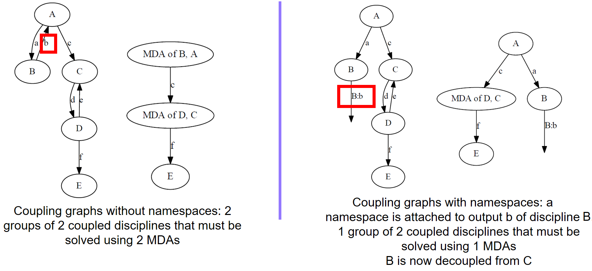

<!--
 Copyright 2021 IRT Saint Exupéry, https://www.irt-saintexupery.com

 This work is licensed under the Creative Commons Attribution-ShareAlike 4.0
 International License. To view a copy of this license, visit
 http://creativecommons.org/licenses/by-sa/4.0/ or send a letter to Creative
 Commons, PO Box 1866, Mountain View, CA 94042, USA.
-->

# Namespaces { #concept-namespaces }

GEMSEO automatically couples disciplines that share variable names,
following the convention that the same name refers to the same variable.
This is convenient in most cases,
but it becomes a limitation when a discipline needs to be used
with more than one role in a process —
for instance, when computing similar quantities for different components.
Namespaces address this limitation
by allowing variable names to be prefixed,
making them distinct even when they share the same base name.

## What are namespaces?

A namespace is a prefix prepended to a variable name,
separated by a special character (a colon `:` by default).
A variable `x` assigned the namespace `ns` becomes by default `ns:x`.

Namespaces must be added after the discipline is instantiated,
using the dedicated methods for inputs and outputs respectively.
Never prefix a variable name directly in the discipline definition.

!!! tutorial
    - [Use namespaces to run the same discipline in multiple contexts][tutorial-use-namespaces-to-run-the-same-discipline-in-multiple-contexts]

## Impact on couplings { #concept-impact-on-couplings }

From the global workflow perspective, adding a namespace to a variable effectively renames it.
Since GEMSEO detects couplings by matching variable names,
renaming a variable breaks any existing coupling involving that name.

!!! note
    Adding a namespace has no impact on how a variable is defined within a discipline.
    See [Impact on discipline wrappers][].

For example,
if discipline $B$ produces output `b` and discipline $A$ consumes input `b`,
they are automatically coupled.
Adding the namespace `B` to the output of B renames it to `B:b`,
which no longer matches $A$'s input `b` —
and the coupling between $B$ and $A$ is removed.

The figure below illustrates how namespaces can modify the coupling structure.

## Impact on discipline wrappers

A discipline's internal code always uses the original variable names,
without the namespace prefix.
GEMSEO handles the mapping between the external namespaced names
and the internal names transparently.
As a result,
supporting namespaces in a discipline wrapper requires only minor modifications.

## Limitations

!!! warning
    This is still an experimental feature,
    currently validated for the main process classes.
    Scenarios can be created with disciplines handling namespaces.
    Not all wrappers and MDO test problems are compatible with namespaces.
    Please let us know if this feature does not work with your process
    ([contact@gemseo.org](mailto:contact@gemseo.org)).
