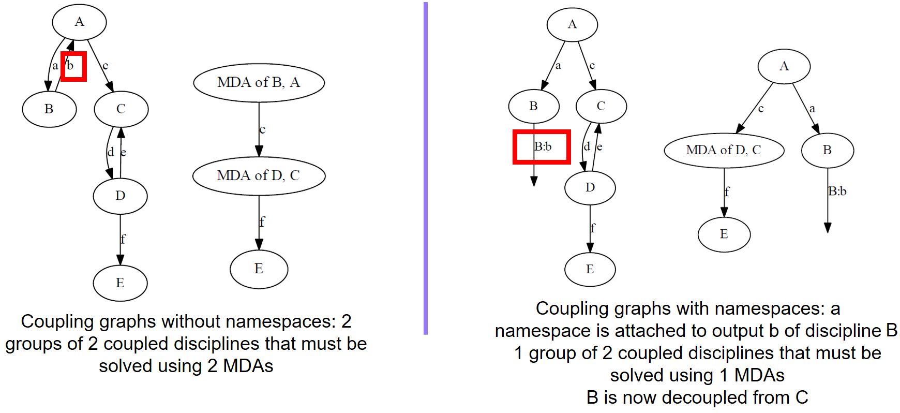
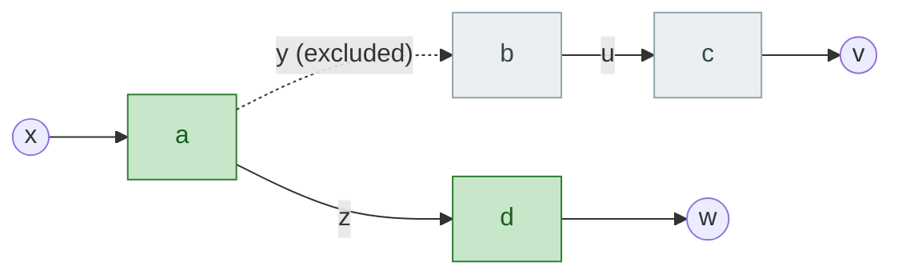
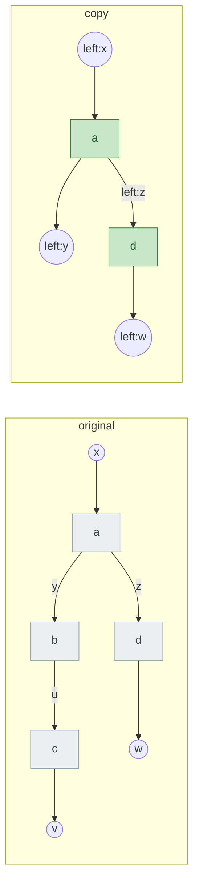

<!--
 Copyright 2021 IRT Saint Exupéry, https://www.irt-saintexupery.com

 This work is licensed under the Creative Commons Attribution-ShareAlike 4.0
 International License. To view a copy of this license, visit
 http://creativecommons.org/licenses/by-sa/4.0/ or send a letter to Creative
 Commons, PO Box 1866, Mountain View, CA 94042, USA.
-->

# Namespaces { #concept-namespaces }

GEMSEO automatically couples disciplines that share variable names,
following the convention that the same name refers to the same variable.
This is convenient in most cases,
but it becomes a limitation when a discipline needs to be used
with more than one role in a process —
for instance, when computing similar quantities for different components.
Namespaces address this limitation
by allowing variable names to be prefixed,
making them distinct even when they share the same base name.

## What are namespaces?

A namespace is a prefix prepended to a variable name,
separated by a special character (a colon `:` by default).
A variable `x` assigned the namespace `ns` becomes by default `ns:x`.

Namespaces must be added after the discipline is instantiated,
using the dedicated methods for inputs and outputs respectively.
Never prefix a variable name directly in the discipline definition.

!!! tutorial
    - [Use namespaces to run the same discipline in multiple contexts][tutorial-use-namespaces-to-run-the-same-discipline-in-multiple-contexts-operating-conditions-and-perform-multipoint-optimization]

## Impact on couplings { #concept-impact-on-couplings }

From the global workflow perspective, adding a namespace to a variable effectively renames it.
Since GEMSEO detects couplings by matching variable names,
renaming a variable breaks any existing coupling involving that name.

!!! note
    Adding a namespace has no impact on how a variable is defined within a discipline.
    See [Impact on discipline wrappers][].

For example,
if discipline $B$ produces output `b` and discipline $A$ consumes input `b`,
they are automatically coupled.
Adding the namespace `B` to the output of B renames it to `B:b`,
which no longer matches $A$'s input `b` —
and the coupling between $B$ and $A$ is removed.

The figure below illustrates how namespaces can modify the coupling structure.

## Propagating a namespace over a group of disciplines { #concept-namespace-propagation }

Calling
[add_namespace_to_input()][gemseo.core.discipline.base_discipline.BaseDiscipline.add_namespace_to_input]
and
[add_namespace_to_output()][gemseo.core.discipline.base_discipline.BaseDiscipline.add_namespace_to_output]
by hand gives the finest control over which couplings are kept and which are broken,
which is why it remains the right tool
when only one or two disciplines need namespacing.
But cascading a namespace over a whole group of coupled disciplines this way
means calling these methods once per affected input and output,
and forgetting a single call silently breaks a coupling
instead of raising an error.

[propagate_namespace()][gemseo.discipline.namespace.propagate_namespace] automates this cascade.
Starting from the disciplines that own the *seed* variables
(the `variable_names` argument),
it walks the coupling graph forward
and namespaces every input and output affected by the propagation,
so that the couplings inside the group survive the renaming
instead of being broken one discipline at a time.

The affected variables are precisely:

- every output of every reached discipline,
- among its inputs, the seeds themselves
  and the variables produced inside the reached set.

Any other input —
one that is neither a seed nor produced inside the reached set —
stays bare.
In particular,
a global design variable passed as a seed *is* namespaced:
being a seed is what matters, not the variable's role.

!!! warning
    The group of disciplines passed to
    [propagate_namespace()][gemseo.discipline.namespace.propagate_namespace] must be self-contained.
    Every output of every reached discipline is namespaced,
    not only the ones carrying the propagation,
    so the renaming also affects references held by objects that are not disciplines,
    and that therefore cannot be checked by
    [propagate_namespace()][gemseo.discipline.namespace.propagate_namespace]:

    - the variable names of a [DesignSpace][gemseo.space.design.DesignSpace],
    - the objective, constraint and observable names
      passed to a formulation or to a scenario,
    - the coupling names passed to [create_mda()][gemseo.create_mda]
      and any variable name stored in settings.

    None of these are reachable from the disciplines,
    so no diagnostic can be emitted for them:
    the coupling those references stood for is silently gone.
    Use the returned mapping —
    each reached discipline paired with the original names
    of its affected inputs and outputs —
    to rewrite such external references by prepending the namespace to them.

### Excluding variables from the namespace

The typical use case for propagating a namespace is running a copy
of a group of disciplines alongside the original one,
the two differing by a variation on a single seed variable.
Often, though, part of the downstream computation is known to be insensitive
to that variation, or must be kept identical to the original by design.
The `excluded_names` argument marks such variables:
a copied discipline consuming one keeps the bare name and so reads the
value from the original group, and a discipline reached only through excluded
variables is not duplicated at all, so the computation it carries downstream
of them is not re-executed.

An excluded variable acts as a barrier to the propagation:
a coupling edge whose variables are all excluded is not traversed,
so a discipline reached only through such edges is not reached at all,
and is left completely untouched.
The mark is global to the variable name —
every consumer of that name keeps it bare,
including one reached through another, non-excluded path.

For example, with `a: x -> y, z`, `b: y -> u`, `c: u -> v` and `d: z -> w`,
seeding the propagation with `{"x"}` and excluding `{"y"}` reaches only `a` and `d`:
the edge from `a` to `b` carries only the excluded `y` and is not traversed,
so `b`, and transitively `c`, are left untouched,
while the edge from `a` to `d` carries `z`, which is not excluded,
and is traversed as usual.

The graph below shows this branching example.
The dotted edge is the one carrying only the excluded `y`,
which is not traversed;
the reached disciplines `a` and `d` are shown in one colour,
the untouched `b` and `c` in another.

```mermaid
graph LR
    x((x)) --> a
    a -. "y (excluded)" .-> b
    b -- u --> c
    c --> v((v))
    a -- z --> d
    d --> w((w))

    classDef reached fill:#c8e6c9,stroke:#2e7d32,color:#1b5e20;
    classDef untouched fill:#eceff1,stroke:#90a4ae,color:#37474f;
    class a,d reached;
    class b,c untouched;
```

The graph below shows the combined group once the namespace `left` is propagated
over the copy.
The reached `a` and `d` are duplicated and their copies namespaced,
while `b` and `c` are instantiated only once, in the original group,
and consume the bare `y` produced by the original `a`.
The namespaced `left:y` produced by the copy of `a` is consumed by nobody.

```mermaid
graph LR
    subgraph original
        x((x)) --> a
        a -- y --> b
        b -- u --> c
        c --> v((v))
        a -- z --> d
        d --> w((w))
    end

    subgraph copy
        left_x(("left:x")) --> a_copy["a"]
        a_copy --> left_y(("left:y"))
        a_copy -- "left:z" --> d_copy["d"]
        d_copy --> left_w(("left:w"))
    end

    classDef reached fill:#c8e6c9,stroke:#2e7d32,color:#1b5e20;
    classDef untouched fill:#eceff1,stroke:#90a4ae,color:#37474f;
    class a_copy,d_copy reached;
    class a,b,c,d untouched;
```

The same reasoning prunes a discipline further down the reached set: a
discipline whose outputs are non-empty and all excluded would have its
namespaced outputs consumed by nobody, an excluded name being bare for every
consumer, so it is left out of the reached set too, and left completely
untouched. For example, with `a: x -> y` and `b: y -> z`,
seeding the propagation with `{"x"}` and excluding `{"z"}` reaches `b` through
`a`, but `b`'s only output `z` is excluded, so `b` is pruned and left untouched.

!!! warning
    A discipline left out of the reached set because of `excluded_names`
    must be instantiated only **once**, in the original group,
    and shared by both groups instead of being duplicated.

An excluded variable that is also an output of a reached discipline
with at least one non-excluded output is still namespaced —
leaving it bare would give the combined group two producers of the same bare name —
so in the first example above `a` still gets `left:y` namespaced,
and that namespaced copy ends up consumed by nobody.

[propagate_namespace()][gemseo.discipline.namespace.propagate_namespace] raises a `ValueError` when

- a seed name is neither an input nor an output of any of the disciplines,
- an excluded name is neither an input nor an output of any of the disciplines,
- a name is both a seed and an excluded variable,
- an affected input or output already carries a namespace,
- an affected output is also produced by a discipline outside the reached set.

The already-namespaced case is a composition limit rather than a typo guard:
a group whose affected variables already carry a namespace
cannot be passed to [propagate_namespace()][gemseo.discipline.namespace.propagate_namespace] at all,
so the cascade cannot be applied twice
and cannot be used to build the nested namespaces described in the next section.

!!! how-to
    - [Propagate a namespace over a group of disciplines][propagate-a-namespace-over-a-group-of-disciplines]

## Nested namespaces in process disciplines

A process discipline
([DisciplineChain][gemseo.discipline.chain.chain.DisciplineChain],
[BaseMDA][gemseo.mda.core.base.BaseMDA],
[ParallelDisciplineChain][gemseo.discipline.chain.parallel_chain.ParallelDisciplineChain],
scenario adapters, etc.)
aggregates the grammars of its sub-disciplines.
When two sub-disciplines expose the same original name under different namespaces,
the process grammar maps that single original name to *several* namespaced names.
The [to_namespaced][gemseo.core.grammar.base.BaseGrammar.to_namespaced] value
is then a list, e.g. `{"x": ["ns1:x", "ns2:x"]}`.
This is called a *nested* namespace.

Nesting is only allowed for process disciplines.
On a leaf discipline, an original name always maps to a single namespaced name.
Accordingly,
[BaseGrammar.update][gemseo.core.grammar.base.BaseGrammar.update]
raises a `ValueError` if an update would map a name to a second, different namespaced name,
unless it is called with the keyword-only argument `allow_namespace_nesting=True`
(which the process disciplines do when aggregating their sub-disciplines).
The reverse map
[from_namespaced][gemseo.core.grammar.base.BaseGrammar.from_namespaced]
is always one-to-one (each namespaced name maps to a single original name)
and is therefore never nested.

## Impact on discipline wrappers

A discipline's internal code always uses the original variable names,
without the namespace prefix.
GEMSEO handles the mapping between the external namespaced names
and the internal names transparently.
As a result,
supporting namespaces in a discipline wrapper requires only minor modifications.

## Limitations

!!! warning
    This is still an experimental feature,
    currently validated for the main process classes.
    Scenarios can be created with disciplines handling namespaces.
    Not all wrappers and MDO test problems are compatible with namespaces.
    Please let us know if this feature does not work with your process
    ([contact@gemseo.org](mailto:contact@gemseo.org)).
