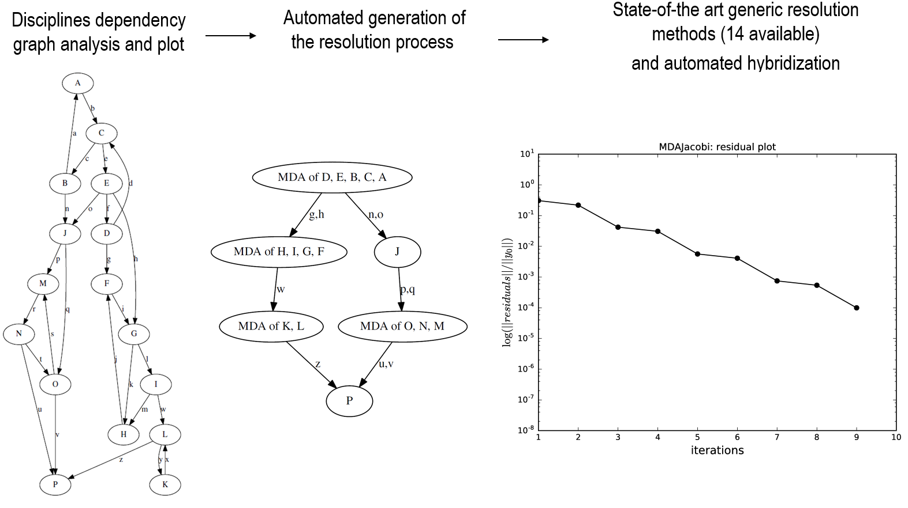
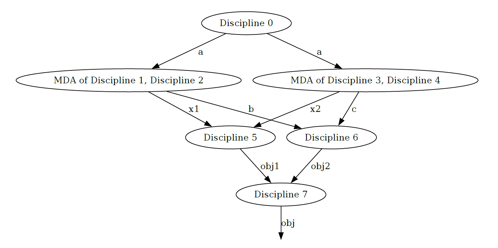

<!--
 Copyright 2021 IRT Saint Exupéry, https://www.irt-saintexupery.com

 This work is licensed under the Creative Commons Attribution-ShareAlike 4.0
 International License. To view a copy of this license, visit
 http://creativecommons.org/licenses/by-sa/4.0/ or send a letter to Creative
 Commons, PO Box 1866, Mountain View, CA 94042, USA.
-->

# Solving Multi Disciplinary Analysis { #concept-solving-multi-disciplinary-analysis }

Multi-Disciplinary Analyses — abbreviated MDA —
are required when dealing with coupled disciplines,
that is when inputs of disciplines are outputs of others.
Such variables are referred to as the coupling variables.

!!! tutorial
    - [Tutorial - The Multi-Disciplinary Analysis][tutorial-the-multidisciplinary-design-analysis]

For a given set of coupled disciplines,
the MDA solves for the coupling variables.
Mathematically,
it reduces to the solution of a non-linear system of equations
block-wise, of the form $R(x, y^{\star}) = 0$
where $y^{\star}$ represents the solution for the coupling variables
and $x$ the remaining variables.
These latter variables *parametrize* the system of equations,
e.g. for a fixed $x$,
the MDA computes $y^{\star}$ such that $R(x, y^{\star}) = 0$.

There are two main categories of MDA objects in GEMSEO:

- The ones implementing a non-linear solver
(inheriting from [BaseMDASolver][gemseo.mda.base_solver.BaseMDASolver]),
- The composed MDA,
which creates and/or uses inner MDA solvers (more information below).

## Non-linear solver algorithms { #concept-non-linear-solver-algorithms }

The non-linear solvers available in GEMSEO fall into two categories:

- fixed-point methods,
that compute fixed points of a coupling function $F$,
that is they solve equations of the form $F(y) = y$.
The fixed-point methods available in GEMSEO are
the [Jacobi](https://en.wikipedia.org/wiki/Jacobi_method) and
[Gauss-Seidel](https://en.wikipedia.org/wiki/Gauss%E2%80%93Seidel_method) methods.

- root finding methods
that solve non-linear systems of equations of the form $R(y) = 0$.
The root finding algorithms available in GEMSEO are
the [Newton-Raphson](https://en.wikipedia.org/wiki/Newton%27s_method) method
which uses the (possibly partial) derivatives $\partial R(y) / \partial y$,
and several derivative-free variants known as
[quasi-Newton](https://en.wikipedia.org/wiki/Quasi-Newton_method) methods.

!!! note
    A fixed-point problem can be reformulated as a root finding problem
    and reciprocally,
    since $R(y) = 0 \iff R(y) + y = y \iff F(y) = y$ with $F(y) = R(y) + y$.

## Composed MDA methods { #concept-composed-mda-methods }

The two composed MDAs available in GEMSEO are
the [MDASequential][gemseo.mda.sequential.MDASequential]
and the [MDAChain][gemseo.mda.chain.MDAChain].

### The MDA chain { #concept-the-mda-chain }

The [MDAChain][gemseo.mda.chain.MDAChain] implements
an advanced graph-based algorithm which allows,
when possible,
to split the solution of the non-linear system of equations into smaller
and weakly coupled ones.
The next figure illustrates this process on a 16 coupled disciplines toy problem.

*The 3 resolution phases of a 16 disciplines coupling problem.*

The MDA chain inspects the coupling graph
and **automatically** detects strongly coupled disciplines.
In the example above,
the problem is split into 4 sub-systems,
for which an inner MDA implementing a non-linear solver is used.

!!! how-to
    - [Instantiate an MDAChain][manage-nested-coupling-systems]

### The sequential MDA { #concept-the-sequential-mda }

The [MDASequential][gemseo.mda.sequential.MDASequential] implements
a generic mechanism to execute sequentially an arbitrary number of inner MDAs.

!!! note
    A specific instance of sequential MDA,
    namely the
    [MDAGaussSeidelNewtonRaphson][gemseo.mda.gauss_seidel_newton_raphson.MDAGaussSeidelNewtonRaphson]
    is readily available in GEMSEO.
    It starts with the Gauss-Seidel's method
    before switching to the Newton-Raphson's method.
    This approach is interesting since the Newton-Raphson's is more expensive,
    but converges quickly close to the solution.
    This kind of sequences typically takes advantage of
    the robustness of fixed-point methods
    while obtaining an accurate solution thanks to a Newton-Raphson's method.

!!! how-to
    - [Create sequential hybrid MDAs][create-sequential-hybrid-mdas]

## Execution of MDAs { #concept-execution-of-mdas }

The MDA inherits from [Discipline][gemseo.core.discipline.discipline.Discipline]
and can thus be executed and linearized as any other discipline.
As mentioned in the previous section,
the MDA solves the non-linear system of equations induced by coupled disciplines.
Formally,
it can be viewed as a function $\text{MDA}(x, y) = y^{\star}$
that takes $x$
and possibly initial values for the coupling variables $y$ and computes $y^{\star}$
that satisfies $R(x, y^{\star}) = 0$.

### Stopping criteria { #concept-mda-stopping-criteria }

The MDA solvers convergence can be monitored by two criteria:

- The maximum number of iterations,
- The tolerance on the normalized residual norm.

The residual of an MDA is a vector
defined by $\mathrm{couplings}_k - \mathrm{couplings}_{k+1}$,
where $k$ and $k+1$ are two successive iterations of the MDA algorithm
and $\mathrm{couplings}$ is the coupling vector.

The normed residual is the normalized value of $\lVert \mathrm{residuals} \rVert$.
When the normed residual is smaller than a given tolerance value,
the MDA has converged.
It is a simple way to quantify the MDA convergence.

!!! note
    The tolerance is monitored on a relative decrease on the residual norm.
    Several scaling strategies for the residual are available in GEMSEO.
    More information [here][gemseo.mda.base.BaseMDA.ResidualScaling]

### Acceleration/relaxation methods { #concept-mda-acceleration-relaxation }

Acceleration and relaxation methods are available for all the MDAs in GEMSEO.
The acceleration methods available can be found
[here][gemseo.algos.sequence_transformer.acceleration].

!!! how-to
    - [MDA acceleration techniques][accelerate-mda-convergence]

## Advanced features { #concept-advanced-features }

In addition to the standard MDA functionalities,
GEMSEO provides more advanced features
that can improve performances in certain situations.

### Parallelization { #concept-parallelization }

The following MDA algorithms can be parallelized:

- [MDAJacobi][gemseo.mda.jacobi.MDAJacobi],
- [MDAQuasiNewton][gemseo.mda.quasi_newton.MDAQuasiNewton],
- [MDANewtonRaphson][gemseo.mda.newton_raphson.MDANewtonRaphson],
- [MDAChain][gemseo.mda.chain.MDAChain].

When using parallelization,
it is possible to set the number of processes/threads
on which the execution will be split,
and whether to use threads or processes.
By default,
GEMSEO uses threads
and the number of threads is the number of CPUs available on the computer
the code is run on.

#### MDAChain specificities { #concept-mdachain-specificities }

In an [MDAChain][gemseo.mda.chain.MDAChain],
there may be an opportunity to parallelize
the execution of [BaseMDA][gemseo.mda.base.BaseMDA]
that can be executed independently.

In the figure above,
2 MDAs can be run in parallel,
hence reducing the overall [MDAChain][gemseo.mda.chain.MDAChain] execution
provided that enough resources are available on the computing node
(in our case, at least two CPUs).
By default,
the parallel execution of the independent
[BaseMDA][gemseo.mda.base.BaseMDA] are deactivated,
meaning that the execution of the two independent [BaseMDA][gemseo.mda.base.BaseMDA]
will remain sequential.
Yet,
a parallel execution of the two [BaseMDA][gemseo.mda.base.BaseMDA] can be activated
using the `mdachain_parallelize_task` boolean option.

If activated,
the user has also the possibility to provide parallelization options,
such as using either threads or processes to perform the parallelization,
or the number of processes or threads to use.
By default, threading is used as it is more lightweight,
but multiprocessing can be employed in specific cases
where race conditions may occur.

### Re-use coupling structures { #concept-re-use-coupling-structures }

MDAs are created from a set of coupled disciplines.
To determine the coupling variables,
a [CouplingStructure][gemseo.core.coupling_structure.CouplingStructure] object
is created
which uses graph algorithms to analyse the coupling structure
of the provided disciplines.
This process is made once at creation of the MDA,
and **only depends on the set of disciplines**.
The graph analysis can be expensive
if there is a large number of disciplines and/or plenty of inputs/outputs variables.

Since the coupling structure only depends on the coupled disciplines,
it can be computed independently,
stored,
and then provided to the MDA when needed.
