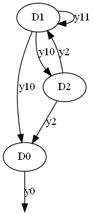
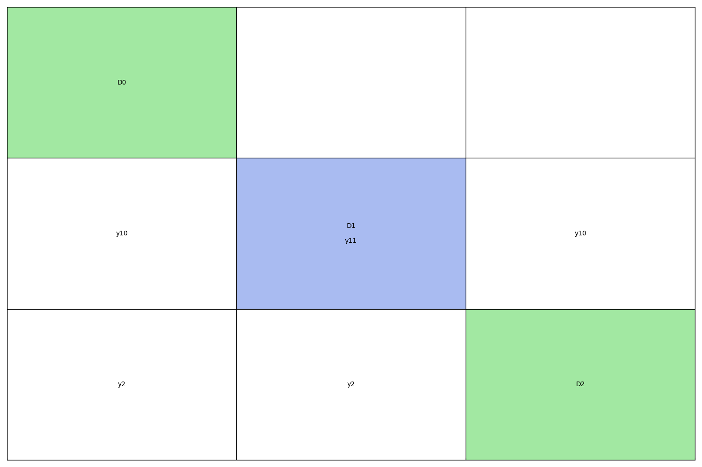
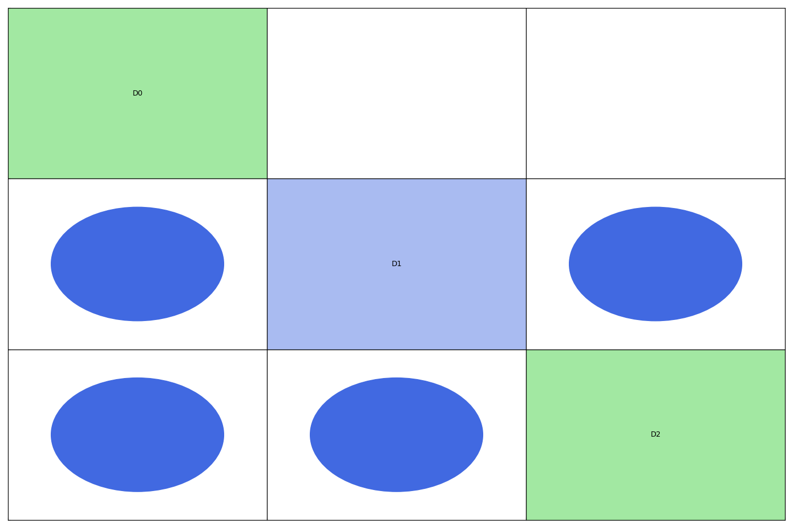
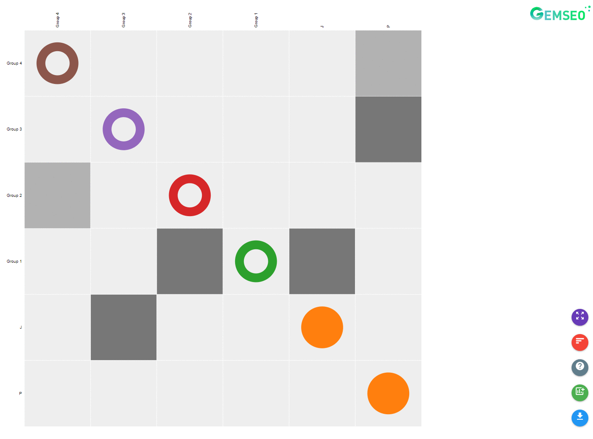

<!--
 Copyright 2021 IRT Saint Exupéry, https://www.irt-saintexupery.com

 This work is licensed under the Creative Commons Attribution-ShareAlike 4.0
 International License. To view a copy of this license, visit
 http://creativecommons.org/licenses/by-sa/4.0/ or send a letter to Creative
 Commons, PO Box 1866, Mountain View, CA 94042, USA.
-->

# Coupling visualization { #concept-coupling-visualization }

The coupling structure of a set of disciplines is automatically generated by GEMSEO
based on the convention that same variable names correspond to same variables.
GEMSEO offers the following tools to visualize the coupling structure:

- a network diagram, referred to as the *coupling graph*,
- a tabular view, referred to as the *N2 chart*.

## Dependency graph { #concept-dependency-graph }

These visualizations all rely on
the [DependencyGraph][gemseo.core.dependency_graph.DependencyGraph].
Underneath,
the [directed graph](https://en.wikipedia.org/wiki/Graph_(discrete_mathematics))
of couplings is built using the [NetworkX](https://networkx.org/) library.
From this directed graph,
standard network operations can be performed such as condensation
(using Tarjan's algorithm[^1] with Nuutila's modifications[^2])
or traversal algorithms to efficiently compute gradient propagation.

## Coupling graph visualization { #concept-coupling-graph-visualization }

The coupling graph is a network representation of the disciplines coupling structure.
The nodes of the network are the disciplines, and are labelled by their name.
An edge exists if there is a coupling variable between two disciplines,
and is oriented
from the producing discipline (where the variable is an output)
to the consuming discipline (where it is an input).
The edges are labelled by the coupling variable names.

!!! how-to
    - [Generate a coupling graph][generate-a-coupling-graph]

### Full graph { #concept-full-graph }

In the full graph representation, each discipline is associated to a single node,
and an edge is drawn for each coupling variable.

### Condensed graph { #concept-condensed-graph }

In the condensed graph, the strongly coupled disciplines are gathered in a single node
labelled with a `MDA of` prefix. In this view, the coupling variables inside a
strongly coupled component are hidden.
In the example below, `D1` and `D2` are strongly coupled (they belong to a common cycle)
and are therefore aggregated in the node `MDA of D1, D2` in the condensed graph below.

## N2 chart visualization { #concept-n2-chart }

The [N2 charts](https://en.wikipedia.org/wiki/N2_chart),
also referred to as N2 diagrams,
N-squared diagrams
or N-squared charts,
are a tabular representation of the coupling structure.

The diagonal elements of an N2 chart are the disciplines
while the non-diagonal elements are the coupling variables.
A discipline takes its inputs vertically and returns its outputs horizontally.
In other words, the cell *(i,j)* contains the names of the variables that are
outputs of the *i*-th discipline (i.e. computed by it) and
inputs of the *j*-th discipline.

The N2 chart can be constructed for both the full and condensed coupling graph.
GEMSEO offers:

- a static visualization for the full graph,
- an interactive visualization for both the full and condensed graphs.

!!! note
    The self-coupled disciplines are represented by diagonal blocks
    with a specific background color:
    blue for the static N2 chart
    and the color of the group to which the discipline belongs for the dynamic N2 chart.

!!! how-to
    - [Generate the N2 chart][generate-the-n2-chart]

### Static N2 diagram { #concept-static-visualization-of-the-full-graph }

The default static N2 diagram is shown in the figure below.

When dealing with too many coupling variables,
this graph tends to become hard to interpret.
Therefore,
coupling names may be removed and replaced by blue ellipses,
as shown in the figure below.

### Dynamic N2 diagram { #concept-dynamic-visualization-of-the-full-graph }

To improve the usage of N2 diagrams,
a dynamic and interactive version can also be viewed in a browser:
[An interactive N2 chart](../../../_static/n2.html).

The figure below shows some features of this interactive visualization.

[^1]: Depth-first search and linear graph algorithms, R. Tarjan SIAM Journal of Computing 1(2):146-160, (1972).

[^2]: On finding the strongly connected components in a directed graph. E. Nuutila and E. Soisalon-Soinen Information Processing Letters 49(1): 9-14, (1994).
