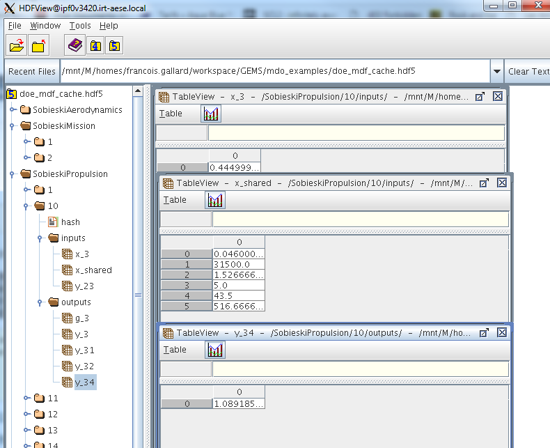

<!--
 Copyright 2021 IRT Saint Exupéry, https://www.irt-saintexupery.com

 This work is licensed under the Creative Commons Attribution-ShareAlike 4.0
 International License. To view a copy of this license, visit
 http://creativecommons.org/licenses/by-sa/4.0/ or send a letter to Creative
 Commons, PO Box 1866, Mountain View, CA 94042, USA.
-->

# Cache { #concept-cache }

A [discipline][concept-discipline]
owns a [cache][gemseo.core.discipline.discipline.Discipline.cache]
that stores the input, output and Jacobian data produced by its executions.
Recording these data serves several purposes:

- skip the re-execution of a discipline at an input value
  for which it has already been evaluated,
- preserve evaluations for post-processing,
  e.g. visualization, statistics, machine learning or debugging,
- checkpoint a long sequential disciplinary process
  so that it can be restarted from the last successful iteration after a crash.

These benefits become especially significant
when the discipline wraps a costly simulation,
in which case caching helps avoid wasting computing resources.

!!! note
    "Discipline" here means any subclass of
    [Discipline][gemseo.core.discipline.discipline.Discipline],
    including process disciplines that consist of other disciplines, such as
    [DisciplineChain][gemseo.discipline.chain.chain.DisciplineChain],
    [MDAChain][gemseo.mda.chain.MDAChain]
    and the [MDA][concept-solving-multi-disciplinary-analysis] solvers
    (e.g. [MDAGaussSeidel][gemseo.mda.gauss_seidel.MDAGaussSeidel],
    [MDANewtonRaphson][gemseo.mda.newton_raphson.MDANewtonRaphson]).
    Their evaluations can therefore be cached
    just like those of a user discipline,
    which is useful for instance to skip a full MDA solve
    when the same input vector has already been processed.

!!! how-to
    - [Access and clear a discipline cache][access-and-clear-a-discipline-cache]
    - [Set a discipline cache][set-a-discipline-cache]
    - [Manipulate data in a cache][manipulate-data-in-a-cache]
    - [Merge different caches][merge-different-caches]
    - [Exploit an HDF5 cache file][exploit-an-hdf5-cache-file]

## How it works { #concept-how-it-works }

When the user passes an input value to the method
[execute()][gemseo.core.discipline.discipline.Discipline.execute],
the [Discipline][gemseo.core.discipline.discipline.Discipline]
looks in its [cache][gemseo.core.discipline.discipline.Discipline.cache]
to find an output value associated with this input value.
If so, it returns it to the user.
Otherwise,
it computes it,
stores it in the cache and returns it to the user.

!!! note
    For performance reasons,
    during the search in the cache,
    an input value of type `Mapping[str, ndarray | int | float]`
    is flattened into a NumPy array.
    This array is then hashed using the XXH64 algorithm
    from the [xxHash library](https://cyan4973.github.io/xxHash/)
    and the resulting hash value is compared
    to those stored in the cache.

A `tolerance` can be set to relax the input comparison.
Two input arrays are considered equal when
the allclose function from NumPy is satisfied:

`allclose(a, b, rtol=tol, atol=tol, equal_nan=True)`

which corresponds to the following equality test:

`absolute(a - b) <= (tol + tol * absolute(b))`

where `a` is the new array, `b` is the reference array and `tol` is the tolerance.
In the `allclose` function, the tolerance parameter `tol` is used for both relative (`rtol`)
and absolute (`atol`) error tolerances.

## Different cache types { #concept-different-cache-types }

GEMSEO ships with three cache implementations:

- in memory:
    - [SimpleCache][gemseo.core.cache.simple.SimpleCache] (default policy)
      only stores the data associated with the last call to
      [execute()][gemseo.core.discipline.discipline.Discipline.execute];
    - [MemoryFullCache][gemseo.core.cache.memory_full.MemoryFullCache]
      stores in memory the data associated with all the calls to
      [execute()][gemseo.core.discipline.discipline.Discipline.execute];
      since its memory footprint grows with the number of evaluations,
      it can quickly exhaust the available RAM
      and crash the process
      when used with a long-running discipline
      or with large input, output or Jacobian arrays;
      prefer
      [HDF5Cache][gemseo.core.cache.hdf5.HDF5Cache] in that case;
- on disk:
    - [HDF5Cache][gemseo.core.cache.hdf5.HDF5Cache]
      stores in a node of an HDF5 file
      the data associated with all the calls to
      [execute()][gemseo.core.discipline.discipline.Discipline.execute].

      HDF5 (Hierarchical Data Format version 5)
      is a file format designed to store and organize large and complex datasets.
      An HDF5 file has a hierarchical structure,
      similar to a file system,
      where data is stored in groups (like folders) and datasets (like files).
      This structure allows multiple datasets to coexist in a single file,
      each accessible through a unique path.
      Metadata can also be attached to groups and datasets using attributes,
      making HDF5 well suited for scientific and engineering applications.

!!! warning
    - The [MemoryFullCache][gemseo.core.cache.memory_full.MemoryFullCache]
      relies on some multiprocessing features.
      When working on Windows,
      the execution of scripts containing instances of
      [MemoryFullCache][gemseo.core.cache.memory_full.MemoryFullCache]
      must be protected by an
      `if __name__ == '__main__':` statement.
    - The [HDF5Cache][gemseo.core.cache.hdf5.HDF5Cache]
      also relies on some multiprocessing features.
      When working on Windows,
      the execution of scripts containing instances of
      [HDF5Cache][gemseo.core.cache.hdf5.HDF5Cache]
      must be protected by an
      `if __name__ == '__main__':` statement.
      The use of an HDF5 cache is currently not supported in parallel on Windows
      platforms because of the way subprocesses are forked in this architecture;
      the method
      [set_backup_settings()][gemseo.scenario.evaluation.EvaluationScenario.set_backup_settings]
      is recommended as an alternative.

!!! note
    The cache types can be extended
    by subclassing
    [BaseFullCache][gemseo.core.cache.base_full.BaseFullCache]
    or [MemoryFullCache][gemseo.core.cache.memory_full.MemoryFullCache].
    The method
    [set_cache()][gemseo.core.discipline.discipline.Discipline.set_cache]
    discovers the new types automatically
    through the
    [CacheFactory][gemseo.core.cache.factory.CacheFactory].

## Going further { #concept-going-further }

The [HDFView](https://www.hdfgroup.org/download-hdfview/)
application can be used to explore the data of an
[HDF5Cache][gemseo.core.cache.hdf5.HDF5Cache]:

*HDFView of the cache generated by an MDF DOE scenario execution on the SSBJ test case*

Any cache can be converted to a
[dataset][concept-dataset]
with [BaseCache.to_dataset()][gemseo.core.cache.base.BaseCache.to_dataset];
see the example [Convert a cache to a dataset][convert-a-cache-to-a-dataset].

!!! info "See also"
    See the [Cache section of the Discipline page][concept-discipline-cache]
    for the role of the cache in the discipline lifecycle,
    and the [Dataset page][concept-dataset]
    for the central post-processing structure that a cache feeds into.
