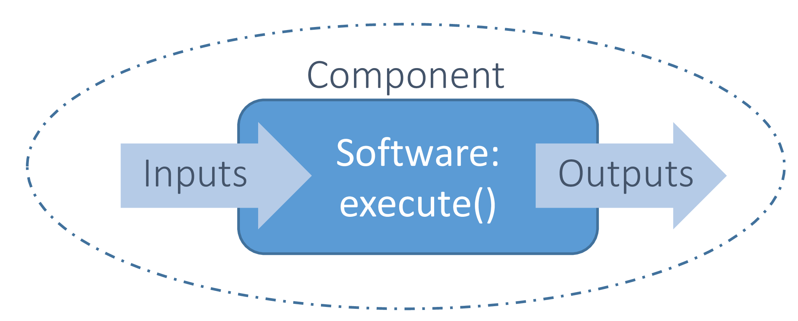

<!--
 Copyright 2021 IRT Saint Exupéry, https://www.irt-saintexupery.com

 This work is licensed under the Creative Commons Attribution-ShareAlike 4.0
 International License. To view a copy of this license, visit
 http://creativecommons.org/licenses/by-sa/4.0/ or send a letter to Creative
 Commons, PO Box 1866, Mountain View, CA 94042, USA.
-->

# Discipline { #concept-discipline }

  A [Discipline][gemseo.core.discipline.Discipline]
  is one of the basic building components of GEMSEO:
  it computes output variables from input variables
  through any software — Python functions, external python packages,
  external executables in other languages or as binaries ...

!!! tutorial
    - [Tutorial - Your first discipline][]
    - [Tutorial - Wrap an executable][]

## Grammar { #concept-grammars}

The input and output variables of a discipline are described by a grammar,
which defines the variable names and eventually their types and values.
Grammars validate input and output data at execution time,
catching invalid values early
and preventing the discipline from running with inconsistent data.

The different grammar types are:

- [SimplerGrammar][gemseo.core.grammars.simpler.SimplerGrammar]: defines variable names only, with no value validation.
- [SimpleGrammar][gemseo.core.grammars.simple.SimpleGrammar]: defines variable names and their type (pure Python types only).
- [JSONGrammar][gemseo.core.grammars.json.JSONGrammar]: validates variable values against a JSON Schema.
- [PydanticGrammar][gemseo.core.grammars.pydantic.PydanticGrammar]: validates variable values against a Pydantic model,
  enabling fine-grained validation rules and natural definition.

!!! how-to
    - [Use a Pydantic grammar][]

## Jacobian { #concept-discipline-jacobian }

A [Discipline][gemseo.core.discipline.discipline.Discipline]
can compute the derivatives of its outputs with respect to its inputs.
These derivatives are either analytic,
implemented by the user,
or numerically approximated.

!!! how-to
    - [Compute the Jacobian of a discipline][]
    - [Change the differentiation settings][]
    - [Check the Jacobian of a discipline][]
    - [Partial analytical Jacobian with numerical completion][]

## Cache { #concept-discipline-cache }

A [Discipline][gemseo.core.discipline.discipline.Discipline]
has a
[cache][gemseo.core.discipline.discipline.Discipline.cache]
that stores the input, output and Jacobian data of an execution.

Storing these executions serves several purposes:

- skip re-execution when a discipline has already been evaluated at a given input value,
- preserve data for post-processing, e.g. visualization, statistics, machine learning or debugging,
- checkpoint the current state so that a crashed sequential disciplinary process can resume from the last successful iteration,
- ...

These benefits become especially significant
when a discipline wraps a costly simulation,
as caching prevents redundant computations.

!!! info "See also"
    See [Cache][concept-cache] for more details.

## Going further { #concept-going-further }

GEMSEO provides several built-in disciplines ready to use out of the box.
See [Different types of disciplines][] for more details.
