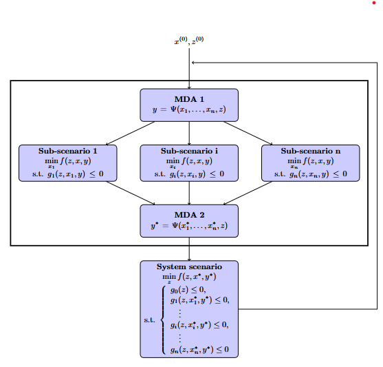

<!--
 Copyright 2021 IRT Saint Exupéry, https://www.irt-saintexupery.com

 This work is licensed under the Creative Commons Attribution-ShareAlike 4.0
 International License. To view a copy of this license, visit
 http://creativecommons.org/licenses/by-sa/4.0/ or send a letter to Creative
 Commons, PO Box 1866, Mountain View, CA 94042, USA.
-->

# The Bi-level formulation { #concept-the-bi-level-formulation }

Bi-level formulations are a family of MDO formulations
that involve multiple optimization sub-problems to
be solved to obtain the solution of the MDO problem.

In many of them, and in particular in formulations derived from BLISS,
the optimization sub-problems are separated according to the design variables.
The design variables shared by multiple disciplines
are put in a so-called system level optimization sub-problem.
In so-called disciplinary optimization sub-problems,
only the design variables that have a direct impact on one discipline are used.
Then,
the coupling variables may be solved by a [MDA][concept-solving-multi-disciplinary-analysis],
as in formulations derived from MDF (BLISS, ASO or CSSO),
or by using consistency constraints (eventually handled through a penalty approach)
like in IDF-like formulations (CO or ATC).

The next figure shows
the decomposition of the Bi-level MDO formulation implemented in GEMSEO with two MDAs,
the parallel sub-optimizations
and a main optimization (system level) on the shared variables.
It is an MDF-based approach,
derived from the BLISS 98 formulation and variants from ONERA[@Blondeau2012].
This formulation was invented in the MDA-MDO project at
IRT Saint Exupéry[@gazaix2017towards][@Gazaix2019] and also used in the
R-EVOL project[@gazaix2024industrialization].

This block decomposition is motivated by several purposes.
First, this separation aligns
with the industrial needs of work repartition between domains,
which matches the decomposition in terms of disciplines.
It allows for greater flexibility
in the use of specific approaches (algorithms) for solving
disciplinary optimizations, also dealing with less design variables at the same time.
Secondly,
as the full coupled derivatives may not be available,
the use of a gradient-based
approach with all variables in the loop may not be affordable.

In the current Bi-level formulation, the objective function is minimized block by block,
in parallel,
with each block $i$ minimizing its own variables $x_i$
and handling its own constraints $g_i$.
Sometimes, if it is not straightforward to optimize the objective function $f$
in the sub-problem $i$, another function $f_i$ can be considered as long as its decay
is consistent with the decay (monotonic decrease) of the overall objective function $f$.
The decomposition is such that the sub-problems constraints $g_i$ are assumed
to depend on other block variables $x_{\neq i}$ only through the couplings.
These couplings are solved by two MDAs: one before the sub-optimizations in order
to compute equilibrium values for each block,
and the second one after the sub-optimizations in order to recompute the equilibrium
for system level functions.
The sub-optimization blocks do not exchange any information
when they are solved in parallel,
which means that the synchronization is ensured by the two MDAs
and the system iterations
which warm start each block with the previous optimal values of local variables.
If the effect of one block variables $x_i$ on another block $j$ is too significant,
it means that the optimal solution $x^*$ is sensitive to the initial guess $x$,
and therefore that for same values of shared variables $z$,
different solutions $x^*$ can be obtained.
As a consequence,
the synchronization mechanism may not be sufficient
to solve accurately the lower problem and the system level algorithm may not converge
to the right solution.
In such a situation,
an enhancement is proposed with the
[bi-level BCD formulation][concept-the-bi-level-block-coordinate-descent-formulation]
which extends the range of problems that can be solved with Bi-level approaches.

## Going further { #concept-going-further }

!!! tip "How-tos"
    - [MDO formulation][mdo-formulation]
