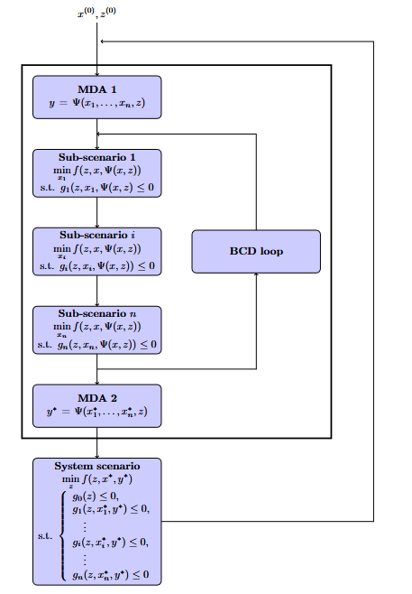

<!--
 Copyright 2021 IRT Saint Exupéry, https://www.irt-saintexupery.com

 This work is licensed under the Creative Commons Attribution-ShareAlike 4.0
 International License. To view a copy of this license, visit
 http://creativecommons.org/licenses/by-sa/4.0/ or send a letter to Creative
 Commons, PO Box 1866, Mountain View, CA 94042, USA.
-->

# The Bi-level Block Coordinate Descent formulation { #concept-the-bi-level-block-coordinate-descent-formulation }

The Bi-level BCD formulation adds more robustness and stability with respect to the
previous [bi-level formulation][concept-the-bi-level-formulation],
solving more accurately the inner sub-problem.
The decomposition discussed in [bi-level formulation][concept-the-bi-level-formulation] section
remains the same
and motivated by the same considerations.
The next figure shows
the process corresponding to the Bi-level BCD implemented in GEMSEO.
This formulation was invented in the R-EVOL project at
IRT Saint Exupéry[@David2024][@david-hal-04758286].

Here,
it can be seen that the lower problem is solved
by a Block Coordinate Descent method (BCD),
also known as the Block Gauss-Seidel method (BGS),
which means that each block,
consisting of a disciplinary optimization,
is sequentially optimized
within an iterative loop until convergence.
As a consequence,
each block $i$ is updated
at every BCD iteration with $x_{\neq i}^*$ until a fixed point $x^*$ is found,
regardless the initial guess $x$,
which drastically reduces the discrepancy of lower level
solutions with respect to same values of shared variables.

In David et al. [@david-hal-04758286], several variants are discussed,
regarding the way how the couplings are solved:

- when all the couplings are solved by running MDAs within each sub-optimization,
  the formulation is referred to as the Bi-level BCD-MDF;
- when each sub-optimization no longer solves the whole coupling vector but only
  its own block of coupling variables, similarly to the design vector $x_i$,
  the formulation is referred to as the Bi-level BCD-WK (stands for weak BCD).
  In this case, both the design variables and the coupling variables are exchanged
  through the BCD loop and updated at each sub-optimization.
  This approach can be considered either when running MDAs in each sub-optimization is
  too time consuming, or when it is simply not accessible due to tools limitation
  that do not give access to all coupling functions.

The Bi-level BCD process schematized in the above image corresponds to
the Bi-level BCD-MDF version where all the couplings are solved within each block,
which is explicitly denoted by the dependence of $f$ and $g_i$ to $\Psi(x, z)$,
meaning that the couplings are recomputed
and not fixed during sub-optimization
conversely to the previous [bi-level formulation][concept-the-bi-level-formulation].
While MDA 1 and 2 may not be theoretically necessary,
in practice they allow to respectively compute more relevant initial
coupling values for the BCD loop
and objective function and constraints values for the system level optimizers
when the BCD loop is not fully or not enough converged.

## Going further { #concept-going-further }

!!! tip "How-tos"
    - [MDO formulation][mdo-formulation]
