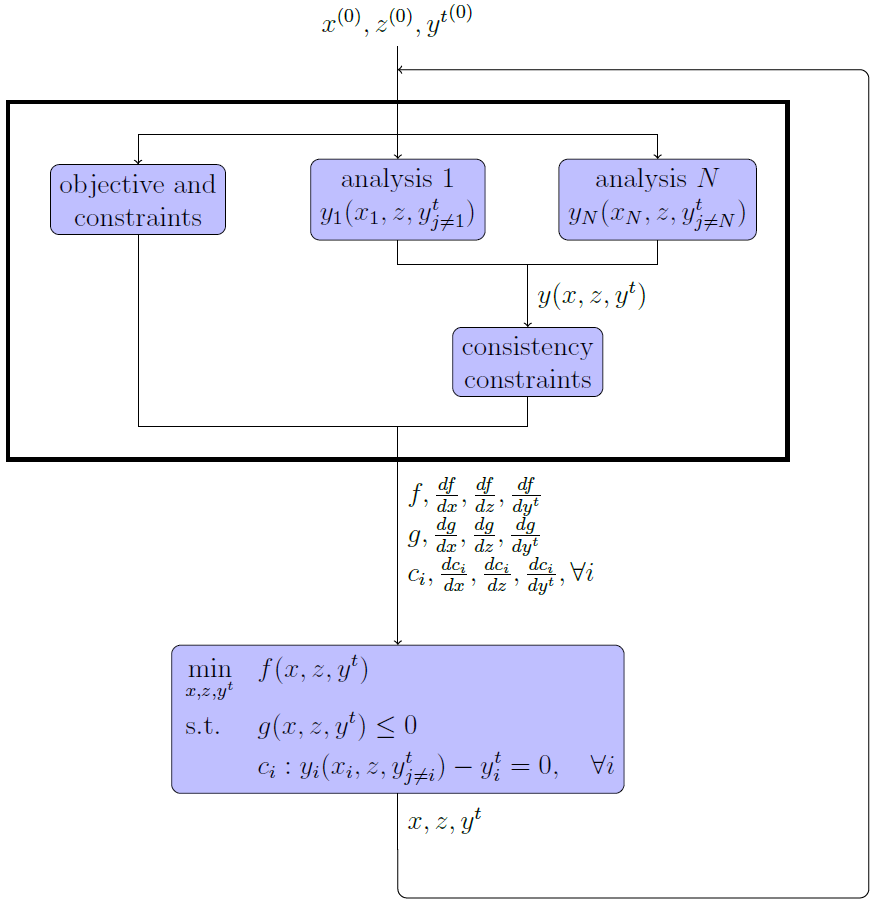
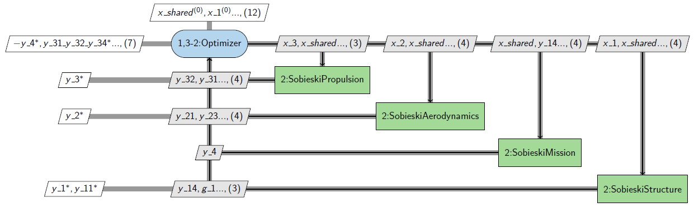
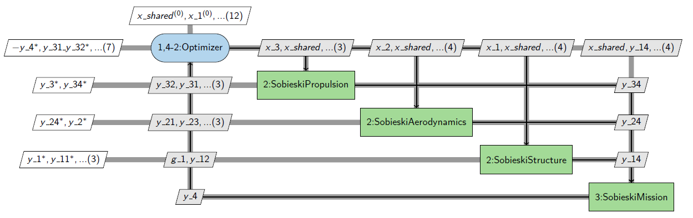

<!--
 Copyright 2021 IRT Saint Exupéry, https://www.irt-saintexupery.com

 This work is licensed under the Creative Commons Attribution-ShareAlike 4.0
 International License. To view a copy of this license, visit
 http://creativecommons.org/licenses/by-sa/4.0/ or send a letter to Creative
 Commons, PO Box 1866, Mountain View, CA 94042, USA.
-->

# The IDF formulation { #concept-the-idf-formulation }

IDF stands for individual discipline feasible.
This MDO formulation expresses the MDO problem as

$$
\begin{aligned}
& \underset{x,z,y^t}{\text{min}} & & f(x, z, y^t) \\
& \text{subject to} & & g(x, z, y^t) \le 0 \\
& & & h(x, z, y^t) = 0 \\
& & & y_i(x_i, z, y^t_{j \neq i}) - y_i^t = 0, \quad \forall i \in \{1,\ldots, N\}
\end{aligned}
$$

where $y^t=(y_1^t,y_2^t,\ldots,y_N^t)$ are additional optimization variables,
called *targets* or *coupling targets*,
used as input coupling variables of the disciplines.
The additional constraints
$y_i(x_i, z, y^t_{j \neq i}) - y_i^t = 0, \forall i \in \{1, \ldots, N\}$,
called *consistency* constraints,
ensure that
the output coupling variables computed by the disciplines $y$ coincide with the targets.

The use of coupling targets allows the disciplines to be run in a decoupled way
while the use of consistency constraints guarantees
a multidisciplinary feasible solution at convergence of the optimizer.
The iterations are less costly than those of MDF, as they do not use an MDA algorithm,
and the optimization path through the design space may lead to a faster convergence.
However, IDF does not allow early stopping
with the guarantee of a multidisciplinary feasible solution, unlike MDF.

Note that the targets can include either all the couplings or the strong couplings only.
If all couplings are considered,
then all disciplines are executed in parallel,
and all couplings (weak and strong) are set as target variables in the design space.
This maximizes the exploitation of the parallelism but leads to a larger design space,
so usually more iterations are done by the optimizer.

If strong couplings only are considered,
then the coupling graph is analyzed
and the disciplines are chained in sequence and in parallel to solve all weak couplings.
In this case,
the size of the optimization problem is reduced,
which usually leads to less iterations.
The best option depends on the number of strong vs weak couplings,
the availability of gradients,
the availability of CPUs versus the number of disciplines,
so it is very context dependant.

## Going further { #concept-going-further }

!!! tip "How-tos"
    - [MDO formulation][mdo-formulation]
