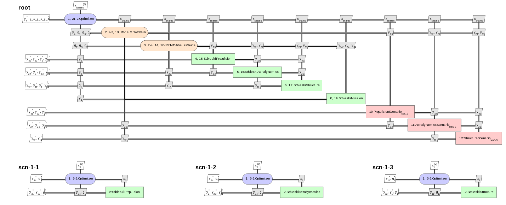
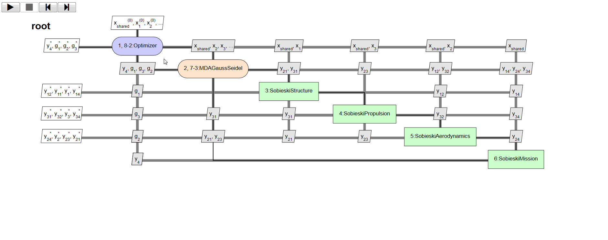

<!--
 Copyright 2021 IRT Saint Exupéry, https://www.irt-saintexupery.com

 This work is licensed under the Creative Commons Attribution-ShareAlike 4.0
 International License. To view a copy of this license, visit
 http://creativecommons.org/licenses/by-sa/4.0/ or send a letter to Creative
 Commons, PO Box 1866, Mountain View, CA 94042, USA.
-->

<!--
Contributors:
         :author: Charlie Vanaret, Francois Gallard, Rémi Lafage
-->

# MDO formulations { #concept-mdo-formulations }

!!! tutorial
    - [Execute your first Multi-Disciplinary Optimization][tutorial-execute-your-first-multi-disciplinary-optimization]
    - [Solve a bi-level MDO problem][tutorial-solve-a-bi-level-mdo-problem]

!!! how-to
    - [Generate an XDSM chart][generate-an-xdsm-chart]
    - [Save the execution history of a scenario][save-the-execution-history-of-a-scenario]
    - [Use multi-processing for your DOE][use-multi-processing-for-your-doe]

<!-- TODO: Define what is a formulation -->

In this section we describe the MDO formulations features of GEMSEO.

## Available formulations in GEMSEO { #concept-available-formulations-in-gemseo }

GEMSEO contains the following formulations:

- [MDF (Multi-Disciplinary Feasible)][concept-the-mdf-formulation];
- [IDF (Individual Discipline Feasible)][concept-the-idf-formulation];
- a simple disciplinary optimization formulation for a weakly coupled problem;
- a particular [bi-level][concept-the-bi-level-formulation] formulation from IRT Saint Exupéry;
- another bi-level formulation,
  denoted [bi-level BCD][concept-the-bi-level-block-coordinate-descent-formulation] formulation,
  from IRT Saint Exupéry that enhances the previous one with a
  Block Coordinate Descent (BCD) algorithm.

In the following, general concepts about the formulations are given.
The [MDF][concept-the-mdf-formulation] and [IDF][concept-the-idf-formulation] text
is integrally taken from the paper[@Vanaret2017].

!!! tip
      For a review of MDO formulations, see Martins and Lambe [@MartinsSurvey].

The following notations are used in formulation descriptions:

- $N$ is the number of disciplines,
- $x=(x_1,x_2,\ldots,x_N)$ are the local design variables,
- $z$ are the shared design variables,
- $y=(y_1,y_2,\ldots,y_N)=\Psi(x, z)$ are the coupling variables,
- $f$ is the objective,
- $g$ are the constraints.

## XDSM visualization { #concept-xdsm-visualization }

GEMSEO allows to visualize a given MDO scenario/formulation
as an XDSM diagram[@Lambe2012] in a web browser.
The figure below shows an example of such visualization.

The XDSM visualization shows:

- dataflow between disciplines (connections between disciplines as list of exchanged variables)
- optimization problem display (click on optimizer box)
- workflow (sequence of execution) animation (top-left control buttons trigger either automatic or step-by-step mode)

Those features are illustrated by the animated gif below.

The rendering is handled by
the visualization library [XDSMjs](https://github.com/whatsopt/XDSMjs).

## Going further { #concept-going-further }

!!! tip "How-tos"
    - [MDO formulation][mdo-formulation]
