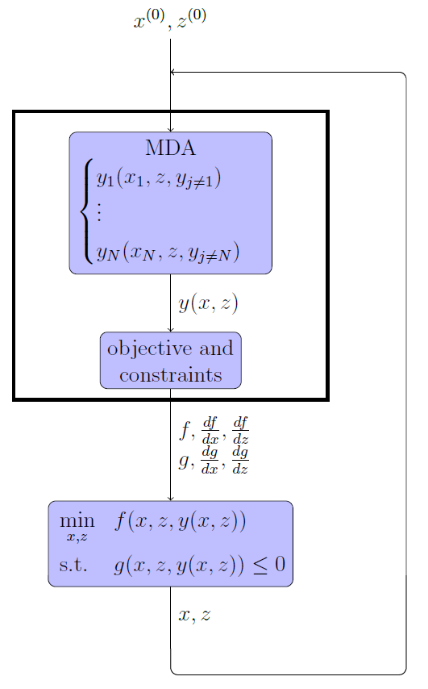

<!--
 Copyright 2021 IRT Saint Exupéry, https://www.irt-saintexupery.com

 This work is licensed under the Creative Commons Attribution-ShareAlike 4.0
 International License. To view a copy of this license, visit
 http://creativecommons.org/licenses/by-sa/4.0/ or send a letter to Creative
 Commons, PO Box 1866, Mountain View, CA 94042, USA.
-->

# The MDF formulation { #concept-the-mdf-formulation }

MDF is an architecture that guarantees an equilibrium between all
disciplines at each iterate $(x, z)$ of the optimization process.
Consequently, should the optimization process be prematurely
interrupted, the best known solution has a physical meaning. MDF generates
the smallest possible optimization problem, in which the coupling
variables are removed from the set of optimization variables and the
residuals removed from the set of constraints:

$$
\begin{aligned}
& \underset{x,z}{\text{min}} & & f(x, z, \Psi(x, z)) \\
& \text{subject to} & & g(x, z, \Psi(x, z)) \le 0
\end{aligned}
$$

The coupling variables $y=\Psi(x, z)$ are computed at equilibrium via an MDA.
Essentially, it involves solving a system of equations
(which may be non-linear)
using fixed-point methods (Gauss-Seidel, Jacobi) or root-finding methods
(Newton-Raphson, quasi-Newton). A prerequisite for invoking is the
existence of an equilibrium for any values of the design variables
$(x, z)$ encountered during the optimization process.

Gradient-based optimization algorithms require the computation of the
total derivatives of $\phi(x, z, \Psi(x, z))$, where
$\phi \in \{f, g\}$ and $v \in \{x,
z\}$.

For details on the MDAs,
see [this page][concept-solving-multi-disciplinary-analysis].
For details on coupled derivatives and gradients computation,
see [this page][concept-coupled-gradient-computation].

!!! warning
      Any [Discipline][gemseo.core.discipline.discipline.Discipline]
      that will be placed inside an [MDF][gemseo.formulations.mdf.MDF] formulation
      with strong couplings **must** define its default inputs.
      Otherwise, the execution will fail.

## Going further { #concept-going-further }

!!! tip "How-tos"
    - [MDO formulation][mdo-formulation]
