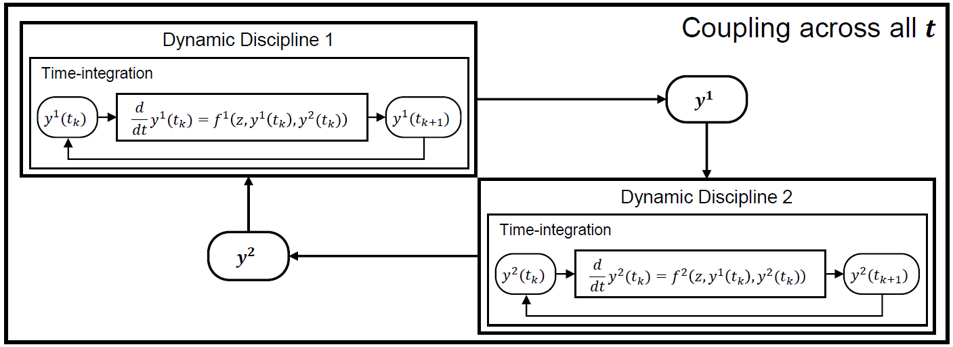
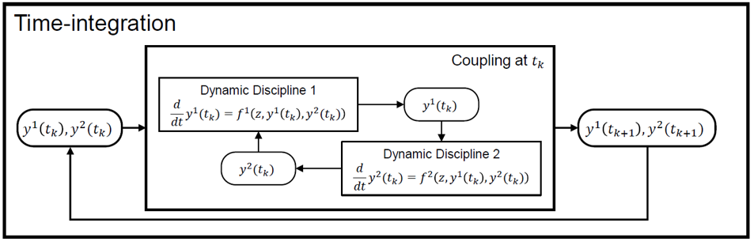

<!--
 Copyright 2021 IRT Saint Exupéry, https://www.irt-saintexupery.com

 This work is licensed under the Creative Commons Attribution-ShareAlike 4.0
 International License. To view a copy of this license, visit
 http://creativecommons.org/licenses/by-sa/4.0/ or send a letter to Creative
 Commons, PO Box 1866, Mountain View, CA 94042, USA.
-->

# Coupling ODE disciplines { #concept-ode-coupling }

Like other disciplines, [ODEDiscipline][gemseo.disciplines.ode.ode_discipline.ODEDiscipline] instances can be coupled to other disciplines
in an [MDA][concept-solving-multi-disciplinary-analysis] to model the dynamics of coupled physical systems.

## Coupled instances of ODEDiscipline

A first approach consists in modeling each entity of the system as a separate
[ODEDiscipline][gemseo.disciplines.ode.ode_discipline.ODEDiscipline] with the parameter `return_trajectories` set to `True`.
The coupling between the disciplines is done by passing the trajectories computed by each [ODEDiscipline][gemseo.disciplines.ode.ode_discipline.ODEDiscipline] as
inputs of the other [ODEDiscipline][gemseo.disciplines.ode.ode_discipline.ODEDiscipline] in the form of *design variables*.

## Coupled dynamic inside an ODEDiscipline

A different approach consists in defining a single [ODEDiscipline][gemseo.disciplines.ode.ode_discipline.ODEDiscipline] for the entire system,
whose state is the collection of all the variables representing each component of the coupled system,
and whose dynamic is the result of an [MDA][concept-solving-multi-disciplinary-analysis] over all the disciplines describing
the dynamics of the components of the system.

