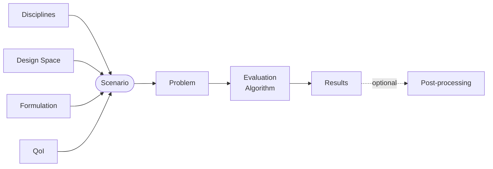

<!--
 Copyright 2021 IRT Saint Exupéry, https://www.irt-saintexupery.com

 This work is licensed under the Creative Commons Attribution-ShareAlike 4.0
 International License. To view a copy of this license, visit
 http://creativecommons.org/licenses/by-sa/4.0/ or send a letter to Creative
 Commons, PO Box 1866, Mountain View, CA 94042, USA.
-->

# Introduction { #concept-scenarios }

A scenario is a high-level interface that assembles
a set of [disciplines][concept-discipline],
a [design space][concept-design-space]
and quantities of interest (QoI)
using a [formulation][concept-mdo-formulations]
to build a multidisciplinary [problem][concept-problems],
execute it with an evaluation algorithm (a DOE algorithm or an optimizer),
and optionally post-process the results.

Unlike [problems][concept-problems],
which operate directly on [functions][concept-functions],
scenarios work at the disciplinary level.
In the background,
the scenario delegates to the [formulation][concept-mdo-formulations] the automatic construction of a problem
using multidisciplinary functions mapping from the design space to the output space of interest.

## Different types of scenarios { #concept-different-types-of-scenarios }

GEMSEO provides two scenario types:

- [evaluation scenario][concept-evaluation]:
  evaluates disciplinary outputs from inputs over a design space,
  driven by a DOE algorithm;
- [optimization scenario][concept-optimization]:
  solves a multidisciplinary design optimization (MDO) problem,
  driven by an optimizer or a DOE algorithm.

## Monitoring { #concept-scenario-monitoring }

GEMSEO provides several modes for monitoring the execution status of a scenario's disciplines in real time:
logging, live XDSM diagram updates, the observer design pattern, and Gantt charts.

## Going further

!!! explanations
    - [Scenario types][concept-scenario-types]
    - [Monitoring a scenario][monitoring-a-scenario]

!!! tutorial
    - [Tutorial - Execute your first Multi-Disciplinary Optimization][tutorial-execute-your-first-multi-disciplinary-optimization]
    - [Tutorial - Execute your first Design of Experiment (DoE)][tutorial-execute-your-first-design-of-experiment-doe]

!!! how-to
    - [Execute a scenario][execute-a-scenario]
    - [Observe variables of interest][observe-variables-of-interest]
