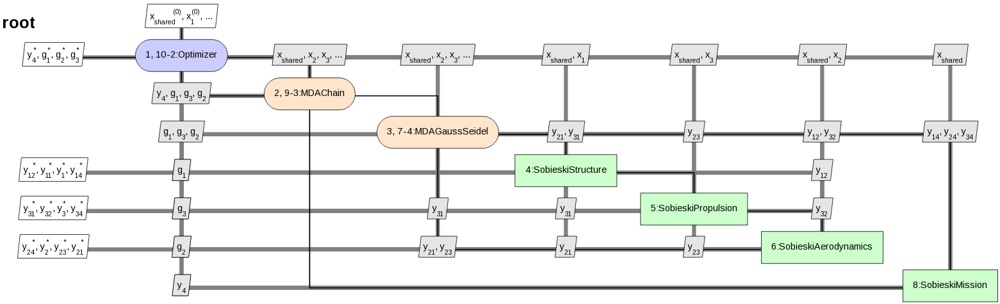
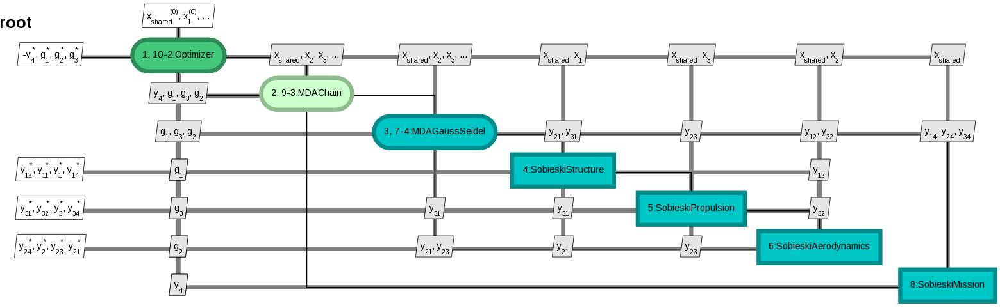
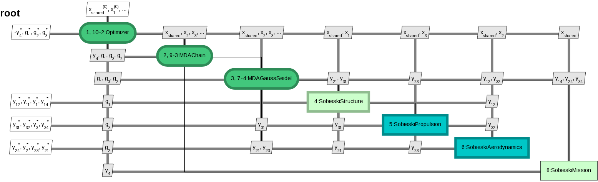
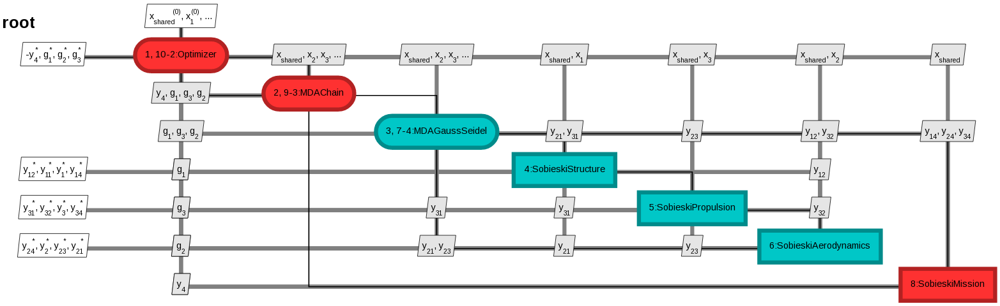
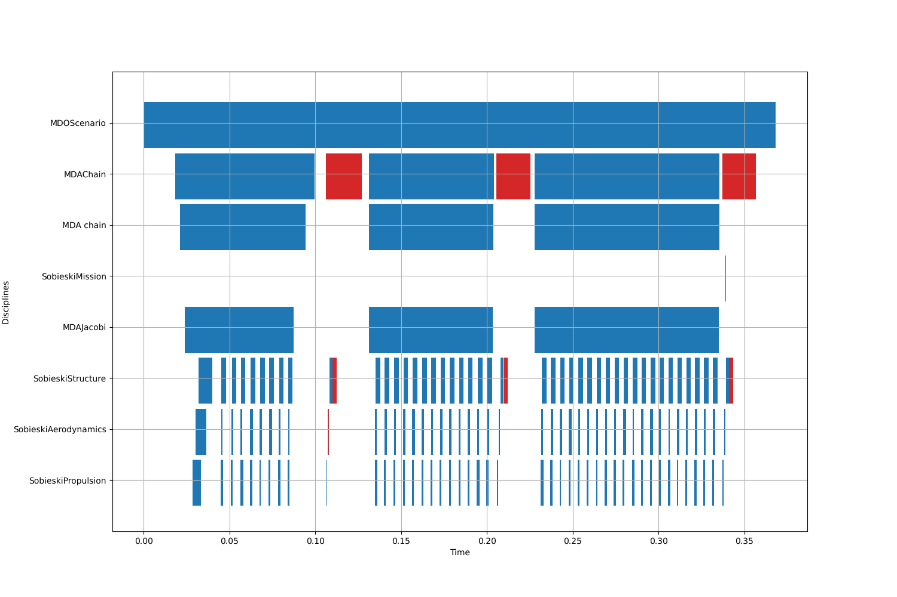

<!--
 Copyright 2021 IRT Saint Exupéry, https://www.irt-saintexupery.com

 This work is licensed under the Creative Commons Attribution-ShareAlike 4.0
 International License. To view a copy of this license, visit
 http://creativecommons.org/licenses/by-sa/4.0/ or send a letter to Creative
 Commons, PO Box 1866, Mountain View, CA 94042, USA.
-->

# Monitoring a scenario { #monitoring-a-scenario }

When a scenario is executed,
GEMSEO logs the last computed value of the objective function.
But a finer monitoring may be needed, especially in case of crash,
where the current execution status of each [Discipline][gemseo.core.discipline.discipline.Discipline] is useful.

GEMSEO provides different monitoring modes,
illustrated below on the [Sobieski][sobieskis-ssbj-test-case] MDF test case.

## Basic monitoring using logs { #concept-monitoring-logs }

The simplest way to monitor discipline status changes is to log them to the console or to a file using GEMSEO's logger.
The [configuration.logging][gemseo.utils.logging.LoggingConfiguration] attribute controls GEMSEO logging.

The [xdsmize()][gemseo.scenarios.mdo.MDOScenario.xdsmize] method of the [MDOScenario][gemseo.scenarios.mdo.MDOScenario] supports this mode via `monitor=True`.
Pass `log_workflow_status=True` to print the workflow status at each status change.

This generates outputs such as the following,
where the process hierarchy is represented as a flattened JSON structure.

``` shell
Optimization: |          | 0/5   0% [elapsed: 00:00 left: ?, ? iters/sec]
{MDOScenario(RUNNING), {MDAChain(RUNNING), [{MDAGaussSeidel(PENDING), [SobieskiStructure(None), SobieskiPropulsion(None), SobieskiAerodynamics(None), ], }, SobieskiMission(None), ], }, }
{MDOScenario(RUNNING), {MDAChain(RUNNING), [{MDAGaussSeidel(RUNNING), [SobieskiStructure(PENDING), SobieskiPropulsion(None), SobieskiAerodynamics(None), ], }, SobieskiMission(None), ], }, }
{MDOScenario(RUNNING), {MDAChain(RUNNING), [{MDAGaussSeidel(RUNNING), [SobieskiStructure(RUNNING), SobieskiPropulsion(None), SobieskiAerodynamics(None), ], }, SobieskiMission(None), ], }, }
{MDOScenario(RUNNING), {MDAChain(RUNNING), [{MDAGaussSeidel(RUNNING), [SobieskiStructure(DONE), SobieskiPropulsion(PENDING), SobieskiAerodynamics(None), ], }, SobieskiMission(None), ], }, }
{MDOScenario(RUNNING), {MDAChain(RUNNING), [{MDAGaussSeidel(RUNNING), [SobieskiStructure(DONE), SobieskiPropulsion(RUNNING), SobieskiAerodynamics(None), ], }, SobieskiMission(None), ], }, }
{MDOScenario(RUNNING), {MDAChain(RUNNING), [{MDAGaussSeidel(RUNNING), [SobieskiStructure(DONE), SobieskiPropulsion(DONE), SobieskiAerodynamics(PENDING), ], }, SobieskiMission(None), ], }, }
{MDOScenario(RUNNING), {MDAChain(RUNNING), [{MDAGaussSeidel(RUNNING), [SobieskiStructure(DONE), SobieskiPropulsion(DONE), SobieskiAerodynamics(RUNNING), ], }, SobieskiMission(None), ], }, }
{MDOScenario(RUNNING), {MDAChain(RUNNING), [{MDAGaussSeidel(RUNNING), [SobieskiStructure(PENDING), SobieskiPropulsion(DONE), SobieskiAerodynamics(DONE), ], }, SobieskiMission(None), ], }, }
{MDOScenario(RUNNING), {MDAChain(RUNNING), [{MDAGaussSeidel(RUNNING), [SobieskiStructure(RUNNING), SobieskiPropulsion(DONE), SobieskiAerodynamics(DONE), ], }, SobieskiMission(None), ], }, }
{MDOScenario(RUNNING), {MDAChain(RUNNING), [{MDAGaussSeidel(RUNNING), [SobieskiStructure(DONE), SobieskiPropulsion(PENDING), SobieskiAerodynamics(DONE), ], }, SobieskiMission(None), ], }, }
```

## Graphical monitoring using [XDSMjs](https://github.com/whatsopt/XDSMjs) { #concept-monitoring-xdsmjs }

An [XDSM diagram][concept-xdsm-diagrams] showing the status of each [Discipline][gemseo.core.discipline.discipline.Discipline]
can be updated at each status change.
To trigger this mode, use [xdsmize()][gemseo.scenarios.mdo.MDOScenario.xdsmize] with `monitor=True`
and specify the output directory via the `directory_path` argument.

The following images show the typical outputs of the process statuses:

- Initial state of the process before execution: the colors represent the type of discipline (scenario, MDA, simple discipline)
   

- The process has started: the colors represent the status of the disciplines — green for RUNNING, blue for PENDING, red for FAILED
   

- The process is running, the MDA iterations are ongoing
   

- The process is finished and failed, due to the SobieskiMission discipline failure
   

## Monitoring from an external platform using the observer design pattern { #concept-monitoring-observer }

The monitoring interface generates an event every time the process status changes.
These events can be observed and used to react programmatically,
for instance to display information to a user or to store data in a database.
This is achieved via the observer design pattern.

An observer class must implement an `update` method receiving the atom (the node whose status changed).
The high-level function [monitor_scenario()][gemseo.monitor_scenario]
creates a [Monitoring][gemseo.core.monitoring.Monitoring] instance
and registers the observer as a listener notified by the GEMSEO monitoring system.

The scenario execution then generates the following output log:

``` shell
MDAChain(RUNNING)
MDAGaussSeidel(RUNNING)
SobieskiStructure(RUNNING)
SobieskiStructure(DONE)
SobieskiPropulsion(RUNNING)
SobieskiPropulsion(DONE)
SobieskiAerodynamics(RUNNING)
SobieskiAerodynamics(DONE)
SobieskiStructure(RUNNING)
SobieskiStructure(DONE)
SobieskiPropulsion(RUNNING)
SobieskiPropulsion(DONE)
# ...
```

Since the atom carries the discipline concerned by the status change as an attribute,
more advanced uses are possible,
such as programmatically tracking the execution
or capturing data produced by a discipline and storing it.

## Monitoring using a Gantt chart { #concept-monitoring-gantt }

A [Gantt chart](https://en.wikipedia.org/wiki/Gantt_chart) can be generated to visualize the process execution.
All discipline execution and linearization times are recorded and plotted.

To activate execution time recording,
enable time stamps via the `is_time_stamps_enabled` attribute of [ExecutionStatistics][gemseo.core.execution_statistics.ExecutionStatistics]
before executing the scenario.
After execution,
the Gantt chart can be created via [create_gantt_chart()][gemseo.post.core.gantt_chart.create_gantt_chart].

The following plot shows an example for the Sobieski MDF scenario.
Disciplines are sorted by name, each with a dedicated row.
Blue rectangles correspond to execution time and red ones to linearization time.



## Going further

!!! explanations
    - [XDSM diagrams][concept-xdsm-diagrams]

!!! how-to
    [Execution statistics as a Gantt chart][execution-statistics-as-a-gantt-chart]
