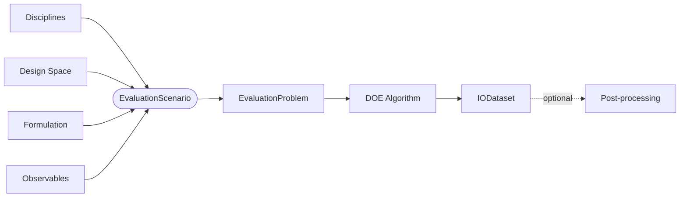
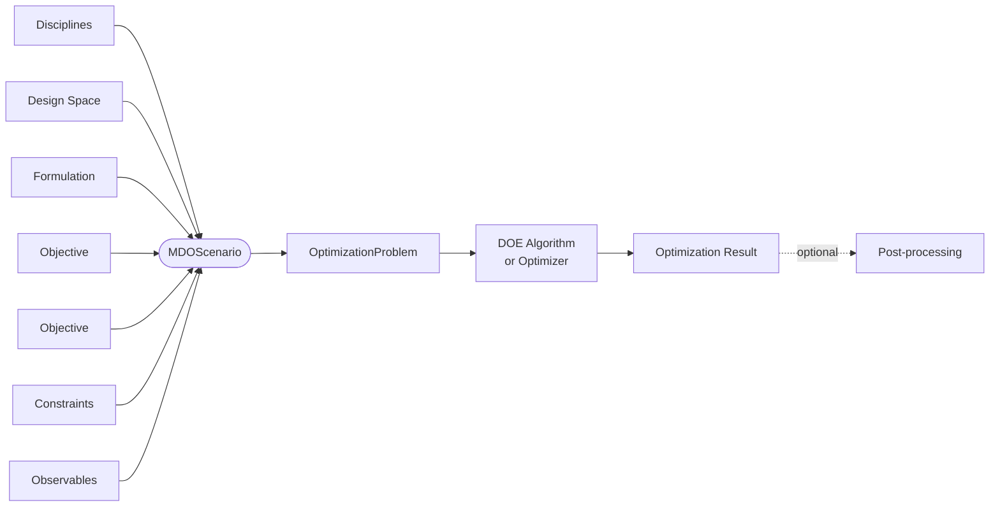
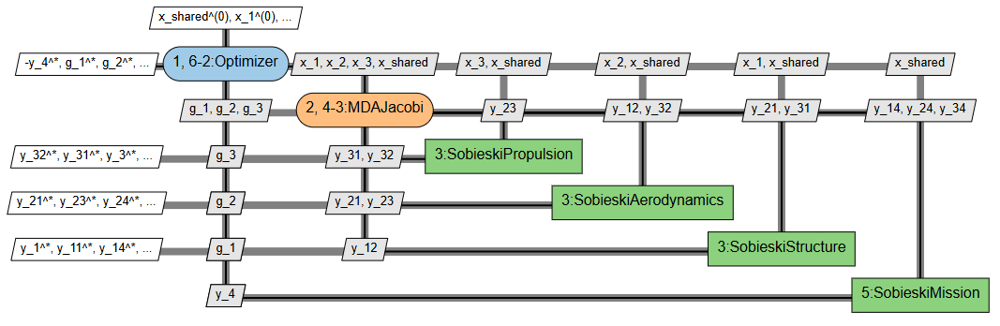

<!--
 Copyright 2021 IRT Saint Exupéry, https://www.irt-saintexupery.com

 This work is licensed under the Creative Commons Attribution-ShareAlike 4.0
 International License. To view a copy of this license, visit
 http://creativecommons.org/licenses/by-sa/4.0/ or send a letter to Creative
 Commons, PO Box 1866, Mountain View, CA 94042, USA.
-->

# Scenario types { #concept-scenario-types }

GEMSEO provides two scenario types depending on the goal:
[evaluation scenario][concept-evaluation] for sampling disciplinary outputs over an input space,
and [MDO scenario][concept-optimization] for solving a multidisciplinary design optimization (MDO) problem.

## Evaluation { #concept-evaluation }

An [EvaluationScenario][gemseo.scenarios.evaluation.EvaluationScenario]
evaluates disciplinary outputs from disciplinary inputs
declared on a [DesignSpace][gemseo.algos.design_space.DesignSpace].

It is built on an [EvaluationProblem][gemseo.algos.evaluation_problem.EvaluationProblem]:
it does with [disciplines][concept-discipline]
what an [evaluation-problem][concept-evaluation-problem]
does with [functions][concept-functions].
The underlying process is built from the provided disciplines by an [MDO formulation][concept-mdo-formulations].
The default MDO formulation is [MDF][concept-the-mdf-formulation];
it performs a [multidisciplinary design analysis (MDA)][concept-solving-multi-disciplinary-analysis]
for each input value.

The quantities of interest, called *observables*, are declared via
[add_observable()][gemseo.scenarios.evaluation.EvaluationScenario.add_observable].
The scenario is executed via
[execute()][gemseo.scenarios.evaluation.EvaluationScenario.execute],
which takes a DOE algorithm settings model as input.

!!! note

    An [EvaluationScenario][gemseo.scenarios.evaluation.EvaluationScenario] has no notion of objective function or constraints.
    For optimization, use [MDOScenario][gemseo.scenarios.mdo.MDOScenario].

## Optimization { #concept-optimization }

An [MDOScenario][gemseo.scenarios.mdo.MDOScenario]
extends [EvaluationScenario][gemseo.scenarios.evaluation.EvaluationScenario]
to solve an MDO problem.

In its most general form:

$$\min_{x} f(x) \quad \text{s.t.} \quad g(x) \leq 0,\quad h(x) = 0,\quad m \leq x \leq M$$

It is built on an [OptimizationProblem][gemseo.algos.optimization_problem.OptimizationProblem]:
it does with [disciplines][concept-discipline]
what an [OptimizationProblem][gemseo.algos.optimization_problem.OptimizationProblem]
does with [functions][concept-functions].

The quantities of interest are the objectives, the constraints and the observables.
The *objectives* are declared via
[add_objective()][gemseo.scenarios.mdo.MDOScenario.add_objective].
By default the scenario minimizes the objective;
passing `minimize=False` switches to maximization.
Equality ($h(x) = a$) and inequality ($g(x) \leq a$ or $g(x) \geq a$) *constraints*
are declared via
[add_constraint()][gemseo.scenarios.mdo.MDOScenario.add_constraint].
By default the scenario adds equality constraints of the form $h(x) = 0$.
*Observables* are declared in the same way as for
[EvaluationScenario][gemseo.scenarios.evaluation.EvaluationScenario].

The scenario is executed via
[execute()][gemseo.scenarios.mdo.MDOScenario.execute],
which takes an optimizer (or DOE algorithm) settings model as input.

## Generic features { #concept-scenario-generic-features }

Both scenario types share the following features.

### XDSM diagrams { #concept-xdsm-diagrams }

The execution workflow of any scenario can be rendered as an
eXtended Design Structure Matrix (XDSM) diagram[@Lambe2012] via the
[xdsmize()][gemseo.scenarios.evaluation.EvaluationScenario.xdsmize] method.

XDSM diagrams represent disciplines as boxes,
data flows as off-diagonal connections,
and execution order along the diagonal.
This ensures that everything is properly wired before running the calculations.

The diagram can be saved as a self-contained HTML file
or exported to PDF, with the option to save intermediate LaTeX/TikZ files.

The following figure shows an example of an XDSM
for an MDO problem solved using the MDF formulation with the Jacobi MDA method.

### Backup settings { #concept-scenario-backup-settings }

[set_backup_settings()][gemseo.scenarios.evaluation.EvaluationScenario.set_backup_settings]
configures an HDF backup file updated at each function call and/or iteration,
so that no evaluation is lost if the run is interrupted.
The mechanism can resume from a previous backup or start fresh by overwriting it.
It can also save an [optimization history view][full-optimisation-history-overview] at each iteration.

### Differentiation method { #concept-scenario-differentiation-method }

[set_differentiation_method()][gemseo.scenarios.evaluation.EvaluationScenario.set_differentiation_method]
controls how Jacobians are approximated when disciplines do not provide analytical gradients.
The default uses user-supplied gradients;
alternatives include approximations, such as finite differences and the complex-step method.

### Results { #concept-scenario-results }

Once the task has been completed,
the evaluation history can then be exported to a
[dataset][concept-dataset] via
[to_dataset()][gemseo.scenarios.evaluation.EvaluationScenario.to_dataset],
or to an HDF file via
[to_hdf()][gemseo.scenarios.evaluation.EvaluationScenario.to_hdf].
After execution,
the optimization history can be post-processed via
[post_process()][gemseo.scenarios.mdo.MDOScenario.post_process],
using any [post-processor][concept-post-processor].

## Going further

!!! how-to
    - [Generate an XDSM chart][generate-an-xdsm-chart]
    - [Post-process a scenario][post-process-a-scenario]
