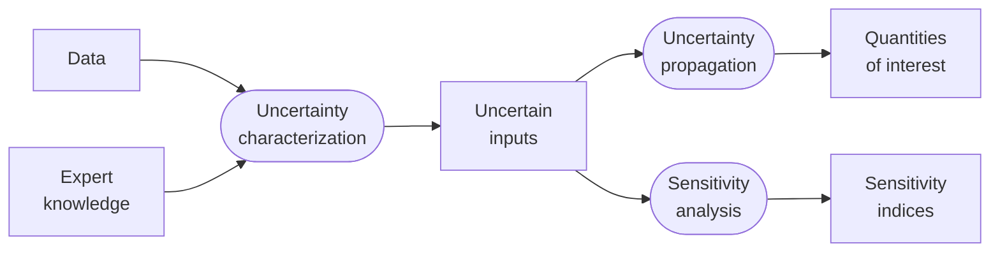

<!--
 Copyright 2021 IRT Saint Exupéry, https://www.irt-saintexupery.com

 This work is licensed under the Creative Commons Attribution-ShareAlike 4.0
 International License. To view a copy of this license, visit
 http://creativecommons.org/licenses/by-sa/4.0/ or send a letter to Creative
 Commons, PO Box 1866, Mountain View, CA 94042, USA.
-->

# Introduction { #concept-uncertainty-introduction }

In the real world, model parameters are never perfectly known:
material properties vary, measurements are imprecise and boundary conditions are approximate.
[Uncertainty quantification (UQ)](https://en.wikipedia.org/wiki/Uncertainty_quantification)
studies how this uncertainty in the inputs affects the model outputs,
and how much each input contributes to output variability.

GEMSEO provides a dedicated [uncertainty][gemseo.uncertainty] package for this purpose:

1. **[Uncertainty characterization][concept-uncertainty-characterization]** —
   each uncertain input is modelled
   as a [probability distribution](https://en.wikipedia.org/wiki/Probability_distribution)
   (e.g., normal, uniform, log-normal)
   using one of GEMSEO's distribution backends
   ([OpenTURNS](https://openturns.github.io/www/) or [SciPy](https://docs.scipy.org/doc/scipy)).

2. **[Uncertainty propagation][concept-uncertainty-propagation]** —
   the [joint input distribution](https://en.wikipedia.org/wiki/Joint_probability_distribution) is sampled,
   the model is evaluated at each sample via an [EvaluationScenario][gemseo.scenarios.evaluation.EvaluationScenario],
   and statistics (e.g., mean, variance, quantiles) are computed on the resulting output dataset.

3. **[Sensitivity analysis][concept-sensitivity-analysis]** —
   [sensitivity indices](https://en.wikipedia.org/wiki/Sensitivity_analysis) help to identify the non-influential uncertain inputs
   and rank the uncertain inputs by their contribution to the output variability,
   answering the question *which inputs matter most?*.

## Going further

!!! explanations
    - [Uncertainty characterization][concept-uncertainty-characterization]
    - [Uncertainty propagation][concept-uncertainty-propagation]
    - [Sensitivity analysis][concept-sensitivity-analysis]

!!! note
    GEMSEO also has the plugin `gemseo-umdo` for solving MDO problems under uncertainty.
    We refer the reader to [its documentation](https://gemseo.gitlab.io/dev/gemseo-umdo/latest/) for more information.
