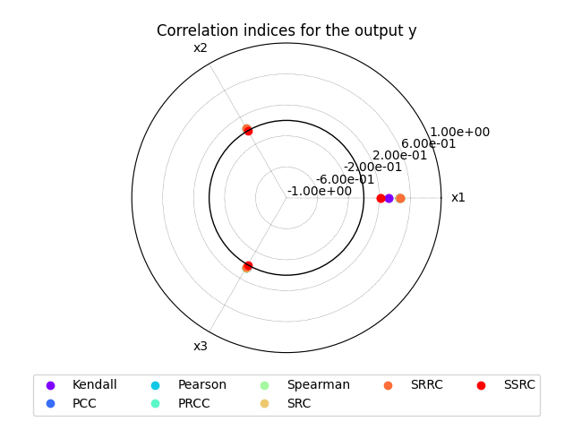
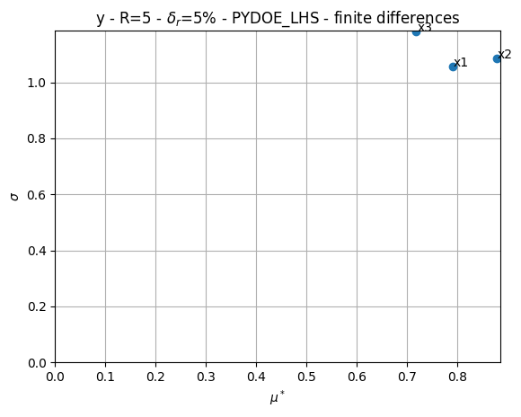
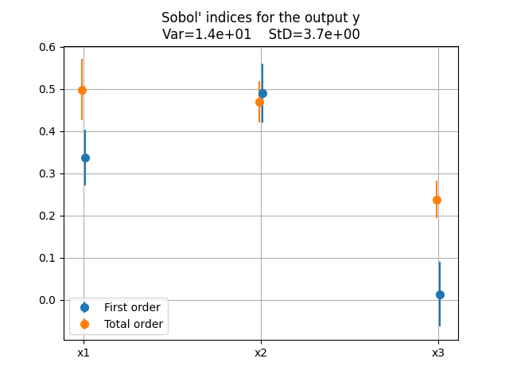
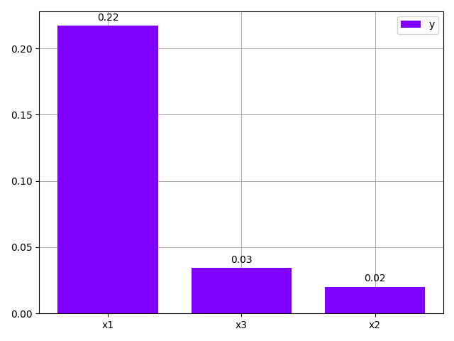

<!--
 Copyright 2021 IRT Saint Exupéry, https://www.irt-saintexupery.com

 This work is licensed under the Creative Commons Attribution-ShareAlike 4.0
 International License. To view a copy of this license, visit
 http://creativecommons.org/licenses/by-sa/4.0/ or send a letter to Creative
 Commons, PO Box 1866, Mountain View, CA 94042, USA.
-->

# Sensitivity analysis { #concept-sensitivity-analysis }

After [propagating uncertainty][concept-uncertainty-propagation] through a model,
a natural question arises: *which uncertain inputs are responsible for the output variability?*
Sensitivity analysis answers this by computing **sensitivity indices**,
i.e. scalar scores that rank the uncertain inputs by their influence on each output.

Global sensitivity analysis (GSA) evaluates the output variation across the entire input distribution,
capturing nonlinear effects and interactions between inputs.
Its results depend on the chosen input distributions, not on a fixed reference point,
making it more informative than local (gradient-based) approaches
for models that are nonlinear or whose inputs are uncertain over a wide range.

GEMSEO provides six sensitivity analysis techniques,
in two families:
Correlation, Morris, Sobol' and HSIC analyses quantify the contribution of each uncertain input
to the variability of a *raw disciplinary output*,
while FORM and ISFORMSobol analyses are **reliability-oriented**:
they quantify the contribution of each uncertain input to a binary *event*
(e.g. a disciplinary output exceeding a threshold) rather than to the raw output itself.

## Available sensitivity analyses { #concept-sensitivity-analyses }

| Analysis    | Class                                                                                   | Approach                                                 | Key indices                                           |
|-------------|-----------------------------------------------------------------------------------------|----------------------------------------------------------|-------------------------------------------------------|
| Correlation | [CorrelationAnalysis][gemseo.uncertainty.sensitivity.correlation.CorrelationAnalysis]   | Linear / Monotonic                                       | Pearson, Spearman, PCC, PRCC                          |
| Morris      | [MorrisAnalysis][gemseo.uncertainty.sensitivity.morris.MorrisAnalysis]                  | Screening                                                | $\mu^*$, $\sigma$                                     |
| Sobol'      | [SobolAnalysis][gemseo.uncertainty.sensitivity.sobol.SobolAnalysis]                     | Variance-based                                           | First-order $S_i$, total-order $S_T$                  |
| HSIC        | [HSICAnalysis][gemseo.uncertainty.sensitivity.hsic.HSICAnalysis]                        | Kernel-based                                             | HSIC, $R^2$-HSIC                                      |
| FORM        | [FORMAnalysis][gemseo.uncertainty.sensitivity.form.FORMAnalysis]                        | Reliability-oriented (importance factors)                | Classical, elliptical, physical importance factors    |
| ISFORMSobol | [ISFORMSobolAnalysis][gemseo.uncertainty.sensitivity.is_form_sobol.ISFORMSobolAnalysis] | Reliability-oriented Sobol' (FORM + importance sampling) | First-order $S_i$, total-order $S_i^T$ (of the event) |

Correlation, Sobol', HSIC, FORM and ISFORMSobol analyses integrate features from [OpenTURNS](https://openturns.github.io/www/)
while Morris analysis is a custom implementation.

!!! note "FORM and ISFORMSobol analyze events, not raw outputs"
    For [FORMAnalysis][gemseo.uncertainty.sensitivity.form.FORMAnalysis] and
    [ISFORMSobolAnalysis][gemseo.uncertainty.sensitivity.is_form_sobol.ISFORMSobolAnalysis],
    the notion of *output* used throughout the common API
    (e.g. the keys of `indices`, the `output`/`outputs` arguments of the plotting methods)
    is equivalent to the notion of *event*: an output name is an event name.
    Events are built from disciplinary outputs with
    [get_event_variables()][gemseo.uncertainty.sensitivity.base_ro.BaseROSensitivityAnalysis.get_event_variables],
    e.g. `y = analysis.get_event_variables("y")` then `y > 3.0` is the event `"y > 3.0"`.

The choice of method depends on the available budget and the type of relationship expected.
Broadly speaking, the following guidelines can be provided:

| Method      | Use when                                                                 | Typical sample budget                            | Assumption on input-output relationship                     |
|-------------|--------------------------------------------------------------------------|--------------------------------------------------|-------------------------------------------------------------|
| Correlation | Model is linear or monotonic; fast screening needed                      | Hundreds                                         | Linear or monotonic                                         |
| Morris      | Many inputs; initial screening before Sobol'                             | $r(d+1)$, typically $< 100$                      | None (finite differences)                                   |
| Sobol'      | Full variance decomposition needed                                       | 10 000+                                          | None                                                        |
| HSIC        | Non-monotonic dependence; target/conditional SA                          | Hundreds                                         | None (kernel-based)                                         |
| FORM        | Importance factors needed for a rare event / limit-state                 | One FORM run (tens of evaluations)               | Event well-approximated by a hyperplane at the design point |
| ISFORMSobol | Full Sobol' decomposition of a rare event; crude Monte Carlo intractable | FORM run(s) + shared Sobol' budget across events | None beyond FORM's per-event design-point search            |

### Correlation analysis

Correlation analysis measures the strength of the association between each input and each output
by computing eight indices in three families:

- **Raw association** —
  [Pearson](https://en.wikipedia.org/wiki/Pearson_correlation_coefficient) (linear),
  [Spearman](https://en.wikipedia.org/wiki/Spearman%27s_rank_correlation_coefficient) (rank-based, monotonic),
  and [Kendall](https://en.wikipedia.org/wiki/Kendall_rank_correlation_coefficient) (rank-based concordance);
- **[Partial correlation](https://en.wikipedia.org/wiki/Partial_correlation)** —
  PCC and its rank-based version PRCC, which remove the linear effect of the other inputs
  to isolate the direct contribution of each one;
- **Regression-based** —
  SRC, SRRC, and SSRC,
  the standardized coefficients of a linear (or rank) regression of the output on the inputs;
  SSRC is the square of SRC and measures the share of output variance explained by each input.

All eight indices are summarized in the following table:

| Index    | Type                                     | Characteristic                                     |
|----------|------------------------------------------|----------------------------------------------------|
| Pearson  | Linear correlation                       | Assumes linear relationship                        |
| Spearman | Rank correlation                         | Robust for monotonic relationships                 |
| Kendall  | Rank correlation                         | Robust concordance measure                         |
| PCC      | Partial correlation                      | Removes linear effect of other inputs              |
| PRCC     | Partial rank correlation                 | Rank-based version of PCC                          |
| SRC      | Standardized regression coefficient      | Linear regression-based                            |
| SRRC     | Standardized rank regression coefficient | Rank regression-based                              |
| SSRC     | Squared SRC                              | Always positive; measures explained variance share |

All values lie in $[-1, 1]$ (except SSRC which lies in $[0, 1]$).
The default [main_method][gemseo.uncertainty.sensitivity.correlation.CorrelationAnalysis.main_method]
is Spearman, which is robust for monotonic but not necessarily linear relationships.

[CorrelationAnalysis][gemseo.uncertainty.sensitivity.correlation.CorrelationAnalysis]
overrides [plot()][gemseo.uncertainty.sensitivity.correlation.CorrelationAnalysis.plot]
with a radar chart that displays all eight indices at once for a given output:

This method is cheap (a few dozens or hundred samples suffice) but limited to linear or monotonic models.

### Morris analysis

Morris analysis is a screening method designed for high-dimensional problems.
It is an [elementary effects method](https://en.wikipedia.org/wiki/Elementary_effects_method):
along $r$ random trajectories in the input space,
each input is perturbed one at a time (OAT)
and the resulting finite difference of the output — the *elementary effect* — is recorded.
Averaging these effects over the trajectories yields six statistics per input:

| Index            | Interpretation                                                            |
|------------------|---------------------------------------------------------------------------|
| $\mu$            | Mean of the elementary effects (sign indicates direction)                 |
| $\mu^*$          | Mean of the **absolute** elementary effects — overall influence           |
| $\sigma$         | Standard deviation of elementary effects — non-linearity and interactions |
| `relative_sigma` | Ratio $\sigma / \mu^*$                                                    |
| `min`            | Minimum of the absolute elementary effects                                |
| `max`            | Maximum of the absolute elementary effects                                |

Interpretation: a high $\mu^*$ signals an influential input;
a high $\sigma$ relative to $\mu^*$ signals non-linear effects or interactions with other inputs;
a low $\mu^*$ and low $\sigma$ indicates a non-influential input that can be fixed.

[MorrisAnalysis][gemseo.uncertainty.sensitivity.morris.MorrisAnalysis]
overrides [plot()][gemseo.uncertainty.sensitivity.morris.MorrisAnalysis.plot]
with a unique two-dimensional scatter plot of $\mu^*$ vs. $\sigma$
that is not available in other analysis classes.
Each point $(\mu_i^*, \sigma_i)$ represents one input;
inputs in the upper-right quadrant are both influential and non-linear/interactive,
while inputs near the origin can be screened out:

It is efficient for initial screening but does not quantify the exact contributions of the uncertain inputs.

### Sobol' analysis

Sobol' analysis decomposes the total output variance by the [Sobol'-Hoeffding identity](https://openturns.github.io/openturns/latest/theory/reliability_sensitivity/sensitivity_sobol.html):

$$\mathbb{V}[Y] = \sum_i V_i + \sum_{i<j} V_{ij} + \cdots$$

where $V_i = \mathbb{V}[\mathbb{E}[Y|X_i]]$ is the variance explained by $X_i$ alone.
The normalized indices $S_i = V_i / \mathbb{V}[Y]$ lie in $[0, 1]$ and sum to $1$.
This decomposition yields three types of indices:

| Index        | Symbol      | Interpretation                                   |
|--------------|-------------|--------------------------------------------------|
| First-order  | $S_i$       | Direct contribution of $X_i$ alone               |
| Total-order  | $S_i^T$     | Direct + interaction contribution of $X_i$       |
| Second-order | $S_{ij}$    | Pure interaction between $X_i$ and $X_j$         |

A large gap $S_i^T - S_i$ signals strong interaction effects.

[SobolAnalysis][gemseo.uncertainty.sensitivity.sobol.SobolAnalysis]
overrides [plot()][gemseo.uncertainty.sensitivity.sobol.SobolAnalysis.plot]
to display first-order and total-order indices as dots
together with their confidence intervals as vertical bars:

Several estimators are available via the `algo` argument of
[compute_indices()][gemseo.uncertainty.sensitivity.sobol.SobolAnalysis.compute_indices]:
SALTELLI (default), JANSEN, MAUNTZ_KUCHERENKO, MARTINEZ, and RANK.
Confidence intervals are retrieved with
[get_intervals()][gemseo.uncertainty.sensitivity.sobol.SobolAnalysis.get_intervals].

This method requires a large number of model evaluations (typically 10 000+).

### HSIC analysis

HSIC analysis uses the Hilbert–Schmidt independence criterion (HSIC),
a kernel-based statistical dependence measure that detects any type of relationship,
including nonlinear and non-monotonic ones.
Each variable is mapped into a reproducing kernel Hilbert space (RKHS)
with a covariance (kernel) function,
and HSIC is the Hilbert-Schmidt norm of the cross-covariance operator
between the input and output RKHS embeddings.
It compares the joint input-output distribution against the product of the marginals,
so it is zero if and only if the input and the output are independent.

[HSICAnalysis][gemseo.uncertainty.sensitivity.hsic.HSICAnalysis] reports three quantities per input:

| Index   | Interpretation                                     |
|---------|----------------------------------------------------|
| HSIC    | Raw dependence measure between input and output    |
| R²-HSIC | Normalized version in $[0, 1]$, analogous to $R^2$ |
| p-value | Statistical significance of the dependence         |

The default [main_method][gemseo.uncertainty.sensitivity.hsic.HSICAnalysis.main_method]
is R²-HSIC (normalized, always positive, comparable across inputs).
[filter()][gemseo.uncertainty.sensitivity.hsic.HSICAnalysis.filter]
keeps only the inputs whose dependence is statistically significant.

In addition to GSA (default),
GEMSEO supports three analysis modes via the `analysis_type` argument of
[compute_indices()][gemseo.uncertainty.sensitivity.hsic.HSICAnalysis.compute_indices]:

| Mode        | Question answered                                                                |
|-------------|----------------------------------------------------------------------------------|
| GLOBAL      | Which inputs drive overall output variability?                                   |
| TARGET      | Which inputs cause the output to enter a target region (e.g. extreme values)?    |
| CONDITIONAL | Which inputs matter given a conditioning event (output in a certain domain)?     |

TARGET and CONDITIONAL modes require specifying `output_bounds` to define the region of interest.

### FORM analysis

[FORMAnalysis][gemseo.uncertainty.sensitivity.form.FORMAnalysis] turns the *importance factors*
of the first-order reliability method (FORM) into sensitivity indices for a binary event,
e.g. a disciplinary output exceeding a threshold.
FORM estimates the probability of the event
by searching for the most probable failure point (MPFP), a.k.a. design point,
and approximating the limit-state surface at this point by a hyperplane;
the importance factors quantify the contribution of each input to reaching this point.

Three types of importance factors are available:

| Factor       | Definition                                                                                                  |
|--------------|-------------------------------------------------------------------------------------------------------------|
| `classical`  | Squares of the co-factors of the design point in the physical space                                         |
| `elliptical` | Squares of the co-factors of the design point in the standard space                                         |
| `physical`   | Squares of the partial derivatives of the Hasofer-Lind reliability index w.r.t. the inputs (physical space) |

The default [main_method][gemseo.uncertainty.sensitivity.core.base.BaseGenericSensitivityAnalysis.main_method]
is `classical`.

Events are defined with
[get_event_variables()][gemseo.uncertainty.sensitivity.base_ro.BaseROSensitivityAnalysis.get_event_variables],
e.g. `y = analysis.get_event_variables("y")` then `events = {"y_high": y > 3.0}`,
and passed to
[compute_samples()][gemseo.uncertainty.sensitivity.form.FORMAnalysis.compute_samples],
which runs the FORM study before
[compute_indices()][gemseo.uncertainty.sensitivity.form.FORMAnalysis.compute_indices]
derives the importance factors.

This method is cheap (a single FORM run, i.e. tens of model evaluations)
but relies on FORM's linear approximation of the limit-state surface at the design point.

### ISFORMSobol analysis

[ISFORMSobolAnalysis][gemseo.uncertainty.sensitivity.is_form_sobol.ISFORMSobolAnalysis]
estimates the Sobol' indices of a binary event.
A crude Monte Carlo estimation of these indices is intractable for rare events,
so this analysis combines three ingredients:

1. FORM to locate the most probable failure point (MPFP), a.k.a. design point, of the event;
2. an importance sampling (IS) auxiliary density —
   a unit-variance normal distribution centered on the design point in the standard space —
   so that samples land around the limit state;
3. a Sobol' analysis of the IS-reweighted indicator,
   where each sample is weighted by the likelihood ratio
   between the true standard normal density and the auxiliary density.

Several events can be passed;
each is processed independently (its own design point, auxiliary density and pick-and-freeze
design), and the total model evaluation budget `n_samples` is shared across them:
once every design point has been located with FORM, the remaining budget is split equally
between the events to draw their Sobol' samples.

!!! note "The indices are computed in the standard space"
    For independent marginals,
    the standard inputs map one-to-one to the physical inputs and share their names.

[ISFORMSobolAnalysis][gemseo.uncertainty.sensitivity.is_form_sobol.ISFORMSobolAnalysis]
reuses the same estimators as
[SobolAnalysis][gemseo.uncertainty.sensitivity.sobol.SobolAnalysis]
(SALTELLI by default for a pick-and-freeze design, JANSEN, MAUNTZ_KUCHERENKO, MARTINEZ,
and RANK for an independent/i.i.d. design), selected via the `algo` argument of
[compute_indices()][gemseo.uncertainty.sensitivity.is_form_sobol.ISFORMSobolAnalysis.compute_indices].

This method makes Sobol' analysis tractable for rare events,
but its cost still scales with the number of events
and grows with the input dimension $d$ through the pick-and-freeze factor ($2+d$ or $2+2d$
per event).

## Common interface { #concept-sensitivity-interface }

All sensitivity analyses follow the same workflow:

1. **Compute samples** — [compute_samples()][gemseo.uncertainty.sensitivity.core.base.BaseSensitivityAnalysis.compute_samples] draws input–output samples
   from the [ParameterSpace][gemseo.space.parameter.ParameterSpace].
   Alternatively, an existing [IODataset][gemseo.dataset.io_dataset.IODataset] can be reused directly.
2. **Compute indices** — [compute_indices()][gemseo.uncertainty.sensitivity.core.base.BaseSensitivityAnalysis.compute_indices]
   derives the sensitivity indices from the samples.
3. **Visualize** — methods such as [plot_bar()][gemseo.uncertainty.sensitivity.core.base.BaseSensitivityAnalysis.plot_bar] and [plot_radar()][gemseo.uncertainty.sensitivity.core.base.BaseSensitivityAnalysis.plot_radar] display the indices.
4. **Export** — [to_dataset()][gemseo.uncertainty.sensitivity.core.base.BaseSensitivityAnalysis.to_dataset]
   exports the indices as a [Dataset][concept-dataset].

Indices can be standardized so that different methods are compared on the same scale
(e.g. using [plot_comparison()][gemseo.uncertainty.sensitivity.core.base.BaseSensitivityAnalysis.plot_comparison]),
and inputs can be sorted by decreasing influence via [sort_input_variables()][gemseo.uncertainty.sensitivity.core.base.BaseSensitivityAnalysis.sort_input_variables].

!!! how-to
    - [Compute sensitivity indices][compute-sensitivity-indices]
    - [Plot sensitivity indices][plot-sensitivity-indices]
    - [Export sensitivity indices to a dataset][export-sensitivity-indices-to-a-dataset]
    - [Sort inputs by influence][sort-inputs-by-influence]
    - [Change the main sensitivity method][change-the-main-sensitivity-method]
    - [Compare sensitivity analyses][compare-sensitivity-analyses]
    - [Save and reuse sensitivity analysis samples][save-and-reuse-sensitivity-analysis-samples]

## Going further

!!! explanations
    - [Uncertainty propagation][concept-uncertainty-propagation]
