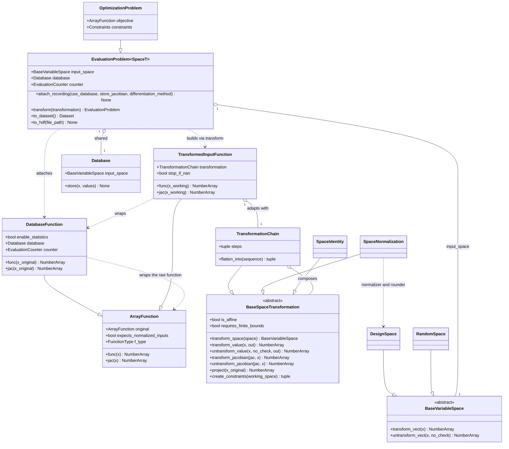

<!--
 Copyright 2021 IRT Saint Exupéry, https://www.irt-saintexupery.com

 This work is licensed under the Creative Commons Attribution-ShareAlike 4.0
 International License. To view a copy of this license, visit
 http://creativecommons.org/licenses/by-sa/4.0/ or send a letter to Creative
 Commons, PO Box 1866, Mountain View, CA 94042, USA.
-->

# Separate function preprocessing from `EvaluationProblem`

## Requirements

Move function *adaptation* out of `EvaluationProblem` so that a driver — or a user —
derives a **new** problem whose functions wrap the originals through an ordered series of
space transformations, leaving the problem the user built unmutated and retrievable at any
time.

- **Value**: the user keeps their problem. Today a driver rewrites the functions in place
  and never undoes it, which forces `reset(preprocessing=…)` workarounds across the
  codebase and two plugins, silently ignores a second driver's settings, and makes the
  warm-start use case of issue #1528 (relax, solve, inject, return to the original) impossible.
- **Boundary**: coordinate transformations only — normalization, integer rounding, sparse
  Jacobian densification — plus the recording/adaptation split and the public entry point.
  Relaxation, encoding, sign change, aggregation and scaling are **out of scope**; the
  mechanism must only leave room for them.
- **Release**: GEMSEO 7.0.0. Breaking, with no deprecation shims.

## Entities



Three domains are named throughout and must not be conflated:

| Name | What it is | Who sees it |
|------|-----------|-------------|
| **working** | the image of the original space under the transformation chain. Normalized only if a normalization step is present, and equal to the original space when the chain is empty | the algorithm |
| **original** | the scale the user declared, where the discipline is evaluated | the discipline, and the database keys |
| **typed** | the domain the user actually declared — a subset of the original space reached by `project`, and equal to it unless a step relaxed something | the user, once, on `x_opt` |

> Running example, an integer variable relaxed and normalized: `0.24` working, `3.4`
> original, `3` typed. The values are illustrative; the definitions above are not.
> Two common cases make the chain degenerate — a DOE, where `normalize_design_space`
> defaults to `False`, and a `RandomSpace` problem, whose coordinate chain is empty. In
> both, the working space *is* the original one.

## Approach

1. **Split the wrapper in two, by owner**
    - `DatabaseFunction` — *recording*, owned by the problem, evaluated in **original**
    coordinates: database lookup and store, call counting, the `pre_compute_at_new_point`
    hook, and derivative approximation.
    - `TransformedInputFunction` — *adaptation*, built by whoever transforms the problem,
    evaluated in **working** coordinates: the transformation chain and the NaN checks that
    stop an algorithm.
    - Rationale: the two have different owners and different lifetimes. Recording belongs to
    the problem because its results must reach the problem's database; adaptation belongs
    to the algorithm because it exists only for the duration of a run.

2. **Make the transformation a first-class object, not a method with seven booleans**
    - Replace the five-branch builder (the cross product of
    `normalize × round_ints × linear × database × vectorize`) with an ordered series of
    steps implementing `BaseSpaceTransformation`.
    - The contract is #1886's, implemented here (decision B2), amended in five places for
    the `random_space` merge and the vocabulary — see the analysis appendix.
    - A new variable kind then contributes a class, not a branch.

3. **Expose the transformation publicly** (decision B1)
    - `EvaluationProblem.transform(transformation) -> EvaluationProblem` returns a derived
    problem sharing the original's database. The driver is its first consumer and discards
    the derived problem after the run.
    - Contract kept narrow: a problem in, a problem out, a series of steps.

4. **Flatten, do not nest**
    - The chain's steps are spliced into the adaptation wrapper's existing tuple-of-callables
    evaluation sequence rather than hidden behind a method that loops internally, so the
    number of Python frames per evaluation is unchanged.
    - `is_affine` over the whole chain guards `LinearFunction.fold(transformation)`, keeping
    the fast path `ScipyLinprog` and `ScipyMILP` depend on.

5. **Add an opt-in working-coordinate database**
    - Off by default, gated by `GlobalConfiguration.enable_working_database`, recorded on an
    **independent** path so it still works under `use_database=False`.
    - It is the only place the working-space history is observable, because the backward map
    is applied at write time.

6. **Break cleanly in 7.0.0** (decision B3)
    - Remove `preprocess_functions`, `reset(preprocessing=…)` and the two setter guards.
    - Four first-party plugin MRs land with the bump; two of them break at runtime otherwise.

## Structure

### Inheritance Relationships

1. `BaseSpaceTransformation` is the abstract contract; `TransformationChain`,
   `SpaceNormalization` and `SpaceIdentity` implement it.
2. `TransformationChain` is itself a `BaseSpaceTransformation`, so a chain composes chains.
3. `DatabaseFunction` and `TransformedInputFunction` both extend `ArrayFunction`.
4. `EvaluationProblem` stays `Generic[_SpaceT]` bound to `BaseVariableSpace`;
   `OptimizationProblem` extends it.

### Dependencies

1. `BaseDriverLibrary.execute` builds a `TransformationChain` from its settings, calls
   `problem.transform(chain)`, runs on the derived problem, and returns results on the
   original.
2. `EvaluationProblem.attach_recording` wraps each function in a `DatabaseFunction` bound to
   the problem's `Database` and `EvaluationCounter`.
3. `EvaluationProblem.transform` wraps each recorded function in a `TransformedInputFunction`
   carrying the chain, and returns a new problem over `chain.transform_space(input_space)`.
4. `TransformedInputFunction` depends on `TransformationChain`; it knows nothing about the
   problem, the database or the counter.
5. `GlobalConfiguration` writes `DatabaseFunction.enable_statistics` and
   `TransformedInputFunction.enable_working_database`. The two flags sit on different
   layers on purpose: counting is recording, and the working-coordinate store can only be
   written where the working point exists.

### Layered Architecture

1. **Driver layer** (`BaseDriverLibrary`): selects the transformation, owns the derived
   problem, registers termination criteria **on the original problem**, tears down.
2. **Problem layer** (`EvaluationProblem`): composition, evaluation, recording attachment,
   export. Never mutated by a driver.
3. **Adaptation layer** (`TransformedInputFunction`): working ↔ original coordinates, NaN checks.
4. **Recording layer** (`DatabaseFunction`): database, counters, iteration hook, derivative
   approximation.
5. **Space layer** (`BaseSpaceTransformation` and friends): pure space and vector maps, with
   no knowledge of problems or functions.

Evaluation path, top to bottom:

```text
algorithm (working)
  -> TransformedInputFunction : untransform_value, NaN check
    -> DatabaseFunction       : lookup, store, count  (original)
      -> ArrayFunction        : the user's function   (original)
```

## Operations

### 1. Prerequisite - make `ArrayFunction.original` transitive

- File: `src/gemseo/core/function/array_function.py`
- Logic: `original` follows the wrapper chain to the deepest non-wrapping function, without
  forwarding through algebraic operations (offset, negation), which would return the
  un-offset constraint.
- Update the fourteen internal readers that assume one level.
- Land as its own commit with a regression test stacking two wrappers.

### 2. Prerequisite - refuse vectorization combined with normalization (decision B4)

- File: `src/gemseo/doe/core/base_doe_settings.py`, in `__check`
- Logic: raise `NotImplementedError` when `vectorize and normalize_design_space`, beside the
  existing `n_processes > 1` and `preprocessors` guards.
- Message in the style of the neighbours: `"Vectorization with normalization is not supported."`
- Land as its own commit with a test asserting the error.

### 3. Create package `src/gemseo/space/transformation/`

#### `base.py` - `BaseSpaceTransformation`

1. Responsibility: one space-to-space map plus its vector, tangent and projection maps.
2. Class attributes: `is_affine`, `requires_finite_bounds`, both
   `ClassVar[bool]` defaulting to `False`. The working space is free to differ from the
   original one in variables and dimension: the maps carry whole values and Jacobians, so
   no flag declares a dimension change and no guard refuses one.
3. Abstract methods: `transform_space(space)`, `transform_value(x, out=None)`,
   `untransform_value(x, no_check=False, out=None)`, `transform_jacobian(jac, x=None)`,
   `untransform_jacobian(jac, x=None)`.
4. Concrete defaults: `project(x)` returns `x`; `create_constraints(working_space)` returns `()`.
5. Constraints: `transform_space` takes and returns a `BaseVariableSpace`, never a
   `DesignSpace`; `project` takes a **original** point.

#### `chain.py` - `TransformationChain`

1. Responsibility: ordered composition, original → working; reversed for the backward; chain
   rule on tangents.
2. Methods:
    - `__init__(*steps)`: drop `SpaceIdentity` instances; evaluate
    `requires_finite_bounds` on the space each step actually receives, not on the user's
    space.
    - `transform_space(space)`: fold the steps left to right.
    - `untransform_value(x)`: apply the reversed steps.
    - `flatten_into(sequence)`: splice the steps into a `TransformedInputFunction` evaluation
    sequence.
    - `is_affine`: `all(step.is_affine for step in steps)`.

#### `normalization.py` - `SpaceNormalization`

1. Responsibility: carry today's behaviour. It delegates to the public `DesignSpace`
   methods — `normalize_vect`, `denormalize_vect`, `normalize_grad`, `denormalize_grad`
   and `round_vect` — rather than reaching into `Normalizer` and `IntegerRounder`, which
   live under the private `space/_design/`.
2. `is_affine = True`. **`requires_finite_bounds` stays `False`**: `normalize_vect` masks
   out the components without finite bounds and passes them through unchanged, so
   normalization tolerates an unbounded variable and requiring finite bounds would reject
   problems that work today.
3. An **integer component is not normalized**, because `DesignSpace` keeps
   `enable_integer_variables_normalization` off by default and only the space-level
   `transform_vect` / `untransform_vect` pair turns it on. The working space therefore
   keeps that variable's own bounds, continuous, and the backward map rounds it. This is
   today's behaviour of `denormalize_vect` followed by `round_vect`.
4. `untransform_value(x)`: denormalize **and round** the integer components, exactly as
   `_preprocess_function` does today (`denormalize_vect → round_vect`). The rounding stays
   in the backward map because this step **relaxes nothing**: the discipline must keep
   receiving `3` for an `IntegerVariable`, as it does today.
5. `project(x)`: round the integer components. Idempotent, and therefore a no-op after
   `untransform_value` in this delivery. It exists so that the schedule is already correct
   when `IntegerRelaxation` arrives and removes the rounding from the backward.

#### `identity.py` - `SpaceIdentity`

1. Responsibility: the neutral element, dropped at chain construction.

### 4. Create `src/gemseo/core/function/database_function.py` - `DatabaseFunction`

1. Responsibility: recording, in **original** coordinates. `use_database` scopes to this
   layer and to this layer only: it turns the **original** problem's store and lookup on and
   off, and governs neither the working-coordinate store, nor call counting, nor derivative
   approximation, which this layer keeps performing when it is `False`.
2. Class attributes: `enable_statistics: ClassVar[bool]`, moved here from
   `PreprocessedFunction`. The working-database flag does **not** live here — see §5.
3. Attributes: `database`, `counter`, `store_jacobian`, `pre_compute_at_new_point`.
4. Methods:
    - `func(x_original)`: look up the database; on a miss evaluate the wrapped function,
    count once, store under the original key. NaN outputs are stored **before** any stop is
    raised upstream.
    - `jac(x_original)`: same, under the gradient name.
    - Derivative approximation: build the approximator on the **non-recording** callable so
    perturbation evaluations never reach the database; perturb in working coordinates when
    the algorithm normalizes; map the result back with `untransform_jacobian` before storing.
5. Constraints: idempotent across repeated executions with different settings — rebuild from
   the originals rather than guarding with a boolean.

### 5. Rename `PreprocessedFunction` to `TransformedInputFunction`, reduced to adaptation

- Move `src/gemseo/core/function/preprocessed_function.py` to
  `src/gemseo/core/function/transformed_input_function.py` and rename the class.

1. Remove: database lookup/store, call counting, the iteration hook, derivative approximation,
   `enable_statistics`, and the four-path dispatch on `database × with_normalized_inputs × vectorize`.
2. Keep: the tuple-of-callables evaluation sequence, now built by
   `TransformationChain.flatten_into`, and the NaN checks raising `TerminationCriterion`
   subclasses.
3. Decouple the NaN checks from `use_database`: they are an adaptation concern and must run
   whether or not a database is in use; a DOE still disables them.
4. **Own the working-coordinate store**: add `enable_working_database: ClassVar[bool]`, and
   when it is set, write `(x_working, output)` to the derived problem's working database.
   This layer is the only one that can: `DatabaseFunction` evaluates in original
   coordinates and never sees a working vector. It also keeps the store out of the
   recording layer, where it would perturb call counts and listener order.
5. `use_database` is **not** consulted here. The two stores are orthogonal, and all four
   combinations are valid — including `use_database=False` with the debug flag on, which is
   what a user hunting a bug in a run with no original-space history actually wants.

### 6. Update `EvaluationProblem`

- File: `src/gemseo/core/problem/evaluation.py`

This task lands in two commits, because the removal cannot be green on its own:
`BaseDriverLibrary.execute` still calls `preprocess_functions`, so **6a** adds
`attach_recording` and `transform` alongside the existing path, **§7** switches the
driver over, and **6b** removes the old path together with `PreprocessedFunction`.

**Open issue, found by attempting the flip.** `transform` builds the derived problem
with `type(self)(space, database=...)`, which assumes a uniform constructor. It is not:
every benchmark problem subclasses `OptimizationProblem` with its own signature —
`Rosenbrock.__init__()` takes no `database` — and so do `ReliabilityProblem` and others.
The flip fails at the first such problem, 170 of the DOE tests among them. Two ways out:

- a `_derived_problem_class` class attribute, `EvaluationProblem` on the base and
  `OptimizationProblem` on that one, so a subclass derives its nearest plain base. Simple,
  but the derived problem loses the concrete type, which a driver's `_run` may rely on;
- build the derived problem by **copying** rather than constructing: shallow-copy the
  problem, then replace the input space and install fresh function collections. The
  concrete type survives and no constructor is called, at the cost of having to be
  explicit about what stays shared — the database by design, nothing else.

The second is recommended: the derived problem is the original with two things swapped,
which is what a copy expresses and what a constructor cannot.

**6b is landed.** `preprocess_functions`, `_preprocess_function` and
`PreprocessedFunction` are gone, and so are `_functions_are_preprocessed`, the two
setter guards and the `preprocessing` parameter of `reset`. Five things had to be
settled on the way out, none of them a mechanical deletion:

- **The flag was redundant.** `get_originals` yields a function itself while it is
  unwrapped, so `not self._functions_are_preprocessed or no_db_no_norm` and
  `no_db_no_norm` pick the same objects before the recording is attached.
- **Two checks lived inside the removed method** and had to move: the refusal of a
  function declaring `expects_normalized_inputs` on a space that cannot be
  normalized, which is now in `attach_recording`, and the filter on the
  differentiation method, which hands anything that is not a method computing the
  derivatives itself to the factory, so an unknown name is still refused rather
  than silently approximating nothing.
- **The removed wrapper carried `special_repr` and `force_real`** and the two new
  ones did not, so a constraint lost its name in every log and result. Both carry
  them now.
- **`reset` no longer unwraps**, so it resets the call counts of the observables
  evaluated at each new iteration as well, which the unwrapping used to do for it.
- **The setter guards were wrong rather than merely unnecessary.** The recording is
  rebuilt at each run, so a parallel-differentiation setting changed after a run is
  honoured by the next; refusing it forbids a legitimate change.

One thing is knowingly left behind: the fast path folding an affine chain into the
coefficients of a `LinearFunction`, which §8 restores as `LinearFunction.fold`.

1. **Remove**: `preprocess_functions`, `_preprocess_function`, `_functions_are_preprocessed`,
   the two setter guards, and the `preprocessing` parameter of `reset`.
2. **Add** `attach_recording(use_database=True, store_jacobian=False, differentiation_method=None)`:
   wrap every function of `_sequence_of_functions` in a `DatabaseFunction`. Idempotent.
3. **Add** `transform(transformation: BaseSpaceTransformation) -> EvaluationProblem`:
    - build the working space with `transformation.transform_space(self.input_space)`;
    - construct a new problem of `type(self)` over that space, **sharing** `self.database`;
    - wrap each recorded function in a `TransformedInputFunction` carrying the transformation;
    - call `transformation.create_constraints(working_space)` **once**, tagging the results so
    they are hidden from the user-facing result;
    - when `GlobalConfiguration.enable_working_database` is set, give the derived problem a
    second `Database(name=…, input_space=working_space)`, written by the
    `TransformedInputFunction` wrappers and independent of `use_database`.
4. **Keep**: `to_dataset` and `to_hdf` on the problem.
5. Replace the `isinstance(input_space, DesignSpace)` narrowing by capability checks: a step
   declares what it needs (bounded, normalizable, has integer variables), so a `RandomSpace`
   omits a step instead of hitting a branch. Preserve both existing `ValueError` messages for
   a space that cannot be normalized.

### 7. Update `BaseDriverLibrary`

- File: `src/gemseo/core/algorithm/base_driver_library.py`

**Landed.** `execute` binds the recording with `attach_recording`, derives the working
problem with `transform`, and hands the derived one to `_pre_run` and `_run` while
`_attach_criteria`, `_get_result` and `_post_run` take the problem the user built. Seven
couplings had to be resolved, each recorded here because none was visible from the call
site:

- **`get_functions` gates on `_functions_are_preprocessed`.** Until `attach_recording`
  sets it, both wrapper layers are bypassed and the raw function is evaluated: the value
  is right and only the side effects are missing, so nothing raises. A flip that does not
  set it measures 13 failures where the truth is 47.
- **A meta-algorithm does not iterate on a derived problem.** `mnbi` and the augmented
  Lagrangian build each sub-problem from a copy of their input space *and* their own
  functions, so the two have to come from the same place. They declare
  `_transforms_the_problem = False`; `mnbi` already refused a normalized top-level problem
  on its own.
- **`attach_recording` rebuilds past its own wrapper only.** A caller that passed another
  one meant it: a sub-problem built on the functions of its parent records into the
  parent's database through them.
- **A sub-problem keeps its own database**, since its feasibility and its optimum are read
  from its own history; what it evaluated of its parent's functions is merged back, now
  whether or not it ran in another process, and tolerantly, since its history answers for
  some of those functions only.
- **Drivers that normalize by hand must stop.** `nlopt`, `scipy_local` and `scipy_global`
  asked `get_value_and_bounds` for normalized bounds from a space that is already the
  normalized one. `scipy_global` also normalized inside a **database store listener**,
  which receives a point in the user's coordinates: that listener now evaluates the
  recording half, which is what takes such a point.
- **The new-iteration observables take no adaptation.** They are evaluated from inside a
  store notification, at the point just recorded. Adapting them denormalizes an original
  point, and the symptom is a `RecursionError` from numpy formatting the bounds-violation
  warning rather than a wrong number.
- **`transform_space` must keep what it does not normalize.** Making every variable a
  float dropped integrality, so `get_integer_mask()` returned all-`False` and MILP solved
  the continuous relaxation.

Six more, found by running the rest of the tree rather than the directories the flip
touches:

- **A point of the working space is not a normalized one.** `TransformedInputFunction`
  first declared `with_normalized_inputs=True`, so `_preprocess_inputs` normalized the
  current value of the working space a second time. On a component sitting at its bound,
  that second pass snaps `0x1.fffffffffffffp-1` to exactly `1.0`, which untransforms to a
  *different* point: the initial evaluation and the algorithm's first step landed on two
  database keys holding the same objective value, and `ftol_rel` stopped the run at the
  second iteration. The optimizer looked as if it never moved.
- **A second driver run rebuilds.** `preprocess_functions` returned early when the
  functions were already wrapped, so a second algorithm inherited the coordinates of the
  first — a normalizing driver after one that did not handed a normalized point to
  functions expecting a point of the design space, and the history recorded it as such.
  `attach_recording` rebuilds, and rebuilds past a `PreprocessedFunction` as well for as
  long as both exist.
- **`stop_if_nan` is set on the problem the driver iterates on**, which is the derived
  one, so its setter has to reach the adaptation layer. A DOE clears it, and without this
  a string-valued observable reached `isnan`.
- **An approximated Jacobian now perturbs in the user's coordinates**, since it belongs
  to the recording half. Perturbing a normalized component by `step` moves the component
  the user declared by `step` times its range, so that is the step the approximator is
  given; the direction is chosen against the bounds of the user's space rather than
  against normalized ones. A complex step is exempt: it perturbs a component relative to
  its own value, so the range plays no part.
- **The working space is given the unit interval, not the image of the bounds.**
  Dividing a range by itself is off by an epsilon, which leaves the bound an algorithm
  reads just below the value it starts from.
- **What is logged is the user's problem**, over the space they declared, not the derived
  one the algorithm iterates on.

Two smaller ones: the call count belongs on `evaluate`, not on `func`, or a direct call
counts where it did not; and an empty `x_opt` is no optimum, which `get_iteration` and
`set_current_value` both have to be told.

### 8. Update `LinearFunction`

- File: `src/gemseo/core/function/linear_function.py`
- Generalize `normalize(input_space)` into `fold(transformation)`, applied when
  `transformation.is_affine`; keep `.original.coefficients` readable for LP and MILP wrappers.

**Landed, and not as planned.** The fold cannot come back, and what it was protecting
needed a different fix.

**Why the fold worked before.** The wrapper it lived in keyed the database on the point
it received, which was the *normalized* one — the very defect this story removes. The
backward map was therefore needed for the evaluation only, and folding it into the
coefficients removed it entirely. Now the key is the point the user declared, so the
backward map runs at every evaluation whatever the function is, and a folded linear
function would save nothing. Reinstating the saving means reinstating the working-
coordinate key. `LinearFunction.normalize` had no caller left after 6b and is removed;
`is_affine` stays, being part of the contract agreed with #1886, with a docstring that no
longer promises a fold this pipeline can perform.

**What the fold was protecting, and the real fix.** `ScipyLinprog` and `ScipyMILP` do not
evaluate point by point at all: they read `.original.coefficients`, build the constraint
matrices from the original constraints, and hand the solver the bounds of
`problem.input_space`. Once that space became the working one, the coefficients and the
bounds described two different spaces and the solver was handed a program of its own — a
crash on an infeasible normalized box, or a wrong optimum. Every existing test used a
design space that already *was* the unit box, so all 39 of them passed. Both libraries now
declare `_transforms_the_problem = False`, which is true of them: they read coefficients,
not values. A regression test per library, over a box that is not the unit one, fails
without the opt-out.

### 9. Update `GlobalConfiguration`

- File: `src/gemseo/util/global_configuration.py`

1. Repoint `__validate_enable_function_statistics` to `DatabaseFunction.enable_statistics`.
2. Add `enable_working_database: bool = False`, with a validator writing
   `TransformedInputFunction.enable_working_database` — the adaptation layer, not the
   recording one.
3. In `__validate_fast`: add it to the list forced `False` when `fast=True`, **and** to the
   second list of the `fast=False` branch — the one forced back to `False`. Placing it in the
   first list would switch debugging on for anyone writing `configure(fast=False)`.
4. Update the `_log_settings` section in `src/gemseo/__init__.py`: the heading follows the
   flag and becomes `DatabaseFunction`.

**Landed.** Points 1 and 4 came with 6b. The store itself is a `Database` named after the
one it shadows, created by `transform` and held by both problems as `working_database`, so
the user reads it on the problem they kept while the disposable one writes it. It lives on
the adaptation layer, the only half holding a working point, and is independent of
`use_database` as the analysis requires.

Two answers the plan left open:

- **Parallel execution.** The wrapper is pickled to a worker, which records into its own
  copy; nothing collects those back. Documented rather than solved: the store holds the
  evaluations of the process that performed them.
- **A meta-algorithm records nothing.** It derives no problem of its own, so there is no
  point of an algorithm to record at that level, and a second store in the user's
  coordinates would only duplicate the one they read. `working_database` stays `None`,
  which a test asserts rather than leaves to be discovered.

**A defect found on the way, left alone.** `__validate_fast` writes the fields with
`object.__setattr__`, which bypasses the field validators, so `fast` changes a setting
without re-applying its side effect: `GlobalConfiguration(enable_function_statistics=True,
fast=True)` reports the setting as `False` while `DatabaseFunction.enable_statistics` stays
`True`, and `enable_discipline_cache=False, fast=False` reports `True` while the cache type
stays `NONE`. Every setting of the configuration is affected and the new one inherits it.
Fixing it means giving each validator a side effect the model validator can re-apply,
which is a change to a shared file with a behaviour change for five existing settings, so
it is reported rather than folded into this task. The test asserts the setting under
`fast` and says why it does not assert the flag.

The mitigation the analysis asked for is a test that the store changes nothing, over a
gradient-based run, a DOE and a nested one. It was checked to fail when the recording is
made to perturb a value or to add an evaluation — on the first two cases; the nested one
passes either way, since the sub-problems hold the store and the top-level history barely
moves, so it guards the result and not the history.

### 10. Migration and documentation

1. Changelog fragments under `changelog/fragments/`: `1528.added.md` (public `transform`,
   the transformation package, `enable_working_database`), `1528.changed.md`
   (recording/adaptation split, and `PreprocessedFunction` renamed to
   `TransformedInputFunction`), `1528.removed.md` (`preprocess_functions`,
   `reset(preprocessing=…)`, the setter guards).
2. Update the `bump-version` mapping: the removed names, and a `classes:` entry mapping the
   bare old name `PreprocessedFunction` to `TransformedInputFunction`. That section is
   codemod-only and raises no runtime warning, so the changelog must carry the rename too.
3. Update `docs/user_guide/concepts/problems/evaluation.md` and `functions.md`; the docs build
   is strict.
4. Four coordinated plugin MRs, landing with the bump: `gemseo-umdo` (two production call
   sites), `gemseo-mlearning` (one production call site), `gemseo-calibration` and
   `gemseo-benchmark` (tests only).

**Landed, except the plugin MRs, which are the user's to open.** Points 1 to 3 travelled
with the commits they describe, so this task is what was left over.

**The changelog needed reconciling, not extending.** `1846.changed.md` announced
`ProblemFunction` renamed to `PreprocessedFunction`, and this story then removes the
renamed class: renaming a thing and deleting it in the same unreleased cycle is churn a
reader of the release notes should never see. The rename entry is dropped and the removal
is stated against the name the last release shipped, `ProblemFunction`. The same rule
leaves `LinearFunction.normalize` under its new name, since that class survives and its
rename is announced by `1699.changed.md`.

**Point 2 no longer applies as written.** It asked for a `classes:` entry mapping
`PreprocessedFunction` to `TransformedInputFunction`. There is no such rename: one class
became two, so the map points the old modules at `database_function` and gives
`ProblemFunction` a `TODO <text>` value in `attributes:`, which raises an `ImportError`
naming both replacements and has the codemod mark its uses, instead of letting it
pick one.

**The plugin inventory, checked rather than recalled**, over every plugin checked out
locally. The count in point 4 still holds and every change is mechanical:

- `gemseo-umdo`: `base_statistic_function.py:134` and
  `statistic_function_for_control_variate.py:114`, both `problem.reset(preprocessing=False)`
  → `problem.reset()`. The argument named the thing `reset` no longer does, so dropping it
  preserves the behaviour exactly.
- `gemseo-mlearning`: `active_learning_algo.py:536`, the same change.
- `gemseo-calibration`: `tests/test_post_processor.py:42`, and `gemseo-benchmark`:
  `tests/benchmarker/test_optimization_worker.py:124`, both
  `problem.preprocess_functions()` → `problem.attach_recording()`.

**The strict docs build was measured against itself**, every reference of the new pages
having been resolved by import first. It aborts on eleven warnings with these changes and
on the same eleven without them, so they add none: ten come from a stale generated example
left by the `ParameterSpace` rename, which is ignored by git and would not exist in a clean
tree, and one from a docstring of `gemseo._deprecation` pointing at
`aliases.class_attribute_renames`, a submodule the API reference does not expose. Neither
belongs to this story; the second is worth its own one-line fix.

## Norms

1. **Module header**: every source file starts with the license header (inserted by
   pre-commit) and `from __future__ import annotations`.
2. **Naming**: methods and functions start with a verb — `transform_space`, `attach_recording`,
   `create_constraints`. Enum members are capital-cased. `ClassVar` for configuration flags
   mutated by `GlobalConfiguration`.
3. **Imports**: one per line (`force-single-line`). Pydantic settings classes that are
   runtime-evaluated go in `.ruff.toml` under `runtime-evaluated-base-classes`.
4. **Docstrings**: Google convention in **markdown**, not RST — `[ClassName][module.ClassName]`.
   Every method with parameters carries `Args:`; every non-`None` return carries `Returns:`;
   this applies to private and static callables too.
5. **Vocabulary** (decided): `DatabaseFunction` for recording, `TransformedInputFunction` for
   adaptation, "transformation" as the user-facing word, "original" for the middle space.
6. **Exceptions**: `ValueError` for a space that cannot satisfy a step, `NotImplementedError`
   for an unsupported settings combination, matching the existing guards. Assert messages with
   `assert_exception` from `gemseo.util.testing.helper` plus a snapshot, not `match=`.
7. **Tests**: `uv run pytest --snapshot-update <path>` without `-n` when regenerating snapshots.
8. **Changelog**: user-visible net effect relative to the last release; nothing about private
   names, internal helpers, tests or tooling; no branch-internal churn.

## Safeguards

1. **Original-problem invariant**: after any driver run, the user's problem has its raw
   functions, its database and its input space intact. Verified by comparing the problem's
   function identities before and after `execute`.
2. **Coordinates**: the shared database is keyed on **original** vectors on every path;
   stored gradients are original. A transformation that changes the space maps back before
   recording.
3. **Approximated Jacobians**: the database grows by exactly **one** gradient entry per
   approximated Jacobian, and by **zero** entries per finite-difference perturbation.
   Asserted, not assumed.
4. **Termination criteria**: `ftol_*`, `xtol_*` and the KKT tolerances are compared in the
   user's scales, on the original problem. Asserted by a test showing identical tolerance
   behaviour with and without normalization.
5. **`use_database` scopes to the original database only**: it governs the store and lookup
   of the original problem's database, nothing else. Call counting, derivative approximation
   and the working-coordinate store are all unaffected by it, and the four combinations of
   the two flags are all valid.
6. **Debug mode is inert when off**: with `enable_working_database` unset, outputs, call
   counts and memory are identical to today. Asserted on a gradient-based run, a DOE and a
   bi-level case.
7. **Numbers are preserved**: finite-difference gradients are computed in working coordinates
   when the algorithm normalizes, so the absolute step is not scaled by the variable range.
   Snapshot re-pinning is allowed within finite-difference noise, not bitwise.
8. **Integer variables still reach the discipline as integers**: today
   `denormalize_vect → round_vect → func` runs on every evaluation, so a discipline that
   indexes, counts or selects on an `IntegerVariable` never sees a fractional value. This
   delivery must not change that. Rounding only in `project` would hand such a discipline
   `3.4` where it gets `3` today — a silent breakage in user code, not in GEMSEO. Asserted
   by a test on an integer problem checking the values the discipline receives.
9. **Linear fast path**: superseded by the decision recorded in section 8. There is no
   chain to fold: `ScipyLinprog` and `ScipyMILP` set `_transforms_the_problem = False`
   and read the coefficients of the problem the user declared, so no benchmark is owed.
10. **Dimension changes**: allowed by the contract, refused by a guard at chain construction,

    so a follow-up story lifts a guard instead of changing a contract.
11. **Non-design input spaces**: `ReliabilityProblem`, an `EvaluationProblem[RandomSpace]`,

    builds a derived problem with an empty coordinate chain. Both existing `ValueError`s for a
    space that cannot be normalized still fire on the same trigger.
12. **Re-execution**: a second driver run on the same problem honours the second driver's
    settings. Covered for bi-level, `MDOScenarioAdapter` and augmented-Lagrangian sub-problems.
13. **Nested drivers**: each derived problem is discarded at the end of its run; with the debug
    mode on, its working database is released with it, and its name identifies its driver.
14. **Parallel DOE**: wrappers are pickled to workers; bound methods and closures in the chain
    must survive pickling. The working-coordinate database is documented as single-process in
    this delivery.
15. **No semantic transformations**: sign change, aggregation, scaling and penalty stay
    problem-definition operations and never enter the series.
16. **Migration**: no deprecation shims. The four plugin MRs land with the 7.0.0 bump.

## Open points, not blocking

- Behaviour of the working-coordinate database under parallel execution — documented as
  single-process for now.
- Final name of the flag; `enable_working_database` matches `enable_discipline_cache` and
  `enable_function_statistics`.
- Decision B2 assumes #1886's author accepts that #1528 merges the contract and that !2719
  rebases onto it, with the five amendments listed in the analysis appendix.
