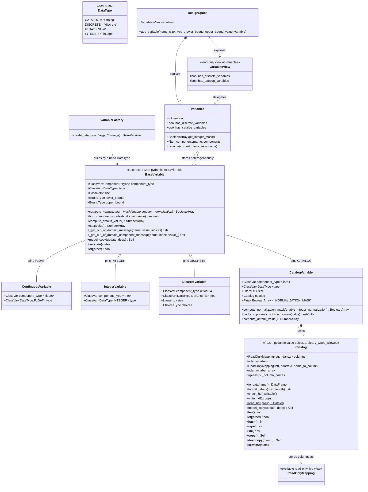

<!--
 Copyright 2021 IRT Saint Exupéry, https://www.irt-saintexupery.com

 This work is licensed under the Creative Commons Attribution-ShareAlike 4.0
 International License. To view a copy of this license, visit
 http://creativecommons.org/licenses/by-sa/4.0/ or send a letter to Creative
 Commons, PO Box 1866, Mountain View, CA 94042, USA.
-->

# Catalog Variables in the DesignSpace (GGQPA-1791)

## Requirements

Implement a fourth kind of design variable, `CatalogVariable`, whose domain is a
**catalogue** — a table of alternatives — rather than an interval or an explicit value
set, so that a modeller can declare a catalogue-valued quantity (a material, a supplier,
a qualified component) in the design space itself. The **value of the variable is the row
position** `0…n-1`; the index label names the row, and each column is a property of the
selected alternative, kept for the follow-up discipline to emit as a coupling variable.

Introduce `Catalog`, a frozen value object owning the table, its normalization pipeline
and its immutability, so that a variable class does not carry table processing and so
that the follow-up discipline is handed a catalogue rather than reaching into a variable.

Guarantee that a catalogue **cannot be modified once the variable is built**: neither
through the object the caller passed in, nor through anything the catalogue hands back.

Boundaries:

- **In scope — the data model only.** A catalog variable becomes *declarable*
  (`Catalog` + `add_variable(..., variable=...)`), *checkable* (both `check_membership`
  paths), *persistable* (HDF round-trip is lossless; CSV export is refused) and
  *viewable* (the tabular view is unchanged).
- **Out of scope — solving.** No encoder, no relaxation, no working design space, no
  capability flag, no driver guard, no rounding. A catalog variable falls out of
  every normalization and integer mask, so a DOE raises *"unbounded components"* and an
  optimizer fails only when it stores a non-integral optimum. The changelog fragment and
  the user documentation must state this limitation explicitly.
- **Also out of scope**: the catalogue-to-coupling discipline; a label-based declaration
  or read-back API; vectors of catalog variables; sharing or naming catalogues;
  catalog random variables in `ParameterSpace`; and special treatment of the
  degenerate one-row catalogue.
- **Public surface.** The variable hierarchy is *already* public — `gemseo.space.variable`
  is a public package. This story adds two names to that surface: `CatalogVariable`
  in `gemseo.space.variable`, and `Catalog` as a public module `gemseo.space.catalog`
  lazily re-exported as `gemseo.space.Catalog`.
- **Additive only.** Every existing `add_variable` call, every previously written HDF or
  CSV file, and every existing behavior of the continuous, integer and discrete kinds is
  unchanged.

## Entities



**Conservative notes**: `BaseVariable`, `ContinuousVariable`, `IntegerVariable` and
`DiscreteVariable` are **not modified** — no new hook, no changed signature, no changed
message. `Bounds`, `Normalizer`, `IntegerRounder`, `_view` and `_registry_derived_data`
are **not modified at all**. `ParameterSpace` is not edited:
`extract_deterministic_space` already shares the variable object as is. `Catalog` lives
*outside* the variable package, in its own module `gemseo/space/catalog.py`: it is a plain
`BaseModel`, **not** a `BaseVariable` subclass and **not** a `DataFrame` subclass, so
`VariableFactory` — which walks the `gemseo.space.variable` package — never sees it, and
no mutating `DataFrame` method is inherited. No `Catalog` registry, no catalogue name, no
catalogue sharing: it is a value owned by one variable.

## Approach

1. **Two concepts, one of which is not a variable**
    - `Catalog` owns the table: the input shapes, the normalization pipeline, the frozen
    storage, the `DataFrame` rebuild, equality, label rendering and the table's HDF
    read/write.
    - `CatalogVariable` owns the domain: the pinned type and dtype, the derived
    bounds, the membership test and the two failure messages. It stays the size of its
    siblings.
    - The catalogue lives in its **own public module** `gemseo/space/catalog.py`, beside
    the `gemseo.space.variable` package rather than inside it, and is lazily re-exported
    as `gemseo.space.Catalog`. It imports nothing from `gemseo.space.variable`, so the
    dependency runs one way only.
    - Rationale: the pipeline is about the table, not about the variable; the follow-up
    discipline will consume a `Catalog`; and a frozen Pydantic `Catalog` avoids a
    `DataFrame`-typed field, which would need `arbitrary_types_allowed` on the variable
    and would break `BaseVariable.__eq__`, since `df1 == df2` yields a `DataFrame` rather
    than a bool.

2. **Kind as a class, not a branch**
    - Add exactly one `BaseVariable` subclass implementing the existing polymorphic
    interface. `Bounds`, `Normalizer`, `IntegerRounder` and the aggregate-mask machinery
    get **no new branch**.
    - The only unavoidable non-polymorphic edits are the new `DataType.CATALOG`
    member and the tuple that derives `TYPE_MAP`
    (`src/gemseo/space/variable/__init__.py:34`).
    - **Acceptance rule for the design**: any `if variable.type == …` or
    `isinstance(variable, CatalogVariable)` in `space/design/` outside the registry
    flag and the three I/O sites is a design smell. The existing
    `isinstance(variable, IntegerVariable)` sweeps in `Variables` stay as they are: a
    catalog variable falls out of the integer and rounding masks for free.

3. **Derive the bounds from the row count**
    - `lower_bound = 0`, `upper_bound = len(catalog) - 1`, written by the model
    validator, never supplied by the caller, each as its own frozen shape-`(1,)`
    `int64` array, handed out as a read-only `.view()`.
    - Rationale: these are the true bounds of the domain, so every existing bounds
    consumer stays correct and honest, exactly as `DiscreteVariable` derives its bounds
    from its sorted choices.

4. **Reduce the domain check to integrality plus the bounds**
    - Unlike a discrete set, which leaves gaps inside its interval, a catalog domain
    **is** the integers of its derived interval, so `find_components_outside_domain`
    tests integrality and range and nothing else. What the kind adds is the *wording*.
    - The test is applied to `value_0.real`, so a complex-valued component — the one
    `DesignSpace.to_complex` produces, and the one a complex-step perturbation carries —
    is in domain when its real part is a valid position. Without this, `to_complex` would
    make every catalog variable unsettable.
    - `None` is treated as in-domain, as `DiscreteVariable` does, because
    `check_addable_value` may pass a not-yet-set value.
    - Two guards come **before** that test, each for a raw NumPy failure rather than for
    a domain rule: a non-numeric component — a label passed in place of a position —
    would make `.real` or `isfinite` raise, and an infinite or `NaN` component would make
    `mod` emit a spurious `RuntimeWarning`. Both are out of domain, so both return `{0}`
    early.

5. **Make immutability structural, not conventional**
    - The table is decomposed at construction into frozen NumPy arrays — the labels plus
    one array per column — with `setflags(write=False)`.
    - Those frozen arrays are never handed out directly: the catalogue stores and returns
    read-only `.view()`s of them, held in a `ReadOnlyMapping`
    (`gemseo.util.read_only_mapping`), so neither the mapping nor any array reachable
    from it can be mutated or re-flagged writeable. That `ReadOnlyMapping` **is** what
    the `columns` field holds after validation; `name_to_column` and `label_array` are
    typed accessors that narrow the input-shaped annotations of the two fields to what
    they hold, not a second copy cached beside them.
    - `to_dataframe()` rebuilds a fresh `DataFrame` from copies on each call.
    - `model_copy` is overridden to return `self` when there is nothing to update and to
    re-validate through `model_validate` otherwise, so a copy can never share a mutable
    buffer with its original. `__copy__` and `__deepcopy__` follow.
    - `__copy__` and `__deepcopy__` return `self`: the object is immutable and its
    arrays are read-only, so a copy has nothing to protect, and rebuilding one would
    lose the frozen flags, which NumPy does not preserve across a copy.
    - Rejected alternatives: a deep copy defends only the caller's handle; freezing
    `df._mgr.blocks` relies on private pandas API that Copy-on-Write can defeat;
    deep-copying on every access keeps mutable state inside a frozen model.

6. **Make the normalization pipeline an ordered contract**
    - Convert (reject a `MultiIndex`, reject a row-less table, reject column names that
    collide once stringified) → check the kinds (reject an unordered collection and a
    nested table) → strip → check dimensionality → check the row count (reject columns
    without a row) → drop blank columns (log warning) → check rectangularity (reject a
    ragged table) → broadcast scalars → check at least one column remains → default the
    labels and freeze.
    - Each step changes what the next one sees, so the order is written into the
    `Catalog` docstring and covered by one test per adjacent pair. Dropping after the
    rectangular check would make a zero-length column look ragged; testing blankness
    before stripping would keep a column of whitespace; broadcasting before the
    rectangular check would let a scalar decide the row count; checking dimensionality
    after dropping would let a nested blank column through; checking dimensionality
    *before* stripping would miss a `DataFrame` column of equal-length sequences, which
    only reveals its shape once stripping has turned it from an opaque object array into
    a nested list; counting the rows after dropping would report the absence of a
    *column* for an input that supplied columns without any *row*.
    - The two non-emptiness checks sit at different points: "at least one row" is raised
    inside the `DataFrame` branch of the conversion, before anything else can be derived
    from a row-less index, and again by the row-count step for a mapping whose every
    sized column is empty — which reports the length disagreement instead when labels
    name rows those columns contradict; "at least one column" is raised after
    broadcasting, so that a table whose every column was blank reports the
    *dropped-columns* warning first and then the failure.
    - **Blankness, never falsiness, except for `str`**: `pandas.isna` decides for every
    non-string value, so a column of `0` or `False` is kept. Only a `str` is tested with
    `not value`, where it means exactly "the empty string after stripping".

7. **Extend the extension points #1885 opened, rather than adding new ones**
    - The per-variable membership fallback in `_checking.check_membership` already exists
    for the discrete kind and needs a second arm.
    - `add_variable` needs **nothing**: it already guards on the allowlist
    `_BOUNDED_TYPES = {DataType.FLOAT, DataType.INTEGER}`
    (`src/gemseo/space/design/__init__.py:96`), so a new non-bounded kind is rejected the
    day it exists, with the wording already shared with the discrete kind. This is the
    extension point working as designed.

8. **Persist in HDF, refuse in CSV**
    - The frozen storage *is* a labels array plus one array per column, so HDF writes it
    directly into a `catalog` sub-group, plus an ordered `column_names` dataset because
    h5py does not preserve group insertion order and column order takes part in
    equality.
    - Writability is checked **before the file is opened**: `to_hdf` sweeps every
    catalog variable through `Catalog.check_hdf_writable()` first, so an
    unrepresentable column, or an invalid HDF link name, cannot truncate an existing file
    or leave a half-deleted `catalog` group behind.
    - A unicode column is encoded to bytes and flagged with a `was_unicode` dataset
    attribute, so `read_hdf` can tell it apart from a genuine byte-string column and
    round-trip both losslessly.
    - CSV is one line per component with a space delimiter: a table has no cell-shaped
    representation there. `to_csv` raises rather than writing a file `from_csv` cannot
    read back.

## Structure

### Inheritance Relationships

1. `BaseVariable(BaseModel, ABC, frozen=True, extra="forbid")` declares the kind
   interface and is **unchanged** by this story: one `@abstractmethod`
   `compute_normalization_mask` plus the overridable hooks `cast`,
   `compute_default_component_value`, `compute_default_value`,
   `check_finite_bound_components`, `find_components_outside_domain`,
   `_get_out_of_domain_message` and `_get_out_of_domain_component_message`.
2. `CatalogVariable(BaseVariable)` pins `type: ClassVar[DataType] =
   DataType.CATALOG`, `size: Literal[1]` and `component_type: ClassVar = int64`,
   declares `catalog`, and overrides `compute_normalization_mask`,
   `find_components_outside_domain`, `compute_default_value` and the two wording hooks.
3. `Catalog(BaseModel, frozen=True, arbitrary_types_allowed=True)` inherits from
   `BaseModel` only, and does **not** set `extra="forbid"`. It is **not** a variable and
   **not** a `DataFrame` subclass; it overrides `__eq__`, `__hash__`, `__repr__`
   (reused as `__str__`), `__len__`, `__copy__`, `__deepcopy__`, `model_copy` and
   `__setstate__`.
4. `ContinuousVariable`, `IntegerVariable` and `DiscreteVariable` are unchanged.
5. `DataType(StrEnum)` gains a fourth member, inserted in alphabetical order; it stays a
   closed enum, publicly re-exported as `gemseo.enum.DesignVariableType`
   (`src/gemseo/enum/__init__.py:104`, lazy map at `:257`, pointing at
   `gemseo.space.variable:DataType`).
6. `VariableFactory(BaseFactory[BaseVariable])` is unchanged: the new kind
   self-registers by existing as a module in `gemseo.space.variable`, resolved through
   the pinned `type`.
7. `VariablesView(ReadOnlyMapping[str, BaseVariable])` is the public read-only face of
   the registry; it gains one delegating property.

### Dependencies

1. `CatalogVariable` depends on `Catalog`; `Catalog` depends on nothing in
   `gemseo.space` — only on `pandas`, `numpy`, `pydantic`, `h5py` (typing only) and
   `gemseo.util` (`ReadOnlyMapping`, `pretty_str`).
2. `DesignSpace.add_variable` calls `VARIABLE_FACTORY.create` for a bound-shaped
   declaration, or stores a caller-supplied variable as is, then
   `Variables.__setitem__`, `_checking.check_addable_value`, `Value.set_variable`,
   `Value.check_value` and, on failure, `DesignSpace.remove_variable`.
3. `Variables.__reindex` sets a boolean flag for the catalog kind alongside the
   discrete one; `has_catalog_variables` reads that cached flag.
4. `VariablesView.has_catalog_variables` delegates to `Variables`.
5. `_checking.check_membership` consults
   `has_discrete_variables or has_catalog_variables` to choose between
   `_check_membership_array` and `_check_membership_dict`.
6. `_checking.check_addable_value` and `_checking._check_index_in_domain` already call
   the two wording hooks; no edit.
7. `_io.to_hdf` and `_io.from_hdf` delegate the table to `Catalog.write_hdf` /
   `Catalog.read_hdf` and share a new module-level helper `_check_domain_payload`;
   `_io` also imports `DataType` and `pretty_str`.
8. `_io.to_csv` consults `design_space.variables.has_catalog_variables` to raise.
9. `Bounds`, `Normalizer`, `IntegerRounder`, `_view`, `_registry_derived_data`,
   `_staleness_guard`, `_codec` and `_legacy` gain **no** dependency on the new kind.
10. `_value.py` and `space/design/__init__.py` are touched for **docstrings only**: both
    describe what `initialize_missing` assigns to a catalog variable.

### Layered Architecture

1. **Catalogue layer** (`src/gemseo/space/catalog.py`): the table, its pipeline, its
   immutability, its equality, its rendering and its HDF payload. Knows nothing about a
   variable or a design space. Owns its own `LOGGER`.
2. **Variable layer** (`src/gemseo/space/variable/`, a public package): the kinds and
   their domains. Owns validation, freezing, default-value computation, normalization
   policy, domain membership and domain-failure wording. Knows nothing about a design
   space.
3. **Collaborator layer** (`src/gemseo/space/design/`): `Variables` (registry +
   versioning + masks + kind flags), `Bounds`, `Normalizer`, `IntegerRounder`, `Value`,
   `_checking`, `_io`, `_view`. Kind-agnostic apart from the registry flag and the three
   I/O sites.
4. **Façade layer** (`src/gemseo/space/design/__init__.py`,
   `src/gemseo/space/variables_view.py`, `src/gemseo/space/parameter.py`): the public
   API. Owns `add_variable`, the accessors, the I/O entry points and the rollback
   semantics. `ParameterSpace` requires **no** edit.
5. **Consumer layer** (outside `space/`): `src/gemseo/core/problem/database.py:1102` and
   `src/gemseo/doe/core/base_doe_library.py:209` index `VARIABLE_TYPES_TO_DTYPES`
   (`TYPE_MAP`) by variable type and must find the new member there.
6. **Documentation and changelog layer**:
   `docs/user_guide/concepts/design_space.md`, `changelog/fragments/1791.added.md` and
   `changelog/fragments/1791.fixed.md`.

## Operations

Execute in this order; each step leaves the test suite green.

### 1. Update Enum — `DataType` (`src/gemseo/space/variable/base.py`)

1. Responsibility: carry the discriminator of the new kind.
2. Change: add `CATALOG = "catalog"` as the **first** member — the enum lists its
   members alphabetically.
3. Constraints: member key capitalized per the repo convention; the value is the string
   that HDF and every external reader of `variable.type` will see. No other edit to
   `base.py`.

### 2. Update Constants — `src/gemseo/space/design/_constants.py`

1. Responsibility: name the HDF sub-group of a catalogue once, for the writer and the
   reader.
2. Add exactly one name, between `_CHOICES_SEPARATOR` and `_TABLE_NAMES`:
    - `_CATALOG_GROUP: Final[str] = "catalog"` — the per-variable HDF sub-group. Its
    docstring names that and nothing else: the field of a catalog variable happens
    to share the string, which is not a contract `_io` may lean on.
3. Constraints: the names of the catalogue's own payload — `labels`, `column_names`,
   `columns` and the `was_unicode` attribute — are **private to `space/catalog.py`** and
   are not shared with `design/_constants.py`; only the sub-group name crosses the
   boundary, because only `_io` needs it. `_TABLE_NAMES` is **not** touched — the tabular
   view gains no column. `_CHOICES_GROUP` and `_CHOICES_SEPARATOR` are untouched.

### 3. Create Value Object — `Catalog` (`src/gemseo/space/catalog.py`, new file)

1. Responsibility: own a table of alternatives — the index labels and the property
   columns — normalized, frozen, comparable, hashable and cheap to render.
2. Module-level names:
    - `LOGGER = logging.getLogger(__name__)`.
    - `_MAX_FORMATTED_LABELS: Final[int] = 6` — mirroring
    `discrete._MAX_FORMATTED_VALUES`.
    - `_LABELS: Final[str] = "labels"` and `_COLUMNS: Final[str] = "columns"` — the
    names of the two fields, used wherever the validator, `model_copy` and
    `__setstate__` write through the instance `__dict__`.
    - `_LABELS_GROUP: Final[str] = "labels"`, `_COLUMN_NAMES_GROUP: Final[str] =
    "column_names"`, `_COLUMNS_GROUP: Final[str] = "columns"` — the HDF payload names,
    declared apart from the field names above so that the on-file layout and the model
    stay free to diverge.
    - `_WAS_UNICODE_ATTRIBUTE: Final[str] = "was_unicode"` — the dataset attribute
    flagging a column that was encoded from `str` to bytes.
    - `_HDF_WRITABLE_DTYPE_KINDS: Final[frozenset[str]] = frozenset({"b", "i", "u", "f",
    "c", "S", "U"})` — bool, signed, unsigned, float, complex, byte string and unicode
    string (encoded before writing).
    - `CatalogColumnsType = DataFrame | Mapping[str, Any]`
    - `CatalogLabelsType = Sequence[Any] | ndarray | Index`
3. Fields, both declared through `Field(description=…)` so that the description reaches
   the model schema and not only the rendered documentation:
    - `columns: CatalogColumnsType` — required. **After validation it holds a
    `ReadOnlyMapping[str, ndarray]`** of read-only views over frozen arrays, in input
    order — the same input-union / normalized-storage pattern `DiscreteVariable.choices`
    uses. The name of a `DataFrame` column is converted to a string; two names that
    collide once converted are rejected.
    - `labels: CatalogLabelsType = ()` — optional. After validation it holds a read-only
    view of a frozen `str_` array. Empty means "use the positions", rendered as `"0"`,
    `"1"`, …; a `str`, `bytes`, `bytearray` or zero-dimensional array is **one** label,
    so `labels=""` names a single row rather than supplying no label at all.
4. Methods:
    - `__validate_catalog(self) -> Self` — `@model_validator(mode="after")`. Logic, **in
    this order**, which is the contract:
       1. **Convert** (`__convert`). A `DataFrame` yields `labels` from `.index`
          (stringified, when `labels` was not supplied) and one array per column via
          `df[name].to_numpy()`, in column order. Reject a `MultiIndex` on either axis,
          naming the offending axis or axes with singular/plural agreement. Reject a
          table with no row here, before anything is derived from its index. Convert
          every column name to a string and reject two names that collide once
          converted, e.g. the integer `1` and the string `"1"`, before the collision
          could silently drop a column; two literally equal names are caught by the same
          test. A mapping yields its keys — already strings, by the field type — as
          column names, preserving insertion order, and its values as candidate columns.
          A `str`, `bytes`, `bytearray` or zero-dimensional array given as `labels` is
          read as a single label, through the same `_is_scalar` rule a column uses, so
          that it is neither exploded into one row per character or per byte nor passed
          to a bare `len` that raises on it.
       2. **Check the kinds** (`__check_column_kinds`). Reject a column given as an
          unordered collection — a `Set`, which covers a `set` and a mapping's keys or
          items view — because the order of the rows it would define is arbitrary, and
          reject a column given as a nested `DataFrame`, which is iterable over its
          **column names** and would otherwise be read, silently, as a column holding
          those names. Both raise a `ValueError`, not a `TypeError`, since pydantic only
          wraps the former into a `ValidationError`.
       3. **Strip** (`_strip`). For every value that is a `str`, `bytes` or `bytearray`,
          replace it with its stripped form; same for every label. A `bytearray` is
          returned as `bytes`, upstream of any broadcast or freeze, so that NumPy never
          reads it through the buffer protocol as a sequence of bytes. A zero-dimensional
          string array is unwrapped to the string it stands for. A scalar string is
          stripped as one value, not exploded per element. Non-string values are
          untouched.
       4. **Check the dimensionality** (`__check_columns`). Reject any column whose
          `asarray(...).ndim > 1`, naming it, and reject labels of dimension greater
          than one. This is what rejects a nested sequence. It runs **after** stripping,
          because stripping a `DataFrame` column of equal-length sequences turns it from
          an opaque one-dimensional object array into a plain nested list that reveals
          its true shape. A `DataFrame` with duplicate column labels would fail here
          too, but `__convert` already rejects it earlier.
       5. **Check the row count** (`__check_row_count`). If every sized column is empty
          and no label is supplied, the input describes columns without any row: raise
          *"A catalog must have at least one row."* When labels **are** supplied, report
          the length disagreement instead, since the labels name rows the empty columns
          contradict. This runs **before** the blank columns are dropped, which would
          otherwise swallow every such column and report the absence of a *column*
          instead of the absence of a *row*. A single empty column alongside a sized one
          is left to the next step, which drops it.
       6. **Drop the blank columns** (`__drop_blank_columns`). A column is blank when it
          has no element, or when every element is blank; a scalar column is blank when
          the scalar itself is blank. Discard each blank column and emit **one**
          `LOGGER.warning` naming **all** of them through `pretty_str(..., sort=False)`.
       7. **Check the rectangularity** (`__compute_row_count`). Every remaining sequence
          column, and the labels when supplied, must have the same length; that length
          is the row count `n`. On a mismatch raise `ValueError` naming each column and
          its length, and the labels and theirs. Scalar columns take no part. When no
          sequence column and no label carries a length — a mapping of scalars only —
          `n = 1`.
       8. **Broadcast the scalars.** Replace each scalar column with `full(n, value)`.
       9. **Check the non-emptiness.** Raise `ValueError` when no column remains
          (*"A catalog must have at least one column."*).
       10. **Default the labels and freeze** (`_freeze`). When `labels` was not supplied,
           build `[str(index) for index in range(n)]`. Convert each column with `asarray`,
           **copy** it so that freezing does not touch an array owned by the caller, then
           `setflags(write=False)`; same for the labels, forced to `str_`. A column mixing
           a string value and a missing one is frozen as `object`
           (`_mixes_string_and_missing`), because NumPy would otherwise promote both to a
           fixed-width string dtype and turn the missing cell into the literal text
           `"nan"`. Write a read-only `.view()` of each back through
           `self.__dict__[_LABELS] = …` and `self.__dict__[_COLUMNS] =
           ReadOnlyMapping({…})` to bypass the frozen model, exactly as `discrete.py`
           does. A view, unlike the array it is built from, refuses to have its writeable
           flag re-enabled, since it does not own its data.
      1. `return self`
    - `name_to_column(self) -> ReadOnlyMapping[str, ndarray]` — `@property`, the
      `ReadOnlyMapping` of read-only views the `columns` field holds after validation.
      It is that object, not a second cache built beside it: the property only narrows
      the input-shaped annotation of the field to what the field actually holds, so two
      reads are the same object and reading a column allocates nothing.
    - `label_array(self) -> ndarray` — `@property`, the read-only labels array, narrowing
      the `labels` field the same way.
    - `_column_names(self) -> tuple[str, ...]` — `@property`, the keys of
      `name_to_column` in order. **Protected**: the order takes part in equality, hashing
      and the on-file layout, so it is a collaborator of those three and not a fifth
      public accessor; a user reads the same tuple from `name_to_column`, which the class
      docstring says so explicitly.
    - `__len__(self) -> int` — the row count, `len(self.label_array)`.
    - `to_dataframe(self) -> DataFrame`
        - Logic: `DataFrame(dict(self.name_to_column), index=self.label_array,
      copy=True)`. The single `copy=True` is what makes the table independent — copying
      each column beforehand would only copy them twice.
        - Returns: a mutable, independent view of the catalogue.
    - `format_labels(self, max_length: int = _MAX_FORMATTED_LABELS) -> str`
        - Logic: with `n = len(self)`, return
      `f"[{pretty_str(labels, sort=False, use_and=False)}]"` when `n <= max_length`;
      otherwise `f"[{head}, ..., {tail}] ({n} items)"` with `n_head = max_length // 2`
      head labels and `n_tail = max_length - n_head` tail labels — so **three and three**
      at the default of six, and never an overlap or a repeat at a small `max_length`.
      A `max_length` below `1` is read as `1`, and a `max_length` of `1` renders the tail
      alone, `"[..., z] (n items)"`, since `labels[-0:]` would otherwise be every label.
    - `__eq__(self, other: object) -> bool`
        - Logic: `False` unless `other` is a `Catalog`; then compare `_column_names`
      tuples for equality **including order**, `array_equal` on the labels, and
      `_columns_are_equal` on each column pairwise. Return a plain bool, never
      `NotImplemented`, which is truthy and would read as *equal* in the plain-truth-value
      comparison `BaseVariable.__eq__` performs.
        - Constraint: **required**, not optional. Pydantic's default `__eq__` compares
      `__dict__`, and a dict holding NumPy arrays raises
      *"truth value of an array … is ambiguous"*; `BaseVariable.__eq__` then relies on
      this method returning a bool.
    - `__hash__(self) -> int`
        - Logic: `hash((self._column_names, tuple(self.label_array)))`.
        - Constraint: **required**. Pydantic gives a frozen model a hash over the values
      of its fields, which raises on the mapping of arrays `columns` holds. Only what two
      equal catalogues are guaranteed to share may take part: the values cannot, since
      equal columns may differ in dtype (an `int8` and an `int64` column of the same
      values) and equal values may differ in bytes (`0.0` and `-0.0`).
    - `__repr__(self) -> str`, reused as `__str__`
        - Logic: `f"{type(self).__name__}({n} alternative(s) {self.format_labels()},
      columns: {pretty_str(self._column_names, sort=False)})"`, with the plural agreed on
      `n`.
        - Constraint: the pydantic default renders every value of every column — some
      13 kB for a thousand rows — which drowns a traceback, a debugger view, an f-string
      and a `print`. `__str__ = __repr__` so that none of them falls back to it.
    - `model_copy(self, *, update=None, deep=False) -> Self` — override
        - Logic: return `self` when `update` is empty — a frozen value object has nothing
      to copy; otherwise rebuild the payload from the stored `columns` and `labels`,
      apply `update`, and return `self.model_validate(payload)`, so the copy is fully
      re-validated and re-frozen and the original is untouched. `deep` changes nothing,
      and says so in its docstring: validation already copies.
    - `__copy__` / `__deepcopy__` — return `self`. The catalogue is immutable and its
      arrays are read-only, so a copy has nothing to protect; returning `self` also keeps
      the arrays frozen, which NumPy does **not** do across a copy.
    - `check_hdf_writable(self) -> None`
        - Logic, per column: reject a name that is not a valid HDF5 link name (empty,
      `"."`, `".."`, or containing `"/"` or a NUL); reject a name that UTF-8 cannot
      encode; accept a dtype whose kind is in `_HDF_WRITABLE_DTYPE_KINDS`, checking in
      addition that every value of a `"U"` column encodes to UTF-8; otherwise raise, with
      a dedicated message for an `object` dtype and a dtype-naming message for anything
      else. Then reject a label that UTF-8 cannot encode. The offending value is found by
      `_find_unencodable_utf8_value`, since `numpy.char.encode` fails on the array as a
      whole without naming a culprit.
        - Constraint: **public and called before the file is opened**, so a rejected
      export cannot truncate or half-write a file. Every encodability check lives here,
      not in `write_hdf`, for that reason.
    - `write_hdf(self, group) -> None`
        - Logic: `check_hdf_writable()` first; create `_LABELS_GROUP` from the
      utf-8-encoded labels; create `_COLUMN_NAMES_GROUP` from the utf-8-encoded column
      names to pin the order; then a `_COLUMNS_GROUP` sub-group with one dataset per
      column, encoding a `"U"` column to bytes and recording
      `dataset.attrs[_WAS_UNICODE_ATTRIBUTE]`.
    - `read_hdf(cls, group) -> Catalog` — `@classmethod`
        - Logic: decode the labels, read the ordered column names, read each column in
      that order decoding it back to `str` only when its `was_unicode` attribute says so,
      and return `cls(columns=…, labels=…)`. Re-validation is a no-op on
      already-normalized data and is the cheapest way to restore the frozen storage.
    - `__setstate__(self, state: dict[str, Any]) -> None`
        - Logic: `super().__setstate__(state)`, then refreeze the labels and every
      column and rebuild the `ReadOnlyMapping` of views, because NumPy pickles a view as
      an independent, writeable array and Pydantic restores the model without
      re-validating it.
5. Module-level helpers (private, tested through the public surface):
    - `_is_scalar(column)` — a `str`, `bytes`, `bytearray` or `Mapping`, a
    zero-dimensional array, or anything that is not `Iterable`. Everything else that can
    be iterated over is a sequence of values, which covers a `Sequence`, an `ndarray`, a
    pandas `Index`, `Series` or extension array, and a generator. Testing for a concrete
    set of sequence types instead would read every other iterable as a scalar and
    broadcast it as a single value — crashing on a pandas extension array with a raw
    NumPy broadcast error. A `Series` **must** be a sequence here: treating it as a
    scalar was a real defect and has a regression test.
    - `_strip_value(value)`, `_strip(column)`.
    - `_is_missing(value)`, `_is_blank(value)`, `_is_blank_column(column)`,
    `_mixes_string_and_missing(column)`.
    - `_compute_column_lengths(columns)`, `_raise_length_mismatch(labels,
    name_to_length)` — the shared length bookkeeping of steps 5 and 7.
    - `_columns_are_equal(column, other_column)`, `_values_are_equal(value,
    other_value)` — `array_equal(..., equal_nan=...)` handles a pair of float or complex
    columns and raises on any other pair, so a column of Python objects is compared value
    by value, where a missing value equals a missing value and nothing else. A missing
    value may never reach a bare `==`: `pd.NA == 1` is itself missing, and `bool` raises
    on it.
    - `_freeze(column, dtype=None)`, `_find_unencodable_utf8_value(values)`,
    `_read_hdf_column(dataset)`.
6. Constraints:
    - `arbitrary_types_allowed=True, frozen=True` as class keywords — this is the
    **only** place in the story that needs `arbitrary_types_allowed`, and it is on the
    value object, not on a variable. `extra="forbid"` is deliberately **not** set.
    - Never test `if not value` to decide blankness of a non-string; test `pandas.isna`,
    guarding against a non-scalar result. For a `str`, `not value` *is* the empty-string
    test and is used as such.
    - Duplicate labels are accepted. Non-numeric columns are accepted. A partly-blank
    column is kept untouched, `NaN` included, and keeps its missing values distinguishable
    from the string `"nan"`.
    - A catalogue is written to and read from HDF, and nothing else: it holds NumPy
    arrays, which pydantic cannot serialize to JSON, so `model_dump_json` raises and
    `model_dump` hands back the arrays as they are. Stated in the class docstring and
    asserted by a test.
    - No `name` field, no identity, no registry: a catalogue is a value.

### 4. Create Variable — `CatalogVariable` (`src/gemseo/space/variable/catalog.py`, new file)

1. Responsibility: a scalar variable whose value is a row position in a catalogue.
2. Class attributes:
    - `component_type: ClassVar[ComponentDType] = int64`
    - `type: ClassVar[DataType] = DataType.CATALOG`
    - `_NORMALIZATION_MASK: Final[BooleanArray] = array([False])` — the constant returned
    by `compute_normalization_mask`, mirroring `DiscreteVariable`.
3. Fields:
    - `size: Literal[1] = 1`
    - `catalog: Catalog = Field(description=...)` — required, no default, and typed as a
    plain `Catalog`. A `field_validator("catalog", mode="before")` named
    `__convert_catalog` wraps a `DataFrame` or a mapping into `Catalog(columns=value)`
    and passes a `Catalog` through unchanged, so the union stays out of the annotation.
    To supply labels alongside a mapping, build the `Catalog` explicitly.
4. Methods:
    - `__check_size(cls, value)` — `@field_validator("size", mode="before")`
        - Logic: reject any value other than `1` with *"A catalog variable is scalar;
      its size cannot be set to {value}."*, so that `filter_dimensions` with duplicated
      indices fails readably instead of surfacing a Pydantic error naming the internal
      `size` field — the reason `DiscreteVariable` carries the same validator.
    - `__validate_catalog_variable(self) -> Self` — `@model_validator(mode="after")`,
      delegating to two private steps:
       1. `__check_bounds_are_not_set` — if `{_LOWER_BOUND, _UPPER_BOUND} &
          self.model_fields_set`, raise `ValueError` naming the catalogue as the domain —
          *"The domain of a catalog variable is its catalog, from which its bounds
          are derived; the bounds are not settable."* This is what makes
          `set_lower_bound` / `set_upper_bound` fail.
       2. `__derive_bounds` — for `(_LOWER_BOUND, 0), (_UPPER_BOUND, len(self.catalog) -
          1)`, build `array([position], dtype=self.component_type)`,
          `setflags(write=False)`, and write a read-only `.view()` of it through
          `self.__dict__[name] = …`, mirroring `BaseVariable.__convert_bound`. Do not
          share one array between the two bounds.
    - `compute_normalization_mask(self, enable_integer_normalization) -> BooleanArray`
        - Logic: `return self._NORMALIZATION_MASK`, ignoring the flag. A catalog
      component is never normalized; no analogue of
      `enable_integer_variables_normalization` is introduced.
    - `find_components_outside_domain(self, value: NumberArray) -> set[int]`
        - Logic: `value_0 = atleast_1d(value)[0]`; return `set()` when `value_0 is None`;
      return `{0}` when `not isreal(value_0)`, which is how a label, or any other
      non-numeric value, is rejected without letting `.real` or `isfinite` raise on it;
      then, with `value_0_real = value_0.real`, return `{0}` when
      `not isfinite(value_0_real)`, which keeps `mod` from emitting a spurious
      `RuntimeWarning` on an infinity or a `NaN` (as opposed to `floor`, see
      `IntegerVariable.check_finite_bound_components`); return `set()` when
      `mod(value_0_real, 1) == 0` and `0 <= value_0_real <= len(self.catalog) - 1`;
      otherwise `{0}`.
        - Constraint: integrality **and** range, in one hook, on the **real part**. No
      tolerance. The two early returns are guards against a raw NumPy failure, not extra
      domain rules: their verdict is the same one the main test would give.
    - `compute_default_value(self) -> NumberArray`
        - Logic: `return array([0], dtype=self.component_type)` — the **first** row, not
      the midpoint of the derived interval.
    - `_get_out_of_domain_message(self, name, value, indices) -> str`
        - Logic: *"The following value of variable '{name}' is not a position in its
      catalog with the items {self.catalog.format_labels()}:
      {format_components(value, indices)}."* A catalog variable is scalar and the
      only caller can never pass more than one component, so no plural wording is needed.
    - `_get_out_of_domain_component_message(self, name, index, value_i) -> str`
        - Logic: *"The variable {name} is a catalog variable with the items
      {self.catalog.format_labels()}; got {name}[{index}] = {value_i}."*
5. Constraints:
    - **No `__eq__` override** — `BaseVariable.__eq__` iterates the model fields and so
    already covers `catalog`, and `Catalog.__eq__` returns a bool, which is what the base
    loop needs.
    - **No `__setstate__` override** — the base one refreezes the bounds and Pydantic
    restores the nested `Catalog` through its own `__setstate__`. Assert this in a test
    rather than duplicating the logic.
    - No `model_copy` override: the inherited one carries a bound over only when it is in
    `model_fields_set`, so a derived bound is never re-supplied and the rebuild through
    `model_validate` cannot trip `__check_bounds_are_not_set`.
    - No `check_finite_bound_components` override: the bounds are never caller-supplied.
    - No `cast` override: the inherited `astype(int64)` is right.
    - `component_type` is `int64`, which is what keeps the design vector numeric and
    sidesteps the one-dtype-per-`DataType` constraint of `TYPE_MAP`.
    - A one-row catalogue is legal and yields a **degenerate** variable — bounds
    `[0, 0]`, one admissible value. No warning, no special treatment.
    - Known inconsistency, documented not fixed: `type` is annotated `ClassVar[DataType]`
    where `DiscreteVariable.type` uses the narrower `ClassVar[DataType.DISCRETE]`.

### 5. Update Packages — `variable/__init__.py` and `space/__init__.py`

1. `src/gemseo/space/variable/__init__.py`:
    - Add `from gemseo.space.variable.catalog import CatalogVariable`.
    - Add `CatalogVariable` to the tuple deriving `TYPE_MAP` (`:34`), keeping the
    tuple alphabetical, so the map gains `"catalog" -> int64`.
    - Add `"CatalogVariable"` to `__all__`, alphabetically.
2. `src/gemseo/space/__init__.py`: add `Catalog` to the lazy re-export map
   (`from gemseo.space.catalog import Catalog` under `TYPE_CHECKING`, plus the
   `"Catalog": "catalog"` entry), so `gemseo.space.Catalog` resolves.
3. Constraints: `Catalog` is **not** exported from the variable package and **not** in
   the `TYPE_MAP` tuple — it has no `component_type` and no pinned `type`, and it does
   not belong to that package at all.

### 6. Update Registry — `Variables` (`src/gemseo/space/design/_variables.py`)

1. Responsibility: report the presence of a catalog variable in O(1), as it already
   does for the discrete kind.
2. Changes:
    - Declare `__has_catalog_variables: bool` next to `__has_discrete_variables`,
    initialized to `False`.
    - In `__reindex`, set both kind flags in the same single pass, with
    `if isinstance(variable, DiscreteVariable) … elif isinstance(variable,
    CatalogVariable) …`. Drop the `not has_discrete_variables and` short-circuit
    that guarded the discrete test: with two mutually exclusive kinds the `elif` is the
    clearer form and the guard was a latent trap.
    - Add `has_catalog_variables` as a `@property` returning the flag, next to
    `has_discrete_variables`.
    - **Bug fix, in scope**: `rename` must call `__reindex()` before `bump_version()`.
    A rename onto the name of another variable collapses the two entries into one, so
    the index ranges, the full-vector size and both kind flags all go stale. Document
    the collapse in the `rename` docstring, including that which of the two survives is
    order-dependent and otherwise unspecified.
3. Constraints: `get_integer_mask` and `has_integer_variables` are **not** touched — a
   catalog variable is deliberately absent from the integer and rounding masks.
   `filter_components` is not touched: `model_copy` preserves the catalogue, and the
   caller-set-bounds rule keeps the derived bounds from being re-supplied.

### 7. Update Checks — `src/gemseo/space/design/_checking.py`

1. Responsibility: route a full-vector membership check through the per-variable path
   when the space holds a kind whose domain the vectorized bound comparison cannot
   express.
2. Change in `check_membership`: replace `variables.has_discrete_variables` with
   `variables.has_discrete_variables or variables.has_catalog_variables`, and extend
   the comment: the bounds of a catalog variable are derived from its catalogue, so
   the vectorized comparison cannot reject a non-integral value lying inside them.
3. Constraints: no other edit. `check_addable_value` and `_check_index_in_domain`
   already delegate the wording to the variable.

### 8. Verify — `DesignSpace.add_variable` (`src/gemseo/space/design/__init__.py:324`)

**This operation requires no code change.** It is kept in the plan because it is the one
place a reader will expect an edit.

1. `add_variable` already guards a bound-shaped declaration on the allowlist
   `_BOUNDED_TYPES = {DataType.FLOAT, DataType.INTEGER}` (`:96`), introduced for the
   discrete kind. A `type_="catalog"` with no `variable` is therefore rejected the
   moment the enum member exists, with the pre-existing shared message:
   *"Only continuous and integer variables may be declared through the type_ argument of
   add_variable; use the variable argument instead."*
2. Do **not** turn the allowlist into a per-kind membership test and do **not** phrase a
   catalog-specific message: the wording is deliberately kind-agnostic and is already
   snapshotted for the discrete kind.
3. The only edit to this file is a docstring: `initialize_missing_current_values` gains a
   bullet for the position of the first alternative of a catalog variable's catalogue,
   noting it applies even though the bounds are finite. `_value.Value.initialize_missing`
   carries the same sentence.
4. Constraints: the signature, the semantics and the rollback behavior of `add_variable`
   are unchanged; the message emitted for a discrete variable is unchanged **verbatim**.

### 9. Create Accessor — `VariablesView.has_catalog_variables` (`src/gemseo/space/variables_view.py`)

1. Responsibility: the public predicate, symmetric with `has_discrete_variables`.
2. Logic: `@property` returning `self._mapping.has_catalog_variables`.
3. Constraints: the predicate lives on the **read-only view**, not on `DesignSpace`;
   `DesignSpace` has no `has_discrete_variables` either, and gains no accessor here.
   Callers write `design_space.variables.has_catalog_variables`.
4. **No `get_catalog` accessor is needed**: `VariablesView` already hands back the
   variable object, so a catalogue reloaded from HDF is reachable publicly as
   `design_space.variables[name].catalog`, and its table as `.catalog.to_dataframe()`.
   This closes the gap the plan originally recorded as deferred, and it is what the
   follow-up discipline story will consume.

### 10. Update I/O — HDF (`src/gemseo/space/design/_io.py`)

1. Responsibility: round-trip a catalogue exactly, and fail before touching the file.
2. `to_hdf`, **before the file is opened** (right after the `mode` is chosen): sweep
   every variable and call `variable.catalog.check_hdf_writable()` on each catalog
   one. This is what makes an unwritable catalogue leave a pre-existing file untouched,
   with or without `append=True`, and is covered by a test parametrized on `append`.
3. `to_hdf`, inside the per-variable loop, next to the existing `choices` handling:
    - Delete a stale `_CATALOG_GROUP` sub-group first — `if _CATALOG_GROUP in
    variable_group: del variable_group[_CATALOG_GROUP]` — for the same reason the
    `choices` dataset is deleted: a changed catalogue shape, or a variable that was
    catalog and no longer is, would otherwise leave a half-written group that
    `from_hdf` misreads.
    - Then `if isinstance(variable, CatalogVariable):
    variable.catalog.write_hdf(variable_group.create_group(_CATALOG_GROUP))`. A separate
    `if`, not an `elif` on the discrete branch.
    - `size`, `l_b`, `u_b`, `var_type` and `value` continue to be written unchanged; the
    persisted bounds of a catalog variable are informational.
4. New module-level helper, shared by both kinds:
   `_check_domain_payload(file_path, name, var_type, choices, catalog_group) -> None`
    - Logic: walk a map `{DataType.DISCRETE: (_CHOICES_GROUP, choices),
    DataType.CATALOG: (_CATALOG_GROUP, catalog_group)}`; for each entry, raise when
    the declared type is that kind and the payload is missing, and raise when the payload
    is present and the declared type is not that kind.
    - Messages, parameterized on the payload name so the discrete wording is preserved
    byte for byte:
        - *"Malformed DesignSpace input file {file_path} has no {payload_name} for the
    variable {name!r} of type {data_type.value!r}."*
        - *"Malformed DesignSpace input file {file_path} has {payload_name} for the
    variable {name!r} of type {var_type!r} instead of {data_type.value!r}."*
    - This replaces the two inline messages formerly built in `from_hdf`; the rendered
    text for a discrete variable is identical to before.
5. `from_hdf`:
    - Read the optional sub-group: `catalog_group = variable_group.get(_CATALOG_GROUP)`,
    decode `var_type`, then call `_check_domain_payload`.
    - Branch `if choices is not None` → discrete, `elif catalog_group is not None` →
    `VARIABLE_FACTORY.create(var_type, catalog=Catalog.read_hdf(catalog_group))`,
    `else` → the bound-shaped `add_variable`. Both non-default branches ignore the
    persisted bounds and let the constructor derive them.
6. Constraints: `append=True` must not disturb sibling variable groups. A file written
   before this story loads unchanged. `from_csv` keeps its own, older malformed-file
   messages for the discrete kind and gains no catalog branch.

### 11. Update I/O — CSV (`src/gemseo/space/design/_io.py`)

1. Responsibility: refuse rather than write a file that cannot be read back.
2. `to_csv`: after the columns are resolved and **before** the discrete-delimiter
   handling, raise `ValueError` when `design_space.variables.has_catalog_variables`,
   naming **every** offending variable through `pretty_str` (sorted, joined with "and"):
   *"A design space holding a catalog variable cannot be exported to CSV because the
   catalog of {names} does not fit in a CSV cell; use to_hdf instead."*
3. `_to_dataframe`, `_format_choices_cell` and `from_csv` are **not** touched: `to_csv`
   is the only entry point that could produce such a file.
4. Constraints: the existing discrete-delimiter check and the `_CHOICES_GROUP` column
   logic are unchanged; because the catalog guard runs first, a space holding both
   kinds reports the catalog failure. A space with no catalog variable exports
   byte-identically to today.

### 12. Update Documentation and Changelog

1. `docs/user_guide/concepts/design_space.md`:
    - Add `"catalog"` to the intro enumeration of available types, and turn "Three
    types are available" into "Four types are available" with a bullet
    *"catalog" for the variables choosing an alternative in a catalog*.
    - New `### Catalog variables { #concept-catalog-variables }` section after
    the discrete one, symmetric with it: what a catalogue is, that the value is the row
    position, the immutability guarantee, and how to read a catalogue back through
    `design_space.variables["material"].catalog` and
    `variable.catalog.to_dataframe()`.
    - State the formatting contract as a **numbered seven-item list**, in pipeline
    order: an unordered collection and a nested table refused; stripping; at least one
    row left; a value-less column dropped and named in a log warning, with the explicit
    note that a column of zeros holds values and is kept; equal lengths required; a
    scalar column repeated over the rows; at least one column left. The list is the
    user-facing face of the `Catalog` docstring, so a step added to one is added to the
    other.
    - State the immutability guarantee over **three** handles, not two: the table passed
    to the constructor, the table `variable.catalog.to_dataframe()` hands back, and the
    read-only columns `variable.catalog.name_to_column` hands out.
    - Illustrate the catalogue with a **Markdown table** (position / alternative /
    `mass` / `cost`). The section carries **no fenced code block** — the file has none.
    - The same *"not yet solvable"* admonition as the discrete section, plus the CSV
    limitation and the degenerate one-row case.
    - Update the normalization note to *"Discrete and catalog variables cannot be
    normalized"*, and spell out that an integer variable is not normalized either unless
    `enable_integer_variables_normalization` is `True`.
    - Close the section with an `??? abstract "API"` block linking `add_variable()`,
    `variables`, `VariablesView.has_catalog_variables`, `CatalogVariable` and
    `Catalog`.
    - Fix the dangling colon left by `a2acc46b56` in the paragraph explaining why a
    discrete or catalog variable needs the `variable` argument rather than bounds.
2. `changelog/fragments/1791.added.md`: the user-visible net effect only — a new
   catalog variable kind backed by a catalogue, declarable through
   `add_variable(..., variable=...)`, its bounds derived and unsettable, its catalogue
   readable back through `DesignSpace.variables[name].catalog`, the
   `DesignSpace.variables.has_catalog_variables` predicate, the new
   `DesignVariableType.CATALOG` member, HDF supported, CSV refused, and no optimizer
   or DOE algorithm handling the kind yet. Name the two public classes,
   `gemseo.space.variable.CatalogVariable` and `gemseo.space.Catalog`.
3. `changelog/fragments/1791.fixed.md`: **a second fragment**, for the registry bug the
   story exposed — `DesignSpace.rename_variable` now recomputes `dimension`,
   `name_to_indices` and the kind flags when the new name collapses onto an existing
   variable, where previously `dimension` kept counting the dropped variable's size and
   the derived data could go stale.

### 13. Create Tests

1. `tests/space/test_catalog.py` (new — beside the module it tests, **not** under
   `tests/space/variable/`): the pipeline, one test per rule and one per adjacent pair —
    - `DataFrame` input and mapping input yield equal catalogues; explicit labels
    override a `DataFrame` index; default labels are the stringified positions; labels
    given as an array or an `Index` are read as a sequence.
    - Labels read as a **single** label: a `str`, a `bytes`, a `bytearray`, a
    zero-dimensional array and the empty string, each naming one row.
    - Column kinds: a `Series`, a generator, a pandas extension array and a plain
    sequence are all read positionally; a `Mapping` and a zero-dimensional array are
    scalars; a `set` and a mapping view are rejected; a nested `DataFrame` is rejected.
    - `DataFrame` column names are stringified, and two names colliding once stringified
    — `1` against `"1"`, and two literally equal names — are rejected.
    - Stripping: columns and labels; the stored value is the stripped one; a `Series`
    column is stripped like a list; a `bytes` / `bytearray` scalar is stripped and
    broadcast as one value, not exploded per byte; a sequence of byte strings is
    stripped; a zero-dimensional string array is stripped.
    - Missing values survive the freeze: a column mixing a string and a missing value
    keeps the missing value missing rather than turning it into the text `"nan"`, for a
    `str` column and for a `bytes` one, while a numeric column with a missing value keeps
    a float dtype.
    - Blank columns dropped: zero-length, all-`NaN`, all-`None`, all-`""`,
    all-whitespace, mixed blanks, and each blank scalar. Assert the warning names
    **every** dropped column in a single record (`caplog`).
    - Kept columns: all-zero, all-`False`, partly blank, `["ACME", ""]`.
    - Rejections: ragged mapping (naming each column and its length), a ragged `Series`
    column, labels of the wrong length, a `MultiIndex` on rows / on columns / on both, a
    nested-sequence column, nested-sequence labels, a `DataFrame` with duplicate column
    labels, a non-string mapping key, no row (an empty `DataFrame`, a mapping of empty
    columns, and the same mapping **with** labels, which reports the length
    disagreement), no column, and every column blank (warning **and** failure telling a
    consistent story).
    - Scalars broadcast; a scalar-only mapping yields one row; a scalar-only mapping
    **with** labels takes its row count from them; a single `Series` column is read
    positionally and its pandas index leaks into neither the values nor the labels.
    - Immutability: mutating the caller's `DataFrame` and the result of `to_dataframe()`
    both leave the catalogue unchanged; every stored array has `flags.writeable is
    False`; `setflags(write=True)` on anything reachable from `columns`,
    `name_to_column` or `labels` raises; item assignment into `columns` or
    `name_to_column` raises `TypeError`; two reads of `name_to_column` hand back the same
    object; `model_copy()` and `model_copy(deep=True)` return `self` while
    `model_copy(update=…)` re-validates and leaves the original untouched; `copy.copy`
    and `copy.deepcopy` return the instance itself.
    - `__eq__`: equal, different label, different value, different column name,
    different length, different column order, non-`Catalog`, numeric-versus-string
    column in both directions, and a catalogue holding a `NaN` equal to itself. A missing
    value equals a missing value in an `object` column, in a nullable `Int64` extension
    column and in a string extension column, and an empty string in an `object` column is
    a value, not a missing one. Assert the result is a `bool` and that no
    *"truth value of an array"* error escapes.
    - `__hash__`: agrees with `__eq__` over the equal and unequal pairs above, and a
    catalogue works as a dictionary key.
    - `__repr__` and `__str__` render the row count, the elided labels and the column
    names, and never a value of a column.
    - `model_dump_json` raises and `model_dump` hands the arrays back as they are.
    - `format_labels` at and beyond `_MAX_FORMATTED_LABELS`, and parametrized on
    `max_length` down to `1` with no overlap or repeat.
    - Pickle, `copy.copy` and `copy.deepcopy` round-trip, with the arrays refrozen
    afterwards.
    - HDF: a non-ASCII label, column name and cell round-trip; the column order
    round-trips; an `"S"` column stays `"S"`; `check_hdf_writable` rejects `datetime64` /
    `timedelta64`, an `object` column, an invalid HDF link name (`""`, `"a/b"`, `"."`,
    `".."`), and a column name, a cell or a label that UTF-8 cannot encode — a lone
    surrogate — each naming the offending value; `write_hdf` performs every one of those
    checks **before** it writes anything into the group.
2. `tests/space/variable/test_catalog.py` (new): derived bounds `[0, n-1]` with
   `int64` dtype; explicit bounds rejected on either side; `size != 1` rejected; the
   domain hook on `-1`, `0`, `1`, `2`, `0.0`, `3`, `1.5`, `None`, a label passed in
   place of a position (a `str`, a `bytes` and an `object` array) and a non-finite
   position (`inf`, `-inf`, `nan`), the latter asserted to raise no warning;
   `compute_normalization_mask` for both values of the flag; `compute_default_value`; the
   two wording hooks snapshotted; a one-row catalogue; a `DataFrame`, a mapping and a
   `Catalog` all accepted through the field validator; the catalogue participating in
   `__eq__`; pickle keeping the bounds and the labels frozen.
3. `tests/space/variable/utils.py`: add `CatalogVariable` to `ALL_KINDS` with its
   `KIND_TO_KWARGS` entry (`{"catalog": {"property": [0, 1]}}`), so the shared
   cross-kind matrix driven by the `variable` fixture in `tests/space/variable/conftest.py`
   — frozen, copy, pickle, `model_copy` identity, `__eq__` — runs against it. Keep
   `KINDS` (the interval kinds) unchanged.
4. `tests/space/variable/test_factory.py`: the factory resolves `"catalog"`, and the
   available-types list in the failure message gains it; uses the `reset_factory`
   fixture.
5. `tests/space/design/test_variables.py`: `has_catalog_variables` after add,
   overwrite and remove; both kind counts exact across insert, `rename`,
   `filter_components`, cross-kind overwrite and delete; the **collapsing rename** in all
   three orderings; a catalog variable stays out of `get_integer_mask` and
   `has_integer_variables`; `filter_components` is the identity and preserves the
   catalogue.
6. `tests/space/design/test_checking.py`: `check_addable_value` rejects a position
   outside the domain; the mapping path and the array path both reject a non-integral
   position lying inside the derived bounds; the array path accepts valid positions.
7. `tests/space/test_design_space.py`: `add_variable` with `type_="catalog"` and no
   `variable` rejected with the shared message; `variables.has_catalog_variables`;
   derived bounds and unsettable bounds; the scalar `(1,)` `int64` value shape;
   `initialize_missing_current_values` assigning `[0]`; neither normalized nor rounded;
   non-position values rejected; HDF round-trip including a mixed numeric/string
   catalogue and a non-ASCII one; HDF append changing the catalogue shape; HDF append
   turning a catalog variable into an integer one; an unwritable catalogue (object
   dtype, `datetime64`) rejected **before** the stale group is deleted and leaving the
   file readable, parametrized on `append`; the two malformed-file errors; `to_csv`
   refusal; the tabular view rendering a catalog variable with **no extra column**
   (snapshot); `extend`, `add_variables_from`, `rename_variable`, `filter_dimensions`,
   `to_scalar_variables`, `to_complex`, pickle and deepcopy.
8. Constraints: snapshot every message with `assert_exception` and `snapshot`; never
   pass `-n` together with `--snapshot-update`; cap xdist at `-n 4` locally; run
   `tests/space/design` before `tests/space` when the factory cache matters.

### Message reference (verbatim)

Every string this story introduces, exactly as the code builds it. Each is snapshotted;
a diff here is a diff in a `.ambr` file.

`Catalog` — validation (`ValueError`, surfaced as a Pydantic `ValidationError`):

```text
A catalog is a flat table, but its {pretty_str(nested_axes, sort=False)} {'axes are' if plural else 'axis is'} a MultiIndex.
A catalog must have at least one row.
The columns of the catalog do not have distinct names once converted to strings: {str_name!r} names more than one column.
The column {name!r} of the catalog is a DataFrame; a catalog is a flat table, so a column holds values, not another table.
The column {name!r} of the catalog is an unordered collection ({type(column).__name__}); use an ordered sequence instead.
The column {name!r} of the catalog has a dimension greater than 1; a column holds one value per row.
The labels of the catalog have a dimension greater than 1.
The columns of the catalog do not have the same length: {pretty_str(sizes, sort=False)}.
A catalog must have at least one column.
```

`Catalog` — dropped columns (`LOGGER.warning`, lazy `%s`):

```text
The following columns of the catalog hold no value and were dropped: %s.
```

`Catalog.check_hdf_writable` (`ValueError`):

```text
The column name {name!r} of the catalog is not a valid HDF name and cannot be written to an HDF file.
The column name {name!r} of the catalog cannot be encoded to UTF-8 and cannot be written to an HDF file.
The value {value!r} of the column {name!r} of the catalog cannot be encoded to UTF-8 and cannot be written to an HDF file.
The column {name!r} of the catalog holds Python objects and cannot be written to an HDF file.
The column {name!r} of the catalog has the dtype {column.dtype} and cannot be written to an HDF file.
The label {label!r} of the catalog cannot be encoded to UTF-8 and cannot be written to an HDF file.
```

`CatalogVariable` — validation (`ValueError`):

```text
A catalog variable is scalar; its size cannot be set to {value}.
The domain of a catalog variable is its catalog, from which its bounds are derived; the bounds are not settable.
```

`CatalogVariable` — domain wording (returned, not raised):

```text
The following value of variable '{name}' is not a position in its catalog with the items {self.catalog.format_labels()}: {format_components(value, indices)}.
The variable {name} is a catalog variable with the items {self.catalog.format_labels()}; got {name}[{index}] = {value_i}.
```

`_io._check_domain_payload` (`ValueError`, shared with the discrete kind through
`payload_name`):

```text
Malformed DesignSpace input file {file_path} has no {payload_name} for the variable {name!r} of type {data_type.value!r}.
Malformed DesignSpace input file {file_path} has {payload_name} for the variable {name!r} of type {var_type!r} instead of {data_type.value!r}.
```

`_io.to_csv` (`ValueError`):

```text
A design space holding a catalog variable cannot be exported to CSV because the catalog of {pretty_str(names)} does not fit in a CSV cell; use to_hdf instead.
```

Reused unchanged, from `DesignSpace.add_variable`:

```text
Only continuous and integer variables may be declared through the type_ argument of add_variable; use the variable argument instead.
```

## Norms

1. **File preamble**: the LGPL license header (inserted by pre-commit) and
   `from __future__ import annotations` first in every source file.
2. **Naming**: a callable name starts with a verb — `to_dataframe`, `format_labels`,
   `write_hdf`, `read_hdf`, `check_hdf_writable`, `find_components_outside_domain`,
   `compute_default_value`; a noun-only name is reserved for an attribute or property
   (`columns`, `labels`, `_column_names`, `label_array`, `name_to_column`,
   `has_catalog_variables`). Enum member keys are capitalized (`CATALOG`).
3. **Imports**: one import per line (`force-single-line = true`), isort order,
   `TYPE_CHECKING`-only imports for annotations. `CatalogVariable` is exported from
   `gemseo.space.variable` and imported from there by the `design/` package;
   `Catalog` is imported from its own module, `gemseo.space.catalog`, by
   `variable/catalog.py` and by `design/_io.py`, and is re-exported lazily as
   `gemseo.space.Catalog` for users.
4. **Docstrings**: Google convention, mkdocs/markdown cross-references
   (`[Catalog][gemseo.space.catalog.Catalog]`, never Sphinx RST). Every docstring with
   parameters carries `Args:`, every non-`None` return carries `Returns:`, every raising
   path carries `Raises:` — private, dunder and `@staticmethod` callables included.
   `# noqa: D102` for an override that inherits its docstring, as
   `ContinuousVariable.compute_normalization_mask` already does. The `Catalog` class
   docstring **states the pipeline order**; it is the contract.
5. **Pydantic mechanics**: `frozen=True`; a validator writes through
   `self.__dict__[name] = …` to bypass assignment validation; a NumPy array stored on a
   model is frozen with `setflags(write=False)`, handed out only as a `.view()`, and
   refrozen in `__setstate__`; `component_type` and `type` are `ClassVar`s and `size` is
   pinned with a `Literal` default. `arbitrary_types_allowed` appears **only** on
   `Catalog`.
6. **Error messages**: build the message into a local `msg` then `raise ValueError(msg)`
   (required by ruff `EM`); report offending array components through
   `format_components`; use `pretty_str` for a list of names — `sort=False` where the
   input order carries meaning (catalogue columns), the default sort where it does not
   (variable names in the CSV refusal).
7. **Logging**: `LOGGER = logging.getLogger(__name__)` at module level; **lazy `%s`
   formatting**, never an f-string, in a logging call; one `LOGGER.warning` per catalogue
   construction, naming every dropped column, never one warning per column and never a
   bare count.
8. **Blankness, not falsiness**: `pandas.isna` decides for every non-string value, so a
   column of `0` or `False` is kept. `not value` is used **only** on a `str`, where it is
   precisely the empty-string test. Never let a bare `array == ""` on a numeric column
   degrade into a scalar comparison.
9. **Polymorphism over branching**: a behavior that differs per kind is a method on the
   kind. `isinstance(variable, CatalogVariable)` is allowed in exactly four places —
   `Variables.__reindex`, the pre-open writability sweep and the write loop of
   `_io.to_hdf`, and the `_io.to_csv` guard. `VariablesView` knows the kind only by
   delegating a property name. `add_variable` knows nothing: it tests the
   `_BOUNDED_TYPES` allowlist. Anything else means a missing hook.
10. **`ruff` configuration**: `BaseModel` is already listed under
    `[lint.flake8-type-checking].runtime-evaluated-base-classes` in `.ruff.toml`, so
    `Catalog` needs no entry.
11. **Testing**: snapshot exception messages with `assert_exception`; use the shared
    fixtures (`tmp_wd`, `reset_factory`) from `gemseo.util.testing.pytest_conftest`.
12. **Changelog**: two fragments — `changelog/fragments/1791.added.md` for the new kind
    and `changelog/fragments/1791.fixed.md` for the rename staleness fix — describing
    only user-visible net effects relative to the last release; no branch-internal churn.

## Safeguards

1. **Functional constraints**
    - A value is admissible **iff** its real part is integral and lies in
    `0…len(catalog)-1`. Both `check_membership` paths must agree on every input,
    including a non-integral value inside the derived bounds.
    - `size == 1` always; any other size is rejected at construction with the kind's own
    message.
    - `lower_bound == 0` and `upper_bound == len(catalog) - 1`; supplying either
    explicitly is an error, and `set_lower_bound` / `set_upper_bound` fail.
    - `initialize_missing` assigns position `0`, never the midpoint of the derived
    interval.
    - A scalar current value is stored as a shape-`(1,)` `int64` array.
    - A catalog component is neither normalized nor rounded: `normalize_vect`,
    `unnormalize_vect` and `round_vect` are the identity on it.
    - `to_complex` must keep a catalog variable settable — hence the real-part test.
2. **Immutability constraints (hard — this is the requirement)**
    - Every array stored by a `Catalog` has `flags.writeable is False`, after
    construction, after `model_copy`, after `copy`/`deepcopy` and after unpickling, and
    every array handed out is a read-only view of one of them, so
    `setflags(write=True)` on anything a caller can reach raises.
    - `columns` and `name_to_column` are `ReadOnlyMapping`s: item assignment raises
    `TypeError`. `name_to_column` narrows the `columns` field rather than duplicating it,
    so two reads are the same object.
    - Mutating the `DataFrame` or the mapping passed to the constructor must not change
    the catalogue: every column is **copied** before being frozen.
    - Mutating the `DataFrame` returned by `to_dataframe()` must not change the
    catalogue; each call returns an independent object.
    - `model_copy()` with nothing to update returns `self`, `deep=True` included, and
    so do `copy.copy` and `copy.deepcopy`; with an update, `model_copy` re-validates and
    leaves the original untouched.
    - A column mixing a string value and a missing one is stored as an `object` column,
    so the missing value stays missing instead of being frozen as the text `"nan"`, and
    two such catalogues compare equal.
    - There is no setter, no `append`, no `drop`: changing a catalogue means building a
    new variable.
3. **Pipeline constraints (order is contractual)**
    - Convert → check kinds → strip → check dimensionality → check row count → drop
    blank → rectangularity → broadcast → at-least-one-column → default labels and
    freeze. One test per adjacent pair asserts the order, not just the outcome.
    - "At least one row" is raised inside the conversion of a `DataFrame`, and again
    after stripping for a mapping whose every sized column is empty — before the blank
    columns are dropped, which would otherwise report a missing *column*; "at least one
    column" is raised after broadcasting, so an all-blank table warns before it fails.
    - A column given as an unordered collection, e.g. a `set` or a mapping view, and a
    column given as a nested `DataFrame` are rejected, as a `ValueError` and not a
    `TypeError`, because pydantic wraps only the former.
    - A `DataFrame` column name is converted to a string, and two names that collide once
    converted are rejected at conversion time, before the collision could drop a column.
    - Blank means: no element, `pandas.isna` true, or empty after stripping for a `str`.
    `0` and `False` are values and their columns are **kept** — the regression test that
    stops a future refactor from substituting a truthiness test.
    - A `Series` is a sequence, never a scalar; a `bytes` / `bytearray` scalar is one
    value, never a sequence of bytes; a `bytearray` is normalized to `bytes` while
    stripping, upstream of any broadcast or freeze. All have regression tests.
    - A `str`, `bytes`, `bytearray` or zero-dimensional array given as `labels` is one
    label, so `labels=""` names a single row rather than supplying no label.
    - A partly-blank column is kept untouched; no imputation, no default.
    - A ragged mapping is rejected with a message naming each column and its length.
    - A column of dimension greater than one is rejected, which is also how a nested
    sequence and a duplicate `DataFrame` column label are caught.
    - A scalar column is broadcast; a scalar-only mapping yields one row unless labels
    fix another count.
    - Stripping applies to string-like values only, in the columns and in the labels, and
    the **stripped value is what is stored** — so `to_dataframe().loc[" alu "]` raises
    where `.loc["alu"]` succeeds.
4. **Backward-compatibility constraints (hard)**
    - No change to the signature, semantics or rollback behavior of `add_variable`, and
    no change to the message it emits for a non-bounded type — the catalog kind
    reuses that message verbatim.
    - No change to `BaseVariable`, `ContinuousVariable`, `IntegerVariable` or
    `DiscreteVariable` — not one line, beyond the new `DataType` member in
    `variable/base.py`.
    - No change to any message emitted for an existing kind, with one sanctioned
    exception: `tests/space/variable/__snapshots__/test_factory.ambr` gains
    `catalog` in the *available types* list of the unknown-type failure. Every other
    entry in `tests/space/__snapshots__/`, `tests/space/design/__snapshots__/` and
    `tests/space/variable/__snapshots__/` must show **no diff** except for genuinely new
    cases. A diff on any other existing entry is a defect, not a snapshot to accept.
    - One deliberate behavior change, changelogged as a fix: `Variables.rename` now
    reindexes, so a collapsing rename no longer leaves `dimension`, `name_to_indices` or
    the kind flags stale.
    - `_value.py` and `space/design/__init__.py` are edited for docstrings only.
    - A space with no catalog variable renders and exports byte-identically to
    today.
    - Every HDF and CSV file written before this story loads unchanged; the fixture
    files under `tests/space/` are the regression baseline.
    - `ParameterSpace` is not edited; `variable/_legacy.py` is not edited — a pre-#1845
    pickle is never catalog.
5. **Data and format constraints**
    - `catalog` is the single name for the model field and the HDF sub-group; `labels`,
    `column_names` and `columns` name its three payloads.
    - HDF preserves **column order** through an explicit `column_names` dataset, because
    h5py does not preserve group insertion order and column order takes part in
    `Catalog.__eq__`.
    - HDF encodes strings as bytes and records a `was_unicode` attribute per dataset, so
    a `str` column and a genuine byte-string column both round-trip to their own dtype.
    - A column whose dtype kind is outside `_HDF_WRITABLE_DTYPE_KINDS`, or whose name is
    not a valid HDF link name, or whose name, cell or label UTF-8 cannot encode, is
    rejected **before the file is opened**, naming the column and, for an encoding
    failure, the offending value. A rejected export leaves an existing file
    byte-identical, with or without `append=True`.
    - A stale `catalog` group is deleted before writing, so `append=True` cannot leave a
    half-written variable group.
    - The persisted `l_b` / `u_b` of a catalog variable are informational: the
    reader ignores them and lets the constructor derive the bounds.
    - `to_csv` raises on a space holding a catalog variable, naming every offending
    variable and running **before** the discrete-delimiter check; `_TABLE_NAMES` gains no
    column and the tabular view is untouched.
6. **Performance constraints**
    - `compute_normalization_mask` returns a module-level constant array and is called on
    rebuild only, inside a `RegistryDerivedData` callback; the hot `normalize_vect` path
    keeps operating on cached aggregate masks keyed on `Variables.version`. No per-call
    kind dispatch may appear in it.
    - `has_catalog_variables` reads a boolean flag cached by `__reindex`, so it is
    O(1) — call it once per operation, not once per component.
    - `name_to_column` is the mapping stored at validation, not a view rebuilt per call,
    so reading a column is O(1) and allocates nothing.
    - The vectorized `_check_membership_array` path stays in use for every space with
    neither a discrete nor a catalog variable.
    - `to_dataframe()` rebuilds the table on every call. It is not on any hot path in
    this story; document the cost rather than adding a cache.
7. **Integration constraints**
    - `CatalogVariable` **must** appear in the tuple deriving `TYPE_MAP`
    (`src/gemseo/space/variable/__init__.py:34`); otherwise the map is silently
    incomplete and `src/gemseo/core/problem/database.py:1102` and
    `src/gemseo/doe/core/base_doe_library.py:209` raise `KeyError` on the first
    catalog variable that reaches them.
    - `Catalog` must **not** appear there, and must not be discoverable by
    `VariableFactory`: assert that `VARIABLE_FACTORY.class_names` excludes it.
    - `DataType.CATALOG` becomes public immediately through
    `gemseo.enum.DesignVariableType`; `tests/test_enums.py::test_all_exports_are_enums`
    guards the lazy string. A third-party consumer matching exhaustively on `DataType`
    with no default branch will break — hence the changelog note.
    - The factory needs no edit; the new module self-registers, and any test asserting
    on discovery uses the `reset_factory` fixture.
8. **Known limitations to state, not to fix here**
    - With no driver guard, running an optimizer or a DOE on a space holding a
    catalog variable fails late and confusingly: the DOE raises *"some components of
    the design space are unbounded"* because the normalization mask is all-`False`, and
    an optimizer fails only when it stores a non-integral optimum. Deliberate; must be
    written into both the changelog fragment and the user documentation.
    - A catalog variable is **not rounded**: a driver producing `1.4` is rejected by
    the domain check rather than rounded to `1`. A consequence of the chosen parent.
    - A **degenerate** one-row catalogue is accepted as is: one admissible value, no
    combinatorics, yet it still occupies a design-vector component and still counts as a
    design variable. Deferred to a second step.
    - There is still no *label-based* declaration or read-back API: a caller declares and
    reads a position, and resolves it against `catalog.label_array` or
    `catalog.to_dataframe()` themselves.
    - `from_csv` has no catalog path; persistence of the kind is HDF-only, in both
    directions.
    - `1791.fixed.md` mentions only `has_discrete_variables` as going stale on a
    collapsing rename, although the catalog flag was equally affected and is covered
    by `test_kind_counts_across_collapsing_rename`. The fragment understates the fix.
9. **Design-quality constraints (reviewable)**
    - No `__eq__`, `__setstate__` or `model_copy` override on `CatalogVariable`;
    assert the inherited behavior instead. `Catalog`, by contrast, must override
    `__eq__`, `__len__`, `__setstate__`, `model_copy`, `__copy__` and `__deepcopy__` —
    all six exist to keep a frozen value object frozen through every copy path — plus
    `__hash__`, which pydantic would otherwise derive from the field values and raise on,
    and `__repr__`, reused as `__str__`, which pydantic would otherwise fill with every
    cell of the table.
    - Only four accessors are public — `columns`, `labels`, `name_to_column` and
    `label_array`. `_column_names` is protected: the column order serves equality,
    hashing and the on-file layout, and a user reads the same tuple from the keys of
    `name_to_column`.
    - `Catalog.__eq__` is **required** and must return a bool — never `NotImplemented`,
    which is truthy and would read as *equal*: Pydantic's default compares `__dict__`,
    and a dict of NumPy arrays raises *"truth value of an array … is ambiguous"*, which
    would break `BaseVariable.__eq__`. It must also survive a dtype mismatch, so
    `equal_nan` is passed only when both columns are float or complex, and an `object`
    column is compared value by value, where a missing value equals a missing value and
    never reaches a bare `==`.
    - No optional `catalog` field on `BaseVariable`; no `labels` field on
    `CatalogVariable`; no `name` field on `Catalog`.
    - `arbitrary_types_allowed` appears exactly once, on `Catalog`.
    - Exactly four `isinstance` sites outside `space/variable/` may know the kind:
    `Variables.__reindex`, the two `_io.to_hdf` sites and the `to_csv` guard. The
    delegating property on `VariablesView` is a fifth site that knows only the *name* of
    the predicate. Anything else means a missing hook.

## Superseded by the implementation

The review of the merge request changed the design on the points below; where the
sections above disagree with this one, this one describes the shipped code.

- **Driver guard** (supersedes *Boundaries*, *Out of scope — solving*, and
  *Known limitations*, first item). Drivers refuse catalog variables up front:
  `BaseDriverLibrary._get_unsuitability_reason` returns
  `_UnsuitabilityReason.CATALOG_VARIABLES`, and
  `BaseDriverLibrary._check_catalog_variables` raises a `ValueError` before an optimizer
  runs or a DOE generates its samples (`BaseDOELibrary.compute_doe` calls it too). A DOE
  no longer fails on *"unbounded components"*, nor an optimizer on a non-integral
  optimum.
- **Integer mask and rounding** (supersedes step 6, constraint 3, and *Known
  limitations*, second item). `DataType.CATALOG` belongs to `_integer_types` in
  `src/gemseo/space/_core/variables.py`, so `get_integer_mask` marks the components of a
  catalog variable as integer and the rounding paths round them like those of an
  integer variable.
- **Label-based value** (supersedes *Also out of scope* and *Known limitations*). The
  `value` of `add_catalog_variable` and `set_current_variable` accepts `int | str`; a
  string is looked up with `Catalog.get_position`, and a label naming no alternative, or
  several ones, raises a `ValueError`.
- **Properties, not columns** (supersedes the names used throughout). The catalog speaks
  of properties: `Catalog(properties=...)`, `CatalogPropertiesType`, the messages and the
  HDF groups. "Column" is kept only for the columns of a `DataFrame`.
