<!--
 Copyright 2021 IRT Saint Exupéry, https://www.irt-saintexupery.com

 This work is licensed under the Creative Commons Attribution-ShareAlike 4.0
 International License. To view a copy of this license, visit
 http://creativecommons.org/licenses/by-sa/4.0/ or send a letter to Creative
 Commons, PO Box 1866, Mountain View, CA 94042, USA.
-->

# DesignSpace Composition Façade Refactor

## Requirements

- Decompose the monolithic `gemseo.space.design.DesignSpace` (~2551 LOC, ~80 methods, 8+ overlapping responsibilities) into focused, single-responsibility collaborators while preserving the public API used by 60+ internal call sites and external plugins.
- Replace the implicit "manually flip `__norm_data_is_computed`" cache strategy with an explicit, observable invalidation signal (`Variables.version`) so downstream caches (`Normalizer`, `Bounds`) cannot silently go stale.
- Enable independent testing and future swap-in of new variable-space behaviors (log-scale transforms, mixed-integer policies) by giving each concern its own module and contract.
- Keep `ParameterSpace`, problem-specific subclasses (`AerostructureDesignSpace`, `SellarDesignSpace`, `SobieskiDesignSpace`, `ScalableDesignSpace`), `DesignSpaceFactory` plugin discovery, and HDF/CSV file format compatibility working end-to-end.

> **Delivered outcome note**: the refactor shipped with deliberate, documented breaking changes beyond the original scope, all recorded in `changelog/fragments/1801.{added,changed,fixed,removed}.md`:
>
> 1. The public `ClassVar` string constants (`DESIGN_SPACE_GROUP`, `NAME_GROUP`, `NAMES_GROUP`, `LB_GROUP`, `UB_GROUP`, `VAR_TYPE_GROUP`, `VALUE_GROUP`, `SIZE_GROUP`, `MINIMAL_FIELDS`, `TABLE_NAMES`) were **removed** from `DesignSpace` rather than preserved (`1801.removed.md`).
> 2. `normalize` was **deprecated** in favor of `name_to_normalization_mask`, and `unnormalize_vect`/`unnormalize_grad` were **deprecated** in favor of `denormalize_vect`/`denormalize_grad` (`1801.deprecated` content folded into `1801.changed.md`; the new names are announced in `1801.added.md`).
> 3. The bound arrays handed out by the getters are now **read-only**, `dimension`/`name_to_normalization_mask`/`name_to_indices` are read-only properties returning `ReadOnlyMapping`, the `out=` buffers of the normalization methods must match the result dtype **and** shape exactly, `project_into_bounds` no longer preserves an integer input dtype, and `DesignSpace` gained the `GoogleDocstringInheritanceMeta` metaclass (metaclass conflict for a subclass combining it with `ABC`).
> 4. Every unknown variable name now raises `UnknownVariableError` (a `KeyError` subclass) with the single message `No variable named '<name>'.`, replacing a mix of `ValueError` and bare `KeyError`.
>
> See Safeguards §1/§7.

## Entities

```mermaid
classDiagram
direction TB

class DesignSpace {
    +str name
    +Variables _variables
    +Bounds _bounds
    +IntegerRounder _integer_rounder
    +Normalizer _normalizer
    +Value _current
    +DesignVariableType$
    +VARIABLE_TYPES_TO_DTYPES$
    +add_variable(name, size, type_, lower_bound, upper_bound, value)
    +remove_variable(name)
    +filter(keep_variables, copy)
    +filter_dimensions(name, dimensions)
    +rename_variable(current_name, new_name)
    +extend(other)
    +add_variables_from(space, *names)
    +to_scalar_variables()
    +set_current_value(value)
    +set_current_variable(name, current_value)
    +get_current_value(variable_names, complex_to_real, as_dict, normalize)
    +has_current_value
    +initialize_missing_current_values()
    +to_complex()
    +set_lower_bound(name, lower_bound)
    +set_upper_bound(name, upper_bound)
    +get_lower_bound(name)
    +get_upper_bound(name)
    +get_lower_bounds(variable_names, as_dict)
    +get_upper_bounds(variable_names, as_dict)
    +get_active_bounds(x_vect, tol)
    +project_into_bounds(x_vect, normalized)
    +normalize_vect(x_vect, minus_lb, out)
    +denormalize_vect(x_vect, minus_lb, no_check, out)
    +unnormalize_vect(x_vect, minus_lb, no_check, out)
    +transform_vect(x_vect, out)
    +untransform_vect(x_vect, no_check, out)
    +normalize_grad(g_vect)
    +denormalize_grad(g_vect)
    +unnormalize_grad(g_vect)
    +round_vect(x_vect, copy)
    +enable_integer_variables_normalization
    +has_integer_variables
    +check_membership(x_vect, variable_names)
    +check()
    +convert_array_to_dict(x_vect)
    +convert_dict_to_array(design_values, variable_names)
    +get_pretty_table(fields, with_index, capitalize, simplify)
    +to_hdf(file_path, append, hdf_node_path)
    +to_csv(output_file, fields, delimiter)
    +to_file(file_path, delimiter, append, fields)
    +from_hdf(file_path, hdf_node_path)$
    +from_csv(file_path, header, delimiter)$
    +from_file(file_path, hdf_node_path, header, delimiter)$
    +get_size(name)
    +get_type(name)
    +get_indexed_variable_names(variable_names)
    +get_variables_indexes(variable_names, use_design_space_order)
    +__contains__(variable)
    +__iter__()
    +__len__()
    +__eq__(other)
    +__setstate__(state)
    -__check_current_names(variable_names)
}

class Variables {
    <<MutableMapping[str, Variable]>>
    +ReadOnlyMapping name_to_indices
    +ReadOnlyMapping name_to_normalization_mask
    +int size
    +int version
    -dict[str, Variable] __name_to_variable
    -dict[str, range] __name_to_indices
    -dict[str, BooleanArray] __name_to_normalization_mask
    -int __size
    -int __version
    -bool __enable_integer_variables_normalization
    +enable_integer_variables_normalization
    +bump_version()
    +__setitem__(name, variable)
    +__delitem__(name)
    +__getitem__(name) Variable
    +rename(current_name, new_name)
    +filter_components(name, components)
    +get_integer_mask() BooleanArray
    +has_integer_variable
    -__reindex()
    -__compute_normalization_mask(variable) BooleanArray
    -__rename_key(mapping, current_name, new_name)$
    +__iter__()
    +__len__()
}

class UnknownVariableError {
    <<KeyError>>
    +__str__()
}

class Variable {
    <<pydantic.BaseModel, frozen>>
    +PositiveInt size
    +DataType type
    +BoundType lower_bound
    +BoundType upper_bound
    -__validate_variable()
    -__convert_bound(bound_name)
    -__check_bound(bound_name)
    +__copy__()
    +__deepcopy__(memo)
    +__setstate__(state)
    +__eq__(other)
}

class StalenessGuard {
    <<dataclass>>
    +Callable rebuild
    -object __key
    +refresh(key)
}

class RegistryDerivedData {
    <<abstract>>
    #Variables _variables
    -dict[str, StalenessGuard] __guards
    #_DEFAULT_GUARD_NAME$
    #_register_guard(rebuild, name)
    #_refresh(name)
    #_get_version_key() object
}

class IntegerRounder {
    -BooleanArray __integer_mask
    -bool __no_integer
    +has_integer
    +round(full_value, copy) ndarray
    #_rebuild()
}

class Bounds {
    -ndarray __full_lower_bound
    -ndarray __full_upper_bound
    +get_lower_bound(name) ndarray
    +get_upper_bound(name) ndarray
    +set_lower_bound(name, lower_bound)
    +set_upper_bound(name, upper_bound)
    +full_lower_bound
    +full_upper_bound
    +get_lower_bounds(names, as_dict)
    +get_upper_bounds(names, as_dict)
    +get_active_bounds_masks(name_to_value, atol) tuple
    +clip_to_bounds(full_value, normalized) ndarray
    +__setstate__(state)
    #_rebuild()
    -__select(names, as_dict, select_lower_bounds)
}

class Normalizer {
    -Bounds __bounds
    -IntegerRounder __integer_rounder
    -ndarray __normalization_factor
    -ndarray __normalization_factor_inv
    -ndarray __normalization_indices
    +normalize(full_value, common_dtype, subtract_lower_bound, out)
    +denormalize(full_value, common_dtype, add_lower_bound, no_check, out)
    #_rebuild()
}

class Value {
    -Bounds __bounds
    -Normalizer __normalizer
    -dict __name_to_value
    -dict __name_to_normalized_value
    -ndarray __full_value
    -ndarray __normalized_full_value
    -int __mutation_count
    -int __last_variables_version
    -bool __has_value
    -dtype __common_dtype
    -ReadOnlyMapping __name_to_value_view
    +ReadOnlyMapping name_to_value
    +has_value
    +common_dtype
    +set(value)
    +set_variable(name, value)
    +pop(name)
    +rename(current_name, new_name)
    +to_complex()
    +initialize_missing()
    +check_value(name)
    +get(names, complex_to_real, as_dict, normalize)
    #_get_version_key() object
    #_clear_derived()
    #_refresh_status()
    #_refresh_common_dtype()
    -__get_array() ndarray
    -__compute_normalization_values()
    -__clear_derived_if_stale()
    -__update_status()
    -__reconcile_before_write()
    -__update_metadata()
    -__format_values(name_to_value, complex_to_real)$
    -__format_full_value(value, complex_to_real)$
}

class Codec {
    <<module>>
    +split_full_value(value, variables) dict$
    +concatenate_values(name_to_value, names) ndarray$
}

class Checking {
    <<module>>
    +check_addable_value(variables, value, name) bool$
    +check_out_array(out, dtype_, shape)$
    +check_membership(variables, bounds, value, names)$
    +check(variables, current_value_checker)$
    -_check_membership_array(bounds, full_value)$
    -_check_membership_dict(variables, name_to_value, names)$
    -_get_integer_mask(value) ndarray$
    -_find_non_integer_indices(value) set$
    -_is_numeric(value) bool$
    -_is_not_nan(value) bool$
}

class IO {
    <<module>>
    +to_hdf(design_space, file_path, append, hdf_node_path)$
    +from_hdf(cls, file_path, hdf_node_path) DesignSpace$
    +to_csv(design_space, output_file, fields, delimiter)$
    +from_csv(cls, file_path, header, delimiter) DesignSpace$
    +to_file(design_space, file_path, delimiter, append, fields)$
    +from_file(cls, file_path, hdf_node_path, header, delimiter) DesignSpace$
    -_to_real(data)$
    -_read_opt_attr_array(var_group, dataset_name)$
    -_to_dataframe(design_space) DataFrame$
}

class View {
    <<module>>
    +get_pretty_table(design_space, fields, with_index, capitalize) PrettyTable$
    +render_string(design_space, use_html, title, simplify) str$
    +render_html(design_space) str$
}

class Constants {
    <<module>>
    +BOUND_ATOL$
    -_DESIGN_SPACE_GROUP$
    -_NAMES_GROUP$
    -_LB_GROUP$
    -_UB_GROUP$
    -_VAR_TYPE_GROUP$
    -_VALUE_GROUP$
    -_SIZE_GROUP$
    -_LOWER_BOUND$
    -_UPPER_BOUND$
    -_TABLE_NAMES$
}

class DataType {
    <<enum>>
    FLOAT
    INTEGER
}

RegistryDerivedData <|-- Bounds
RegistryDerivedData <|-- IntegerRounder
RegistryDerivedData <|-- Normalizer
RegistryDerivedData <|-- Value
RegistryDerivedData "1" *-- "1..*" StalenessGuard : owns named guards
RegistryDerivedData --> Variables : reads version

DesignSpace "1" *-- "1" Variables : owns
DesignSpace "1" *-- "1" Bounds : owns
DesignSpace "1" *-- "1" IntegerRounder : owns
DesignSpace "1" *-- "1" Normalizer : owns
DesignSpace "1" *-- "1" Value : owns
DesignSpace ..> Checking : delegates
DesignSpace ..> Codec : uses
DesignSpace ..> IO : delegates
DesignSpace ..> View : delegates
Variables "1" *-- "0..*" Variable : contains
Variables ..> UnknownVariableError : raises
Variable --> DataType : typed by
Bounds ..> Codec : uses
Normalizer --> Bounds : reads
Normalizer --> IntegerRounder : delegates rounding
Normalizer ..> Checking : check_out_array
Value --> Bounds : reads (bounds check)
Value --> Normalizer : delegates
Value ..> Codec : uses
Checking ..> Variables : uses
Checking ..> Bounds : uses
IO ..> DesignSpace : constructs/serializes
View ..> DesignSpace : renders
```



## Approach

1. **Package restructuring**:
    - Replaced single-file module `src/gemseo/algos/design_space.py` with a package `src/gemseo/algos/design_space/` whose `__init__.py` defines `DesignSpace`. `from gemseo.space.design import DesignSpace` keeps working unchanged.
    - Kept `algos/design_space_utils.py` and `algos/design_space_factory.py` untouched (they only use the public API).
    - The commit history on the package directory (~200 commits) is a strangler sequence but not a strict one-collaborator-at-a-time build-out: the package-conversion commit and the "dissolve Codec into module functions" commit introduced most files together, followed by many focused rename/cleanup/fix commits. Several class and module **renames** happened mid-flight; the names of record are the ones below. All collaborator submodules are underscore-prefixed (protected): `_variable.py`, `_variables.py`, `_bounds.py`, `_normalizer.py`, `_integer_rounder.py`, `_value.py`, `_staleness_guard.py`, `_registry_derived_data.py`, `_codec.py`, `_checking.py`, `_constants.py`, `_io.py`, `_view.py`.
    - **Rename ledger** (earlier name → current name of record): `VariableSet`/`_variable_set.py` → `Variables`/`_variables.py`; `BoundsAccessor`/`_bounds_accessor.py` → `Bounds`/`_bounds.py`; `CurrentValue` then `ValueAccessor`/`_value_accessor.py` → `Value`/`_value.py`; `VersionedMemoize` then `Memoizer`/`_memoizer.py` → `StalenessGuard`/`_staleness_guard.py`; `IntegerManager` → `IntegerRounder`; `_membership.py`/`membership.py` → `_checking.py`; `Normalizer.unnormalize` → `Normalizer.denormalize`; `Bounds.get_active` → `get_active_bounds_masks`; `Bounds.project_into_bounds` → `clip_to_bounds`; `Bounds.lower_bound`/`upper_bound` → `full_lower_bound`/`full_upper_bound`; `Variables.get_integer_components` → `get_integer_mask`; `Normalizer.get_norm_factor` → dropped (see §2).
    - Two helpers were extracted to carry the staleness discipline: the generic `StalenessGuard` (`_staleness_guard.py`), a dependency-free "compare a version key, rebuild on mismatch" primitive, and the abstract `RegistryDerivedData` (`_registry_derived_data.py`), which owns **named** guards and the version-key policy so every derived-data collaborator inherits the discipline instead of re-implementing it.
    - Integer-rounding logic, originally inline in `Normalizer`, was extracted into its own collaborator `IntegerRounder` (`_integer_rounder.py`) and is now constructor-injected into `Normalizer`.

2. **Cache invalidation discipline**:
    - `Variables` exposes a monotonic `version: int` bumped by every structural mutation (`__setitem__`/`__delitem__`/`rename`/`filter_components`, plus the `enable_integer_variables_normalization` toggle). There is no separate `refresh_normalization_mask` method any more: `__setitem__` and `filter_components` recompute the affected normalization mask themselves.
    - `Bounds`, `Normalizer`, `IntegerRounder` and `Value` all subclass `RegistryDerivedData`. Each registers one or more named `StalenessGuard`s in its `__init__` via `self._register_guard(callback, name=...)`, and every public read calls `self._refresh(name)`; the guard invokes the callback only when `_get_version_key()` changed. No external code may flip an "is_computed" flag — the check-and-rebuild logic lives entirely inside `StalenessGuard.refresh`, and the key policy lives in `RegistryDerivedData._get_version_key`.
    - `Bounds`, `Normalizer` and `IntegerRounder` use the single unnamed default guard (`_DEFAULT_GUARD_NAME = ""`) keyed on `Variables.version` alone, and reconcile it by **rebuilding eagerly** in `_rebuild()`.
    - `Value` overrides `_get_version_key()` to return the composite tuple `(Variables.version, __mutation_count)` — an internal counter incremented on every value mutation, since bounds/order don't change when a value is written. It registers **three named guards**: `"status"` → `_refresh_status` (recomputes `has_value` and applies pending resize invalidations), `"common_dtype"` → `_refresh_common_dtype`, `"derived_arrays"` → `_clear_derived` (**invalidates** the array caches for lazy rebuild rather than rebuilding them eagerly).
    - The common dtype is exposed as the cached **property** `Value.common_dtype` (not a `get_common_dtype()` method); it is recomputed via the external `gemseo.util._numpy.get_common_dtype` over the stored values when a complete current value exists, else `FLOAT64_DTYPE`. The façade reads `self._current.common_dtype` directly at each normalization call site — the former private `DesignSpace.__get_common_dtype()` no longer exists.
    - **Immutability as an invariant guard**: `Variable` is frozen *and* its bound arrays are frozen (`setflags(write=False)`), `Variable.__copy__`/`__deepcopy__` return `self`, and `Variable.__setstate__` refreezes the arrays after unpickling (NumPy does not preserve the writeable flag). `Bounds` freezes its cached full bounds and hands out `.view()`s — a view does not own its data, so a caller cannot re-enable the writeable flag. `Bounds.__setstate__` re-registers its guard, because pickling/copying loses the flag and the restored arrays must be rebuilt and refrozen on next access.

3. **Façade composition**:
    - `DesignSpace.__init__` instantiates five collaborators once, in this exact dependency order: `Variables()` → `Bounds(variables)` → `IntegerRounder(variables)` → `Normalizer(variables, bounds, integer_rounder)` → `Value(variables, bounds, normalizer)`, stored as plain attributes `_variables`, `_bounds`, `_integer_rounder`, `_normalizer`, `_current` (no `__getattr__` magic — protects hot-path performance). `_codec.py` and `_checking.py` are consumed as module-level functions, not stored collaborators.
    - **Note on `_variables`**: the name now designates the `Variables` registry instance itself, *replacing* the pre-refactor backward-compat `_variables` property that returned a `dict[str, Variable]`. Since `Variables` is a `MutableMapping[str, Variable]`, read-only consumers (`ParameterSpace`, `_io.py`, `_view.py`) keep working through `.items()`/`[name]`/`in`, but the attribute is a live registry, not a plain dict.
    - The bound tolerance `BOUND_ATOL = 100.0 * finfo(float64).eps` lives in `_constants.py` (module-level `Final`, not on any collaborator instance or the façade) and is imported by `_normalizer.py`, `_value.py` and `_checking.py` directly.
    - **Correction to the original "every public method ≤5 lines" intent**: most `DesignSpace` public methods are thin delegates, but several retain genuine orchestration logic beyond simple forwarding — `add_variable` (duplicate check, validate-then-rollback), `filter`, `filter_dimensions`, `get_active_bounds` (input-type dispatch), `set_current_value` (mapping-completeness pre-check plus conditional re-validation), `get_indexed_variable_names`, `get_variables_indexes`, `to_scalar_variables`, `__eq__`, and `__setstate__`. These are documented individually in Operations below rather than assumed thin.
    - IO and View are free functions in their modules; the façade keeps the thin methods `to_hdf`, `from_hdf` (classmethod), `to_csv`, `from_csv` (classmethod), `to_file`, `from_file` (classmethod), `get_pretty_table`, `__repr__`, `__str__`, `_repr_html_` that call the free functions. The pre-refactor `_get_string_representation` hook was **removed** (no callers).

4. **API preservation, with intentional exceptions**:
    - Public method signatures, return types, and exception messages are preserved for everything **except** the deliberate breaking changes listed in the Requirements outcome note.
    - The pre-refactor `ClassVar` constants (`DESIGN_SPACE_GROUP`, `NAME_GROUP`, `NAMES_GROUP`, `LB_GROUP`, `UB_GROUP`, `VAR_TYPE_GROUP`, `VALUE_GROUP`, `SIZE_GROUP`, `MINIMAL_FIELDS`, `TABLE_NAMES`) were **removed** from the façade, not kept for backward compatibility as originally planned. Only `DesignVariableType` (alias for `DataType`) and `VARIABLE_TYPES_TO_DTYPES` (alias for `_variable.TYPE_MAP`) remain as façade class-level constants. The removed constants now live as private, underscore-prefixed module constants: most in `_constants.py` (`_DESIGN_SPACE_GROUP`, `_NAMES_GROUP`, `_LB_GROUP`, `_UB_GROUP`, `_VAR_TYPE_GROUP`, `_VALUE_GROUP`, `_SIZE_GROUP`), with `_MINIMAL_FIELDS` living locally in `_io.py` instead (it is only consumed there). There is **no** `_NAME_GROUP` — the pre-refactor `NAME_GROUP` had no consumer left.
    - `Normalizer.unnormalize` became `Normalizer.denormalize`, and the façade gained `denormalize_vect`/`denormalize_grad`. The old façade names `unnormalize_vect`/`unnormalize_grad` survive as **deprecated shims** emitting a `DeprecationWarning` and forwarding; the `ParameterSpace` override is shimmed the same way.
    - Single-underscore protected member `_current_value` read by `ParameterSpace` is kept as a protected read-only property on the façade. `_lower_bounds`/`_upper_bounds` (pre-refactor protected properties) were removed as unused, and `_check_variable_name` was removed as redundant with `Variables.__getitem__`'s own guard. The pre-refactor `_check_current_value` and `_add_norm_policy` hooks were likewise dropped — no callers.

5. **Subclass impact**:
    - `ParameterSpace` keeps `class ParameterSpace(DesignSpace)`. It reaches only into the façade's own protected surface — `_variables` (now the registry, read as a mapping: `.keys()`, `.items()`, `[name]`, `in`) and `_current_value`/`other._current_value` — never into `_bounds`/`_normalizer`/`_current`/`_integer_rounder` internals, and never into name-mangled `_DesignSpace__*` state. No rerouting hooks were needed. It gained a `denormalize_vect` override plus a deprecated `unnormalize_vect` shim mirroring the façade.
    - Problem subclasses (Aerostructure/Sellar/Sobieski/Scalable) need zero changes: confirmed they only call `add_variable` / `set_current_value`.

6. **Performance protection**:
    - Hot paths (`normalize_vect`, `denormalize_vect`, `convert_array_to_dict`, `convert_dict_to_array`) avoid attribute hops by binding local refs at method entry. Profile on a 10k-variable space, gate at ≤5% regression.
    - No `weakref`s; collaborators are deep-copyable for `filter(copy=True)`. `Variable.__deepcopy__` returns `self` (safe: frozen model, frozen bound arrays), which also keeps the bound arrays read-only across a copy.

7. **Pickle/serialization compatibility**:
    - `__getstate__` is not overridden (default protocol). `__setstate__` **is** implemented, dual-path, and keys off the presence of `"_bounds"` in the payload: new-layout state restores `__dict__` directly via `self.__dict__.update(state)`; otherwise the payload is treated as a pre-refactor flat layout and replayed — calling `self.__init__(state.get("name", ""))`, seeding `_variables.enable_integer_variables_normalization` from the legacy `_DesignSpace__normalize_integer_variables` key, re-inserting every entry from the legacy `_variables` dict, seeding a current-value entry (value or `None`) for **every** variable from the legacy `_DesignSpace__current_value` dict, then restoring any remaining keys so a subclass state (e.g. the distributions of a `ParameterSpace`) is not silently dropped. Derived data (index ranges, normalization masks) is recomputed rather than read from the old pickle.
    - `Bounds.__setstate__` and `Variable.__setstate__` exist for the same reason at collaborator level: NumPy loses the `writeable=False` flag through pickling and copying, so the bound arrays must be refrozen (`Variable`) or the guard reset so the next access rebuilds and refreezes them (`Bounds`).
    - `ReadOnlyMapping` (new module `gemseo.util.read_only_mapping`) is deliberately **picklable**, unlike `types.MappingProxyType`, so the objects exposing it need no bespoke `__getstate__`/`__setstate__`.

8. **Error handling**:
    - Errors remain `ValueError` / `TypeError` with the existing messages (see the exact strings quoted per-module in Operations below), except that an unknown variable name now raises `UnknownVariableError`, a `KeyError` subclass whose `__str__` returns the raw message (so the name is not double-quoted by `KeyError.__str__`). Use `assert_raises_snapshot` (from `gemseo.util.testing.helper`) in tests.
    - No silent swallowing; the existing "remove on validation failure" semantic in `add_variable` is preserved via `except ValueError: self.remove_variable(name); raise`.
    - A caller-supplied `out` buffer can neither be converted nor resized, so a dtype/shape mismatch is a hard `ValueError` raised by `_checking.check_out_array` rather than something to accommodate.

## Structure

### Inheritance Relationships

1. `Variable(pydantic.BaseModel, frozen=True)` — immutable value object; both the model and its bound arrays are frozen, guaranteeing memoized collaborators can't be invalidated by in-place mutation.
2. `UnknownVariableError(KeyError)` — the single unknown-name error of the package; overrides `__str__` to return `self.args[0]` verbatim.
3. `RegistryDerivedData(metaclass=ABCGoogleDocstringInheritanceMeta)` — abstract base owning the named `StalenessGuard`s and the version-key policy. Subclassed by `Bounds`, `IntegerRounder`, `Normalizer`, `Value`.
4. `Variables(MutableMapping[str, Variable], metaclass=ABCGoogleDocstringInheritanceMeta)` — the registry is itself the mapping; `get`, `keys`, `values`, `items`, `pop`, `update` and the rest come from `MutableMapping`.
5. `StalenessGuard` — plain `@dataclass`, no inheritance, no design-space imports.
6. `DesignSpace(metaclass=GoogleDocstringInheritanceMeta)` — plain class, façade. No abstract base, no mixin. **Breaking**: the metaclass was previously plain `type`, so a subclass combining `DesignSpace` with another metaclass (e.g. `ABC`) now raises a metaclass conflict at class creation.
7. `ParameterSpace(DesignSpace)` — unchanged inheritance.
8. `AerostructureDesignSpace(DesignSpace)`, `SellarDesignSpace(DesignSpace)`, `SobieskiDesignSpace(DesignSpace)`, `ScalableDesignSpace(DesignSpace)` — unchanged.
9. `DesignSpaceFactory(BaseFactory[DesignSpace])` — unchanged.

### Dependencies

1. `DesignSpace` aggregates and is the only construction site for: `Variables`, `Bounds`, `IntegerRounder`, `Normalizer`, `Value` (constructed in that order — `IntegerRounder` before `Normalizer` since the latter depends on it).
2. `Variables` depends only on `Variable` (plus `ReadOnlyMapping`); it is the root collaborator — nothing it does depends on `StalenessGuard`, `Codec`, or any other collaborator.
3. `Variable` depends on `_constants._LOWER_BOUND`/`_UPPER_BOUND` (the string field-name keys reused by its validators) and on `gemseo.util.pydantic_ndarray.NDArrayPydantic`.
4. `Codec` (`_codec.py`) depends only on `Variables` (type-only) plus external utilities (`gemseo.util._numpy.get_common_dtype`, `gemseo.util.data_conversion.split_array_to_dict_of_arrays`).
5. `StalenessGuard` (`_staleness_guard.py`) is a fully generic leaf with no design-space imports at all; it is instantiated only by `RegistryDerivedData._register_guard` (one instance per named guard, never shared).
6. `RegistryDerivedData` (`_registry_derived_data.py`) depends on `StalenessGuard` and on `Variables` (type-only) plus `gemseo.util.metaclass.ABCGoogleDocstringInheritanceMeta`.
7. `IntegerRounder` reads `Variables` (`.version` via the base, `.get_integer_mask()`); it has no dependency on `Bounds` or `Normalizer`.
8. `Bounds` reads `Variables` and **writes** it (`self._variables[name] = rebuilt_variable` in the bound setters); calls `_codec.concatenate_values` to assemble aggregate bound arrays.
9. `Normalizer` reads `Variables` and `Bounds`; is constructor-injected with an `IntegerRounder` (delegates rounding to it inside `denormalize`); calls `_checking.check_out_array`; uses `gemseo.util._numpy.{FLOAT64_DTYPE, INT64_DTYPE, convert_array_type}` and `gemseo.util.compatibility.scipy.sparse_classes`.
10. `Value` reads `Variables`, `Bounds` (for the `check_value` bound-comparison path) and `Normalizer` (for normalized-value computation); calls `_codec` module functions for array↔dict conversion; owns the cached common dtype; imports `OptimizationResult`, `ReadOnlyMapping`, `pretty_str` and the `gemseo.util._numpy` dtype constants.
11. `_checking.py` reads `Variables` and `Bounds`; called by `DesignSpace.check_membership` / `DesignSpace.check` / `DesignSpace.add_variable`, and by `Normalizer` for `check_out_array`. `check()` takes a callable `current_value_checker` so the façade can inject its own conditional re-validation semantics without `_checking` importing `DesignSpace`.
12. `_io.py` reads/writes the façade only (constructs new `DesignSpace` via the public `add_variable`, then `check()`). `from_*` functions accept `cls: type[DesignSpace]` as a factory parameter so subclasses (e.g. `ParameterSpace`) reconstruct correctly through the same code path.
13. `_view.py` reads the façade only; `render_string` takes `use_html` to drive HTML vs plain output and is consumed by `__repr__`, `__str__`, `_repr_html_`.
14. `DesignSpaceFactory` and `design_space_utils.get_value_and_bounds` import `DesignSpace` from `gemseo.space.design` — unchanged.

### Layered Architecture

1. **Façade layer** (`design_space/__init__.py`): `DesignSpace` class — orchestrates collaborators, owns public API, owns the two surviving class-level constants and aliases for backward compatibility.
2. **Staleness primitives** (`_staleness_guard.py`, `_registry_derived_data.py`): the generic guard and the abstract base that every derived-data collaborator inherits. `_staleness_guard.py` has zero design-space imports.
3. **Core domain layer** (`_variable.py`, `_variables.py`, `_bounds.py`, `_normalizer.py`, `_integer_rounder.py`, `_value.py`): single-responsibility classes with explicit, version-keyed staleness reconciliation. `_codec.py` sits in this layer too but as a module of pure free functions (no class, no state).
4. **Behavior modules** (`_checking.py`, `_view.py`): free functions, stateless, take collaborators as parameters.
5. **IO layer** (`_io.py`): free functions for HDF/CSV serialization; the only layer touching `h5py`, `pandas.DataFrame`, `numpy.genfromtxt`.
6. **Constants module** (`_constants.py`): shared `Final` constants (`BOUND_ATOL`, HDF/table group names, bound field-name keys), consumed by `_variable.py`, `_normalizer.py`, `_value.py`, `_checking.py`, `_io.py`, `_view.py`.
7. **Subclass layer** (`parameter_space.py`, `problems/mdo/**/`): consumers of the façade; not refactored in this story.

### File Layout

```text
src/gemseo/algos/design_space/
├── __init__.py                 # DesignSpace facade (defined here), public class
├── _variable.py                # Variable, DataType, TYPE_MAP, bound type aliases
├── _variables.py               # Variables (MutableMapping registry), UnknownVariableError
├── _bounds.py                  # Bounds
├── _integer_rounder.py         # IntegerRounder (extracted rounding policy)
├── _normalizer.py              # Normalizer (policy + transforms, guarded)
├── _value.py                   # Value (current value + normalized cache)
├── _staleness_guard.py         # StalenessGuard, generic version-keyed guard
├── _registry_derived_data.py   # RegistryDerivedData, abstract base owning named guards
├── _codec.py                   # split_full_value, concatenate_values (module functions)
├── _checking.py                # check_membership, check, check_addable_value, check_out_array
├── _constants.py               # BOUND_ATOL, HDF group names, bound keys, table field order
├── _io.py                      # to_hdf, from_hdf, to_csv, from_csv, to_file, from_file
└── _view.py                    # get_pretty_table, repr helpers
```

`src/gemseo/algos/design_space.py` was **deleted** in the same change (Python resolves `gemseo.space.design` to the new package).

Two supporting modules outside the package were added/extended in the same story:

```text
src/gemseo/utils/read_only_mapping.py   # ReadOnlyMapping: picklable read-only live view
src/gemseo/utils/_numpy.py              # + COMPLEX128_DTYPE, FLOAT64_DTYPE, INT64_DTYPE,
                                        #   convert_array_type, get_common_dtype
```

## Operations

### Module — `src/gemseo/algos/design_space/_variable.py` (`Variable`, `DataType`)

1. **Responsibility**: immutable value object describing one variable's size, dtype, and bounds; the pydantic-frozen leaf of the whole package (depends only on `_constants`).
2. **Module-level**: `DataType(StrEnum)` with members `FLOAT = "float"`, `INTEGER = "integer"`; `TYPE_MAP: Final[dict[str, type[int64 | float64]]] = {DataType.INTEGER: int64, DataType.FLOAT: float64}` (kept module-level because pydantic disallows dict class attributes); type aliases `ScalarBoundType`, `BoundType`, `BoundArray`.
3. **Attributes**: `size: PositiveInt = 1`, `type: DataType = DataType.FLOAT`, `lower_bound: BoundType = -inf`, `upper_bound: BoundType = inf` — all public pydantic fields on a `frozen=True` `BaseModel`. The string field-name keys reused by the validators are the module constants `_LOWER_BOUND`/`_UPPER_BOUND` imported from `_constants.py` (they are no longer name-mangled class constants).
4. **Methods**:
    - `__validate_variable() -> Self` — `@model_validator(mode="after")`; for each bound name, calls `__convert_bound` then `__check_bound`; raises `ValueError` `"The upper bounds must be greater than or equal to the lower bounds."` if any `upper_bound < lower_bound`.
    - `__convert_bound(bound_name: str) -> None` — **copies** an incoming `ndarray` (so freezing does not affect the caller's array); broadcasts a scalar `Real` to `full(size, bound, dtype=...)` (dtype `None` when the bound is infinite, else `TYPE_MAP[type]`); otherwise `atleast_1d`. Then **freezes** the array (`bound.setflags(write=False)`) so an accidental in-place mutation cannot bypass the version bump and leave the derived caches serving stale bounds. Bypasses pydantic re-validation via `self.__dict__[bound_name] = bound` (required because the model is frozen).
    - `__check_bound(bound_name: str) -> None` — validates `len(shape) <= 1`, size `== self.size`, no NaNs, and (for `INTEGER` type) no finite non-integer components.
    - `__copy__() -> Self` / `__deepcopy__(memo=None) -> Self` — both return `self`: the model is immutable and its bound arrays read-only, so a copy can be shared; this also keeps the arrays frozen, since NumPy does not preserve the writeable flag across a copy.
    - `__setstate__(state) -> None` — calls `super().__setstate__(state)`, then refreezes `lower_bound`/`upper_bound` (NumPy loses the flag through pickling and pydantic restores without re-validating).
    - `__eq__(other) -> bool` — structural equality on `size`, `type`, and elementwise `.all()` equality of both bounds.
5. **Exact exception messages** (verbatim, `{bound_prefix}` = `"lower"`/`"upper"`):
    - `"The upper bounds must be greater than or equal to the lower bounds."`
    - `f"The {bound_prefix} bound has a dimension greater than 1."`
    - `f"The {bound_prefix} bound should be of size {self.size}."`
    - `f"The following {bound_prefix} bound component{'s are not numbers' if plural else ' is not a number'}: {...}."`
    - `f"The following {bound_prefix} bound component{'s are' if plural else ' is'} neither integer nor infinite while the variable is of type integer: {...}."`
6. **Constraints**: frozen model with frozen arrays — any post-construction change must go through `model_validate({**model_dump(), ...})` (see `Bounds.set_lower_bound`/`set_upper_bound`), never direct attribute or in-place array assignment, to preserve the "immutable `Variable` ⇒ safe to key derived data on `Variables.version` alone" invariant.

### Module — `src/gemseo/algos/design_space/_variables.py` (`Variables`, `UnknownVariableError`)

1. **Responsibility**: hold the ordered registry of `Variable`s, the `name → range` index map, per-variable normalization mask, total size, integer-normalization toggle, and a monotonic `version` int. Root collaborator — depends on `Variable` only. It **is** a `MutableMapping[str, Variable]`: read with `registry[name]`, `.keys()`, `.values()`, `.items()`, `.get()`, iteration, membership and length; insert or replace with `registry[name] = variable`; delete with `del registry[name]`. The operations that do not map onto item assignment or deletion — `rename` and `filter_components` — remain explicit methods.
2. **`UnknownVariableError(KeyError)`**: raised on any access to an absent name. It overrides `__str__` to return `self.args[0]`, so the message reads `No variable named 'x'.` instead of `KeyError`'s default repr-quoting.
3. **Attributes**:
    - `__name_to_variable: dict[str, Variable]`, `__name_to_indices: dict[str, range]`, `__name_to_normalization_mask: dict[str, BooleanArray]` — private, insertion-ordered.
    - `name_to_indices`, `name_to_normalization_mask` — public `ReadOnlyMapping` read-only live views over the same private dict objects, built once in `__init__` (writes to the private dict are visible through the view without rebuilding it). **There is no public `name_to_variable` view**: the registry itself is the read surface for the variables.
    - `__size: int`, `__version: int`, `__enable_integer_variables_normalization: bool` — backing the `size`, `version`, `enable_integer_variables_normalization` public properties.
4. **Methods**:
    - `bump_version() -> None` — `self.__version += 1`.
    - `enable_integer_variables_normalization` — `bool` property + setter; setter is a no-op on unchanged value, else recomputes the normalization mask of every `INTEGER` variable and calls `bump_version()`.
    - `__setitem__(name, variable) -> None` — insert-or-replace: a new name is appended, an existing one keeps its position (and may change size); stores the variable, recomputes its normalization mask, calls `__reindex()`, bumps `version`. This subsumes the pre-refactor `add` and `replace`; there is **no duplicate-name guard here** — the façade's `add_variable` owns that check.
    - `__delitem__(name) -> None` — validates via `self[name]` (so an unknown name raises with a clear message before mutating), drops the entry from all three private dicts, calls `__reindex()`, bumps `version`.
    - `__reindex() -> None` — rebuilds the contiguous index ranges and `__size` from scratch over the insertion order. Called by every structural write, so index ranges are never left shifted or stale.
    - `rename(current_name, new_name) -> None` — validates via `self[current_name]`, then renames the key in all three private dicts **in place** (via the static helper `__rename_key`, preserving order and object identity — not moving the entry to the end); bumps `version`.
    - `__rename_key(mapping, current_name, new_name)` (static) — rebuilds the item list with the key swapped, then `mapping.clear()` + `mapping.update(items)`, so the dict object identity (and therefore the `ReadOnlyMapping` view) is preserved.
    - `filter_components(name, components: Sequence[int]) -> None` — builds a smaller `Variable` indexed by `components` (bounds sliced accordingly, size updated), stores it, **recomputes its normalization mask** (bug fix: the stale full-size mask used to be left in place), calls `__reindex()`, bumps `version`.
    - `__getitem__(name) -> Variable` — dict lookup; on miss raises `UnknownVariableError(f"No variable named {name!r}.")` from `None`. This is the single, centralized unknown-variable guard of the package: `__delitem__`, `rename`, `filter_components`, `Bounds`, `Value.set_variable` and the façade all validate through it rather than duplicating a check.
    - `get_integer_mask() -> BooleanArray` — concatenates a per-variable boolean broadcast of `type == INTEGER`; returns `zeros(0, dtype=bool)` if empty.
    - `has_integer_variable` (property) — `any(v.type == INTEGER for v in ...)`.
    - `__compute_normalization_mask(variable) -> BooleanArray` — `logical_and(lower != -inf, upper != inf)` for `FLOAT` variables and for `INTEGER` variables when `__enable_integer_variables_normalization` is set; otherwise `full(variable.size, False)`.
    - `__iter__`, `__len__` — delegate to `__name_to_variable`; `__contains__`, `get`, `keys`, `values`, `items`, `pop`, `update` come from `MutableMapping`.
5. **Exact exception message** (verbatim): `f"No variable named {name!r}."`
6. **Constraints**: every mutation (`__setitem__`/`__delitem__`/`rename`/`filter_components`/the toggle setter) bumps `version` exactly once and leaves the index ranges contiguous. All external access goes through the mapping protocol or the public read-only views — never the mangled private dicts directly.

### Module — `src/gemseo/algos/design_space/_staleness_guard.py` (`StalenessGuard`)

1. **Responsibility**: generic, dependency-free staleness guard keyed by an arbitrary comparable version key. One instance per named guard of a `RegistryDerivedData` subclass.
2. **Shape**: `@dataclass`. Fields:
    - `rebuild: Callable[[], None]` — **public**, the sole constructor argument; the callback reconciling the derived data (either rebuilding it eagerly or invalidating it for lazy rebuild).
    - `__key: object = field(default=None, init=False, repr=False)` — the key at last refresh; `None` initially, and since `None` never equals a real key, the first `refresh` always fires.
3. **Methods**:
    - `refresh(key: object) -> None` — if `self.__key != key`, calls `self.rebuild()` then sets `self.__key = key`; otherwise no-op. Note the key is passed in and the callback is held on the instance — the inverse of the pre-refactor `Memoizer.refresh(key, rebuild)` signature.
4. **Constraints**: no design-space imports at all (fully generic, `Callable` imported under `TYPE_CHECKING`). Guards are never shared between collaborators or between named slots.

### Module — `src/gemseo/algos/design_space/_registry_derived_data.py` (`RegistryDerivedData`)

1. **Responsibility**: abstract base for every collaborator holding data derived from the versioned registry. It owns the named guards and the version-key policy, so subclasses declare *what* to reconcile and never re-implement *when*.
2. **Attributes**: `_variables: Variables` (protected, read by every subclass); `__guards: dict[str, StalenessGuard]`; `_DEFAULT_GUARD_NAME: ClassVar[str] = ""` — the empty name used by single-guard subclasses.
3. **Methods**:
    - `__init__(variables: Variables) -> None` — stores `_variables`, initializes `__guards = {}`. Subclasses call `super().__init__(variables)` then register their guards.
    - `_register_guard(rebuild: Callable[[], None], name: str = _DEFAULT_GUARD_NAME) -> None` — `self.__guards[name] = StalenessGuard(rebuild)`. Also used to **reset** a guard (see `Bounds.__setstate__`), since re-registering installs a fresh guard whose key is `None`.
    - `_refresh(name: str = _DEFAULT_GUARD_NAME) -> None` — `self.__guards[name].refresh(self._get_version_key())`.
    - `_get_version_key() -> object` — returns `self._variables.version`. Overridden by `Value` to return the composite `(version, mutation_count)` tuple.
4. **Constraints**: `metaclass=ABCGoogleDocstringInheritanceMeta` (from `gemseo.util.metaclass`), so subclass docstrings inherit. Every public read of a subclass must call `_refresh(...)` before returning derived state. A subclass reconciles either by rebuilding eagerly (`Bounds`, `IntegerRounder`, `Normalizer`, `Value`'s status/dtype guards) or by invalidating for lazy rebuild (`Value`'s `derived_arrays` guard) — both are legal callbacks.

### Module — `src/gemseo/algos/design_space/_codec.py`

1. **Responsibility**: bidirectional conversion between the concatenated full vector (`ndarray`) and `name → ndarray` dicts. Module of pure free functions (no class); callers pass the `Variables` registry or the ordered variable names explicitly.
2. **Functions** (renamed from the pre-refactor `convert_array_to_dict`/`convert_dict_to_array`):
    - `split_full_value(value: ndarray, variables: Variables) -> dict[str, ndarray]` — builds a `name → size` map from `variables.items()` (order preserved) and delegates to `gemseo.util.data_conversion.split_array_to_dict_of_arrays(value, name_to_size, variables)`.
    - `concatenate_values(name_to_value: Mapping[str, ndarray], names: Iterable[str]) -> ndarray` — gathers `name_to_value[name]` for `name in names` in order; returns `array([])` if empty; else computes the common dtype via the external `gemseo.util._numpy.get_common_dtype` and returns `concatenate(values, axis=-1).astype(common_dtype)`. Callers may pass the `Variables` registry itself as `names` (it iterates its names in order).
3. **Constraints**: pure functions, no module state, no staleness reconciliation needed. `get_common_dtype` is **not** owned by this module — it lives in `gemseo.util._numpy` and is imported from there by both `_codec.py` and `_value.py`. No exceptions raised explicitly here; `KeyError` propagates naturally from dict lookups on missing names.

### Module — `src/gemseo/algos/design_space/_bounds.py` (`Bounds`)

1. **Responsibility**: read/write access to the per-variable and full-vector bounds, active-bound masks, bound clipping. Subclass of `RegistryDerivedData` with one unnamed guard keyed on `Variables.version`.
2. **Attributes**: `__full_lower_bound: ndarray`, `__full_upper_bound: ndarray` — start as frozen `array([])`, rebuilt and refrozen on staleness. (`_variables` and the guard live on the base.)
3. **Methods**:
    - `__init__(variables)` — `super().__init__(variables)`, `self._register_guard(self._rebuild)`, then the two empty frozen caches.
    - `__setstate__(state) -> None` — `self.__dict__.update(state)` then `self._register_guard(self._rebuild)`. NumPy does not preserve the writeable flag across pickling and copying, so the restored full bounds come back writeable; re-registering the guard resets its key to `None` so the next access rebuilds and refreezes them.
    - `get_lower_bound(name) -> ndarray` / `get_upper_bound(name) -> ndarray` — return `self._variables[name].lower_bound.view()` / `.upper_bound.view()`. A **read-only view** is handed out rather than the frozen array itself: a view does not own its data, so NumPy refuses to re-enable its writeable flag. Unknown names raise `UnknownVariableError` from `Variables.__getitem__`.
    - `set_lower_bound(name, lower_bound)` / `set_upper_bound(name, upper_bound)` — rebuild the `Variable` via `variable.model_validate({**variable.model_dump(), "lower_bound": lower_bound})` (re-triggers `Variable`'s pydantic validators, so out-of-range/shape errors surface from `Variable` itself) and assign it back with `self._variables[name] = new_variable`, which bumps `version`.
    - `_rebuild() -> None` — recomputes `__full_lower_bound`/`__full_upper_bound` via `_codec.concatenate_values` over the per-variable bounds, then freezes both (`setflags(write=False)`).
    - `full_lower_bound` / `full_upper_bound` (properties) — call `self._refresh()` then return `self.__full_lower_bound.view()` / `.__full_upper_bound.view()`, so no caller can reach the cached array itself.
    - `get_lower_bounds(names: Sequence[str] = (), as_dict: bool = False)` / `get_upper_bounds(...)` (both overloaded on `as_dict`) — delegate to `__select(names, as_dict, select_lower_bounds)`.
    - `__select(names, as_dict, select_lower_bounds)` — fast path returns the cached full bound view when `not names and not as_dict`; when `not names and as_dict`, `names` defaults to `self._variables`; else builds `{name: get_bound(name) for name in names}` and either returns it or concatenates it via `_codec.concatenate_values` and freezes the throwaway result (no view needed — nothing else reads it). **Signature change**: the pre-refactor static `__select(names, as_dict, name_to_bound, get_full_bound)` is gone; the current one is an instance method taking a boolean selector.
    - `get_active_bounds_masks(name_to_value: Mapping[str, ndarray], atol: float = 1e-8) -> tuple[dict, dict]` — per variable, normalizes `None`-valued bound components to `±inf` via `where(equal(bound, None), ...)`, returns `{name: abs(value - bound) <= atol}` masks for lower and upper. The tolerance kwarg is named `atol` (the façade's `get_active_bounds` still exposes it as `tol` and forwards `atol=tol`).
    - `clip_to_bounds(full_value, normalized: bool = False) -> ndarray` — `clip(full_value, 0, 1)` when normalized, else `clip(full_value, full_lower_bound, full_upper_bound)`.
4. **Constraints**: `full_lower_bound`/`full_upper_bound` always `_refresh()` first. `set_lower_bound`/`set_upper_bound` always bump `Variables.version` (via `__setitem__`), preserving the single-version policy. **Every bound array handed out is read-only** — the per-variable views, the full-vector views, and the dict values of `get_*_bounds(as_dict=True)`. There are no `name_to_lower_bound`/`name_to_upper_bound` properties any more (the pre-refactor dict-comprehension properties were dropped; use `get_lower_bounds(as_dict=True)`). No exceptions raised directly in this module — bound-setting errors bubble up from `Variable`'s pydantic validators, unknown names from `Variables`.

### Module — `src/gemseo/algos/design_space/_integer_rounder.py` (`IntegerRounder`)

1. **Responsibility**: own the "which full-vector components are integer" mask and the rounding operation, reconciled on `Variables.version`. Constructor-injected into `Normalizer`. Subclass of `RegistryDerivedData` with one unnamed guard.
2. **Attributes**: `__integer_mask: BooleanArray | None` (starts `None`); `__no_integer: bool` (short-circuit flag, starts `True`).
3. **Methods**:
    - `__init__(variables) -> None` — `super().__init__(variables)`, `self._register_guard(self._rebuild)`, then the two initial values.
    - `_rebuild() -> None` — `__integer_mask = self._variables.get_integer_mask()`; `__no_integer = not mask.any() if mask.size else True`.
    - `has_integer` (property) — `self._refresh()` then `return not self.__no_integer`.
    - `round(full_value: ndarray, copy: bool = True) -> ndarray` — `self._refresh()`; if `__no_integer`, returns `full_value` unchanged (note: no copy is made even when `copy=True`, since the early return bypasses the flag); else copies (if `copy`) and rounds via `np_round` at the masked integer positions, in place on the (possibly copied) array.
4. **Constraints**: no exceptions raised. Consumed by `Normalizer.denormalize` (`self.__integer_rounder.round(value, copy=False)`, gated by `has_integer`) and by the façade's `round_vect` (direct delegate). Depends only on `Variables` and the base — no dependency on `Bounds` or `Normalizer`.

### Module — `src/gemseo/algos/design_space/_normalizer.py` (`Normalizer`)

1. **Responsibility**: normalization policy and forward/inverse transforms over the full vector. Integer rounding is delegated to the injected `IntegerRounder`. Gradient scaling (`normalize_grad`/`denormalize_grad`), the `transform_vect`/`untransform_vect` aliases, and the dtype-resolution step all live on the `DesignSpace` façade so this collaborator keeps a tight core. Subclass of `RegistryDerivedData` with one unnamed guard.
2. **Attributes**: `__bounds: Bounds`; `__integer_rounder: IntegerRounder` (constructor-injected); `__normalization_factor: ndarray | None` (`upper − lower`); `__normalization_factor_inv: ndarray | None` (`1 / where(factor == 0, 1, factor)`); `__normalization_indices: ndarray | None` (`.nonzero()[0]` of the concatenated per-variable mask). *No internal integer-mask attribute* — that state lives entirely in `IntegerRounder`. There is **no** `get_normalization_factor()`/`get_norm_factor()` accessor any more; the factor is internal.
3. **Methods**:
    - `__init__(variables, bounds, integer_rounder) -> None` — `super().__init__(variables)`, `self._register_guard(self._rebuild)`, then the injected collaborators and `None` caches.
    - `_rebuild() -> None` — reads `bounds.full_lower_bound`/`full_upper_bound`; `factor = upper − lower`; concatenates the per-variable `Variables.name_to_normalization_mask` in registry order into a full boolean mask (or `zeros(0, dtype=bool)` if empty), `.nonzero()[0]` → `__normalization_indices`; `__normalization_factor_inv = 1.0 / where(factor == 0.0, 1, factor)` (guards `lb == ub` against divide-by-zero).
    - `normalize(full_value, common_dtype, subtract_lower_bound=True, out=None) -> RealOrComplexArrayT` — `self._refresh()`; **empty-indices short-circuit**: when there is nothing to normalize, the full value is merely copied and keeps its dtype (`full_value.copy()` when `out is None`, else `check_out_array(out, full_value.dtype, full_value.shape)` then `out[...] = full_value`). Otherwise upgrades an integer `common_dtype` to `FLOAT64_DTYPE`, allocates `full_value.astype(current_x_dtype)` or validates the caller buffer with `check_out_array(out, current_x_dtype, full_value.shape)` and fills it, optionally subtracts the lower bound at the normalization indices, then multiplies by `__normalization_factor_inv`; the sparse-array branch (`isin(out.indices, normalization_indices)`) mirrors the dense fancy-indexing branch.
    - `denormalize(full_value, common_dtype, add_lower_bound=True, no_check=False, out=None) -> RealOrComplexArrayT` — (renamed from `unnormalize`) `self._refresh()`; unless `no_check`, checks that normalized components stay within `[-BOUND_ATOL, 1+BOUND_ATOL]` and **logs a warning** (does not raise). Then: `recast_to_int = (common_dtype.kind == "i")`, upgrading `current_dtype` to `FLOAT64_DTYPE` in that case; `recast_to_int` is then **and-ed with `integer_rounder.has_integer`**, because the integer recast only makes sense when there are integer components to round; `result_dtype = INT64_DTYPE if recast_to_int else current_dtype`, and a caller-supplied `out` is validated against it via `check_out_array(out, result_dtype, full_value.shape)`. The working array is chosen in three ways: fill `out` in place when `out.dtype == current_dtype` (an integer `out` is excluded — it cannot hold the intermediate float values), else `full_value.copy()` when the dtype already matches, else `convert_array_type(full_value, current_dtype)` (called only when a conversion is genuinely needed, since it takes the real part for a complex target and would otherwise drop the imaginary part). Scales by `__normalization_factor` at the normalization indices (sparse/dense branches as in `normalize`), optionally adds the lower bound back, rounds via `integer_rounder.round(value, copy=False)` when `has_integer`, and finally either returns the value (recast to `INT64_DTYPE` if `recast_to_int`) or copies it into `out` when they are not the same object.
4. **Exact logged message** (via `LOGGER.warning`, module-level `LOGGER = logging.getLogger(__name__)` in `_normalizer.py` — the warning originates from this module's logger, not `gemseo.space.design`): built incrementally as `"All components of the normalized vector should be between 0 and 1; "` plus optional `f"lower bounds violated: {...}; "` and/or `f"upper bounds violated: {...}; "`, trailing `"; "` trimmed to `"."`.
5. **Constraints**: every public method first calls `self._refresh()`. `normalize`/`denormalize` always honor the caller-supplied `common_dtype` (no internal dtype caching here — the dtype cache lives in `Value`) and never mutate the input: a caller-supplied `out` is written **into**. A dtype/shape mismatch on `out` is a hard `ValueError` from `_checking.check_out_array`, not an accommodation. Rounding responsibility is fully delegated to `IntegerRounder` — `Normalizer` has no `round` method of its own (the façade's `round_vect` calls `_integer_rounder.round` directly).

### Module — `src/gemseo/algos/design_space/_value.py` (`Value`)

1. **Responsibility**: current design-state container; getter/setter; normalized cache; complex conversion; current-value validation against bounds; the cached common dtype. Subclass of `RegistryDerivedData` with **three named guards** and a composite version key.
2. **Attributes**:
    - `__bounds: Bounds` (read by `check_value`), `__normalizer: Normalizer` (used for normalized-value computation). (`_variables` lives on the base.)
    - `__name_to_value: dict[str, ndarray | None]` — primary store. **Every variable of the design space always has an entry**; a variable with no value maps to `None` (an explicit no-value marker, not an absent key).
    - `__name_to_value_view: ReadOnlyMapping[str, ndarray | None]` — the read-only live view exposed by the `name_to_value` property; rebuilt whenever `__name_to_value` is replaced wholesale (in `set`).
    - `__name_to_normalized_value: dict[str, ndarray]`, `__full_value: ndarray`, `__normalized_full_value: ndarray` — lazily-filled derived caches.
    - `__mutation_count: int` — incremented on every value mutation; independent of `Variables.version` since bounds/order don't change here.
    - `__last_variables_version: int` — the registry version seen at the last status refresh, used to apply resize invalidation exactly once per structural change.
    - `__has_value: bool`, `__common_dtype: dtype` — the cached values the `"status"`/`"common_dtype"` guards protect.
3. **Guards** (all keyed on `_get_version_key()` = `(Variables.version, __mutation_count)`):
    - `"status"` → `_refresh_status`
    - `"common_dtype"` → `_refresh_common_dtype`
    - `"derived_arrays"` → `_clear_derived`
4. **Methods**:
    - `__init__(variables, bounds, normalizer) -> None` — `super().__init__(variables)`, stores the collaborators, `__name_to_value = {}`, `__has_value = False`, `__mutation_count = 0`, `__last_variables_version = variables.version`, `__common_dtype = FLOAT64_DTYPE`, registers the three guards, calls `_clear_derived()`, then wraps the store in the `ReadOnlyMapping` view.
    - `name_to_value` (property) — `__update_status()` then return the view, so a value invalidated by a resize is never served.
    - `_get_version_key() -> object` — `(self._variables.version, self.__mutation_count)`.
    - `_clear_derived() -> None` — resets `__full_value`/`__normalized_full_value` to `array([])` and `__name_to_normalized_value` to `{}` (invalidation, not eager rebuild).
    - `__clear_derived_if_stale() -> None` — `self._refresh("derived_arrays")`.
    - `__update_status() -> None` — `self._refresh("status")`.
    - `_refresh_status() -> None` — when `__last_variables_version != Variables.version`, records the new version and reconciles **sizes**: a resized variable keeps its entry but is marked `None` (so every variable always has an entry). Entries without a matching variable belong to a rename or a removal in progress and are handled by `rename`/`pop`. Then recomputes `__has_value` as: `__name_to_value` non-empty **and** its key set equals `Variables.keys()` **and** every value is non-`None` with a size matching its variable.
    - `__reconcile_before_write() -> None` — calls `__update_status()` before a mutation, so a pending resize invalidation is applied against the *pre-mutation* registry version: a stale value left by an earlier resize is dropped while the values about to be written are untouched. A wrong-size value written afterwards is left in place for the membership check to reject.
    - `__update_metadata() -> None` — increments `__mutation_count`, refreshes status, and clears the derived caches when a complete value now exists.
    - `has_value` (property) — `__update_status()` then return `__has_value` (O(1) when the key is unchanged).
    - `common_dtype` (**property**, replacing the former `get_common_dtype()` method) — `self._refresh("common_dtype")` then return `__common_dtype`.
    - `_refresh_common_dtype() -> None` — `__update_status()`, then `__common_dtype = get_common_dtype(values)` when `__has_value` else `FLOAT64_DTYPE`.
    - `set(value: ndarray | Mapping[str, ndarray | None] | OptimizationResult) -> None` — dispatches on type: any `Mapping` (not only `dict`) keeps only known-variable keys, and a `None` value marks the variable as having no value; an `ndarray` checks `value.size == Variables.size` (else raises) and splits it via `_codec.split_full_value`; an `OptimizationResult` checks `value.x_opt.size` likewise and splits `x_opt`; anything else raises `TypeError`. Then `__reconcile_before_write()`, installs the new store, rebuilds the `ReadOnlyMapping` view, casts the values of `INTEGER`-typed variables to `TYPE_MAP[INTEGER]`, and `__update_metadata()`.
    - `set_variable(name, value: ndarray | None) -> None` — validates the name via `self._variables[name]` (raising `UnknownVariableError`, replacing the pre-refactor `"Variable {name!r} is not known."` `ValueError`), then `__reconcile_before_write()`, stores the value (possibly `None`), `__update_metadata()`.
    - `pop(name) -> None` — `__reconcile_before_write()`, drops the entry if present (no error if absent), `__update_metadata()`.
    - `rename(current_name, new_name) -> None` — `__reconcile_before_write()`, moves the entry (`pop(current_name, None)`, so a missing entry becomes an explicit `None`), `__update_metadata()`.
    - `to_complex() -> None` — `__reconcile_before_write()`, casts every **non-`None`** stored value to `COMPLEX128_DTYPE`; a variable with no value keeps its `None` marker (bug fix: casting it used to yield a zero-dimensional `nan+nanj` array that passed for a genuine value). Bumps `__mutation_count` and calls `_clear_derived()` directly, bypassing the staleness check.
    - `initialize_missing() -> None` — for every variable whose value is `None` or absent: per component, midpoint `(l+u)/2` when both bounds are finite, the finite bound when the other is infinite, `0` when both are infinite; casts to `TYPE_MAP[variable type]`; calls `set_variable`.
    - `check_value(name) -> None` — compares the stored value against `bounds.get_lower_bound(name)`/`get_upper_bound(name)` with `BOUND_ATOL` tolerance, skipping `None` components; raises `ValueError` on the first out-of-range component found.
    - `get(names=None, complex_to_real=False, as_dict=False, normalize=False) -> ndarray | dict` — (the `names` parameter was `variable_names` pre-refactor) an explicitly empty `names` → `{}`/`array([])`; `return_all` is `names is None` or the name set covers the registry; `__update_status()`; when incomplete, an all-variables `as_dict` non-normalized request returns just the variables that do have a value, while a request that needs all values or normalization raises `KeyError` (with the normalization message wrapping the missing-values one); computes normalized values lazily via `__compute_normalization_values`; validates unknown names (`ValueError`); for a partial non-normalized request, raises `KeyError` listing the requested variables that have no value; then selects/formats the result (full-array fast path, all-as-dict path, or filtered subset concatenated via `_codec.concatenate_values`).
    - `__get_array() -> ndarray` — `__clear_derived_if_stale()`; lazily fills `__full_value` via `_codec.concatenate_values(self.__name_to_value, self._variables)` when empty.
    - `__compute_normalization_values() -> None` — `__clear_derived_if_stale()`; early-returns when already populated; else fills `__normalized_full_value` via `normalizer.normalize(__get_array(), self.common_dtype)`, splits it back into `__name_to_normalized_value` via `_codec.split_full_value`; recasts to `INT64_DTYPE` any `INTEGER` variable whose normalization mask is all-`False` (i.e. not actually normalized — keep the integer dtype instead of the float dtype `normalize` produced).
    - `__format_values` / `__format_full_value` (static) — apply `.real` when `complex_to_real`.
5. **Exact exception messages** (verbatim):
    - `f"Invalid current_x, dimension mismatch: {variables.size} != {value.size}."`
    - `f"Invalid x_opt, dimension mismatch: {variables.size} != {value.x_opt.size}."`
    - `f"The current design value should be either an array, a dictionary of arrays or an optimization result; got {type(value)} instead."` (`TypeError`)
    - `f"The current value of variable {name!r} ({...}) is not between the lower bound {...} and the upper bound {...}."`
    - `f"There is no current value for the design variables: {pretty_str(missing, use_and=True)}."` (`KeyError`, raised both for the all-variables path and for a partial request)
    - `f"The current value of a design space cannot be normalized when some variables have no current value. {msg}"` (`KeyError`)
    - `f"There are no such variables named: {pretty_str(unknown, use_and=True)}."` (`ValueError`)
    - Unknown name in `set_variable`: `f"No variable named {name!r}."` (`UnknownVariableError`, from `Variables`)
6. **Constraints**: every mutation goes through `__reconcile_before_write()` then `__update_metadata()`. The three guards are all keyed on the composite `(Variables.version, __mutation_count)`. The `cast` parameter and the `_check_names`/`has_full` helpers from the legacy `get_current_value` path are **not** ported (no callers in tree). There is no `values` property and no `has_full()` — the façade reads `_current.name_to_value` (or the `_current_value` protected property) directly.

### Module — `src/gemseo/algos/design_space/_checking.py`

1. **Responsibility**: free-function membership and consistency checks, the pre-`add_variable` value validation extracted from the façade, and the `out`-buffer contract shared with `Normalizer`.
2. **Module-level**: imports `BOUND_ATOL` from `_constants.py`.
3. **Functions**:
    - `check_addable_value(variables, value, name) -> bool` — validates a candidate value before it is stored. Raises `ValueError` if `value.ndim > 1`; returns `True` early if every component is `None`; then raises `ValueError` if any component is non-numeric (`_is_numeric`), NaN (`_is_not_nan`), or — for an `INTEGER`-typed variable — non-integer (`_find_non_integer_indices`), each with a pluralized message listing the offending components and their indices.
    - `check_out_array(out: ndarray, dtype_: dtype, shape: tuple[int, ...]) -> None` — **new function**; an array supplied by a caller can neither be converted nor resized, so a mismatch is an error. Checks `out.shape != shape` first, then `out.dtype != dtype_`. Called by `Normalizer.normalize`/`denormalize`.
    - `check_membership(variables, bounds, value, names=()) -> None` — (the last parameter was `variable_names` pre-refactor) dispatches on `value` type: `Mapping` → `_check_membership_dict`; `ndarray` → first validates `value.shape[-1] == variables.size` (else `ValueError`), then either splits it via `split_array_to_dict_of_arrays` and calls `_check_membership_dict` (if `names` given) or calls `_check_membership_array(bounds, value)`; anything else raises `TypeError`.
    - `check(variables, current_value_checker) -> None` — raises `ValueError` `"The design space is empty."` when `not variables`; otherwise invokes the passed-in zero-arg `current_value_checker` callback (this is how `DesignSpace.__check_current_names` gets invoked without `_checking` importing `DesignSpace`).
    - `_check_membership_array(bounds, full_value) -> None` — recurses over rows for `ndim > 1`; else compares against `bounds.full_lower_bound`/`full_upper_bound` with `BOUND_ATOL` tolerance; raises `ValueError` with the components, the values, the bound and the violation magnitude.
    - `_check_membership_dict(variables, name_to_value, names) -> None` — `names` defaults to the whole registry; **skips variables whose value is `None`**; then per-variable, per-component checks: size mismatch, lower/upper bound violation (formatted `{:.1e}`), and integer-type enforcement.
    - `_get_integer_mask(value) -> ndarray` (private, distinct from `Variables.get_integer_mask()` — this one checks whether *given values* look integer-valued, not which components are declared `INTEGER` type) — `array([isinf(x) or x is None or not mod(x, 1) for x in atleast_1d(value)])`.
    - `_find_non_integer_indices(value) -> set[int]` — `set(range(len(value))) - set(_get_integer_mask(value).nonzero()[0])`.
    - `_is_numeric(value) -> bool` — `value is None or isinstance(value, Complex)`.
    - `_is_not_nan(value) -> bool` — `(value is None) or ~isnan(value)`.
4. **Exact exception messages** (verbatim):
    - `f"The value {value} of variable '{name}' has a dimension greater than 1 while a scalar or a 1D iterable object (array, list, tuple, ...) was expected."`
    - `f"The following value{'s' if plural else ''} of variable '{name}' {'are' if plural else 'is'} neither None nor complex and cannot be cast to float: {...}."`
    - `f"The following value{'s' if plural else ''} of variable '{name}' {'are' if plural else 'is'} neither None nor {'numbers' if plural else 'a number'}: {...}."`
    - `f"The following value{'s' if plural else ''} of variable '{name}' {'are' if plural else 'is'} neither None nor integer while variable '{name}' is of type integer: {...}."`
    - `f"Expected an out array of shape {shape}; got {out.shape}."`
    - `f"Expected an out array of dtype {dtype_}; got {out.dtype}."`
    - `f"Expected an array of shape (..., {size}); got {shape}."`
    - `f"The input vector should be an array or a dictionary; got a {type(value)} instead."` (`TypeError`)
    - `"The design space is empty."`
    - `f"The components {violated} of the given array ({values}) are lower than the lower bound ({bound}) by {delta}."` and the symmetric `"... are greater than the upper bound ..."`
    - `f"The variable {name} of size {variable.size} cannot be set with an array of size {value.size}."`
    - `f"The component {name}[{i}] of the given array ({value_i}) is lower than the lower bound ({lower_bound}) by {delta:.1e}."` and the symmetric `"... is greater than the upper bound ..."`
    - `f"The variable {name} is of type integer; got {name}[{i}] = {value_i}."`
5. **Constraints**: no instance state, only free functions. `current_value_checker` is a callable so the façade can inject its conditional re-validation semantics without `_checking` learning about `DesignSpace`/`Value` directly.

### Module — `src/gemseo/algos/design_space/_io.py`

1. **Responsibility**: HDF and CSV serialization, file dispatch. All `from_*` functions accept a `cls: type[DesignSpace]` factory parameter so subclasses reuse the same code path.
2. **Module-level**: `_MINIMAL_FIELDS: Final[list[str]] = ["name", "lower_bound", "upper_bound"]` — defined **locally in `_io.py`**, not in `_constants.py` (it is only consumed here). Imports `_DESIGN_SPACE_GROUP`, `_LB_GROUP`, `_NAMES_GROUP`, `_SIZE_GROUP`, `_TABLE_NAMES`, `_UB_GROUP`, `_VALUE_GROUP`, `_VAR_TYPE_GROUP` from `_constants.py`.
3. **Functions**:
    - `_to_real(data) -> ndarray` — `array(array(data, copy=False).real, dtype=float64)`.
    - `_read_opt_attr_array(var_group, dataset_name) -> ndarray | None` — reads an HDF dataset if present, else `None`.
    - `to_hdf(design_space, file_path, append=False, hdf_node_path="") -> None` — resolves the integer dtype through the façade class (`cls.VARIABLE_TYPES_TO_DTYPES[cls.DesignVariableType.INTEGER]`), opens the file in `"a"`/`"w"` mode, descends into `hdf_node_path` when non-empty, writes `_DESIGN_SPACE_GROUP/_NAMES_GROUP` from `design_space.variable_names` plus per-variable subgroups containing `_SIZE_GROUP`, `_LB_GROUP`, `_UB_GROUP`, `_VAR_TYPE_GROUP`, and (when `design_space._current_value.get(name) is not None`) `_VALUE_GROUP` via `_to_real`. Iterates `design_space._variables.items()` — the registry, read as a mapping.
    - `from_hdf(cls, file_path, hdf_node_path="") -> DesignSpace` — instantiates `cls()`, reads the variable list, then per variable reads lower/upper/type/value/size and calls `design_space.add_variable(...)`; finishes with `design_space.check()`.
    - `_to_dataframe(design_space) -> DataFrame` — flattens into a pandas `DataFrame` with columns `name`, `value`, `lower_bound`, `upper_bound`, `type` (one row per scalar component); casts complex floats to `.real`.
    - `to_csv(design_space, output_file, fields=(), delimiter=" ") -> None` — `_to_dataframe(...).to_csv(..., columns=fields or _TABLE_NAMES, na_rep="None")`.
    - `from_csv(cls, file_path, header=(), delimiter="") -> DesignSpace` — reads via `genfromtxt` twice (`float` then `str` dtype); infers the header when missing; requires `_MINIMAL_FIELDS ⊆ header` (else `ValueError` `f"Malformed DesignSpace input file {file_path} does not contain minimal variables in header:{_MINIMAL_FIELDS}; got instead: {header}."`); builds a `col_map` from the header so the `name` column is read wherever it sits (fixed bug, see Safeguards); detects non-consecutive variable-name blocks (`ValueError` `f"Malformed DesignSpace input file {file_path} contains some variables ({file_path}) in a non-consecutive order."`); calls `cls().add_variable(...)` per name, then `.check()`.
    - `to_file(design_space, file_path, delimiter=" ", append=False, fields=()) -> None` — dispatches to `to_hdf`/`to_csv` based on `Path(file_path).suffix.startswith((".hdf", ".h5"))`.
    - `from_file(cls, file_path, hdf_node_path="", header=(), delimiter="") -> DesignSpace` — dispatches via `h5py.is_hdf5(file_path)` to `from_hdf`/`from_csv`, both passing `cls`.
4. **Constraints**: HDF/CSV format compatibility — output must round-trip with files written by the pre-refactor code, verified by a checked-in fixture. All `from_*` functions always construct via the public `add_variable`, so subclass-level construction overrides keep firing.

### Module — `src/gemseo/algos/design_space/_view.py`

1. **Responsibility**: pretty-table rendering and string/HTML representations.
2. **Module-level**: `CAMEL_CASE_REGEX: Final[re.Pattern] = re.compile(r"[A-Z][^A-Z]*")` — splits a CamelCase class name into space-separated words for the default title. Imports `_TABLE_NAMES` from `_constants.py`.
3. **Functions**:
    - `get_pretty_table(design_space, fields=(), with_index=False, capitalize=False) -> PrettyTable` — **no `simplify` parameter at this level** (the façade's own `get_pretty_table` still exposes `simplify` for backward compatibility and for subclass overrides, but does not forward it here — `simplify` is consumed only by `render_string` and by subclasses such as `ParameterSpace`). Defaults `fields` to `_TABLE_NAMES`; builds column labels (capitalize + underscore→space when requested); sets `table.custom_format = _format_value_in_pretty_table_16` (from `gemseo.util.string`); iterates `design_space._variables.items()`, reading `design_space._current_value.get(name)` per variable and emitting one row per scalar component — a `None` value renders every component as `None`, and `.real` is taken only for `FLOAT`-typed variables; left-aligns the name/type columns.
    - `render_string(design_space, use_html, title="", simplify=False) -> str` — derives a default `title` by joining `CAMEL_CASE_REGEX.findall(design_space.__class__.__name__)`, lowercasing, then capitalizing; calls `design_space.get_pretty_table(with_index=True, capitalize=True, simplify=simplify)` (so a subclass override, e.g. `ParameterSpace`, is honored); picks `get_html_string`/`get_string` by `use_html`; returns `f"{title}{post_title}{design_space.name}{new_line}{table}"` with `post_title = ": " if design_space.name else ":"`.
    - `render_html(design_space) -> str` — wraps `render_string(design_space, use_html=True)` with `REPR_HTML_WRAPPER` (from `gemseo.util.repr_html`).
4. **Constraints**: output must match the existing snapshot of `__repr__`/`__str__`/`_repr_html_` byte-for-byte. There is a slight circularity by design: `render_string` calls back into `design_space.get_pretty_table` (the façade method) rather than `_view.get_pretty_table` directly, specifically so subclass overrides fire.

### Module — `src/gemseo/algos/design_space/_constants.py`

1. **Responsibility**: shared, package-wide `Final` constants.
2. **Constants**:
    - `BOUND_ATOL: Final[float] = 100.0 * finfo(float64).eps` — the single bound-tolerance constant, consumed by `_normalizer.py` (denormalize check), `_value.py` (`check_value`) and `_checking.py`.
    - `_DESIGN_SPACE_GROUP: Final[str] = "design_space"`, `_NAMES_GROUP: Final[str] = "names"`, `_LB_GROUP: Final[str] = "l_b"`, `_UB_GROUP: Final[str] = "u_b"`, `_VAR_TYPE_GROUP: Final[str] = "var_type"`, `_VALUE_GROUP: Final[str] = "value"`, `_SIZE_GROUP: Final[str] = "size"` — HDF group names, consumed only by `_io.py`. There is no `_NAME_GROUP`.
    - `_LOWER_BOUND: Final[str] = "lower_bound"`, `_UPPER_BOUND: Final[str] = "upper_bound"` — the bound field-name keys, consumed by `_variable.py`'s validators and `__setstate__`.
    - `_TABLE_NAMES: Final[list[str]] = ["name", "lower_bound", "value", "upper_bound", "type"]` — tabular/HDF-view field order, consumed by `_io.py` and `_view.py`.
3. **Constraints**: `_MINIMAL_FIELDS` is **not** here — it lives locally in `_io.py` (the one consumer). No camel-case constant here either — that lives in `_view.py` as `CAMEL_CASE_REGEX`.

### Module — `src/gemseo/algos/design_space/__init__.py` (`DesignSpace` façade)

1. **Responsibility**: orchestrator and public API entry point. No longer the holder of most class-level constants — see the breaking-change note in Requirements/Approach. Declared as `class DesignSpace(metaclass=GoogleDocstringInheritanceMeta)`.
2. **Attributes** (instance, set in `__init__`): `name: str`; `_variables: Variables`; `_bounds: Bounds`; `_integer_rounder: IntegerRounder`; `_normalizer: Normalizer`; `_current: Value`. No `_codec`/`_checking` attributes — both are consumed via direct module-function imports (`_io` is imported `as _design_space_io`; `_codec.concatenate_values`/`split_full_value` are imported under the aliases `_convert_dict_to_array`/`_convert_array_to_dict`).
3. **Class-level constants (surviving)** — only two:
    - `DesignVariableType = DataType` (alias).
    - `VARIABLE_TYPES_TO_DTYPES: Final[dict[str, type[int64 | float64]]] = TYPE_MAP` (from `_variable.TYPE_MAP`; carries a `TODO: API` note that the values are types, not dtypes).
    All others (`MINIMAL_FIELDS`, `TABLE_NAMES`, `DESIGN_SPACE_GROUP`, `NAME_GROUP`, `NAMES_GROUP`, `LB_GROUP`, `UB_GROUP`, `VAR_TYPE_GROUP`, `VALUE_GROUP`, `SIZE_GROUP`) were **removed** — see Safeguards §1/§7 and `changelog/fragments/1801.removed.md`.
4. **`__init__(self, name: str = "") -> None`**: instantiates the five collaborators in order —

    ```python
    self.name = name
    self._variables = Variables()
    self._bounds = Bounds(self._variables)
    self._integer_rounder = IntegerRounder(self._variables)
    self._normalizer = Normalizer(self._variables, self._bounds, self._integer_rounder)
    self._current = Value(self._variables, self._bounds, self._normalizer)
    ```

5. **`add_variable(name, size=1, type_=DesignVariableType.FLOAT, lower_bound=-inf, upper_bound=inf, value=None) -> None`** — **not a thin delegate**; owns the duplicate-name guard, the no-value registration and the validate-then-rollback orchestration:

    ```python
    if name in self._variables:
        msg = f"The variable {name!r} already exists."
        raise ValueError(msg)

    variable = Variable(size=size, type=type_, lower_bound=lower_bound, upper_bound=upper_bound)
    self._variables[name] = variable
    if value is None:
        # Every variable of the design space always has a current-value entry.
        self._current.set_variable(name, None)
    else:
        try:
            array_value = atleast_1d(value)
            _checking.check_addable_value(self._variables, array_value, name)
            if len(array_value) == 1 and size > 1:
                array_value = full(size, value)
            self._current.set_variable(
                name,
                array_value.astype(self.VARIABLE_TYPES_TO_DTYPES[self.get_type(name)], copy=False),
            )
            self._current.check_value(name)
        except ValueError:
            self.remove_variable(name)
            raise
    ```

    Confirms: the duplicate-name check lives **here**, not in `Variables.__setitem__` (which is an insert-or-replace primitive); the bound/type validation is delegated OUT to `_checking.check_addable_value` plus `self._current.check_value(name)`; the façade itself does no bound math, only orchestration, the dtype cast, and the rollback.
6. **Other methods that retain real logic (not ≤5-line delegates)** — documented individually rather than assumed thin:
    - `remove_variable(name)` — `del self._variables[name]` then `self._current.pop(name)`.
    - `filter(keep_variables, copy=False)` — normalizes the argument via `convert_strings_to_iterable`, **validates every requested name up front** by indexing `self._variables[name]` (bug fix: an unknown name no longer leaves the space partially emptied when `copy=False`), optionally deep-copies, then loops calling `remove_variable` for the names not kept.
    - `filter_dimensions(name, dimensions)` — computes `nonexistent_dimensions` for a pluralized `ValueError`, snapshots and reslices the current value around `self._variables.filter_components(name, dimensions)` (only when `self._current_value.get(name) is not None`), then restores it via `set_current_variable`.
    - `get_active_bounds(x_vect=None, tol=1e-8)` — manual type dispatch (`None` → current value plus a `check_membership` self-check; `ndarray` → `convert_array_to_dict`; `dict` → as-is; else `TypeError`) to resolve `x_vect` into a mapping before delegating to `self._bounds.get_active_bounds_masks(current_x, atol=tol)`.
    - `set_current_value(value)` — when `value` is a **non-empty** `Mapping`, first checks that it covers every variable and raises `ValueError` otherwise (bug fix: this validation happens **before** anything is assigned, so an incomplete mapping no longer leaves a partial current value); an empty mapping clears every variable; then `self._current.set(value)` and, when a current value exists, `self.__check_current_names()`.
    - `__check_current_names(variable_names=())` (private) — reduced to `self.check_membership(self._current.name_to_value, variable_names)`. The completeness comparison and its `"Expected current_x variables: ..."` message moved up into `set_current_value`; an array or `OptimizationResult` always covers every variable, so only bound membership is checked here.
    - `check()` — `_checking.check(self._variables, lambda: self.__check_current_names() if self.has_current_value else None)`.
    - `get_indexed_variable_names(variable_names=())` — loops building per-component indexed names via `repr_variable`.
    - `get_variables_indexes(variable_names, use_design_space_order=True)` — orders names then concatenates their index ranges from `name_to_indices`.
    - `to_scalar_variables()` — builds a `self.__class__()` and re-adds one scalar variable per component, with a `try/except KeyError` fallback to `full(size, None)` when the variable has no current value.
    - `extend(other)`, `add_variables_from(space, *names)`, `_add_variable_from(space, name)` — loops of per-variable `add_variable` calls reading `other._variables[name]` and `other._current_value.get(name)`.
    - `__eq__(other)` — multi-step structural comparison (class, variable-key equality, per-variable equality, current-value key equality, `array_equal` per value).
    - `__setstate__(state)` — dual-path pickle replay, see §9.
7. **Thin one-to-few-line delegates** (everything else): bounds accessors (`set_lower_bound`, `set_upper_bound`, `get_lower_bound`, `get_upper_bound`, `get_lower_bounds`, `get_upper_bounds` — the last two overloaded on `as_dict`; `project_into_bounds` → `_bounds.clip_to_bounds`), normalization (`normalize_vect` → `_normalizer.normalize(x_vect, self._current.common_dtype, subtract_lower_bound=minus_lb, out=out)`; `denormalize_vect` → `_normalizer.denormalize(x_vect, self._current.common_dtype, add_lower_bound=minus_lb, no_check=no_check, out=out)`; `transform_vect`/`untransform_vect` call `normalize_vect`/`denormalize_vect`; `normalize_grad` calls `denormalize_vect(g_vect, minus_lb=False, no_check=True)`; `denormalize_grad` calls `normalize_vect(g_vect, minus_lb=False)`; `round_vect` → `_integer_rounder.round`), current-value (`set_current_variable`, `get_current_value`, `has_current_value`, `initialize_missing_current_values`, `to_complex` → `_current`), conversion (`convert_array_to_dict` → `_codec.split_full_value`; `convert_dict_to_array` → `_codec.concatenate_values`, defaulting `variable_names` to the registry when empty), membership (`check_membership` → `_checking.check_membership`), IO and View delegates, misc accessors (`get_size` → `_variables[name].size`, `get_type` → `str(_variables[name].type)`, `has_integer_variables` → `_variables.has_integer_variable`), dunders (`__contains__`, `__len__`, `__iter__` → `_variables`).
8. **Deprecated shims** (emit `DeprecationWarning` with `stacklevel=2`, then forward):
    - `normalize` (property) → `name_to_normalization_mask`. Message: `"DesignSpace.normalize is deprecated; use DesignSpace.name_to_normalization_mask instead."`
    - `unnormalize_grad(g_vect)` → `denormalize_grad`. Message: `"DesignSpace.unnormalize_grad is deprecated; use DesignSpace.denormalize_grad instead."`
    - `unnormalize_vect(x_vect, minus_lb=True, no_check=False, out=None)` → `denormalize_vect`. Message: `"DesignSpace.unnormalize_vect is deprecated; use DesignSpace.denormalize_vect instead."`
9. **Backward-compat read-only properties — actual current set**:

    | Property | Source |
    |---|---|
    | `_current_value` | `self._current.name_to_value` (values may be `None`) |
    | `dimension` | `self._variables.size` |
    | `name_to_normalization_mask` | `self._variables.name_to_normalization_mask` |
    | `normalize` (**deprecated**) | delegates to `name_to_normalization_mask` |
    | `variable_names` | `list(self._variables)` |
    | `variable_sizes` | dict comprehension over `self._variables.items()` |
    | `variable_types` | dict comprehension over `self._variables.items()` |
    | `name_to_indices` | `self._variables.name_to_indices` |
    | `has_current_value` | `self._current.has_value` |
    | `has_integer_variables` | `self._variables.has_integer_variable` |
    | `enable_integer_variables_normalization` | getter/setter delegating to `self._variables.enable_integer_variables_normalization` (setter is a no-op on an unchanged value) |

    The pre-refactor `_variables` **property** (a `dict[str, Variable]`) no longer exists: `_variables` is now the `Variables` registry instance itself, readable through the mapping protocol. `_lower_bounds`/`_upper_bounds`, `_check_variable_name` and `_get_string_representation` no longer exist either. The `names_to_indices` → `name_to_indices` rename has **no** deprecated alias in the current package (one was added then removed).
10. **Dunder methods**:
    - `__contains__`, `__iter__`, `__len__` — delegate to `_variables`.
    - `__repr__` → `_view.render_string(self, use_html=False)`; `__str__` → same with `simplify=True`; `_repr_html_` → `_view.render_html(self)`.
    - `__eq__` — see §6, real multi-step comparison.
    - `__getstate__` — not overridden (default `__dict__` pickling).
    - `__setstate__(state)` — **implemented**, dual-path, keyed on `"_bounds"`:

      ```python
      def __setstate__(self, state: dict[str, Any]) -> None:
          if "_bounds" in state:
              self.__dict__.update(state)
              return
          # Pre-refactor pickle: replay the flat layout through the components.
          self.__init__(state.get("name", ""))
          self._variables.enable_integer_variables_normalization = bool(
              state.get("_DesignSpace__normalize_integer_variables")
          )
          for name, variable in state.get("_variables", {}).items():
              self._variables[name] = variable
          saved_current_value = state.get("_DesignSpace__current_value", {})
          for name in self._variables:
              self._current.set_variable(name, saved_current_value.get(name))
          obsolete_keys = {
              "dimension", "name", "normalize",
              "_variables", "_norm_factor", "_norm_factor_inv",
          }
          for key, value in state.items():
              if key not in obsolete_keys and not key.startswith("_DesignSpace__"):
                  self.__dict__[key] = value
      ```

      New-layout state restores `__dict__` directly. Legacy flat-layout state replays through `__init__` + the component APIs, seeding a current-value entry (value or `None`) for **every** variable, then restoring the leftover keys so a subclass state (e.g. the distributions of a `ParameterSpace`) is not silently dropped.

### Update — `src/gemseo/algos/parameter_space.py`

1. **Responsibility (scope of this story)**: keep working against the new façade surface, and mirror the `unnormalize_*` → `denormalize_*` rename.
2. **Outcome of the audit**: `ParameterSpace` needed **no rerouting**. It touches only `self._variables` (now the registry, read as a mapping: `.keys()`, `.items()`, `[name]`, `in`) and `_current_value`/`other._current_value`, never `_bounds`/`_normalizer`/`_current`/`_integer_rounder` internals, and never name-mangled `_DesignSpace__*` state. Every other underscore-prefixed name in the file (`__random_vector_name_to_settings`, `__copulas`, `__supports_dependency`, `__distribution_library_name`, `__set_joint_distribution`, `__check_dict_of_array`, `__unnormalize_vect`, `__normalize_vect`) is `ParameterSpace`'s own private member.
3. **Changes made**: the `unnormalize_vect` override was renamed to `denormalize_vect`, with `unnormalize_vect` kept as a `DeprecationWarning`-emitting shim mirroring the façade; `normalize_vect`/`denormalize_vect` (and hence `transform_vect`/`untransform_vect`) now write their result **into** the caller's `out` array when `use_dist=True` (bug fix — the caller's array used to be left untouched and a new array returned).
4. **Verified**: `__init__` still calls `super().__init__(name=name)`; subclass-specific attributes (`uncertain_variables`, `distributions`, …) live on `ParameterSpace`; the `get_pretty_table` override — the one consumer of the façade's `simplify` parameter — keeps working and is honored by `_view.render_string`'s callback-into-the-façade design.

### Update — Delete `src/gemseo/algos/design_space.py`

1. Deleted the single-file module after the package layout was in place. Python import resolution then finds `gemseo/algos/design_space/__init__.py`.
2. Pre-commit hook re-inserts license header on new files; not skipped.

### Tests

Facade-level tests remained a **single flat file**, unmoved and extended in place:

- `tests/algos/test_design_space.py`
- `tests/algos/test_design_space_factory.py`
- Fixture CSVs: `tests/algos/design_space*.csv`, `design_space_fail_*.csv`, `sobieski_design_space.csv`.
- Snapshot: `tests/algos/__snapshots__/test_design_space.ambr`.

A **new package** `tests/algos/design_space/` was added, mirroring the src package, for collaborator-level unit tests:

```text
tests/algos/design_space/__init__.py
tests/algos/design_space/test_bounds.py
tests/algos/design_space/test_checking.py
tests/algos/design_space/test_codec.py
tests/algos/design_space/test_integer_rounder.py
tests/algos/design_space/test_normalizer.py
tests/algos/design_space/test_value.py
tests/algos/design_space/test_variable.py
tests/algos/design_space/test_variables.py
tests/algos/design_space/__snapshots__/
```

**Coverage gaps, flagged rather than fabricated as done**: there is no `test_io.py`, `test_view.py`, `test_staleness_guard.py` or `test_registry_derived_data.py`. `_io.py`/`_view.py` are covered indirectly through `tests/algos/test_design_space.py` (`to_csv`/`from_csv`/`to_hdf`/`from_hdf`/`get_pretty_table`/`__repr__` tests), and `_staleness_guard.py`/`_registry_derived_data.py` only through their four subclasses' tests. This deviates from the original "each collaborator gets its own test module" intent. New supporting modules have their own tests outside the package: `tests/utils/test_read_only_mapping.py`.

1. **`Variables` version tests**: for each mutation (`__setitem__` insert, `__setitem__` replace, `__delitem__`, `rename`, `filter_components`, the bound setters via `Bounds`, the `enable_integer_variables_normalization` setter), assert `version` strictly increases — in `tests/algos/design_space/test_variables.py`. Also assert index ranges stay contiguous after each mutation.
2. **Staleness tests**: `Normalizer`, `Bounds`, `IntegerRounder` — call a guarded getter, mutate the registry, call again, assert reconciliation occurred. `Value` — `get(normalize=True)` after a bound change or an `enable_integer_variables_normalization` toggle recomputes against the new bounds (regression for the stale normalized cache); the three named guards are exercised independently (`has_value`, `common_dtype`, the array caches).
3. **Immutability tests**: a `Variable`'s bound arrays cannot be mutated in place nor unfrozen via `setflags(write=True)`; the arrays returned by `get_lower_bound(s)`/`get_upper_bound(s)` are read-only views; the read-only flag survives `copy`, `deepcopy` and pickling (`Variable.__setstate__`, `Bounds.__setstate__`).
4. **API preservation tests**: existing `tests/algos/test_design_space*.py` pass, with edits limited to lines reading name-mangled state, the removed/renamed attributes (`normalize` → `name_to_normalization_mask`, `unnormalize_*` → `denormalize_*`, dropped `_lower_bounds`/`_upper_bounds`, dropped class constants), the unknown-name error type/message, and the now-read-only bound arrays.
5. **Round-trip regression**: HDF/CSV round-trip fixtures (pre-refactor ↔ refactored code); pickle backward-compat (`__setstate__` legacy-layout replay, including a `ParameterSpace` pickle whose subclass state must survive).
6. **Plugin discovery smoke test**: `DesignSpaceFactory().create("AerostructureDesignSpace")` constructs successfully.
7. **Bug-fix regressions** (shipped alongside the refactor, `changelog/fragments/1801.fixed.md` — eleven entries): `rename_variable` position/index ranges; stale normalized-current-value cache on bound/toggle change; `denormalize_vect(..., out=buffer)` writes into `buffer`; `add_variable` rollback on rejection; `from_csv` reads the `name` column wherever it sits; empty-design-space handling for `normalize_vect`/`denormalize_vect`/`round_vect`/`get_*_bounds`/`convert_dict_to_array`; `filter` validates before removing; `filter_dimensions` rebuilds the kept components' normalization mask; `set_current_value` validates a mapping's coverage before assigning; `to_complex` leaves value-less variables untouched (complex-step differentiation path); `ParameterSpace.normalize_vect`/`denormalize_vect` honor `out` when `use_dist=True`.
8. **`out`-buffer contract tests**: a wrong dtype or shape raises the `check_out_array` messages; the `out` parametrization of the normalization tests must not share a mutable buffer object between cases.
9. **Snapshot tests**: for all `ValueError`/`TypeError`/`UnknownVariableError` raised across the package, use `assert_raises_snapshot`. Regenerate `__snapshots__/*.ambr` via `uv run pytest --snapshot-update <path>` **without `-n`**.

### Changelog Fragments

**Five** fragments shipped under issue `1801` (the original plan foresaw two):

1. `changelog/fragments/1801.added.md` — the new public surface: `DesignSpace.name_to_normalization_mask`; `DesignSpace.denormalize_vect`/`denormalize_grad`; `gemseo.util.read_only_mapping.ReadOnlyMapping` (a picklable read-only live view over a mapping that forbids insertion/deletion/update, holds the backing mapping by reference and does not copy its values).
2. `changelog/fragments/1801.changed.md` — the package conversion (import-compatible); the `normalize` → `name_to_normalization_mask` and `unnormalize_*` → `denormalize_*` renames with deprecated aliases (including the `ParameterSpace.unnormalize_vect` override); `dimension`/`normalize` are now read-only properties; `name_to_normalization_mask`/`name_to_indices` return `ReadOnlyMapping` instead of `dict` (item assignment raises `TypeError`, `isinstance(..., dict)` and `dict`-only methods such as `.copy()` no longer work); the concatenated design-vector argument is uniformly named `x_vect` (was `x_vec`/`x_c`/`vector`/`x_array`); `project_into_bounds` no longer preserves an integer input dtype; `set_current_value` accepts any `Mapping` and a `None` value marks a variable as having no value; the `GoogleDocstringInheritanceMeta` metaclass (metaclass conflict for `ABC`-combining subclasses); unknown variable names now uniformly raise `KeyError` with `No variable named '<name>'.`; the bound getters return read-only arrays (in-place mutation raises `ValueError: assignment destination is read-only`, and `setflags(write=True)` on the returned view raises `ValueError: cannot set WRITEABLE flag to True of this array`); the `out=` argument of `normalize_vect`/`denormalize_vect`/`transform_vect`/`untransform_vect` and their `ParameterSpace` counterparts must have the dtype and shape of the result (`Expected an out array of dtype float64; got int64.` / `Expected an out array of shape (2,); got (3, 2).`) where values were previously truncated, downcast, broadcast or raised `UFuncTypeError`.
3. `changelog/fragments/1801.fixed.md` — the eleven bug fixes listed in Tests §7.
4. `changelog/fragments/1801.removed.md` — explicit record that the `DESIGN_SPACE_GROUP`, `NAME_GROUP`, `NAMES_GROUP`, `LB_GROUP`, `UB_GROUP`, `VAR_TYPE_GROUP`, `VALUE_GROUP`, `SIZE_GROUP`, `MINIMAL_FIELDS` and `TABLE_NAMES` class attributes were removed **without a public replacement**, being implementation details of `to_hdf`/`from_hdf`/`to_csv`/`from_csv`/`get_pretty_table`.
5. The `normalize` deprecation, initially carried in a separate `1801.deprecated.md`, was folded into `1801.changed.md` alongside the `denormalize_*` rename.

## Norms

1. **Module headers**: every new `.py` file starts with the LGPL license header (pre-commit re-inserts it automatically) followed by `from __future__ import annotations` and a Google-style module docstring.
2. **Docstrings**: Google convention, mkdocs/markdown format (NOT Sphinx RST). Use `[ClassName][module.path.ClassName]` for cross-references, never `:class:\`ClassName\``. Collaborators use a docstring-inheriting metaclass: `ABCGoogleDocstringInheritanceMeta` (from `gemseo.util.metaclass`) for `RegistryDerivedData` and `Variables`, `GoogleDocstringInheritanceMeta` (from `docstring_inheritance`) for `DesignSpace`. `**init**` docstrings that document only `Args:` carry `# noqa: D205, D212`.
3. **Imports**: one import per line, sorted by `ruff` isort. `__init__.py` defines the `DesignSpace` façade directly and imports its collaborators from the underscore-prefixed (protected) sibling modules: `_variable`, `_variables`, `_bounds`, `_integer_rounder`, `_normalizer`, `_value`, `_checking`, `_codec` (aliased at import: `concatenate_values as _convert_dict_to_array`, `split_full_value as _convert_array_to_dict`), `_io` (aliased `_design_space_io`), `_view`; keep imports minimal to limit plugin import cost. `_staleness_guard`/`_registry_derived_data`/`_constants` are imported by the collaborators, not the façade.
4. **Type hints**: full annotations everywhere; `TYPE_CHECKING` block for forward refs that are only used in annotations.
5. **Pydantic settings**: not applicable here (no algorithm settings introduced), so no `runtime-evaluated-base-classes` update to `.ruff.toml`. Note `Variable` itself is a `pydantic.BaseModel` (`frozen=True`) but is a plain domain value object, not a settings class.
6. **Error handling**: raise `ValueError`/`TypeError` with the existing messages, verified by `assert_raises_snapshot` from `gemseo.util.testing.helper`. The single new exception type is `UnknownVariableError(KeyError)` in `_variables.py`, raised from one place (`Variables.__getitem__`) so every unknown-name path shares one message; it overrides `__str__` to avoid `KeyError`'s repr-quoting. The out-of-bounds `denormalize` check is a **logged warning**, not a raised exception — do not convert it to one. An `out`-buffer mismatch **is** a raised `ValueError` — do not silently accommodate it.
7. **Logging**: `LOGGER = logging.getLogger(__name__)` pattern in `_normalizer.py` (and in `__init__.py`); the bound-violation warning text is reused verbatim from the pre-refactor code but now originates from the `_normalizer` logger.
8. **Naming**:
    - Classes: PascalCase (`Variables`, `Bounds`, `IntegerRounder`, `Value`, `Normalizer`, `StalenessGuard`, `RegistryDerivedData`). Collaborator names are nouns for what they *are*, not `*Accessor` suffixes.
    - Free functions: snake_case verbs (`check_membership`, `to_hdf`, `split_full_value`, `check_out_array`).
    - Private state: **double-underscore name-mangling for instance state and instance-private methods** (`__name_to_variable`, `__bounds`, `__integer_rounder`, `__normalization_indices`, `__reindex`, `__select`, `__update_status`, …). **Single-underscore for the inherited protection seam**: everything a subclass or its base must reach across the `RegistryDerivedData` boundary — `_variables`, `_register_guard`, `_refresh`, `_get_version_key`, `_rebuild`, `_clear_derived`, `_refresh_status`, `_refresh_common_dtype`, `_DEFAULT_GUARD_NAME` — plus `StalenessGuard.rebuild`, which is a public dataclass field. This corrects the original plan's blanket "mangle everything" assumption: mangling would break the base/subclass contract.
    - Module constants: SCREAMING_SNAKE_CASE (public, e.g. `BOUND_ATOL`, `TYPE_MAP`, `CAMEL_CASE_REGEX`) or `_LEADING_UNDERSCORE_SCREAMING_SNAKE_CASE` (module-private, e.g. `_TABLE_NAMES`, `_DESIGN_SPACE_GROUP`, `_LOWER_BOUND`, `_MINIMAL_FIELDS`).
9. **Composition over duplication**: the "when to reconcile" logic exists once, in `StalenessGuard.refresh` + `RegistryDerivedData`; a collaborator only declares *what* to reconcile, under a name, in its `__init__`. Collaborators hold each other by constructor injection (`Normalizer` holds `Bounds` + `IntegerRounder`; `Value` holds `Bounds` + `Normalizer`). The documented structural seams beyond version reads are `Value.check_value` reading `Bounds` directly, and `Bounds` **writing** the registry through `self._variables[name] = ...` in the bound setters.
10. **Immutability as a cache invariant**: anything a derived cache is keyed on must be unmutatable in place — hence the frozen `Variable`, the frozen bound arrays, the read-only views handed out by `Bounds`, and the `__setstate__` hooks that restore freezing after pickling/copying. Do not relax these to "save a copy".
11. **Performance hygiene**: in hot paths, bind frequently-used attributes to local names — but only if profiling shows ≥5% improvement; otherwise prefer readability.
12. **Test placement**: facade-level tests stay in the existing flat files `tests/algos/test_design_space.py` / `tests/algos/test_design_space_factory.py`; NEW collaborator-level unit tests live in the mirrored package `tests/algos/design_space/` (`test_<module>.py`), with the documented gaps of §Tests.
13. **Snapshot updates**: never run `pytest --snapshot-update` with `-n` (xdist). Always use a single worker (per `CLAUDE.md`).
14. **Linting/formatting**: `just check` must pass before each commit. `ruff` rules (Google docstrings, single-line imports, `from __future__ import annotations`) apply to all new files.
15. **Commit hygiene**: one focused commit per refactor step on `design-space-refacto`, message in imperative mood; many `refactor(<module>): ...`, `fix(<module>): ...` and `docs: ...` commits followed the initial package-conversion commit as review feedback landed.
16. **Towncrier fragments**: present in `changelog/fragments/` (`1801.added.md`, `1801.changed.md`, `1801.fixed.md`, `1801.removed.md`) before opening the MR.

## Safeguards

1. **Functional constraints**:
    - Public surface of `DesignSpace` must keep identical signature, behavior, and exception type/message for every method/property that was **not** deliberately removed, renamed-with-shim, or tightened — the exhaustive list of those is the Requirements outcome note plus `1801.{added,changed,removed}.md`.
    - `from gemseo.space.design import DesignSpace` must keep resolving.
    - `DesignSpaceFactory` plugin discovery must keep returning `DesignSpace`-typed instances for all problem subclasses (Aerostructure, Sellar, Sobieski, Scalable).
    - HDF and CSV files written by the pre-refactor code must remain readable, and files written by the refactored code must remain readable by the pre-refactor code (forward-and-backward compatibility, verified by checked-in fixtures).
    - Every variable of a design space always has a current-value entry; a variable with no value is represented by an explicit `None`, never by an absent key.
2. **Staleness-reconciliation constraints**:
    - For every mutation of `Variables` (`__setitem__`/`__delitem__`/`rename`/`filter_components`/the `enable_integer_variables_normalization` toggle), `Variables.version` must strictly increase by exactly 1, and the index ranges must be left contiguous (`__reindex` runs on every structural write).
    - For every mutation of bounds via `Bounds.set_lower_bound`/`set_upper_bound`, `Variables.version` must also strictly increase (single-version policy, via `Variables.__setitem__`).
    - `Bounds`, `Normalizer`, `IntegerRounder` and `Value` must not return stale data: every guarded read goes through `RegistryDerivedData._refresh(name)` — hence `StalenessGuard.refresh(self._get_version_key())` — before returning cached state. No external code may flip an "is_computed" flag.
    - `Value` must key its three named guards on the **composite** `(Variables.version, __mutation_count)` tuple, since value mutations alone don't bump `Variables.version`, and must apply a pending resize invalidation *before* a write (`__reconcile_before_write`) so the values being written are not themselves dropped.
    - A guard may be **reset** only by re-registering it (`_register_guard`), as `Bounds.__setstate__` does; never by poking the guard's key.
3. **Immutability constraints**:
    - `Variable` stays `frozen=True`, and both its bound arrays stay `writeable=False`. `Variable.__copy__`/`__deepcopy__` must keep returning `self`, and `Variable.__setstate__` must keep refreezing, because NumPy loses the flag through copying and pickling and pydantic restores without re-validating.
    - Every bound array handed to a caller must be read-only, and must be a `.view()` (not the owning array) so its writeable flag cannot be re-enabled: `get_lower_bound`, `get_upper_bound`, `full_lower_bound`, `full_upper_bound`, `get_lower_bounds`/`get_upper_bounds` in both array and `as_dict` form.
4. **Performance constraints**:
    - On a synthetic 10k-variable design space, `normalize_vect`, `denormalize_vect`, `convert_array_to_dict`, `convert_dict_to_array` each within 5% of pre-refactor timing.
    - `__init__` overhead (creating five collaborators) within 50µs to keep scenario construction snappy.
5. **Numerical constraints**:
    - `lb == ub` guard preserved: `1.0 / where(factor == 0.0, 1, factor)` in `Normalizer._rebuild`. No `RuntimeWarning: divide by zero` on the test suite.
    - Bound tolerance constant `BOUND_ATOL = 100.0 * finfo(float64).eps` (in `_constants.py`) unchanged in value, consumed identically by `_normalizer.py`, `_value.py` and `_checking.py`.
    - Integer rounding after `denormalize` preserved, owned by `IntegerRounder.round`. The integer **recast** of the denormalized result only happens when there actually are integer components (`recast_to_int and has_integer`). `enable_integer_variables_normalization` keeps its semantics.
    - Complex-number paths (`to_complex`, complex inputs to `normalize_vect`) preserved. `convert_array_type` takes the real part for a complex target, so it must only be called when a conversion is genuinely needed — otherwise a complex full value loses its imaginary part. The common-dtype upgrade logic lives on `Value.common_dtype` (cached) plus the per-call integer→`float64` upgrade inside `Normalizer`.
6. **Edge-case constraints**:
    - Empty `DesignSpace` (`DesignSpace("name")` with no `add_variable`): every collaborator method must accept it without raising; `normalize_vect(empty_array)` returns an empty array, as do `denormalize_vect`, `round_vect`, `get_lower_bounds`/`get_upper_bounds` (array form) and `convert_dict_to_array`.
    - All-integer space with `enable_integer_variables_normalization = False`: `Normalizer.normalize` short-circuits on `__normalization_indices.size == 0` and returns a plain copy keeping the input dtype.
    - Sparse-array inputs to `normalize`/`denormalize` (`scipy.sparse`): preserve the `isinstance(..., sparse_classes)` branches.
    - `out=` buffer handling: the result is written **into** the caller-supplied `out` buffer, the input `x_vect` is never mutated in place, and the buffer's dtype and shape must already match the result exactly (`check_out_array`).
    - Value-less variables: `to_complex` must leave their `None` marker alone; `_check_membership_dict` must skip them; `get(as_dict=True)` on an incomplete space returns only the variables that do have a value.
    - Resizing a variable (`__setitem__` with a different size, `filter_components`) invalidates its stored value rather than serving a wrong-size array.
    - `filter(copy=True)` must deep-copy the façade and its collaborators; no `weakref`s, no unpicklable handles (hence the picklable `ReadOnlyMapping`).
7. **API constraints**:
    - **Corrected from the original plan**: it is **not true** that "no public method, property, or ClassVar was removed". Ten class attributes were removed, three names deprecated (`normalize`, `unnormalize_vect`, `unnormalize_grad`), several return types tightened to read-only, and one exception type/message unified — all enumerated in the Requirements outcome note and the changelog fragments. Everything else on the public surface keeps its signature, default values, and kwarg/positional shape unchanged.
    - Exception messages either unchanged or covered by snapshot tests where a textual change was necessary.
    - `DesignSpace.__getstate__` is not overridden. `DesignSpace.__setstate__` **is** implemented, keys off `"_bounds"`, keeps loading pre-refactor (flat-layout) pickles by replaying them through the collaborators, and must not silently drop subclass state; regression-tested and documented in `1801.fixed.md`.
    - Renames with **no** deprecated alias in the current package: `names_to_indices` → `name_to_indices`. Renames **with** a deprecation shim: `normalize` → `name_to_normalization_mask`, `unnormalize_vect` → `denormalize_vect`, `unnormalize_grad` → `denormalize_grad` (including the `ParameterSpace` override).
8. **Subclass constraints**:
    - `ParameterSpace` and the four problem subclasses must import unchanged and behave unchanged in their existing tests.
    - No new protected hook was needed for `ParameterSpace` (audit confirmed zero reach into name-mangled `DesignSpace`/collaborator-internal state); `_variables` (as a mapping) and `_current_value` suffice.
    - The façade's `get_pretty_table(simplify=...)` parameter must stay in the signature even though `_view.get_pretty_table` ignores it: it is the extension point `ParameterSpace` overrides.
    - `DesignSpace`'s metaclass is `GoogleDocstringInheritanceMeta`; a subclass needing another metaclass must compose it explicitly.
9. **Test-coverage constraints**:
    - New collaborator public methods are covered by unit tests in `tests/algos/design_space/test_<module>.py`, with the documented gaps (`_io.py`, `_view.py`, `_staleness_guard.py`, `_registry_derived_data.py`) covered only indirectly — see Tests.
    - Existing `tests/algos/test_design_space*.py` runs green with edits limited to name-mangled state, removed class attributes, the `normalize`/`unnormalize_*` renames, the unknown-name error type, and the read-only bound arrays.
    - All exception-message tests use `assert_raises_snapshot`; snapshots regenerated without `-n`.
10. **Documentation constraints**:
    - mkdocs build passes (`mkdocs build` with no warnings) — verify the cross-reference `[DesignSpace][gemseo.space.design.DesignSpace]` still resolves to the façade in the new package.
    - Towncrier fragments present in `changelog/fragments/` (`1801.added.md`, `1801.changed.md`, `1801.fixed.md`, `1801.removed.md`).
11. **Quality gate**:
    - `just check` passes (ruff lint + format).
    - `uv run pytest -n 6 tests/algos/` passes (project convention is `-n 6`; cap the worker count to `-n 4` on memory-constrained machines, and never use `-n auto`).
    - `uv run pytest --snapshot-update` (no `-n`) only run if snapshots intentionally changed; resulting `.ambr` diff reviewed before commit.
