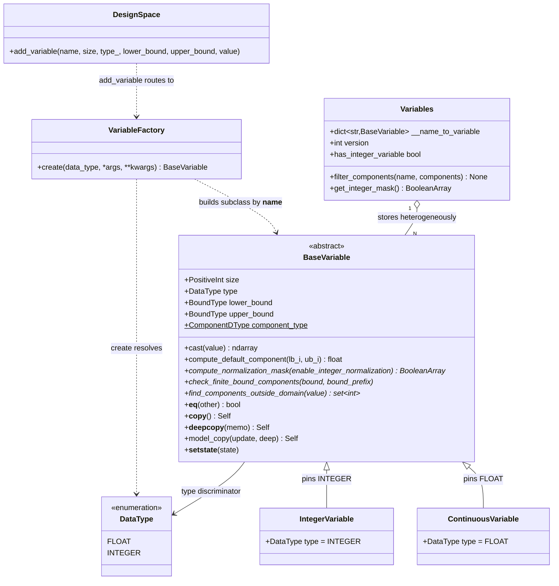

<!--
 Copyright 2021 IRT Saint Exupéry, https://www.irt-saintexupery.com

 This work is licensed under the Creative Commons Attribution-ShareAlike 4.0
 International License. To view a copy of this license, visit
 http://creativecommons.org/licenses/by-sa/4.0/ or send a letter to Creative
 Commons, PO Box 1866, Mountain View, CA 94042, USA.
-->

# Variable Class Hierarchy in the DesignSpace (GGQPA-1845)

## User advice

You can select different submodels (sonnet, haiku, opus) if needed,
with the more appropriate effort.
I let you consider what is best.

## Requirements

- Replace the single `Variable` model (a `DataType` enum field + scattered
  `if variable.type == …` branches across the design-space collaborators) with a
  **polymorphic variable hierarchy** whose kind-specific behavior lives on the type.
- Introduce an **abstract `BaseVariable` base** and two concrete kinds this phase —
  `ContinuousVariable` (FLOAT) and `IntegerVariable` (INTEGER) — so later kinds
  (`Discrete` / `Categorical` / `Catalog`, ticket 1791 v2) extend the hierarchy instead
  of editing every consumer.
- Construct variables through a **GEMSEO `VariableFactory`** (the `BaseFactory` pattern),
  not a `BaseVariable.create` classmethod, so kinds are auto-discovered and plugin-extensible.
- Deliver this as a **behavior-preserving refactor**: identical functional behavior,
  identical HDF/CSV serialization layout, identical public API. The only observable change
  is the Python class of a variable instance (internal).

## Entities

**Conservative notes**: `DataType` (`StrEnum{FLOAT, INTEGER}`), `TYPE_MAP`, `BoundType` /
`BoundArray` and `format_components` stay unchanged and stay importable from
`gemseo.space._variable` — `DataType` remains the on-disk discriminator, each subclass
pins its member as a `Literal` default. `BaseVariable` keeps its four fields
(`size`, `type`, `lower_bound`, `upper_bound`) and `frozen=True` immutability, keeps
handing out **read-only** bound arrays (`setflags(write=False)`), and keeps the four
copy/pickle hooks (`__copy__`, `__deepcopy__`, `model_copy`, `__setstate__`) — subclasses
inherit them unchanged. No new DTOs, no new enum members, no wrapper objects. `Variables`
storage/iteration is untouched — it already treats elements polymorphically via
`.size` / `.type` / bounds.

## Approach

1. **Hierarchy shape** (rich behavioral subclasses, not a `Domain` strategy object):
    - Abstract `BaseVariable(BaseModel, ABC, frozen=True)` holds the shared fields and declares
    the polymorphic interface (`@abstractmethod`s for the kind-specific hooks). Being
    `inspect.isabstract`-true, it is never instantiated and is skipped by `BaseFactory`
    class discovery.
    - `ContinuousVariable` / `IntegerVariable` pin `type` (a `Literal[DataType.FLOAT]` /
    `Literal[DataType.INTEGER]` default) and implement the hooks.
    - Preserve the existing single `@model_validator(mode="after")` orchestration; the
    integer-bound check becomes a subclass hook. Keep both halves of the bound-conversion
    contract: the freeze (`bound.setflags(write=False)`) and the frozen-bypass write
    (`self.__dict__[bound_name] = bound`).
    - Inherit the copy/pickle hooks verbatim: `__copy__` / `__deepcopy__` return `self`,
    `model_copy` returns `self` without an update and otherwise rebuilds through
    `model_validate` (which must return the **same subclass**), `__setstate__` re-freezes
    the bound arrays after unpickling.

2. **Construction via GEMSEO factory** (not a classmethod — user requirement):
    - `VariableFactory(BaseFactory[BaseVariable])` with `_CLASS = BaseVariable` and
    `_PACKAGE_NAMES = ("gemseo.space._variable",)`; singleton via the
    inherited `BaseABCMultiton`, and exposed as the module-level
    `VARIABLE_FACTORY: Final[VariableFactory]`, as the other factories of GEMSEO are
    (`DISCIPLINE_FACTORY`, `GRAMMAR_FACTORY`).
    - `create(data_type, *args, **kwargs)` **overrides** the inherited
    `create(class_name, …)`: it resolves a `DataType` to its subclass by reading each
    discovered subclass's pinned `type` default (`model_fields["type"].default`), then
    delegates to `super().create(class_name, …)`. It accepts a `bytes` data type and
    decodes it first: `_io.from_hdf` reads the per-component type from HDF as `bytes`
    and hands it straight to `add_variable`, where the pydantic enum field used to
    coerce it in lax mode; the explicit `DataType(...)` coercion does not.
    - Route the single remaining construction site through the factory:
    `DesignSpace.add_variable`. `Variables.filter_components` mutates the
    registry **in place** and rebuilds the entry from its source variable
    (`model_copy`), which keeps the **same** subclass as its
    source, via `create(type(source).__name__, …)`).

3. **De-branching the collaborators**:
    - Replace each `variable.type == DataType.X` branch with a polymorphic call.
    - Keep the aggregate arrays (integer mask, normalization mask) **built once inside the
    `RegistryDerivedData` guard `rebuild` callbacks**, keyed on `Variables.version`
    (and `Value`'s compound `(version, mutation_count)` key). The per-variable
    polymorphic call stays in the rebuild path, never in the hot transform path;
    vectorized arithmetic is preserved.
    - There are **12** branch sites: `space/_variable.py:216`;
    `space/design/_variables.py:151`, `:263`, `:272`, `:290`;
    `space/design/_value.py:277`, `:359-362`, `:531`;
    `space/design/_checking.py:164`, `:350`; `space/design/_view.py:78`;
    `space/design/_io.py:195`. `Normalizer`'s hot paths already use
    `current_x_dtype.kind == "i"` (`_normalizer.py:142`, not `type ==`) and delegate
    integer rounding to `IntegerRounder`, so `_normalizer.py` / `_integer_rounder.py` /
    `_bounds.py` need no edit.

4. **Equality**: relax `BaseVariable.__eq__` from `isinstance(other, self.__class__)` to
   `isinstance(other, BaseVariable)` **and** compare `type` + `size` + bounds. Data-based
   equality keeps `Continuous([0,1]) != Integer([0,1])` (their `type` differs).

5. **Error handling** (Python/Pydantic idiom — no framework layer): construction errors
   surface as Pydantic `ValidationError`; the existing `ValueError` messages emitted from
   the (now subclass-hosted) bound/membership checks must keep their exact text so
   `__snapshots__/*.ambr` do not churn. `BaseFactory.create` wraps `TypeError`; a Pydantic
   `ValidationError` passes through unchanged. An unknown class name in `create` raises a
   clear `ImportError` (via `get_class`). An unknown **data type** passed to
   `create` (e.g. `add_variable(type_="a")`) raises a `ValueError` from
   the `DataType(...)` coercion — a minor change from the former Pydantic enum
   `ValidationError`; both are `ValueError` instances, so `except ValueError` callers are
   unaffected.

## Structure

### Inheritance Relationships

1. `BaseVariable(BaseModel, ABC, frozen=True)` — abstract base; declares the polymorphic
   interface as `@abstractmethod`s; holds `size`, `type`, `lower_bound`, `upper_bound`.
2. `ContinuousVariable(BaseVariable)` — pins `type: Literal[DataType.FLOAT] = DataType.FLOAT`.
3. `IntegerVariable(BaseVariable)` — pins `type: Literal[DataType.INTEGER] = DataType.INTEGER`.
4. `VariableFactory(BaseFactory[BaseVariable])` — GEMSEO factory; `_CLASS`, `_PACKAGE_NAMES`
   class attributes; singleton via `BaseABCMultiton`.

### Dependencies

1. `DesignSpace.add_variable` calls `VariableFactory.create`.
2. `Variables.filter_components` calls `VariableFactory.create` (same subclass).
3. `Variables`, `Normalizer`, `IntegerRounder`, `Value` and the `_checking`
   functions call the polymorphic `BaseVariable` methods (no `type ==` switch).
4. `RegistryDerivedData` subclasses (`Normalizer`, `IntegerRounder`, `Value`,
   `Bounds`) invoke the per-variable hooks only inside their `_rebuild` callbacks.
5. `DesignSpace._io` (`from_hdf` / `from_csv`) reconstructs via `add_variable` → factory.

### Package Layout

1. `src/gemseo/space/_variable/` — the current `space/_variable.py` module is turned into a
   package at the **same import path**. It sits one level **above** `space/design/`, since
   `Variable` is shared with `ParameterSpace` and re-exported by `gemseo.enum`. The
   singular name does not clash with the registry module `space/design/_variables.py`
   (different packages):
    - `__init__.py` — re-exports `BaseVariable`, `ContinuousVariable`, `IntegerVariable`,
    `VariableFactory`, the legacy `Variable`, **and, unchanged, every symbol
    `gemseo.space._variable` exports today**: `DataType`, `TYPE_MAP`, `BoundType`,
    `BoundArray`, `format_components`.
    - `_base.py` — abstract `BaseVariable` base (the former `_variable.py` body, keeping
    `DataType`, `TYPE_MAP`, `ScalarBoundType`, `BoundType` / `BoundArray` and
    `format_components`, plus the new `ComponentDType` alias).
    - `_continuous.py` — `ContinuousVariable`.
    - `_integer.py` — `IntegerVariable`, plus the integer-index helpers `_get_integer_mask`
    / `_find_non_integer_indices` **moved here from `space/design/_checking.py`** (they are
    integer-kind logic and moving them breaks the `_variable ↔ _checking` import cycle).
    - `_factory.py` — `VariableFactory` and the module-level `VARIABLE_FACTORY` instance.
    - `_legacy.py` — `Variable`, the single variable class of the releases predating the
    hierarchy. A pickle refers to a class by name, so a design space pickled by such a
    release only loads while that name resolves; the class exists for that sole purpose
    and its `__setstate__` rebuilds the variable through the factory (fully validated),
    then takes the identity of the built variable. It derives from `BaseModel`, **not**
    from `BaseVariable`, so that the factory does not discover a second class pinning
    the float data type.
2. Existing modules stay in place under `src/gemseo/space/design/`: `_variables.py`
   (`Variables` registry), `_normalizer.py`, `_integer_rounder.py`, `_value.py` (`Value`),
   `_bounds.py` (`Bounds`), `_checking.py`, `_codec.py`, `_constants.py`, `_view.py`,
   `_io.py`, `__init__.py` (`DesignSpace`), plus `space/parameter.py` (`ParameterSpace`).
   Imports of `Variable` become `BaseVariable` (the old name stays exported by the
   package root, bound to the legacy class of `_legacy.py`); the class attributes
   `DesignSpace.DesignVariableType = DataType` (`space/design/__init__.py:123`) and
   `VARIABLE_TYPES_TO_DTYPES = TYPE_MAP` (`:126`) are unchanged.

### Import Contract (module → package conversion)

1. `gemseo/enum/__init__.py:116` imports `DataType as DesignVariableType` from
   `gemseo.space._variable`, and the lazy map at `:275` binds `"DesignVariableType"` to the
   **string** `"gemseo.space._variable:DataType"`. That string must keep resolving after
   the module becomes a package — guarded by `tests/test_enums.py::test_all_exports_are_enums`,
   which `getattr`s every name in `enum.__all__`.
2. `space/design/*` import from `gemseo.space._variable`: `Variable` + `DataType`
   (`_variables.py`), `Variable` + `DataType` + `TYPE_MAP` (`design/__init__.py`),
   `DataType` + `TYPE_MAP` (`_value.py`), `DataType` (`_io.py`, `_view.py`),
   `DataType` + `format_components` (`_checking.py:33-34`). Every one of these must stay
   importable from the package root (with `Variable` renamed to `BaseVariable`).
3. The name `Variable` must keep resolving at the package root, since a pickle written by
   an earlier release refers to `gemseo.algos._variable.Variable` — the module alias of
   `gemseo._deprecation` redirects the module, and `_legacy.Variable` answers the name.

## Operations

### Create Package - `src/gemseo/space/_variable/`

1. Responsibility: hold the variable hierarchy + factory in a tight factory-scan scope, at
   the import path the module `space/_variable.py` occupies today.
2. Add `__init__.py` (LGPL header, `from __future__ import annotations`), re-exporting
   `BaseVariable`, `ContinuousVariable`, `IntegerVariable`, `VariableFactory`, the legacy
   `Variable` **and** the pre-existing module surface `DataType`, `TYPE_MAP`, `BoundType`,
   `BoundArray`, `format_components`.
3. Constraint: `gemseo.space._variable:DataType` must keep resolving for the
   `gemseo.enum` lazy map (`enum/__init__.py:275`), and the class attribute
   `DesignSpace.DesignVariableType = DataType` must keep working.

### Create Abstract Base - `BaseVariable`

1. Responsibility: shared fields + polymorphic interface; never instantiated.
2. Definition: `class BaseVariable(BaseModel, ABC, frozen=True):` with fields `size`, `type`,
   `lower_bound`, `upper_bound` (unchanged types/defaults).
3. Keep: single `@model_validator(mode="after") __validate_variable`
   (`space/_variable.py:127-142`) orchestrating `__convert_bound` (`:144`; dtype via
   `TYPE_MAP[self.type]` at `:161`, freeze via `setflags(write=False)` at `:171`,
   frozen-bypass write at `:174`) and the bound check (`__check_bound`, `:176`), then
   `upper >= lower`.
4. Keep unchanged and inherited by every subclass: `__copy__` (`:229`), `__deepcopy__`
   (`:236`), `model_copy` (`:239`), `__setstate__` (`:261`).
5. **Concrete shared methods** (defined once on the base — behavior is identical across
   kinds, so NOT abstract):
    - `component_type: ClassVar[ComponentDType]` — the NumPy type of the components,
    pinned by each subclass (`int64` / `float64`) — no `type ==` branch needed. It is a
    class variable rather than a method, since the convention reserves callables for
    verb-named operations. `ComponentDType` is a module-level alias for
    `type[int64 | float64]` in `_base.py`, because the `type` field shadows the `type`
    builtin inside the class body; the `DType` suffix avoids the collision with
    `gemseo.dataset.dataset.ComponentType` and
    `gemseo.core.coupling_structure.ComponentType`.
    - `cast(value: ndarray) -> ndarray` — `value.astype(self.component_type)`.
    - `compute_default_component(lower_bound_i, upper_bound_i) -> float` — a
    `@staticmethod` holding the midpoint / finite bound / zero rule (identical for both
    kinds in `initialize_missing`, `space/design/_value.py:348-355`; the only kind
    difference is the final dtype, already carried by the `component_type` class
    variable).
6. **Class variables** (each replacing a current `type ==` branch, but constant per kind
   rather than computed):
    - `component_type: ClassVar[ComponentDType]` — the NumPy type of the components.
    The integer mask is **not** carried by a class variable: `Variables` tests
    `isinstance(variable, IntegerVariable)` (see the call-site mapping below), so a
    future kind whose components are integral without deriving from `IntegerVariable`
    — a `DiscreteVariable` over an integer grid, say — drops out of the rounding mask
    unless that test is widened.
7. **Per-kind hooks** (each replacing a current `type ==` branch — these genuinely
   differ per kind). Only the first is `@abstractmethod`, which is what makes
   `inspect.isabstract(BaseVariable)` `True`; the other two carry a permissive default
   on the base, so a kind that restricts nothing inherits it:
    - `compute_normalization_mask(enable_integer_normalization: bool) -> BooleanArray`
    (`@abstractmethod`) — the per-component normalization mask for this kind.
    - `check_finite_bound_components(bound, bound_prefix) -> None` — the kind's bound
    validity check (integer kinds reject finite non-integer components; continuous accepts
    any finite). `bound_prefix` is the `"lower"`/`"upper"` prefix already computed by
    `__check_bound`, so the integer kind can preserve its verbatim `ValueError` message
    without splitting the field name again.
    - `find_components_outside_domain(value: ndarray) -> set[int]` — indices violating the
    kind's per-component domain (empty for continuous; non-integer indices for integer).
8. Relax `__eq__` (`:269`): keep the `isinstance(other, BaseVariable)` guard, then
   compare the fields named by `type(self).model_fields` — `size` first, since bounds of
   different sizes cannot be compared element-wise — so that a field added by a future
   kind takes part without editing `BaseVariable.__eq__`.

### Create Concrete Kind - `ContinuousVariable`

1. Inheritance: `ContinuousVariable(BaseVariable)`.
2. Attribute: `type: Literal[DataType.FLOAT] = DataType.FLOAT`.
3. Pins `type`; inherits `dtype` / `compute_default_component` from the base.
   Overrides `cast` to be complex-safe
   (`return value if iscomplexobj(value) else value.astype(float64)`),
   so that the `complex128` values produced by `Value.to_complex()` (complex-step)
   survive `Value.set` — the base `astype(float64)` drops the imaginary part
   and regresses the complex-step tests.
   Sets `component_type = float64`.
   Implements the abstract hooks:
    - `compute_normalization_mask` → normalized where both bounds finite (ignores the
    integer flag).
    - `check_finite_bound_components` → inherits the base no-op (any finite bound allowed).
    - `find_components_outside_domain` → inherits the base empty set.

### Create Concrete Kind - `IntegerVariable`

1. Inheritance: `IntegerVariable(BaseVariable)`.
2. Attribute: `type: Literal[DataType.INTEGER] = DataType.INTEGER`.
3. Pins `type`; sets `component_type = int64`; inherits `cast`
   (`astype(int64)`) / `compute_default_component` from the base. Hosts the moved
   `_get_integer_mask` / `_find_non_integer_indices` helpers. Implements the abstract
   hooks:
    - `compute_normalization_mask` → normalized where both bounds finite **only if**
    `enable_integer_normalization`, else all-`False`.
    - `check_finite_bound_components` → reject finite non-integer components (the message
    at `space/_variable.py:216-227` preserved verbatim, including the
    `format_components` rendering).
    - `find_components_outside_domain` → `_find_non_integer_indices(value)` (`None`/`inf`
    treated as integer).

### Implement Factory - `VariableFactory`

1. Definition: `class VariableFactory(BaseFactory[BaseVariable]):` with
   `_CLASS = BaseVariable`, `_PACKAGE_NAMES = ("gemseo.space._variable",)`.
2. `create(self, data_type: DataType | str | bytes, *args, **kwargs) ->
   BaseVariable`:
    - Build (once, lazily) a `DataType -> class_name` map by scanning
    `self.class_names` and reading each class's `model_fields["type"].default`;
    override `update()` to reset the map, since a rediscovery invalidates it.
    - Decode a `bytes` `data_type` (HDF round-trip), then coerce with `DataType(...)`.
    - Resolve `data_type` → `class_name`; return
    `super().create(class_name, *args, **kwargs)`.
    - Raise a clear `ValueError` if no subclass pins the requested `data_type`.
3. Singleton behavior inherited from `BaseABCMultiton`; the `reset_factory` fixture clears
   the cache between tests. Instantiate it once at the module level as
   `VARIABLE_FACTORY` and import that instance at the call sites.

### Update Construction Site - `DesignSpace.add_variable`

1. Location: `src/gemseo/space/design/__init__.py:310` (`add_variable`), construction at
   `:342`, registry write at `:348`.
2. Replace the direct `Variable(size=…, type=type_, lower_bound=…, upper_bound=…)` with
   `VARIABLE_FACTORY.create(type_, size=size, lower_bound=…,
   upper_bound=…)`.
3. Constraint: signature and behavior unchanged — `add_variable(name, size=1,
   type_=DesignVariableType.FLOAT, lower_bound=-inf, upper_bound=inf, value=None)`; the
   value/rollback path stays intact.

### Update Construction Site - `Variables.filter_components`

1. Location: `src/gemseo/space/design/_variables.py:219`
   (`filter_components(name, components) -> None`), construction at `:231`.
2. Replace `Variable(size=…, type=variable.type, lower_bound=…, upper_bound=…)` with
   `variable.model_copy(update={"size": …, "lower_bound": …, "upper_bound": …})`, which
   rebuilds through `model_validate` (converting, checking and refreezing the new
   bounds) while carrying every other field over, so the rebuilt entry keeps the source
   subclass **and** any field that subclass adds.
3. Constraint: the method mutates the registry **in place** (it reassigns
   `__name_to_variable[name]`, recomputes the normalization mask, reindexes and bumps the
   version) and returns `None` — do not change that to a return value.

### De-branch the Collaborators (replace `type ==` with polymorphic calls)

All paths below are under `src/gemseo/space/`.

1. `design/_variables.py`:
    - `__compute_normalization_mask` (`:276`, branch `:290`) →
    `variable.compute_normalization_mask(
    self.__enable_integer_variables_normalization)`.
    - `get_integer_mask` (`:251`, branch `:263`) → set the indices of every variable
    that is an `IntegerVariable`.
    - `has_integer_variable` (`:269`, branch `:272`) →
    `any(isinstance(v, IntegerVariable) for v in …)`.
    - `enable_integer_variables_normalization` setter (`:145`, branch `:151`) → recompute
    masks via `compute_normalization_mask` for every variable whose policy depends on the
    flag.
2. `design/_integer_rounder.py` (`_rebuild`, `:51`): keep building from
   `Variables.get_integer_mask()` (already polymorphic through the registry). No edit.
3. `design/_checking.py`: `check_addable_value` (def `:101`, integer branch `:164`, pass
   `value`) and `_check_membership_dict` (def `:316`, integer branch `:348-351`, pass
   `value.real`) → `variable.find_components_outside_domain(...)`; the `ValueError` messages
   stay **verbatim in the callers** (the hook only returns the offending index set).
   **Move** `_get_integer_mask` (`:48`) and `_find_non_integer_indices` (`:63`) into
   `_integer.py`; `_checking.py` then **drops its `DataType` import** (`:33`) while keeping
   `format_components` (`:34`) — this removes the `_variable ↔ _checking` cycle. No test
   imports those helpers, so no test update is needed for the move.
4. `design/_value.py`:
    - `initialize_missing` (def `:331`; shared rule `:348-355`, dtype branch `:359-366`) →
    replace the midpoint loop with `variable.compute_default_component` over the zipped
    bounds (ruff rewrites the comprehension to `itertools.starmap`) and build the array
    with `variable.component_type` (i.e. `array(current_value,
    dtype=variable.component_type)`),
    dropping the `variable_type` if/else entirely.
    - `set` (def `:222`, cast at `:276-278`) → `self._variables[name].cast(val)`.
    **Behavior note**: the current code resolves `var_type = str(variable.type)` and casts
    **only** integer values (to `TYPE_MAP[var_type]`), leaving floats untouched to preserve
    `complex128` values produced by `to_complex()` (complex-step). The plain
    `value.astype(self.component_type)` of the base **does** regress the complex-step tests
    (`test_get_current_x_no_complex`,
    `test_normalize_vect_dtype_follows_current_value`), so `ContinuousVariable.cast` is
    complex-safe: `return value if iscomplexobj(value) else value.astype(float64)`.
    - `__compute_normalization_values` (def `:512`, integer branch `:531`) → replace
    `type == DataType.INTEGER` with `self._variables[name].cast(...)`, which casts to the
    component type of the kind.
5. `design/_view.py` (`get_pretty_table` def `:39`, branch `:78`) **and `design/_io.py`
   (`_to_dataframe` def `:170`, branch `:195`)**: both share the `type == DataType.FLOAT`
   branch that takes `value.real` for display → replace with a kind predicate
   (`variable.component_type == float64`), so neither module needs its `DataType` import.
6. `_variable.py:216` (the integer-bound check inside `__check_bound`) moves to
   `IntegerVariable.check_finite_bound_components`; `ContinuousVariable`'s implementation
   is a no-op.

### Update Serialization Imports - `_io.py`

1. No format change. Confirm `to_hdf` (`:81`) / `from_hdf` (`:138`) / `to_csv` (`:208`) /
   `from_csv` (`:232`) still call `design_space.add_variable(name, size, var_type, l_b,
   u_b, value)` — now routing to the factory. `type` remains stored per component;
   reconstruction resolves the subclass.
2. `_to_dataframe` (`:170`) has a `type == DataType.FLOAT` branch at `:195` (take
   `value.real`); de-branch it exactly like `_view.py:78` (kind predicate /
   `variable.component_type`).

### Update Tests & Changelog

1. **Ten** test modules import `Variable` directly from `gemseo.space._variable` and
   construct it: `tests/space/test_variable.py`, `test_design_space.py`,
   `test_parameter_space.py`, and `tests/space/design/test_bounds.py`,
   `test_checking.py`, `test_codec.py`, `test_integer_rounder.py`, `test_normalizer.py`,
   `test_value.py`, `test_variables.py`. Migrate each to `VariableFactory` /
   `add_variable` (or to the concrete subclasses where a test needs a specific kind).
2. Add per-subclass construction tests (validator order, frozen inheritance, defaults),
   plus a copy/pickle test per subclass asserting the round-trip returns the **same
   subclass** with **read-only** bound arrays.
3. Add a factory test in `tests/space/test_variable_factory.py` (discovery, singleton,
   `create` including the `bytes` form, unknown data type, `update`), guarded by
   `reset_factory`.
4. Cover the legacy path: unpickling a `Variable` returns the kind pinning its data
   type, with frozen bounds and the deprecation warning; a design space pickled by the
   last release (`tests/space/design_space_6_3_3.pkl`) loads with every collaborator
   rebuilt. The deprecation must also be visible under the **default** warning filters
   when the pickle is loaded from library code, which `gemseo._deprecation.install`
   provides with a filter anchored on `The class 'gemseo\..*' is deprecated`
   (`tests/test_deprecated_imports.py`).
5. Snapshot churn is expected in **two** files, for two cosmetic reasons — the Pydantic
   `ValidationError` messages embed the model class name (`Variable` → `ContinuousVariable` /
   `IntegerVariable`), and the `input_value` repr of the errors raised from `add_variable`
   no longer carries `'type'` (the factory resolves the kind instead of passing the field):
   `tests/space/__snapshots__/test_variable.ambr` and
   `tests/space/__snapshots__/test_design_space.ambr` (the latter validates variables through
   `add_variable`). Regenerate with
   `uv run pytest --snapshot-update tests/space/test_variable.py tests/space/test_design_space.py`
   — **without `-n`**. The `test_add_variable_with_unkown_type` snapshot is dropped (it now
   asserts a `ValueError` instead of a `ValidationError`).
   `tests/space/design/__snapshots__/test_checking.ambr` and `test_value.ambr` are
   `ValueError` text and must **not** change; if they do, a message drifted — fix the code,
   don't re-record.
6. `tests/test_enums.py::test_all_exports_are_enums` must stay green — it forces the lazy
   resolution of `"gemseo.space._variable:DataType"`.
7. Add a towncrier fragment in `changelog/` (`changed` / `refactor`) noting the internal
   hierarchy and the data-based-equality contract change.

## Norms

1. **File preamble**: every source file starts with the LGPL header (pre-commit inserts
   it) and `from __future__ import annotations` (ruff isort enforced).
2. **Imports**: one import per line (`force-single-line = true`).
3. **Naming**: method/function names start with a verb (`compute_normalization_mask`,
   `compute_default_component`, `cast`, `find_components_outside_domain`,
   `check_finite_bound_components`); a `check_*` name is reserved for a hook that raises,
   a `find_*` name for one that returns indices; enum member keys are
   capital-cased (`FLOAT`, `INTEGER`). Properties/attributes may be noun-only
   (`component_type`, `size`). The abstract base is `BaseVariable` (GEMSEO `Base*` factory-base convention).
4. **Docstrings**: Google convention, mkdocs/markdown links
   (`[BaseVariable][module.BaseVariable]`, **not** Sphinx RST). Every method with parameters
   has an `Args:` section; every non-`None`-returning method has a `Returns:` section —
   including private / abstract ones.
5. **Abstract interface**: declare hooks with `@abstractmethod`; the base mixes
   `BaseModel` + `ABC` so `inspect.isabstract` is `True`.
6. **Discriminator**: each subclass pins `type` as a `Literal[...]` default; never remove
   `DataType` or `TYPE_MAP`.
7. **Factory pattern**: mirror `CacheFactory` — subclass `BaseFactory[T]`, set `_CLASS`
   and `_PACKAGE_NAMES`; construction goes through the factory singleton, never a
   `BaseVariable.create` classmethod.
8. **Caching**: per-variable polymorphic calls live only inside `RegistryDerivedData`
   `_rebuild` callbacks; never add a per-call dispatch to a hot transform path.
9. **Type-checking**: add `gemseo.space._variable._base.BaseVariable` to
   `.ruff.toml` `[lint.flake8-type-checking].runtime-evaluated-base-classes` (the list
   starting at `:106`), so the subclasses' `Literal[DataType.*]` field annotations stay
   runtime-evaluated (ruff must not push the `DataType` import under `TYPE_CHECKING`).
   (`BaseVariable` itself subclasses `pydantic.BaseModel`, already listed at `:107`, so the
   base module needs no entry.)
10. **Exceptions**: preserve existing `ValueError` message text verbatim; assert exception
    messages with `assert_exception` (`gemseo/util/testing/helper.py:71`) + snapshots, not
    `match=` regex.
11. **Commits**: Conventional Commits (commitizen); scope this as `refactor`.

## Safeguards

1. **Behavior-preserving**: all existing `tests/space/**` tests pass **unchanged** — this
   is the headline acceptance criterion.
2. **Serialization back-compat**: HDF/CSV round-trip yields a byte-identical layout and an
   **equal** design space; old float/integer files reload identically; concatenation order
   of aggregate masks unchanged for mixed continuous+integer spaces.
3. **Public API unchanged**: `DesignSpace.add_variable` signature identical; `variable.type`
   still equals the same `DataType` member for every kind; `ParameterSpace.add_variable(
   FLOAT)` transparently yields a `ContinuousVariable` with no `ParameterSpace` edit.
4. **Abstract base**: `BaseVariable` is not directly instantiable (`inspect.isabstract`
   True); callers use `add_variable` / `VariableFactory` only.
5. **Factory contract**: subclass `__name__`s are unique and stable (they are the factory
   keys); `create` on an unknown name raises a clear `ImportError`; a Pydantic
   `ValidationError` propagates unchanged.
6. **Equality contract**: data-based (`type` + `size` + bounds), not exact-class;
   `ContinuousVariable([0,1]) != IntegerVariable([0,1])`. Document in the changelog.
7. **Performance**: no per-call Python dispatch in `normalize_vect`/`unnormalize_vect` hot
   paths; polymorphic calls confined to guard rebuilds. Benchmark a high-dimensional space.
8. **Frozen inheritance**: subclasses stay `frozen=True`; the `self.__dict__[...] =`
   bound-conversion bypass keeps working; validator order verified per subclass.
9. **Scope discipline**: no new `DataType` member, no IO format change, no new public
   method, no `Domain` strategy object — hierarchy only. Enumerated kinds (1791 v2) are a
   separate follow-up.
10. **Snapshot integrity**: never run `--snapshot-update` with xdist (`-n`); the only files
    expected to change are `tests/space/__snapshots__/test_variable.ambr` and
    `tests/space/__snapshots__/test_design_space.ambr` (model name inside `ValidationError`).
11. **Complex-step preservation**: `Value.set` keeps the integer→`int64` / float-untouched
    semantics so `to_complex()` values survive; verify with the complex-step test path
    (see Operations `design/_value.py`).
12. **No import cycle**: the `_variable` package must not import from `space/design/`; the
    moved integer helpers live in `_integer.py`, and `space/design/_checking.py` no longer
    imports `DataType`.
13. **Import contract preserved**: `gemseo.space._variable` keeps exporting `DataType`,
    `TYPE_MAP`, `BoundType`, `BoundArray` and `format_components` after becoming a package;
    the lazy string `"gemseo.space._variable:DataType"` (`gemseo/enum/__init__.py:275`)
    still resolves, and `tests/test_enums.py` stays green.
14. **Immutability contract**: bound arrays stay read-only after construction, `copy`,
    `deepcopy`, `model_copy` and unpickling; `model_copy` returns the same subclass, and an
    update contradicting a subclass's pinned `type` must fail loudly rather than silently
    downcast.
15. **Unknown-name errors**: `UnknownVariableError` (`space/design/_variables.py:41`) keeps
    its current message; no error path added by the hierarchy may bypass or shadow it.
16. **Out of scope — issue #1812**: do **not** rename `DataType` to `DesignVariableType` at
    the definition site (the TODO at `gemseo/enum/__init__.py:113`); it would enlarge an
    otherwise behavior-preserving MR.
